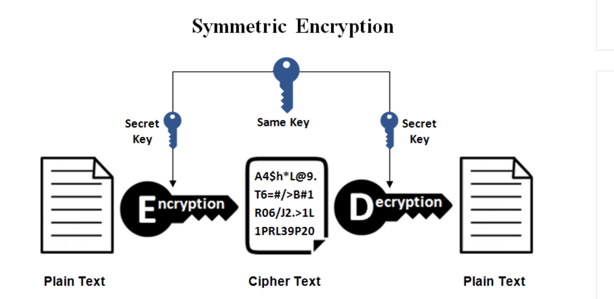
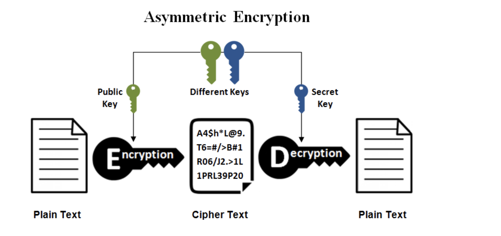

## Introduction

Blockchain technology, as a decentralized distributed ledger technology, is rapidly transforming multiple sectors, including finance, supply chain management, and smart contracts. At the core of blockchain, security is of paramount importance, and cryptographic techniques are the foundation for ensuring this security. This article will explore the primary cryptographic techniques used in blockchain, including hash functions, digital signatures, symmetric encryption, and asymmetric encryption. Additionally, it will introduce some advanced cryptographic techniques, such as zero-knowledge proofs and homomorphic encryption.

## Common Types of Data Encryption

### 1. Symmetric Encryption

**Working Principle**: Symmetric encryption uses the same key for both encryption and decryption of data. This means that both the sender and the receiver must share the key beforehand. Because the same key is used for both processes, the encryption and decryption operations are typically very fast.

**Technologies Used**: Common symmetric encryption algorithms include DES (Data Encryption Standard), 3DES, and AES (Advanced Encryption Standard).

**Application Scenarios**: Symmetric encryption is suitable for scenarios that require efficient encryption and decryption of large volumes of data, such as data storage and data transmission. However, since the key needs to be shared in advance, the security of symmetric encryption relies on the protection and distribution of the key, making it unsuitable for open communication environments.

### 2. Asymmetric Encryption

**Working Principle**: Asymmetric encryption uses a pair of keys, commonly referred to as the public key and the private key. The public key is used for encrypting data, while the private key is used for decrypting data. This means that the sender can encrypt the data using the recipient's public key, and only the recipient, who holds the corresponding private key, can decrypt the data.

**Technologies Used**: Common asymmetric encryption algorithms include RSA, DSA, ECC (Elliptic Curve Cryptography), among others.

**Application Scenarios**: Asymmetric encryption is suitable for secure communication scenarios, particularly those involving data transmission over networks, such as certificate exchange in the SSL/TLS protocols, and digital signatures. It offers enhanced security because the private key does not need to be transmitted or shared. Moreover, even if the public key is compromised, it does not affect the security of the data.

### 3.Hash Encryption

**Working Principle**: Hash encryption involves converting input data into a fixed-length hash value, making it impossible to reconstruct the original data from the hash value.

**Technologies Used**: Common hash functions include MD5 (currently considered insecure and easily breakable), SHA (Secure Hash Algorithms), among others.

**Application Scenarios**: The primary applications of hash encryption include data integrity verification, file integrity verification, password hashing for storage, and digital signatures.

## Cryptographic Techniques in Blockchain

### 1.Applications of Symmetric Encryption in Blockchain

- Data Storage and Protection:
  Blockchain nodes can use symmetric encryption to protect locally stored data. For example, encrypting blockchain data backups or user data stored on a node can prevent unauthorized access.
- Encrypted Communication:
  During communication between nodes, symmetric encryption can be used to ensure the confidentiality of data transmission. Symmetric encryption provides efficient encryption and decryption, making it suitable for protecting large amounts of data.
- Wallet Protection:
  Cryptocurrency wallets can use symmetric encryption to encrypt wallet files or backups. This ensures that even if the files are stolen, the private keys or assets stored within them cannot be accessed directly.
- Smart Contract Data:
  In some cases, smart contracts might use symmetric encryption to protect sensitive data stored within the contract. This approach is suitable for scenarios in which the contract needs to handle and store large amounts of data.
- Data Backup:
  For data backups within a blockchain network, symmetric encryption can be used to protect the confidentiality and integrity of the backup data, ensuring that it is not leaked or tampered with.

### 2.Asymmetric cryptography (also called Public Key Cryptography)

Public key cryptography protects information by using unique keys based on a mathematical function that is easy to compute in one direction but very difficult to reverse. Based on these functions, cryptography can create digital signatures and unforgeable digital signatures, both relying on the security of mathematical principles. A more advanced category of these mathematical functions involves arithmetic operations on elliptic curves. In elliptic curve cryptography (ECC), multiplication modulo a prime number is simple, while the inverse operation (i.e., division) is nearly impossible—this is known as the discrete logarithm problem. Currently, there is no known shortcut to solve this problem. Elliptic curve cryptography is widely used in modern computer systems, supporting private keys and digital signatures in Ethereum and other cryptocurrencies.

**Elliptic Curve Cryptography (ECC)**
Elliptic Curve Cryptography (ECC) is a public key cryptographic system characterized by being easy to compute in one direction but extremely difficult to compute in the opposite direction. This characteristic in algorithms is known as Trapdoor Functions.

Basic Characteristics of Elliptic Curves:

The equation must satisfy the form: ( y^2 = x^3 + ax + b ),
Symmetric about the x-axis (as shown by points p and p'),
Any non-vertical line intersects the curve at most three times (as depicted by points G, P, and m),
Any two points on the curve can be multiplied to obtain a new point ( ( G \cdot P = m ) ).

General Steps and Applications of Elliptic Curve Cryptography:
In elliptic curve cryptography, the private key is not derived through any calculations but is rather a randomly selected number. The private key is generally a large number, known only to the holder and kept secret.
The generation of the public key is based on the private key. First, a common base point, denoted as ( G ), is selected. Then, the private key ( \text{priv} ) as a scalar is multiplied by the base point ( G ), effectively adding ( G ) to itself ( \text{priv} ) times. The result of the scalar multiplication on the curve is another point, which serves as the public key, denoted as ( P ).
[ \text{Public key } P = \text{Private key } \text{priv} \times \text{Base point } G ]
Here, ( \times ) represents scalar multiplication in the context of elliptic curves, distinct from traditional multiplication or exponentiation (( ^ )). Point addition and scalar multiplication on elliptic curves are uniquely defined operations, differing from conventional arithmetic rules.
Deriving the private key from the public key in elliptic curve cryptography involves the elliptic curve discrete logarithm problem (ECDLP). Mathematically, this is an intractable problem, especially with large prime numbers. This inherent difficulty forms the trapdoor function, which is the foundation for the security in public key encryption and digital signature systems. The security of cryptographic algorithms fundamentally depends on this property.

#### Application of Elliptic Curves in Blockchain

1. Key Pair Generation
   Elliptic curve algorithms are crucial for generating public-private key pairs for blockchain users. The public key is used to generate wallet addresses, while the private key is used to sign transactions, control funds, and validate identity.

   Public Key Generation: Generating a public key from a private key is a mathematical operation involving point multiplication on an elliptic curve.
   Private Key Protection: The private key must be securely stored. Possession of the private key equates to control over all assets in the associated account.

   The methods by which Bitcoin, Ethereum, and Solana generate wallet addresses from public keys include:

   - Bitcoin: Uses the secp256k1 elliptic curve algorithm. Address generation includes steps like SHA-256 and RIPEMD-160 hashing, followed by Base58 encoding. Addresses begin with 1, 3, or bc1.
   - Ethereum: Uses the secp256k1 elliptic curve algorithm. Address generation involves Keccak-256 hashing. Addresses start with 0x.
   - Solana: Uses the Ed25519 elliptic curve algorithm. Addresses are directly the Base58 encoding of the public key without additional hashing steps. Addresses are 44-byte Base58 encoded strings.

2. Digital Signatures
   Elliptic curve digital signature algorithms are used to sign transactions. The signing process ensures the transaction's integrity and authenticity, making it tamper-proof.

   Signing Transactions: Users sign transaction data with their private key to create a digital signature.
   Verifying Signatures: Other nodes use the public key to verify the signature's validity, ensuring that the transaction has not been tampered with and was indeed initiated by the holder of the corresponding private key.

   There are three main purposes for digital signatures:

   - Authorization Proof: Signatures prove that the controller of the private key, i.e., the owner of the funds, has authorized the transfer of these funds.
   - Non-repudiation: The authorization is undeniable.
   - Transaction Integrity: Authorized transactions cannot be altered by unauthorized third parties.

   In Ethereum and Solana, transactions also include calls to smart contracts, which require digital signatures to verify the legitimacy of the caller.

   This translation includes the main points while ensuring clarity and proper technical terminology in English. If you need the rest of the document translated, let me know!

3. Identity Verification
   Elliptic curve algorithms are used for identity verification, ensuring that only authorized users can access specific blockchain resources or perform certain operations.

   - User Identity: Verifying user identity through digital signatures and public key verification.
   - Smart Contracts: Using digital signatures to verify the identity of the contract caller in smart contracts.

4. Multi-Signature
   Multi-signature involves requiring multiple signatures to authorize a transaction or perform an action. This mechanism significantly increases the security and control of accounts, especially in blockchain and cryptocurrency. Multi-signature schemes are typically supported by elliptic curve algorithms through the generation of multiple key pairs and corresponding signatures. This mechanism is important for scenarios such as corporate accounts, large fund management, and decentralized governance

## Hash Encryption

The main features of hash functions include:

- Determinism: Given an input message, the same hash output is always generated.
- Verifiability: Computing the hash of a message is efficient (linear complexity).
- Non-correlation: A small change in the message (e.g., changing 1 bit) should result in a widely varied hash output, making it impossible to relate it to the original message's hash.
- Irreversibility: It is infeasible to derive the original message from the hash value, equivalent to performing a brute-force search over all possible messages.
- Collision Protection: It is infeasible to find two different messages that produce the same hash output.

In blockchain technology, hash functions also play crucial roles, and different blockchains often adopt different hash algorithms to meet specific security and performance requirements. Below are some mainstream blockchains and their employed hash algorithms: - Bitcoin

    **Main Hash Algorithm**: SHA-256 (Secure Hash Algorithm 256-bit)
    **Uses**: Mining process (Proof of Work), transaction hashes, block hashes, Merkle trees

    - Ethereum

    **Main Hash Algorithm**: Keccak-256 (often incorrectly referred to as SHA-3)
    **Uses**: Transaction hashes, address generation, smart contract data verification, Merkle trees

    - Solana

    **Main Hash Algorithms**: SHA-256 and SHA-3
    **Uses**:

    SHA-256: Mainly used for Proof of History (PoH), data verification, generating unique identifiers
    SHA-3: Used for smart contract execution and data verification

## Conclusion

Blockchain encryption technology provides a robust safeguard for the security of digital assets. Through asymmetric encryption techniques and advanced cryptographic algorithms, users can conduct secure transactions and communications on the blockchain, ensuring the preservation and circulation of digital assets.

## References

- [A blockchain-based traceable and secure data-sharing scheme](https://www.ncbi.nlm.nih.gov/pmc/articles/PMC10280384/)
