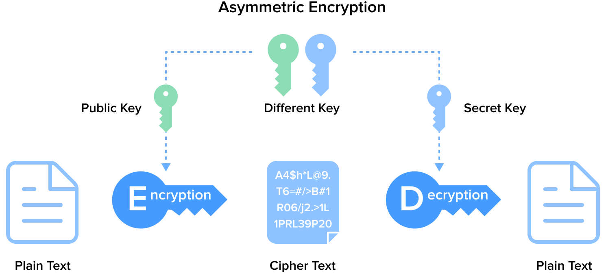
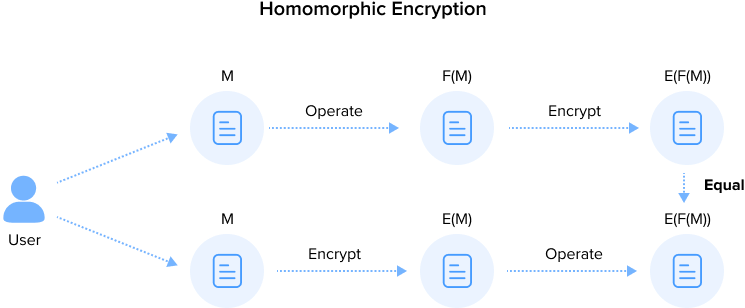

## Introduction

Blockchain is a decentralized distributed ledger technology that is rapidly transforming multiple sectors, including finance, supply chain management, and smart contracts. As blockchain technology becomes more widely adopted, safeguarding digital assets and sensitive information while ensuring secure transactions becomes critical. For blockchain to be adopted by organizations, IT needs to know how to secure digital assets in areas like transaction verification, identity authentication, and preventing data tampering.

Security is vital at the core of blockchain, and cryptographic techniques are the foundation for ensuring blockchain security. Here, we will explore the primary cryptographic techniques used in blockchain, including symmetric encryption, asymmetric encryption, and hash functions.

These encryption technologies are the backbone of secure communication, transactions, and identity verification, significantly reducing security vulnerabilities. By the end of this article, you’ll understand how to assess the encryption technologies used in blockchain, identify potential security risks, and apply these encryption methods to strengthen system security and ensure the safety of data and transactions.

## Common Types of Data Encryption

A core concept of data encryption is transforming readable information (plaintext) into an unreadable format (ciphertext) so that only authorized users can decrypt it. Symmetric encryption, asymmetric encryption, and hash functions are different forms of data encryption.

### 1. Symmetric Encryption

**Working Principle**: Symmetric encryption uses the same key for data encryption and decryption. Both the sender and the receiver must share the key beforehand. The encryption and decryption operations are typically very fast because the same key is used for both processes.

**Technologies Used**: Common symmetric encryption algorithms include Data Encryption Standard (DES), 3DES, and Advanced Encryption Standard (AES).

**Application Scenarios**: Symmetric encryption is suitable for scenarios that require efficient encryption and decryption of large volumes of data, such as data storage and transmission. However, since the key is shared in advance, the security of symmetric encryption relies on protecting and distributing the key, it unsuitable for open communication environments.

### 2. Asymmetric Encryption

**Working Principle**: Asymmetric encryption uses a pair of keys, commonly called public and private keys. The public key encrypts data, while the private key decrypts it. This means the sender can encrypt the data using the recipient's public key, and only the recipient, who holds the corresponding private key, can decrypt the data.

**Technologies Used**: Common asymmetric encryption algorithms include RSA, DSA, and Elliptic Curve Cryptography (ECC).

**Application Scenarios**: Asymmetric encryption is suitable for secure communication scenarios, particularly those involving data transmission over networks, such as certificate exchange in the SSL/TLS protocols and digital signatures. It offers heightened security because the private key does not need to be transmitted or shared. Even if the public key is compromised, the security of the data is not affected.

### 3. Hash Encryption

**Working Principle**: Hash encryption converts input data into a fixed-length hash value, making reconstructing the original data from the hash value impossible.

**Technologies Used**: Common hash functions include MD5 (currently considered insecure and easily breakable) and Secure Hash Algorithms (SHA).

**Application Scenarios**: Hash encryption's primary applications include data integrity verification, file integrity verification, password hashing for storage, and digital signatures.

## Advanced Encryption Techniques

### 1. Zero-knowledge proof

**Working Principle**: Zero-knowledge proof (ZKP) is a cryptographic protocol that allows a "prover" (the party trying to prove something) to convince a "verifier" (the party validating the proof) that a certain statement is true without revealing the identity or information about a user or transaction. Sophisticated mathematical algorithms ensure the "verifier" can trust the proof's authenticity without requesting additional information.

**Technologies Used**: zk-SNARKs, zk-STARKs, Bulletproofs.

**Application Scenarios**: This approach is used in situations involving untrusted or unidentified parties over an untrusted communication channel. It is ideal for situations involving privacy protection, verification optimization, and identity authentication, as it ensures data privacy while enhancing verification efficiency and security.

To illustrate, imagine a "prover" who wants to demonstrate that they know a password without revealing it. The attached diagram visually explains this process:

1. The **Prover** claims, "I know the password," but does not disclose the password itself.
2. The **Verifier** sends random challenges to test the prover's password knowledge.
3. The **Prover** responds correctly to these challenges multiple times, proving their claim without ever revealing the password.
4. Through this iterative process, the "verifier" gains confidence that the "prover" truly knows the password, as the successful responses show, but never learns the password.

:::center

:::

### 2. Homomorphic Encryption

**Working Principle**: Homomorphic encryption allows specific computations to be performed directly on ciphertexts without first decrypting the data. When decrypted, the computation's result is the same as when performing the computation on plaintext and then encrypting the result. Note that this technique allows for infinite additions to encrypted data. It is often used to increase the safety and security of data, especially data accessed and used by third parties.

**Technologies Used**: Paillier Encryption, ElGamal Encryption, Brakerski-Gentry-Vaikuntanathan (BGV), Brakerski/Fan-Vercauteren (BFV), Cheon-Kim-Kim-Song (CKKS).

**Application Scenarios**: Applied in privacy-preserving financial transactions, decentralized finance (DeFi), decentralized data markets, medical data privacy, user privacy, and related user data activities.

### 3. Threshold Cryptography

**Working Principle**: Threshold cryptography is a technique in which a secret (such as a private key) is divided into multiple parts and distributed to multiple participants. The secret can only be reconstructed when enough participants agree to cooperate (i.e., meet a predetermined "threshold").

The assumption is that since all participating entities are susceptible to compromise, decrypting the shared secret requires the cooperation of some participants. Someone will always be in a group with the appropriate credentials; one or two bad actors or keys will not jeopardize security.

**Technologies Used**: Shamir's Secret Sharing (SSS), Blakley's Secret Sharing, Threshold RSA, Threshold ECDSA

**Application Scenarios**: It is applied in multi-signature wallets, decentralized exchanges (DEX), distributed key management, cloud computing security, secure multi-party computation, or decentralized autonomous organization (DAO) management. It is used in cases where multiple actors may be necessary to complete a transaction. One bad actor or corrupted value won't impact the data integrity of the whole.

:::center

:::

## Cryptographic Techniques in Blockchain

Now we are introducing five important encryption techniques in blockchain technology:

- Elliptic Curve Cryptography (ECC)
- Hash functions
- Zero-knowledge proof
- Homomorphic Encryption
- Threshold Cryptography

Elliptic Curve Cryptography (ECC) is an asymmetric encryption method known for its high security and computational efficiency. ECC provides strong encryption while using relatively short key lengths, enabling more efficient encryption and decryption processes. This makes ECC widely used in generating digital signatures and performing secure key exchanges, which are critical for ensuring the security of blockchain transactions, identity verification, and data integrity protection.

Hash functions play an indispensable role in ensuring data integrity and security. By converting input data of arbitrary length into fixed-length outputs, hash functions can quickly detect any data tampering, as even a slight change in the input results in significantly different hash values. Each block contains the previous block's hash in blockchains, creating a secure and immutable chain structure. Additionally, hash functions are used to create Merkle trees, supporting efficient transaction verification and retrieval.

Zero-knowledge proofs (ZKPs) allow one party to prove to another that a statement is true without revealing any underlying information. This technology is crucial for privacy in blockchain systems, enabling confidential transactions, secure identity verification, and proof of compliance without exposing sensitive data.

Homomorphic encryption allows computations to be performed on encrypted data without decrypting it first, ensuring data privacy even during processing. In blockchain, homomorphic encryption enables privacy-preserving analytics, smart contract execution, and secure data sharing, making it a powerful tool for applications requiring confidentiality.

Threshold cryptography enhances security by distributing cryptographic operations among multiple parties. It splits secret keys into shares held by different participants, requiring a minimum number of them to collaborate on cryptographic actions, such as signing or decryption. This ensures that no single party can compromise the system, making it ideal for secure key management and protecting against insider threats.

Together, these technologies provide foundational security guarantees for blockchains, supporting the security, transparency, and immutability of decentralized applications.

### Elliptic Curve Cryptography (ECC)

Elliptic Curve Cryptography (ECC) is a public key cryptographic system characterized by being easy to compute in one direction but extremely difficult to compute in the opposite direction. This characteristic in algorithms is known as trapdoor functions.

Basic Characteristics of Elliptic Curves:

- The equation must satisfy the form: (y^2 = x^3 + ax + b)
- Symmetric about the x-axis (as shown by points p and p')
- Any non-vertical line intersects the curve at most three times (as depicted by points G, P, and m)
- Any two points on the curve can be multiplied to obtain a new point (G dot P = m)

**General Steps and Applications of Elliptic Curve Cryptography**

In elliptic curve cryptography, the private key is not derived through calculations but rather a randomly selected number. It is generally a large number, known only to the holder, and kept secret.

The generation of the public key is based on the private key. First, a common base point, denoted as G, is selected. Then, the private key priv as a scalar is multiplied by the base point G, effectively adding G to itself priv times. The result of the scalar multiplication on the curve is another point, which serves as the public key, denoted as P (P = Priv _ G). Here, _ represents scalar multiplication in the context of elliptic curves, distinct from traditional multiplication or exponentiation (^). Point addition and scalar multiplication on elliptic curves are uniquely defined operations that differ from conventional arithmetic rules.

Deriving the private key from the public key in elliptic curve cryptography involves the elliptic curve discrete logarithm problem. Mathematically, this is an intractable problem, especially with large prime numbers. The inherent difficulty forms the trapdoor function, which is the foundation for the security in public key encryption and digital signature systems. The security of cryptographic algorithms fundamentally depends on this property.

:::center

:::

#### Application of Elliptic Curve Cryptography in Blockchain

There are four main applications of elliptic curve cryptography in blockchain, each with a different business goal and purpose.

1. **Key Pair Generation Elliptic curve algorithms are crucial for generating public-private key pairs for blockchain users.** The public key is used to generate wallet addresses. In contrast, the private key is used to sign transactions, control funds, and validate identity. This mechanism ensures that only the wallet owner can authorize transactions, which prevents unauthorized access and fraud. It reduces transaction costs, enhances transparency and auditability, and ultimately provides businesses with a secure, efficient, and transparent financial operation environment.

   - Public Key Generation: Generating a public key from a private key is a mathematical operation involving point multiplication on an elliptic curve.

   - Private Key Protection: The private key must be securely stored. Possession of the private key equates to control over all assets in the associated account.

   The methods by which Bitcoin, Ethereum, and Solana generate wallet addresses from public keys include:

   - Bitcoin: Uses the secp256k1 elliptic curve algorithm. Address generation includes steps like SHA-256 and RIPEMD-160 hashing, followed by Base58 encoding. Addresses begin with 1, 3, or bc1.

   - Ethereum: Uses the secp256k1 elliptic curve algorithm. Address generation involves Keccak-256 hashing. Addresses start with 0x.

   - Solana: Uses the Ed25519 elliptic curve algorithm. The addresses are 44-byte Base58 encoded strings that directly correspond to the public key's Base58 encoding without additional hashing steps.

2. **Digital Signatures. Elliptic curve digital signature algorithms are used to sign transactions.** The signing process ensures the transaction's integrity and authenticity by making it tamper-proof. This not only enhances the security and reliability of transactions but also increases the level of trust between customers and partners.

   - Signing Transactions: Users sign transaction data with their private key to create a digital signature.
   - Verifying Signatures: Other nodes use the public key to verify the signature's validity, ensuring that the transaction has not been tampered with and was initiated by the holder of the corresponding private key.

   There are three main purposes for digital signatures:

   - **Authorization Proof:** Signatures prove that the controller of the private key, i.e., the owner of the funds, has authorized the transfer of these funds.

   - **Non-Repudiation:** The authorization is undeniable.

   - **Transaction Integrity:** Authorized transactions cannot be altered by unauthorized third parties.

   Ethereum and Solana transactions include calls to smart contracts requiring digital signatures to verify the caller's legitimacy.

3. **Identity Verification. Elliptic curve algorithms are used for identity verification, ensuring that only authorized users can access specific blockchain resources or perform certain operations.**

   - User Identity: Verifying user identity through digital signatures and public key verification. This process ensures that communications and transactions can be securely linked to the rightful owner.

   - Smart Contracts: Using digital signatures to verify the identity of the contract caller in smart contracts.

4. **Multi-Signature. This algorithm requires multiple signatures to authorize a transaction or perform an action.**
   This mechanism significantly increases account security and control, especially in blockchain and cryptocurrency. Elliptic curve algorithms typically support multi-signature schemes by generating multiple key pairs and corresponding signatures. This mechanism is important for corporate accounts, large fund management, and decentralized governance scenarios. The multi-signature mechanism significantly enhances account security and internal control by requiring multiple decision-makers to jointly authorize transactions, which is crucial in blockchain and cryptocurrency environments.

### Hash Encryption

Hash encryption significantly enhances data management and transaction security by ensuring data integrity and security, improving processing efficiency, and supporting authentication and data deduplication.

The main features of hash functions include:

- Determinism: The same hash output is always generated by an input message.
- Verifiability: Computing the hash of a message is efficient (linear complexity).
- Non-Correlation: A slight change in the message (e.g., changing 1 bit) should result in a widely varied hash output, making it impossible to relate it to the original message's hash.

- Irreversibility: Deriving the original message from the hash value is infeasible. It is equivalent to performing a brute-force search over all possible messages.

- Collision Protection: Finding two messages that produce the same hash output is infeasible.

In blockchain technology, hash functions also play crucial roles, and different blockchains often adopt different hash algorithms to meet specific security and performance requirements. Below are some mainstream blockchains and their employed hash algorithms:

- Bitcoin

  - Main Hash Algorithm: SHA-256 (Secure Hash Algorithm 256-bit)
  - Uses: Mining process (Proof of Work), transaction hashes, block hashes, Merkle trees

- Ethereum

  - Main Hash Algorithm: Keccak-256 (often incorrectly referred to as SHA-3)
  - Uses: Transaction hashes, address generation, smart contract data verification, Merkle trees

- Solana

  - Main Hash Algorithms: SHA-256 and SHA-3
  - Uses:
    - SHA-256: Mainly used for Proof of History (PoH), data verification, generating unique identifiers
    - SHA-3: Used for smart contract execution and data verification

### Zero-knowledge Proof (ZKP)

Each application scenario listed below utilizes the unique attributes of specific ZKP technologies to meet the needs for privacy protection, identity verification, data privacy, decentralized decision-making, or system performance on the blockchain.

1. **Privacy-Preserving Transactions:**

   Zcash, a privacy-focused cryptocurrency based on Bitcoin's codebase and developed with anonymity in mind, employs zk-SNARKs to conceal transaction details (sender, receiver, and amount) and support privacy-preserving transactions.

2. **Identity Verification:**

   zk-SNARKs and zk-STARKs are used to verify identity on the blockchain. They allow users to prove compliance with certain conditions without disclosing specific identity information.

3. **Smart Contracts and Data Privacy:**

   zk-SNARKs and Bulletproofs are used in smart contracts, such as those found in decentralized finance (DeFi), to ensure the privacy of contract participants.

4. **Decentralized Voting Systems:**

   zk-SNARKs and Pedersen Commitments are used to verify the legitimacy of votes and ensure the accuracy of voting results without disclosing specific voter selections or their personal information.

5. **Efficient Verification and Scaling:**

zk-Rollups (using zk-SNARKs or zk-STARKs) utilize zero-knowledge proofs to reduce on-chain data volume, verify the legitimacy of batch transactions, and increase the throughput of the main chain.

### Homomorphic Encryption in Blockchain

Understanding the application of homomorphic encryption in blockchain helps one clearly see its potential in privacy protection, data processing, and security. These are specific application scenarios along with relevant homomorphic encryption technologies.

1. **Privacy-Preserving Transactions:**

   Paillier Homomorphic Encryption is used to encrypt blockchain transaction values. By supporting additive homomorphism, the system can calculate transaction totals without decrypting them, providing privacy and protection for transaction values.

2. **Identity Verification:**

   Users can employ partial homomorphic encryption to encrypt identity credentials for verification purposes. On the blockchain, verifiers can confirm the legitimacy of a user's identity without decrypting data or concealing specific identity information.

3. **Smart Contracts and Data Privacy:**

   Used in decentralized finance (DeFi), smart contracts encrypt data provided by participants. This enables the execution of complex financial computations without decryption and ensures data privacy.

4. **Decentralized Voting Systems:**

   ElGamal Encryption can be used for ballots in decentralized voting systems. The additive homomorphic property of encrypted votes allows tallying without decryption, which ensures the privacy of votes while adding transparency to the voting process.

5. **Efficient Data Processing and Storage:**

   In cross-party data sharing and analysis scenarios, fully Homomorphic Encryption (FHE) allows arbitrary computations on encrypted data. Using FHE in blockchain can protect data privacy while enhancing processing efficiency and security without needing to decrypt the data.

As you can see, each technology supports an optimized design and solves the unique challenges in computational complexity and performance in specific applications. Depending on your business needs related to security and data privacy, a homomorphic encryption technology approach can support your business or project goal.

### Threshold Cryptography

Threshold cryptography is widely used in multi-signature wallets, decentralized governance, privacy protection in smart contracts, trustless environments supporting cross-chain transactions, or anywhere multiple participants could complete a transaction. It significantly enhances the security and efficiency of these applications by not relying on single actors or access points that could be easily compromised.

1. **Multi-Signature Wallets:**

   This distributed signing protocol combines the Elliptic Curve Digital Signature Algorithm (ECDSA) with threshold cryptography. In this system, a private key is divided into several shares held by different users. A predefined minimum number of shareholders must participate to produce a valid signature. Even one compromised share does not threaten the entire system's security, which enhances wallet security.

2. **Decentralized Governance:**

   These threshold signature schemes are exemplary for enabling Decentralized Autonomous Organization (DAO) decision-making. Governance decisions only take effect when a pre-set threshold number of votes is reached in a distributed consensus. This ensures the democratic nature of organizational decisions and prevents the concentration of control, which strengths community involvement. Some examples of this can be found in this [article](https://www.forbes.com/sites/bernardmarr/2022/05/25/the-best-examples-of-daos-everyone-should-know-about/) by Bernard Marr (LINK needed) in Forbes about DAO.

3. **Privacy Protection in Smart Contracts:**

   In blockchain applications requiring privacy, schemes like Threshold RSA and Threshold ElGamal can protect transaction data confidentiality. These algorithms allow decryption to be distributed across multiple entities, with the original data being retrievable only through multi-party collaboration when certain conditions are met. This mechanism protects contract privacy while maintaining system transparency and trustworthiness.

4. **Cross-Chain Transactions and Interoperability:**

   The core challenge of cross-chain transactions is achieving a trustless asset exchange between blockchains. Atomic Swaps use Hash Time-Locked Contracts (HTLCs) and threshold signatures to ensure that assets on the target chain are only unlocked after securing assets on the source chain. This atomicity of transactions ensures the safety and reliability of asset exchanges, improving the interoperability between different blockchain networks.

These applications highlight how threshold cryptography can enhance security and operational efficiency in blockchain ecosystems, ensuring privacy, democracy, and trust in decentralized systems and cross-chain operations.

## Cryptography in the Age of Quantum Computing

Today, blockchain encryption technology provides robust security for digital assets. Asymmetric encryption and advanced cryptographic algorithms enable secure transactions and communications on the blockchain while ensuring asset integrity and preventing unauthorized access. These mechanisms protect digital assets through secure transactions, communication, and data integrity, making blockchain systems less vulnerable to traditional computing threats. This heightened security fosters trust among business partners, aids regulatory compliance, and optimizes digital asset management, which can unlock new revenue opportunities.

However, future innovations like quantum computing will unearth known and yet unknown vulnerabilities in blockchain encryption technology. The algorithmic capacity of quantum systems can solve problems typically impossible for more traditional computing approaches because quantum systems can perform multiple calculations simultaneously, exponentially faster, and with greater energy efficiency. This means that hacking systems that were previously too challenging to exploit may now be at risk. The idea that bad actors could misuse quantum computing advantages is not an immediate concern. However, as quantum computing becomes more widely adopted, the potential impact of exploitation should be top of mind.
Quantum computing advancements like Google's Willow chip with 105 qubits mark significant technological progress. But they are far from the scale needed to threaten cryptocurrency encryption and exploit vulnerabilities in cryptographic algorithms like Elliptic Curve Cryptography (ECC) and SHA-256. Breaking Bitcoin's security would require a quantum computer with millions of qubits. While Willow cannot currently compromise blockchain networks, its existence signals rapid evolution in quantum capabilities.

Future quantum computers could use algorithms like Shor’s to efficiently factor large numbers, exposing private keys and compromising network integrity. Similarly, Grover’s algorithm could weaken hash functions like SHA-256, endangering static addresses, dormant accounts, and blockchain security.

The blockchain community is advancing post-quantum cryptography to address these risks, using techniques like lattice-based and hash-based cryptography and code-based and multivariate polynomial approaches. Quantum random-number generators are also being integrated to create unbreakable keys. Developers are rethinking wallet and protocol designs with quantum-resistant measures, such as Ethereum's ERC-4337 and EIP-7560 proposals for enhanced security. Quantum computing also offers transformative opportunities, such as optimizing consensus mechanisms, accelerating transaction validation, and enabling more complex smart contracts. These advancements can improve scalability, efficiency, and functionality and drive blockchain innovation.

As stated earlier, while Google’s Willow chip does not currently threaten cryptocurrency encryption, its development underscores the urgency for blockchain systems to adopt quantum-resistant cryptography. Proactively integrating these measures ensures blockchain networks remain secure while leveraging quantum computing’s transformative potential to build scalable and efficient systems for the future.
