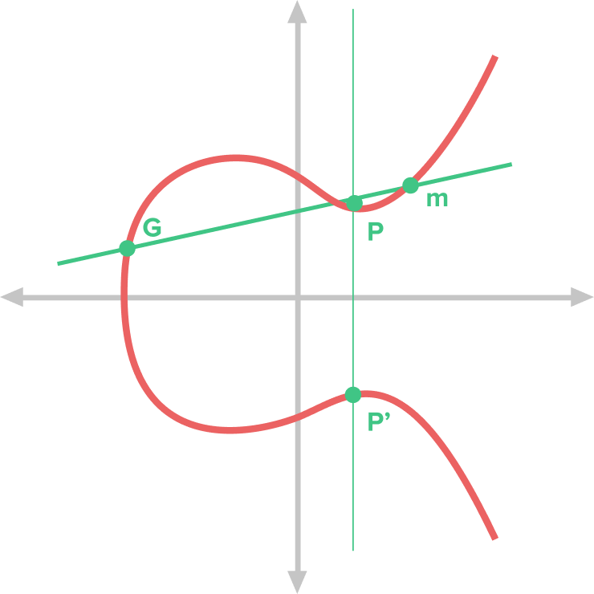

## Encryption Technology

Data security protects our data from unauthorized access, and encryption solutions are a crucial means to achieve this goal. There are two basic types of encryption solutions: data-at-rest encryption and data-in-transit encryption.

### Data-at-Rest Encryption

Data-at-rest encryption refers to the encryption of information stored on media such as servers or computer hard drives. For this type of data, any application that needs to access the encrypted data must be configured to decrypt it. There are many data security solutions for data-at-rest encryption, such as Bitlocker for Windows or Firevault for macOS.

### Data-in-Transit Encryption

Data-in-transit encryption involves the process of sending and receiving data, such as emails or information transmitted between internal systems. In this case, both the sender and receiver need to have the ability to encrypt and decrypt the data, a method known as end-to-end encryption or E2EE. These requirements increase the management burden, especially when you need to send encrypted messages outside the organization, which can become very complex.

## Common Types of Data Encryption

### Symmetric Encryption

**How it works:** Symmetric encryption uses the same key to both encrypt and decrypt data. This means that the sender and receiver must share the key in advance. The process of encryption and decryption uses the same key, making it very fast.

**Technologies Used:** Common symmetric encryption algorithms include DES (Data Encryption Standard), 3DES, and AES (Advanced Encryption Standard).

**Application Scenarios:** Symmetric encryption is suitable for scenarios where large amounts of data need to be encrypted and decrypted efficiently, such as data storage and data transmission. However, since the key needs to be shared in advance, the security relies on the protection and distribution of the key, making it unsuitable for open communication environments.

### Asymmetric Encryption

**How it works:** Asymmetric encryption uses a pair of keys, known as a public key and a private key. The public key is used to encrypt data, and the private key is used to decrypt data. This means that the sender can use the receiver's public key to encrypt the data, and only the receiver who holds the corresponding private key can decrypt the data.

**Technologies Used:** Common asymmetric encryption algorithms include RSA, DSA, and ECC.

**Application Scenarios:** Asymmetric encryption is suitable for secure communication scenarios, especially in network transmissions such as certificate exchange in SSL/TLS protocols and digital signatures. It provides better security because the private key does not need to be transmitted or shared, and even if the public key is leaked, the security of the data remains unaffected.

### Cryptographic Hash Function

**How it works:** A cryptographic hash function converts input data into a fixed-length hash value, and it is impossible to restore the original data from the hash value.

**Technologies Used:** Common hash functions include MD5 (currently considered insecure and easily broken) and SHA.

**Application Scenarios:** The primary application scenarios include data integrity verification, file integrity verification, password hashing, and digital signatures.

## Encryption Algorithms in Blockchain

In the blockchain environment, users need to take responsibility for managing their encryption keys, including storing, transferring, and verifying information. This redistribution of responsibility emphasizes the importance of the user. An educated user who follows best practices to ensure credential security will be safer than most commercial solutions. Commercial solutions usually allow companies to store all user credentials in one place, making them more attractive to attackers.

Common encryption algorithms in the blockchain field include:

### Elliptic Curve Cryptography

Elliptic Curve Cryptography (ECC) is a type of public key cryptographic system. This system is characterized by being easy to process in one direction but extremely difficult to compute in the opposite direction. This concept is known in algorithms as [Trapdoor Functions](https://en.wikipedia.org/wiki/Trapdoor_function).

The basic properties of elliptic curves are:

- Must satisfy the equation: ( y^2 = x^3 + ax + b )
- Symmetry about the X-axis (e.g., ( p ), ( p' ))
- Any non-vertical line intersects the curve at most three times (e.g., points ( G ), ( P ), ( m ))
- Any two points on the curve can be added to obtain a new point (e.g., ( G \cdot P = m ))
  Below are the general steps and applications of elliptic curve encryption:

In elliptic curve encryption, the **private key** is not derived through any computation but is randomly chosen. The private key is usually a very large number, and this number is secret, known only to the holder of the private key.

The generation of the public key is based on the private key: First, choose a public base point, noted as ( G ). Then, use your private key ( \text{priv} ) as a scalar and perform point multiplication with the base point ( G ), which involves adding ( G ) to itself ( \text{priv} ) times. The result of this scalar multiplication is another point on the curve, which serves as the public key, noted as ( P ). Thus, ( P = \text{priv} \times G ), where ( \times ) represents scalar multiplication on the elliptic curve, distinct from traditional multiplication. The process of deriving the private key from the public key in elliptic curve cryptography is known as the elliptic curve discrete logarithm problem (ECDLP). This problem is computationally difficult, especially when the prime number is large. This property forms the basis of the trapdoor function, crucial for public key encryption and digital signature systems, and is key to the security of the encryption algorithm.

Elliptic Curve Applications in Blockchain

1. Key Generation

Using MetaMask as an example, users can create a wallet with a unique address public key and private key. The public key is a string used as an address to receive cryptocurrency, similar to a bank account number, allowing other users to send cryptocurrency to you. The private key is a secret password linked to your public key, akin to a PIN for your bank card. Possessing the private key means having full control over the cryptocurrency in the public key address. The private key is crucial for securing your cryptocurrency; anyone with access to your private key essentially owns your assets. Whenever a user wants to conduct a transaction, they must provide the wallet address (public key) of another node in the network and sign the transaction with their private key. By signing the transaction, the user unlocks the funds associated with their address.

During the key generation process, a mnemonic phrase is generated. Mnemonic phrases are commonly used for private key management in cryptocurrency wallets.

In the cryptocurrency world, the user's private key is pivotal to their assets. However, private keys are often very long random strings that are hard to remember. To facilitate private key management, mnemonic phrases (also known as seed phrases or recovery phrases) are used. These mnemonic phrases, through a series of mathematical processes, are ultimately converted into a private key. This private key is generally generated using elliptic curve cryptography.

2. Digital Signatures

In the blockchain, every transaction is digitally signed to prove its origin and integrity. The sender uses their private key to sign the transaction, and the verifier can use the sender's public key to verify the signature.

3. Key Exchange

ECC can also be used for secure key exchange. By using each party's public and private keys, a shared symmetric key can be securely generated without being exposed to a man-in-the-middle attack.

### Hash Encryption

The main features of hash functions include:

- Deterministic: For a given input, the hash function always generates the same output.
- Fixed-Length Output: The output generated by a hash function has a fixed length, regardless of the input data's length.
- Avalanche Effect: Even a small change in the input data results in a significantly different output hash.
- Irreversibility: Typically, hash functions are one-way, meaning it's infeasible to derive the original input data from the hash value.
- Collision Resistance: Ideally, two different input data sets should not produce the same hash value. Even minor changes in the input should generate different hashes.

To enhance the security of the hash function, a random input called a salt can be added to the original input before hashing. This leads to a different output hash, making it more difficult to recover the original message from the hash without knowing the salt.

**Application**

1. Hash Functions and Blockchain State
   Hash functions are used to represent the current state of the blockchain. The hash value of each block depends on the hash of the previous block, linking all blocks together. This creates a tamper-resistant chain, as any modification to transaction data will change the block's hash value, thereby breaking the chain. A visual demonstration can be found [here](https://ethereum.org/en/developers/docs/intro-to-ethereum).

2. PoW Mining: Miners use hash functions to search for a random number (nonce) that, when combined with block data, produces a hash value that meets certain conditions. Only by finding a valid nonce can they generate a valid block and add it to the blockchain. PoW blockchains typically aim to have ASIC resistance (referring mainly to hardware specialized for cryptocurrency mining) to mitigate centralization tendencies. ASIC-resistant PoW mining is more decentralized, as users do not need to obtain specialized hardware first, thereby lowering the entry barrier.

### Attribute-Based Encryption (ABE)

Attribute-Based Encryption (ABE) has the following key features:

1. Flexibility: ABE allows for different access permissions based on user attributes. This means that access to encrypted data can be defined based on specific user attributes such as age, role, identity, etc.
2. Security: ABE offers a high level of security because only users with specific attributes can decrypt the data. Even if a key is leaked, decryption requires meeting the attribute conditions, thereby enhancing data security.
3. Privacy Protection: ABE protects user privacy, as only users meeting specific attribute conditions can access the encrypted data. This allows users to control who can access their data, thus safeguarding their privacy.
4. Many-to-Many Access: ABE supports a one-to-many or many-to-many access model, whereby data encrypted by one user can be decrypted by multiple users. This flexibility makes data sharing easier.
5. Wide Applicability: ABE is applicable in various scenarios, including data sharing, access control, privacy protection, and more. It suits any situation where access needs to be defined based on user attributes.

Symmetric encryption schemes are susceptible to key leakage, while asymmetric encryption schemes face substantial encryption and decryption overhead. ABE extends asymmetric encryption algorithms, addressing the key leakage issue in symmetric encryption while allowing user-generated attribute private keys to meet the one-to-many encryption and decryption requirement. This means data encrypted by one user can be decrypted by multiple users, reducing the overall encryption and decryption overhead.

### System Architecture of Blockchain

- PFS (InterPlanetary File System): Provides offline storage services for data owners.

- Authorization Center: Generates required parameters and keys for data owners and data demanders, similar to MetaMask.

- Data Owner: Encrypts the data using attribute-based encryption algorithms, transfers the ciphertext to IPFS, and obtains the hash value of the ciphertext.

- Blockchain: Performs elliptic curve encryption on the hash value of the offline data ciphertext and records the identity information of both parties involved in the data sharing, generating a data sharing log.

- Data Demander: Retrieves the encrypted hash value of the data ciphertext from the blockchain, decrypts the hash value to download the data ciphertext from IPFS, and finally decrypts the ciphertext using attribute-based decryption to restore the original data.

## Conclusion

Blockchain encryption technology provides solid security for digital assets. Through asymmetric encryption techniques and advanced encryption algorithms, users can perform secure transactions and communications on the blockchain, ensuring the preservation and circulation of digital assets.

## References

- [A blockchain-based traceable and secure data-sharing scheme](https://www.ncbi.nlm.nih.gov/pmc/articles/PMC10280384/)
