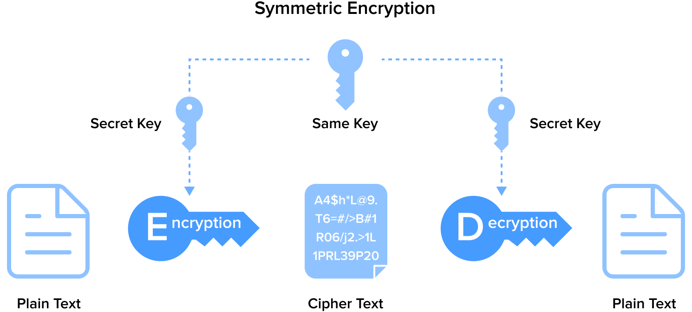
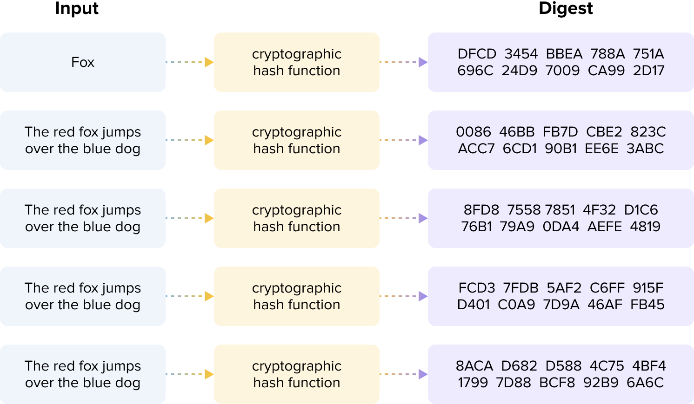

## Introduction

Blockchain is a decentralized distributed ledger technology that is rapidly transforming multiple sectors, including finance, supply chain management, and smart contracts. As blockchain technology becomes more widely adopted, safeguarding digital assets and sensitive information while ensuring secure transactions becomes critical. For blockchain to be adopted by almost any organization, knowing how to secure digital assets in areas like transaction verification, identity authentication, and preventing data tampering is necessary.

Security is paramount at the core of blockchain, and cryptographic techniques are the foundation for ensuring this security. Here, we will explore the primary cryptographic techniques used in blockchain, including symmetric encryption, asymmetric encryption, and hash functions. These encryption technologies form the backbone of secure communication, transactions, and identity verification, significantly reducing security vulnerabilities. By the end of this article, you’ll be able to understand and assess the core encryption technologies used in blockchain, identify potential security risks, and apply these encryption methods to enhance system security, ensuring the safety of data and transactions.

## Common Types of Data Encryption

A core concept of data encryption is the transformation of readable information (plaintext) into an unreadable format (ciphertext) so that only authorized users can decrypt it. Here, we introduce symmetric encryption, asymmetric encryption, and hash functions in data encryption.

### 1. Symmetric Encryption

**Working Principle**: Symmetric encryption uses the same key for data encryption and decryption. This means that both the sender and the receiver must share the key beforehand. The encryption and decryption operations are typically very fast because the same key is used for both processes.

**Technologies Used**: Common symmetric encryption algorithms include DES (Data Encryption Standard), 3DES, and AES (Advanced Encryption Standard).

**Application Scenarios**: Symmetric encryption is suitable for scenarios that require efficient encryption and decryption of large volumes of data, such as data storage and transmission. However, since the key needs to be shared in advance, the security of symmetric encryption relies on protecting and distributing the key, making it unsuitable for open communication environments.

### 2. Asymmetric Encryption

**Working Principle**: Asymmetric encryption uses a pair of keys, commonly called the public and private keys. The public key encrypts data, while the private key decrypts it. This means that the sender can encrypt the data using the recipient's public key, and only the recipient, who holds the corresponding private key, can decrypt the data.

**Technologies Used**: Common asymmetric encryption algorithms include RSA, DSA, and ECC (Elliptic Curve Cryptography).

**Application Scenarios**: Asymmetric encryption is suitable for secure communication scenarios, particularly those involving data transmission over networks, such as certificate exchange in the SSL/TLS protocols and digital signatures. It offers enhanced security because the private key does not need to be transmitted or shared. Even if the public key is compromised, the security of the data is not affected.

### 3. Hash Encryption

**Working Principle**: Hash encryption involves converting input data into a fixed-length hash value, making it impossible to reconstruct the original data from the hash value.

**Technologies Used**: Common hash functions include MD5 (currently considered insecure and easily breakable) and SHA (Secure Hash Algorithms), among others.

**Application Scenarios**: Hash encryption's primary applications include data integrity verification, file integrity verification, password hashing for storage, and digital signatures.

## Cryptographic Techniques in Blockchain

In this article, we are introducing two important encryption techniques in blockchain technology: Elliptic Curve Cryptography (ECC) and hash functions.

Elliptic Curve Cryptography (ECC) is an asymmetric encryption method known for its high security and computational efficiency. ECC provides strong encryption while using relatively short key lengths, enabling more efficient encryption and decryption processes. This makes ECC widely used in generating digital signatures and performing secure key exchanges, which are critical for ensuring the security of blockchain transactions, identity verification, and data integrity protection.

Hash functions play an indispensable role in ensuring data integrity and security. By converting input data of arbitrary length into fixed-length outputs, hash functions can quickly detect any data tampering, as even a slight change in the input results in significantly different hash values. In blockchains, each block contains the previous block's hash, creating a secure and immutable chain structure. Additionally, hash functions are used to create Merkle trees, supporting efficient transaction verification and retrieval.

Together, these technologies provide foundational security guarantees for blockchains, supporting the security, transparency, and immutability of decentralized applications.

### Elliptic Curve Cryptography (ECC)

Elliptic Curve Cryptography (ECC) is a public key cryptographic system characterized by being easy to compute in one direction but extremely difficult to compute in the opposite direction. This characteristic in algorithms is known as trapdoor functions.

Basic Characteristics of Elliptic Curves:

- The equation must satisfy the form: (y^2 = x^3 + ax + b )
- Symmetric about the x-axis (as shown by points p and p')
- Any non-vertical line intersects the curve at most three times (as depicted by points G, P, and m)
- Any two points on the curve can be multiplied to obtain a new point (G dot P = m)

**General Steps and Applications of Elliptic Curve Cryptography**

In elliptic curve cryptography, the private key is not derived through calculations but rather a randomly selected number. It is generally a large number, known only to the holder, and kept secret.

The generation of the public key is based on the private key. First, a common base point, denoted as G, is selected. Then, the private key _priv_ as a scalar is multiplied by the base point G, effectively adding G to itself _priv_ times. The result of the scalar multiplication on the curve is another point, which serves as the public key, denoted as P (P = Priv \* G). Here, \* represents scalar multiplication in the context of elliptic curves, distinct from traditional multiplication or exponentiation (^). Point addition and scalar multiplication on elliptic curves are uniquely defined operations that differ from conventional arithmetic rules.

Deriving the private key from the public key in elliptic curve cryptography involves the elliptic curve discrete logarithm problem. Mathematically, this is an intractable problem, especially with large prime numbers. The inherent difficulty forms the trapdoor function, which is the foundation for the security in public key encryption and digital signature systems. The security of cryptographic algorithms fundamentally depends on this property.

:::center

:::

#### Application of Elliptic Curve Cryptography in Blockchain

There are four main applications of elliptic curve cryptography in blockchain, each with a different business goal and purpose.

1. **Key Pair Generation Elliptic curve algorithms are crucial for generating public-private key pairs for blockchain users.** The public key is used to generate wallet addresses. In contrast, the private key is used to sign transactions, control funds, and validate identity. This mechanism ensures that only the wallet owner can authorize transactions, thus preventing unauthorized access and fraud. It reduces transaction costs, enhances transparency and auditability, and ultimately provides businesses with a secure, efficient, and transparent financial operation environment.

   - Public Key Generation: Generating a public key from a private key is a mathematical operation involving point multiplication on an elliptic curve.

   - Private Key Protection: The private key must be securely stored. Possession of the private key equates to control over all assets in the associated account.

   The methods by which Bitcoin, Ethereum, and Solana generate wallet addresses from public keys include:

   - Bitcoin: Uses the secp256k1 elliptic curve algorithm. Address generation includes steps like SHA-256 and RIPEMD-160 hashing, followed by Base58 encoding. Addresses begin with 1, 3, or bc1.

   - Ethereum: Uses the secp256k1 elliptic curve algorithm. Address generation involves Keccak-256 hashing. Addresses start with 0x.

   - Solana: Uses the Ed25519 elliptic curve algorithm. The addresses are 44-byte Base58 encoded strings that directly correspond to the public key's Base58 encoding without additional hashing steps.

2. **Digital Signatures. Elliptic curve digital signature algorithms are used to sign transactions.** The signing process ensures the transaction's integrity and authenticity, making it tamper-proof. This not only enhances the security and reliability of transactions but also increases the level of trust between customers and partners.

   - Signing Transactions: Users sign transaction data with their private key to create a digital signature.
   - Verifying Signatures: Other nodes use the public key to verify the signature's validity, ensuring that the transaction has not been tampered with and was initiated by the holder of the corresponding private key.

   There are three main purposes for digital signatures:

   - **Authorization Proof:** Signatures prove that the controller of the private key, i.e., the owner of the funds, has authorized the transfer of these funds.

   - **Non-Repudiation:** The authorization is undeniable.

   - **Transaction Integrity:** Authorized transactions cannot be altered by unauthorized third parties.

   Ethereum and Solana's transactions include calls to smart contracts requiring digital signatures to verify the caller's legitimacy.

3. **Identity Verification. Elliptic curve algorithms are used for identity verification, ensuring that only authorized users can access specific blockchain resources or perform certain operations.**

   - User Identity: Verifying user identity through digital signatures and public key verification. This process ensures that communications and transactions can be securely linked to the rightful owner.

   - Smart Contracts: Using digital signatures to verify the identity of the contract caller in smart contracts.

4. **Multi-Signature requires multiple signatures to authorize a transaction or perform an action.**
   This mechanism significantly increases account security and control, especially in blockchain and cryptocurrency. Elliptic curve algorithms typically support multi-signature schemes by generating multiple key pairs and corresponding signatures. This mechanism is important for corporate accounts, large fund management, and decentralized governance scenarios. The multi-signature mechanism significantly enhances account security and internal control by requiring multiple decision-makers to jointly authorize transactions, which is crucial in blockchain and cryptocurrency environments.

### Hash Encryption

Hash encryption significantly enhances data management and transaction security by ensuring data integrity and security, improving processing efficiency, and supporting authentication and data deduplication.

The main features of hash functions include:

- Determinism: The same hash output is always generated by an input message.
- Verifiability: Computing the hash of a message is efficient (linear complexity).
- Non-Correlation: A small change in the message (e.g., changing 1 bit) should result in a widely varied hash output, making it impossible to relate it to the original message's hash.
- Irreversibility: It is infeasible to derive the original message from the hash value, equivalent to performing a brute-force search over all possible messages.
- Collision Protection: Finding two messages that produce the same hash output is infeasible.

In blockchain technology, hash functions also play crucial roles, and different blockchains often adopt different hash algorithms to meet specific security and performance requirements. Below are some mainstream blockchains and their employed hash algorithms:

- Bitcoin

  - Main Hash Algorithm: SHA-256 (Secure Hash Algorithm 256-bit)
  - Uses: Mining process (Proof of Work), transaction hashes, block hashes, Merkle trees

- Ethereum

  - Main Hash Algorithm: Keccak-256 (often incorrectly referred to as SHA-3)
  - Uses: Transaction hashes, address generation, smart contract data verification, Merkle trees

- Solana

  - Main Hash Algorithms: SHA-256 and SHA-3
  - Uses:
    - SHA-256: Mainly used for Proof of History (PoH), data verification, generating unique identifiers
    - SHA-3: Used for smart contract execution and data verification

## Conclusion

Blockchain encryption technology provides a robust safeguard for the security of digital assets. Using asymmetric encryption techniques and advanced cryptographic algorithms, businesses can conduct secure transactions and communications on the blockchain, ensuring the preservation and circulation of digital assets. This technology guarantees the confidentiality and integrity of transactions, preventing unauthorized access and tampering, and enhancing trust among business partners. It also aids in meeting regulatory compliance requirements and improves the efficiency of digital asset management, supporting businesses in exploring new revenue streams and optimizing financial strategies.
