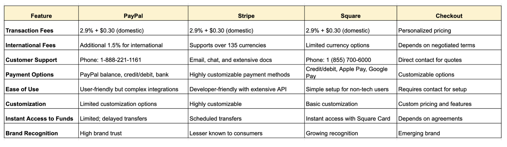
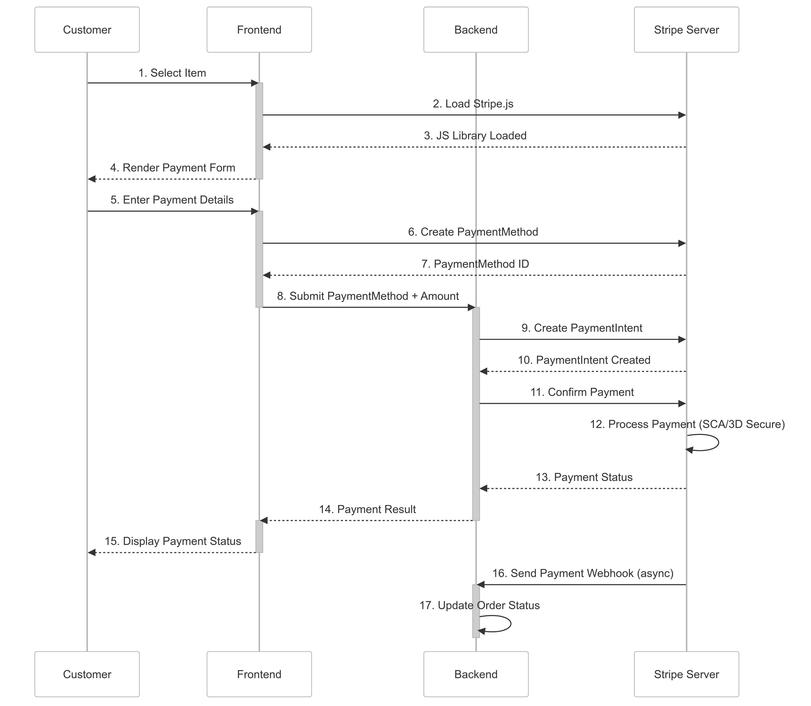
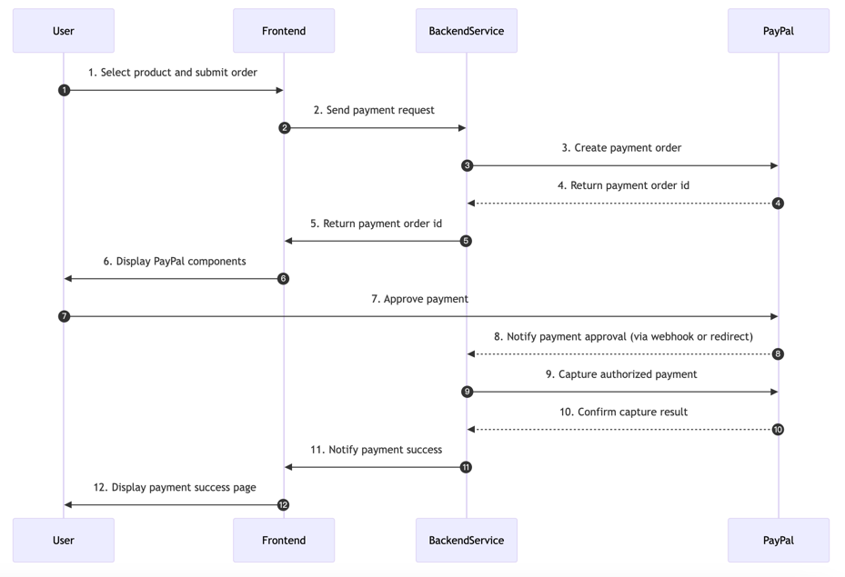

# Code to Cash: Expert Insights on Implementing Payment Processors in Your Web App

## 1. Introduction to Payment Systems

### 1.1 Current Payment Landscape

The financial services industry is experiencing an unprecedented transformation in the digital age. Traditional banking systems are rapidly evolving, while innovative fintech solutions continue to reshape the market. This evolution is driven by several key factors:

- The acceleration of digital transformation in traditional banking
- The emergence of agile fintech companies introducing innovative solutions
- Consumer demand for seamless, instant payment experiences
- Regulatory changes adapting to new technological capabilities

These changes have created a dynamic ecosystem where traditional banks and fintech companies both compete and collaborate, leading to more innovative and efficient payment solutions.

### 1.2 Payment Platform Comparison

#### 1.2.1 Major Payment Solutions

The payment processing landscape is dominated by several key players, each with distinct characteristics:

**PayPal** continues to maintain its position as a global leader, leveraging its early market entry and vast user base. Their strength lies in consumer trust and international reach, making them particularly valuable for cross-border commerce.

**Stripe** has revolutionized the payment industry with its developer-first approach. Their REST APIs and comprehensive documentation have set new standards for payment integration, making it a preferred choice for tech-savvy businesses.

**Square** is an integrated payment processing platform that provides a user-friendly solution for small businesses, offering features like point of sale, online sales, and instant access to funds. It allows merchants to easily accept various payment methods, including credit cards and digital wallets, with a straightforward fee structure.

**Checkout** is a customizable payment processing solution designed for larger enterprises, offering personalized pricing and vadvanced features to optimize transactions across various payment methods and currencies. It focuses on providing a seamless payment experience with robust support for international payments and compliance.




#### 1.2.2 Strategic Platform Selection

Choosing the right payment platform requires careful consideration of multiple factors:

- Transaction volumes and scaling requirements
- Geographic presence and market-specific needs
- Technical expertise and integration capabilities
- Implementation timelines and resource availability
- Cost structures and budget constraints

The decision often involves balancing immediate needs with long-term strategic goals, considering both technical and business requirements.

### 1.3 Integration Strategy & Architecture Design

A robust payment system architecture is fundamental to long-term success. Key considerations include:

- Gateway Interface Design: Creating flexible interfaces that can adapt to different payment providers
- Processing System Integration: Ensuring seamless communication between various system components
- Security Implementation: Building multi-layered security protocols that protect sensitive data
- Monitoring Systems: Implementing comprehensive logging and tracking mechanisms
- Scalability Planning: Designing systems that can grow with business needs

The architecture must be both robust enough to handle current requirements and flexible enough to accommodate future growth and technological changes.

## 2. Modern Payment Trends

The digital payments landscape has undergone a remarkable transformation in recent years, revolutionizing how consumers and businesses conduct financial transactions. This evolution has been driven by technological advancements, changing consumer preferences, and the growing demand for seamless payment experiences.

### 2.1 The Rise of Digital Payments

At the forefront of this transformation is the widespread adoption of mobile wallets. Services like Apple Pay, Google Pay, and Samsung Pay have transformed smartphones into powerful payment tools, fundamentally changing how we interact with money. Their success can be attributed to several key factors:

- Enhanced security through sophisticated tokenization technology
- Seamless integration with existing banking infrastructure
- Improved user experience through biometric authentication
- Growing merchant acceptance worldwide

Alongside mobile wallets, QR code payments have emerged as a transformative force, particularly in Asian markets. Their remarkable success stems from several compelling advantages:

- Minimal implementation costs for merchants
- Intuitive and simplified user experience
- Natural integration with popular social platforms
- Reduced need for specialized hardware

### 2.2 Alternative Payment Methods



#### 2.2.1 Buy Now Pay Later (BNPL)

The financial services landscape has been significantly disrupted by Buy Now Pay Later services. Companies like Klarna, Affirm, and Afterpay have created a new paradigm in retail financing that resonates strongly with modern consumers. Their success is built on several innovative features:

- Interest-free installment payments that particularly appeal to younger consumers
- Instant credit decisions that enhance the shopping experience
- Seamless integration with major e-commerce platforms
- Advanced risk assessment models that enable broader credit access

#### 2.2.2 Cryptocurrency and Blockchain Payments

While initially viewed primarily as speculative investments, cryptocurrencies are increasingly establishing themselves as viable payment solutions. The cryptocurrency space continues to evolve with several promising developments:

- Stablecoins emerging as practical payment solutions
- Smart contracts enabling programmable transactions
- DeFi protocols introducing innovative financial instruments
- Reduced friction in cross-border payments

### 2.3 Regional Innovation and Adoption

#### 2.3.1 Asian Market Leadership

Asia continues to lead global payment innovation, with developments that are reshaping the financial landscape. The Chinese digital ecosystem, in particular, demonstrates the potential of integrated payment solutions:

**China's Digital Ecosystem**

- The dominance of WeChat Pay and Alipay in daily transactions
- Super-app integration creating seamless user experiences
- Advanced facial recognition payment systems
- Widespread rural market penetration through simplified solutions

The Southeast Asian market shows similar dynamism, characterized by:

**Southeast Asian Development**

- Regional leaders like GrabPay and Go-Pay driving adoption
- Innovative cross-border payment initiatives
- Strong government support for digital transformation
- Financial inclusion efforts through mobile solutions

#### 2.3.2 European Payment Evolution

Europe's payment landscape is evolving along a distinct path, shaped by several key factors:

- Comprehensive regulatory frameworks, particularly PSD2
- Progressive Open Banking initiatives
- Advanced instant payment systems like SEPA Instant
- Successful country-specific solutions such as iDEAL and Swish

These developments are fostering a more integrated and efficient payment ecosystem across the continent, while maintaining the high standards of security and compliance that characterize European financial services.

This diverse global landscape of payment innovation reflects different market needs, regulatory environments, and technological capabilities. As these systems continue to evolve, they increasingly influence and learn from each other, contributing to a more connected and sophisticated global payment ecosystem.

## 3. Stripe Integration

Stripe is a widely used online payment processing platform that offers comprehensive APIs and SDKs, making it convenient for developers to incorporate payment features into their applications.

### 3.1 Basic Setup

#### 3.1.1 Account Registration and Setup

Begin by registering an account on the [Stripe official website](https://stripe.com). After registration, log in to the Stripe Dashboard to access your API keys and manage your account settings.

#### 3.1.2 API Keys Configuration

In the Stripe Dashboard under the "Developers" section, locate your API keys. You'll need both the **Publishable Key** (used on the client side) and the **Secret Key** (used on the server side). Ensure these keys are securely stored and not exposed publicly.

#### 3.1.3 SDK Installation

**Installing the Golang SDK**

```bash
go get -u github.com/stripe/stripe-go/v81
```

**Install the React Stripe libraries**

```bash
npm install @stripe/react-stripe-js @stripe/stripe-js
```

### 3.2 Payment Flow Implementation

Here's the Stripe payment flow swimlane diagram.



#### 3.2.1 Creating Payment Intents

The Payment Intents API is central to Stripe's payment processing, allowing you to manage the lifecycle of a payment.

```go
package main


import (
    "encoding/json"
    "log"
    "net/http"
    "os"
    "strconv"


    "github.com/joho/godotenv"
    "github.com/stripe/stripe-go/v81"
    "github.com/stripe/stripe-go/v81/paymentintent"
)


func createPaymentIntentHandler(w http.ResponseWriter, r *http.Request) {
    w.Header().Set("Access-Control-Allow-Origin", "*")
    w.Header().Set("Access-Control-Allow-Methods", "*")
    w.Header().Set("Access-Control-Allow-Headers", "*")
    if r.Method == "OPTIONS" {
       w.WriteHeader(http.StatusOK)
       return
    }


    err := r.ParseForm()
    if err != nil {
       http.Error(w, "Form parsed failed", http.StatusBadRequest)
    }
    amountStr := r.FormValue("amount")
    amount, err := strconv.ParseInt(amountStr, 10, 64)
    if err != nil {
       http.Error(w, "Invalid amount", http.StatusBadRequest)
       return
    }
    params := &stripe.PaymentIntentParams{
       Amount:   stripe.Int64(amount * 100),
       Currency: stripe.String(string(stripe.CurrencyUSD)),
    }
    paymentIntent, err := paymentintent.New(params)
    if err != nil {
       http.Error(w, err.Error(), http.StatusInternalServerError)
       return
    }
    w.Header().Set("Content-Type", "application/json")
    err = json.NewEncoder(w).Encode(map[string]string{
       "clientSecret": paymentIntent.ClientSecret,
    })
    if err != nil {
       http.Error(w, err.Error(), http.StatusInternalServerError)
       return
    }
}


func main() {
    if err := godotenv.Load(); err != nil {
       log.Fatalln("Error loading .env file")
    }


    stripe.Key = os.Getenv("STRIPE_SECRET_KEY")


    http.HandleFunc("/create-payment-intent", createPaymentIntentHandler)


    if err := http.ListenAndServe(":8080", nil); err != nil {
       log.Fatalf("Failed to listen on port 8080: %v", err)
    } else {
       log.Println("Server started successfully on :8080")
    }
}
```

In this code, we initialize the Stripe API with your secret key, create a PaymentIntent with the specified amount and currency, and return the client secret to the frontend.

#### 3.2.2 Client-side Payment Elements

Stripe's React components, known as Elements, provide a secure and customizable way to collect payment information.

```javascript
'use client'


import { useState, useEffect } from 'react';
import { Elements, PaymentElement } from '@stripe/react-stripe-js';
import { loadStripe } from '@stripe/stripe-js';


const stripePromise = loadStripe(process.env.NEXT_PUBLIC_STRIPE_PUBLIC_KEY!);


export default function Home() {
    const [clientSecret, setClientSecret] = useState<string>();


    useEffect(() => {
        fetch('/create-payment-intent', {
            method: 'POST',
            headers: { 'Content-Type': 'application/x-www-form-urlencoded' },
            body: new URLSearchParams({ amount: '100' }).toString(),
        })
            .then(res => res.json())
            .then(data => setClientSecret(data.clientSecret));
    }, []);


    if (!clientSecret) {
        return <div>Loading...</div>;
    }


    return (
        <Elements stripe={stripePromise} options={{ clientSecret }}>
            <form>
                <PaymentElement/>
                <button>Submit</button>
            </form>
        </Elements>
    );
};
```

Here, we load Stripe.js, set up the Elements provider with the public key, and create a checkout form that includes the PaymentElement. The form handles the payment submission process.

#### 3.2.3 Handling Payment Results

To handle payment results, especially asynchronous events, Stripe recommends using webhooks.

```go
func webhookHandler(w http.ResponseWriter, r *http.Request) {
    // Retrieve the signature header
    sigHeader := r.Header.Get("Stripe-Signature")
    payload, err := io.ReadAll(r.Body)
    if err != nil {
       http.Error(w, "Unable to read request body", http.StatusBadRequest)
       return
    }


    // Replace with your Webhook secret
    endpointSecret := "whsec_..." // Your Webhook secret
    event, err := webhook.ConstructEvent(payload, sigHeader, endpointSecret)
    if err != nil {
       http.Error(w, fmt.Sprintf("Signature verification failed: %v", err), http.StatusBadRequest)
       return
    }


    // Handle the event
    switch event.Type {
    case "payment_intent.succeeded":
       var paymentIntent stripe.PaymentIntent
       err := json.Unmarshal(event.Data.Raw, &paymentIntent)
       if err != nil {
          http.Error(w, fmt.Sprintf("Error parsing webhook JSON: %v", err), http.StatusBadRequest)
          return
       }
       fmt.Printf("Payment succeeded: %s\n", paymentIntent.ID)
       // Add your business logic here, e.g., update order status
    default:
       fmt.Printf("Unhandled event type: %s\n", event.Type)
    }


    // Respond with a 200 status to acknowledge receipt of the event
    w.WriteHeader(http.StatusOK)
}


http.HandleFunc("/webhook", webhookHandler)
```

In this code, the `webhookHandler` function processes incoming Webhook requests. It retrieves the Stripe signature from the request header and reads the request body. Then, it uses your Webhook secret to verify the signature, ensuring the request is from Stripe. Based on the event type, it processes the corresponding business logic.

**Verify Webhook Signature**:

To ensure the security of the request, you need to verify the signature of the Webhook request sent by Stripe. The code above uses Stripe's Go library's `webhook.ConstructEvent` function to perform signature verification.

**Handle Payment Success Event**:

In the `handleWebhook` function, when a `payment_intent.succeeded` event is received, you can access the `PaymentIntent` object and add your business logic, such as updating the order status or sending notifications.

**Start the Server**:

Run your Go application, ensuring the server listens on the specified port (8080 in the example above).

**Register Webhook Endpoint in Stripe**:

Log in to your Stripe Dashboard, navigate to the Webhooks section, add your Webhook endpoint URL, and select the event types you want to receive, such as `payment_intent.succeeded`.

#### **3.2.4 Local Development Testing Considerations**

When developing locally, Stripe needs to communicate with your local server. Since your local server isn't publicly accessible, you can use a tool like [ngrok](https://ngrok.com/downloads) to create a secure tunnel to your localhost.

**Install ngrok**:

1. Download and install ngrok from the official website.

**Start ngrok**:

Run ngrok to expose your local server:

```bash
ngrok http 8080
```

This command will provide a public URL (e.g., `https://<random_subdomain>.ngrok.io`) that forwards requests to your local server.

**Update Stripe Webhook Endpoint**:

In your Stripe Dashboard, update the Webhook endpoint URL to the ngrok URL provided (e.g., `https://<random_subdomain>.ngrok.io/webhook`).

**Test Webhook Events**:

You can now test Webhook events by sending them to your ngrok URL. Stripe will forward the events to your local server, allowing you to test your Webhook handling logic.

By following these steps, you can effectively handle Stripe payment success Webhook events in Go and test them during local development.

### 3.3 Advanced Features

Stripe is a powerful payment processing platform that offers a wide range of advanced features to handle complex payment scenarios. In this article, we will explore some of these advanced features, including **Saving Payment Methods**, **Subscription Payments**, **Refund Processing**, and **Multi-currency Support**. We'll discuss their use cases and provide complete Go code examples for each feature.

#### 3.3.1 Saving Payment Methods

Saving payment methods allows you to store a customer's payment details securely for future use. This is particularly useful for recurring payments, one-click checkouts, or when you want to offer a seamless payment experience without requiring the customer to re-enter their payment details.

```go
func savePaymentMethod() {
    // Create a new customer
    customerParams := &stripe.CustomerParams{
       Email: stripe.String("customer@example.com"),
    }
    c, err := customer.New(customerParams)
    if err != nil {
       log.Fatalf("Error creating customer: %v", err)
    }


    // Attach a payment method to the customer
    paymentMethodParams := &stripe.PaymentMethodParams{
       Type: stripe.String("card"),
       Card: &stripe.PaymentMethodCardParams{
          Number:   stripe.String("4242424242424242"),
          ExpMonth: stripe.Int64(12),
          ExpYear:  stripe.Int64(2025),
          CVC:      stripe.String("123"),
       },
    }
    pm, err := paymentmethod.New(paymentMethodParams)
    if err != nil {
       log.Fatalf("Error creating payment method: %v", err)
    }


    attachParams := &stripe.PaymentMethodAttachParams{
       Customer: stripe.String(c.ID),
    }
    _, err = paymentmethod.Attach(pm.ID, attachParams)
    if err != nil {
       log.Fatalf("Error attaching payment method: %v", err)
    }


    fmt.Printf("Payment method %s saved for customer %s\n", pm.ID, c.ID)
}
```

#### 3.3.2 Subscription Payments

Subscription payments are ideal for businesses offering recurring services, such as SaaS platforms, membership sites, or subscription boxes. Stripe handles the complexity of recurring billing, including prorations, trial periods, and automatic retries.

```go
func createSubscriptionPayment() {
    // Create a new customer
    customerParams := &stripe.CustomerParams{
       Email: stripe.String("customer@example.com"),
    }
    c, err := customer.New(customerParams)
    if err != nil {
       log.Fatalf("Error creating customer: %v", err)
    }


    // Attach a payment method to the customer
    paymentMethodParams := &stripe.PaymentMethodParams{
       Type: stripe.String("card"),
       Card: &stripe.PaymentMethodCardParams{
          Number:   stripe.String("4242424242424242"),
          ExpMonth: stripe.Int64(12),
          ExpYear:  stripe.Int64(2025),
          CVC:      stripe.String("123"),
       },
    }
    pm, err := paymentmethod.New(paymentMethodParams)
    if err != nil {
       log.Fatalf("Error creating payment method: %v", err)
    }


    attachParams := &stripe.PaymentMethodAttachParams{
       Customer: stripe.String(c.ID),
    }
    _, err = paymentmethod.Attach(pm.ID, attachParams)
    if err != nil {
       log.Fatalf("Error attaching payment method: %v", err)
    }


    // Create a subscription
    subscriptionParams := &stripe.SubscriptionParams{
       Customer: stripe.String(c.ID),
       Items: []*stripe.SubscriptionItemsParams{
          {
             Price: stripe.String("price_1J9Z2Z2eZvKYlo2C3ZJZ3Z3Z"),
          },
       },
    }
    subscription, err := sub.New(subscriptionParams)
    if err != nil {
       log.Fatalf("Error creating subscription: %v", err)
    }


    fmt.Printf("Subscription %s created for customer %s\n", subscription.ID, c.ID)
}
```

#### 3.3.3 Refund Processing

Refunds are essential for maintaining customer satisfaction and handling disputes. Stripe allows you to issue full or partial refunds, either immediately or at a later date.

```go
func refundChange() {
    // Create a charge
    chargeParams := &stripe.ChargeParams{
       Amount:   stripe.Int64(1000),
       Currency: stripe.String(string(stripe.CurrencyUSD)),
       Source: &stripe.PaymentSourceSourceParams{
          Token: stripe.String("tok_visa"),
       },
    }
    ch, err := charge.New(chargeParams)
    if err != nil {
       log.Fatalf("Error creating charge: %v", err)
    }


    // Create a refund
    refundParams := &stripe.RefundParams{
       Charge: stripe.String(ch.ID),
       Amount: stripe.Int64(500),
    }
    r, err := refund.New(refundParams)
    if err != nil {
       log.Fatalf("Error creating refund: %v", err)
    }


    fmt.Printf("Refund %s processed for charge %s\n", r.ID, ch.ID)
}
```

#### 3.3.4 Multi-currency Support

Multi-currency support is crucial for businesses operating in multiple countries. Stripe allows you to charge customers in their local currency, which can improve conversion rates and customer satisfaction.

## 4. PayPal Integration

### 4.1 Basic Setp

#### 4.1.1 Business Account Setup

1. Create a PayPal Business Account:
   Ensure you have a PayPal Business Account. This is essential for handling real transactions. Make sure it is correctly set up and verified.

#### 4.2.2 Register Your App on PayPal's Developer Portal

1. Access the Developer Portal:
   Visit the [PayPal Developer Portal](https://developer.paypal.com/).
2. Log In:
   Register and log in to your developer account.
3. Create a New App:
   Within the portal, create a new app to obtain your API credentials.
4. Obtain API Credentials:
   1. Generate and save your Client ID and Secret.
   2. Navigate to the "Dashboard" -> "My Apps & Credentials" section to find these details.

### 4.2 Payment Flow Implementation

   Here's the Paypal payment flow swimlane diagram.



#### 4.2.1 PayPal Button Integration

Add PayPal SDK:

```bash
npm install @paypal/react-paypal-js
```

Integrate PayPal Buttons:

```javascript
import {
    PayPalButtons,
    PayPalButtonsComponentProps,
    PayPalScriptProvider,
    ReactPayPalScriptOptions,
} from "@paypal/react-paypal-js";


export default function App() {
    const initialOptions: ReactPayPalScriptOptions = {
        clientId: "YOUR_CLIENT_ID",
    };


    const createOrder: PayPalButtonsComponentProps["createOrder"] = async () => {
        const response = await fetch("/create-paypal-order", {
            method: "POST",
            headers: {
                "Content-Type": "application/json",
            },
            body: JSON.stringify({
                cart: [
                    {
                        sku: "YOUR_PRODUCT_STOCK_KEEPING_UNIT",
                        quantity: "YOUR_PRODUCT_QUANTITY",
                    },
                ],
            }),
        });


        const data = await response.json();


        return data.id;
    };


    const onApprove: PayPalButtonsComponentProps["onApprove"] = async (data) => {
        // Capture the funds from the transaction.
        const response = await fetch("/capture-paypal-order", {
            method: "POST",
            body: JSON.stringify({
                orderID: data.orderID,
            }),
        });


        const details = await response.json();


        // Show success message to buyer
        alert(`Transaction completed by ${details.payer.name.given_name}`);
    };


    return (
        <div className="App">
            <PayPalScriptProvider options={initialOptions}>
                <PayPalButtons createOrder={createOrder} onApprove={onApprove} />
            </PayPalScriptProvider>
        </div>
    );
}
```

#### 4.2.2 Payment Flow Handling in Go

Since PayPal does not officially provide a Go SDK, you can use the standard `net/http` library or a community-supported library like `github.com/plutov/paypal/v4`

Install the Library:

```bash
go get github.com/plutov/paypal/v4
```

Initialize the Client:

```go
package main


import (
    "github.com/plutov/paypal/v4"
    "log"
    "context"
)


func main() {
    c, err := paypal.NewClient("YOUR_CLIENT_ID", "YOUR_SECRET", paypal.APIBaseSandBox)
    if err != nil {
        log.Fatal(err)
    }   
}
```

create and  capture order：

```go
package main


import (
	"context"
	"encoding/json"
	"log"
	"net/http"


	"github.com/plutov/paypal/v4"
)


var client *paypal.Client


func main() {
	var err error
	// Initialize the PayPal client with your credentials
	client, err = paypal.NewClient("YOUR_CLIENT_ID", "YOUR_SECRET", paypal.APIBaseSandBox)
	if err != nil {
		log.Fatalf("Error initializing PayPal client: %v", err)
	}


	http.HandleFunc("/create-paypal-order", createPayPalOrder)
	http.HandleFunc("/capture-paypal-order", capturePayPalOrder)
	log.Println("Server listening on :8080")
	log.Fatal(http.ListenAndServe(":8080", nil))
}


// createPayPalOrder creates a PayPal order
func createPayPalOrder(w http.ResponseWriter, r *http.Request) {
	var purchaseUnit = paypal.PurchaseUnitRequest{
		Amount: &paypal.PurchaseUnitAmount{
			Currency: "USD",
			Value:    "100.00",
		},
		Description: "Order description",
	}


	var applicationContext = &paypal.ApplicationContext{
		ReturnURL:          "https://example.com/success",
		CancelURL:          "https://example.com/cancel",
		ShippingPreference: paypal.ShippingPreferenceNoShipping,
		LandingPage:        "BILLING",
		UserAction:         paypal.UserActionPayNow,
	}


	purchaseUnits := []paypal.PurchaseUnitRequest{purchaseUnit}
	order, err := client.CreateOrder(context.Background(), paypal.OrderIntentCapture, purchaseUnits, nil, applicationContext)
	if err != nil {
		http.Error(w, "Error creating order", http.StatusInternalServerError)
		return
	}


	w.Header().Set("Content-Type", "application/json")
	json.NewEncoder(w).Encode(map[string]string{
		"id": order.ID,
	})
}


// capturePayPalOrder captures a PayPal order to confirm the payment
func capturePayPalOrder(w http.ResponseWriter, r *http.Request) {
	var requestData map[string]string
	err := json.NewDecoder(r.Body).Decode(&requestData)
	if err != nil {
		http.Error(w, "Invalid request", http.StatusBadRequest)
		return
	}


	orderID := requestData["orderID"]
	order, err := client.CaptureOrder(context.Background(), orderID, paypal.CaptureOrderRequest{})
	if err != nil {
		http.Error(w, "Error capturing order", http.StatusInternalServerError)
		return
	}


	w.Header().Set("Content-Type", "application/json")
	json.NewEncoder(w).Encode(order)
}
```

#### 4.2.3 Configuring a PayPal Webhook and Implementing It in Go

1. Configuring a PalPal Webhook
   1. Log in to Your PayPal Developer Account:
      1. Visit the PayPal Developer Site: Go to the PayPal Developer Portal.
      2. Log in with Your Credentials: Use your PayPal developer account credentials to access your dashboard.
   2. Navigate to the Dashboard:
      1. Access the Dashboard: Click on the "Dashboard" link at the top-right corner after logging in.
      2. Select Mode: Choose "Sandbox" for testing or "Live" for production. Start with sandbox mode for initial testing.
   3. Select Your Application:
      1. Choose the Correct Application: Under "Applications", select your application. Ensure it is the one you have configured with a client ID and secret.
   4. Configure Webhook:
      1. Locate Webhook Settings: In the application details, find "Sandbox Webhooks" or "Live Webhooks" based on your selected mode.
      2. Add a New Webhook: Click "Add Webhook" to start configuration.
   5. Set Up the Webhook URL and Event Types:
      1. Enter the Webhook URL: Provide your server endpoint URL that will receive webhook notifications. The URL must be publicly accessible.
      2. Select Event Types: Choose the events your webhook will listen for, such as "Payment Capture Completed" for payment success notifications.
   6. Save Webhook Configuration:
      1. Finalize Settings: Click "Save" to store your webhook configurations.
2. Implementing the webhook in go

   Now, we will implement a basic HTTP server in Go to handle PayPal webhook events, including verifying the signature to ensure authenticity.

1. Go Code Explanation:
   1. PayPal Client Initialization: Set up the PayPal client using your application's client ID and secret.
   2. HTTP Server Setup: Define an HTTP route to process webhook requests.
   3. Access Token Management: Ensure you have an access token for API communication.
   4. Signature Verification: Authenticate the webhook signature to verify event legitimacy.
2. Example Code:

```go
package main


import (
    "context"
    "errors"
    "log"
    "net/http"


    "github.com/plutov/paypal/v4"
)


var (
    payClient *paypal.Client
)


func main() {
    var err error


    // Load configuration
    clientID := "YOUR_CLIENT_ID"     // Load from a secure source
    secret := "YOUR_SECRET"          // Load from a secure source
    webhookID := "YOUR_WEBHOOK_ID"   // Load from a secure source


    // Initialize PayPal client
    payClient, err = paypal.NewClient(clientID, secret, paypal.APIBaseSandBox)
    if err != nil {
       log.Fatalf("Error initializing PayPal client: %v", err)
    }


    // Set up HTTP routes
    http.HandleFunc("/order-webhook", handleOrderWebhook(webhookID))


    // Start HTTP server
    if err := http.ListenAndServe(":80", nil); err != nil {
       log.Fatalf("Could not start server: %v", err)
    }
}


func handleOrderWebhook(webhookID string) http.HandlerFunc {
    return func(wr http.ResponseWriter, req *http.Request) {
       ctx := req.Context()


       if err := checkAccessToken(ctx); err != nil {
          log.Println("Access token fetch failed:", err)
          http.Error(wr, "Internal Server Error", http.StatusInternalServerError)
          return
       }
       


       if err := verifySignature(ctx, req, webhookID); err != nil {
          log.Println("Signature verification failed:", err)
          http.Error(wr, "Unauthorized", http.StatusUnauthorized)
          return
       }


       // TODO process event data and capture order
       wr.WriteHeader(http.StatusOK)
       wr.Write([]byte(`{"message": "Webhook processed successfully"}`))
    }
}


func checkAccessToken(ctx context.Context) error {
    if _, err := payClient.GetAccessToken(ctx); err != nil {
       return err
    }
    return nil
}


func verifySignature(ctx context.Context,  req *http.Request, webhookID string) error {
    verified, err := payClient.VerifyWebhookSignature(ctx, req,webhookID)
    if err != nil {
       return err
    }


    if verified.VerificationStatus != "SUCCESS" {
       return errors.New("invalid webhook signature")
    }


    return nil
}
```

### 4.3 Advanced Features

#### 4.3.1 Subscription Management

- PlanID: This is an identifier for a billing plan that has already been configured in your PayPal account. Plans define the subscription terms, including billing frequency, amount, and duration.
- Subscriber: Details about the individual who is subscribing. This generally includes their name and email address, which are crucial for identifying the subscriber in your PayPal records and any communications.

Sample Function：

```go
func createSubscription(client *paypal.Client) {
    billingAgreement := paypal.SubscriptionBase{
       PlanID: "P-XXXXXXXXXX", // Replace with your actual Plan ID
       Subscriber: &paypal.Subscriber{
          Name: paypal.CreateOrderPayerName{
             GivenName: "John",
             Surname:   "Doe",
          },
          EmailAddress: "customer@example.com",
       },
    }


    subscription, err := client.CreateSubscription(context.Background(), billingAgreement)
    if err != nil {
       log.Fatalf("Error creating subscription: %v", err)
    }


    log.Printf("Subscription created: %+v", subscription)
}
```

 

#### 4.3.2 Refund Processing

- Capture ID: Used to identify the specific transaction that you wish to refund. This is obtained from the transaction details.
- CaptureRefundRequest: This includes the amount and currency of the refund you want to process.

Sample Function：

```go
func issueRefund(client *paypal.Client, captureID string) {
	refundRequest := paypal.CaptureRefundRequest{
		Amount: &paypal.Amount{
			Currency: "USD",
			Value:    "10.00", // Specify the amount to refund
		},
	}


	refundResponse, err := client.RefundCapture(context.Background(), captureID, refundRequest)
	if err != nil {
		log.Fatalf("Error processing refund: %v", err)
```

## 5. Payment Systems Security, Error Handling, Integration, Performance, and Scalability

This overview highlights the essential components of payment systems, emphasizing the importance of robust security measures, effective error handling, seamless integration, optimized performance, and scalable architectures. As digital payment landscapes evolve, organizations must adopt comprehensive strategies that address these critical areas to ensure reliability, protect user data, and enhance user experience while maintaining compliance with regulatory standards. Continuous adaptation and improvement in these domains are vital for sustaining trust and competitiveness in the rapidly changing market.



### 5.1 Security & Compliance

Security and compliance form the foundation of modern payment systems, where protecting user data and ensuring transaction integrity are paramount concerns. In today's sophisticated digital landscape, organizations must implement a comprehensive, defense-in-depth approach that addresses multiple security layers while navigating complex regulatory requirements.

- **Sensitive Data Handling**: Protect sensitive information with robust security mechanisms like granular access controls and secure data lifecycle management.
- **SSL/TLS Encryption**: Utilize TLS 1.3 for secure communication, ensuring rigorous certificate management and perfect forward secrecy.
- **Fraud Prevention**: Implement multi-layered strategies including real-time monitoring, machine learning, and dynamic risk scoring.**
- **Modern Security Protocols**: Use advanced protocols like 3D Secure 2.0 and Strong Customer Authentication (SCA) to enhance transaction security while maintaining user experience.
- **Regulatory Compliance**: Adhere to PCI DSS standards and regional regulations like GDPR and CCPA to ensure data protection and compliance.

### 5.2 Error Handling & Monitoring

In the complex world of payment processing, robust error handling and comprehensive monitoring systems are essential for maintaining service reliability and user trust. These systems work in concert to prevent issues, detect problems early, and ensure rapid recovery when failures occur. The ability to gracefully handle errors while maintaining detailed system visibility directly impacts both operational efficiency and user experience.

- **Error Handling Strategies**: Employ intelligent retry mechanisms, idempotent processing, and user-friendly error messages to manage failures gracefully.
- **System Monitoring**: Implement multi-layered monitoring for transaction flow, infrastructure health, and API performance to preemptively identify issues.
- **Logging & Auditing**: Maintain comprehensive logs for transactions, errors, and security events to support operational troubleshooting and compliance.
- **Alerting Systems**: Develop tiered alerting strategies to respond quickly to critical issues and performance degradation.
- **Recovery Procedures**: Establish clear recovery protocols to ensure data consistency and minimize service impact during failures.

### 5.3  Integration & Testing

In modern payment systems, comprehensive testing and seamless integration form the cornerstone of reliable service delivery. As these systems grow in complexity, organizations must adopt sophisticated testing strategies that encompass both technical validations and real-world business scenarios, while maintaining robust integration architectures that can scale with growing demands.

- **Integration Architecture**: Design modular integration interfaces with robust fault isolation and asynchronous processing capabilities.
- **Testing Strategy**: Adopt a multi-layered testing approach, including unit, integration, end-to-end, performance, and security testing to ensure reliability.
- **Test Environments**: Maintain distinct testing environments for development, integration, and performance validation to ensure quality assurance.
- **Test Data Management**: Use synthetic data generation and production data masking to create realistic and secure testing scenarios.
- **Deployment Testing**: Implement automated verification and rollback procedures to ensure seamless transitions during updates.

### 5.4 Performance Optimization

In today's digital payment landscape, system performance isn't merely a technical metric—it's a critical business differentiator that directly impacts user satisfaction, transaction completion rates, and ultimately, revenue. Every millisecond of latency can affect user confidence, while system efficiency determines both operational costs and scalability potential. 

- **Database Optimization**: Utilize query optimization, read/write splitting, and database sharding to enhance data management and processing speed.
- **Application Performance**: Focus on request/response optimization, memory management, and efficient API design to ensure high throughput.
- **Caching Architecture**: Implement multi-level caching strategies to improve performance while ensuring data freshness and consistency.
- **Load Balancing**: Use advanced load balancing techniques, including Layer 7 load balancing and geographic distribution, to optimize resource utilization.
- **Monitoring & Tuning**: Continuously monitor system performance and employ machine learning for proactive optimization.

### 5.5 Scalability Design

In the rapidly evolving landscape of digital payments, scalability has become a defining characteristic of successful payment systems. As global commerce continues to shift online, payment platforms must gracefully handle not only steady growth in transaction volumes but also unexpected surges in activity.

- **Horizontal Scaling**: Implement stateless service design and auto-scaling policies to accommodate growth and fluctuating demands.
- **Data Layer Scaling**: Address challenges related to maintaining ACID properties while employing database partitioning and read scaling strategies.
- **Message Queue Architecture**: Utilize message queues for reliable message delivery and decoupling of components, ensuring performance under load.
- **Service Decomposition**: Define clear service boundaries and enable independent scaling of components to optimize resource usage.
- **Infrastructure Automation**: Employ Infrastructure as Code (IaC) and automated deployment pipelines to manage scaling efficiently.


In conclusion, integrating payment processors like Stripe and PayPal into your web application is not just about enabling transactions; it's about creating a seamless user experience while ensuring the security and reliability of every payment. As we've explored, understanding modern payment trends and the nuances of each platform is crucial for making informed decisions that align with your business goals.

By leveraging the strengths of Stripe and PayPal, you can cater to a diverse user base, offering flexible payment options and enhancing customer satisfaction. Moreover, prioritizing security, error handling, and performance optimization will not only protect sensitive data but also build trust with your users.

As the digital payment landscape continues to evolve, staying informed about the latest trends and best practices will empower you to adapt and thrive in this competitive environment. Embrace these insights, and you will be well on your way to effectively implementing payment solutions that drive success for your web app.

