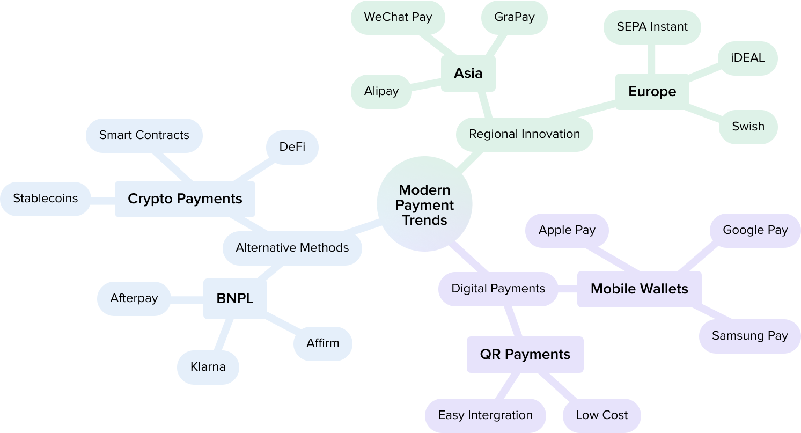
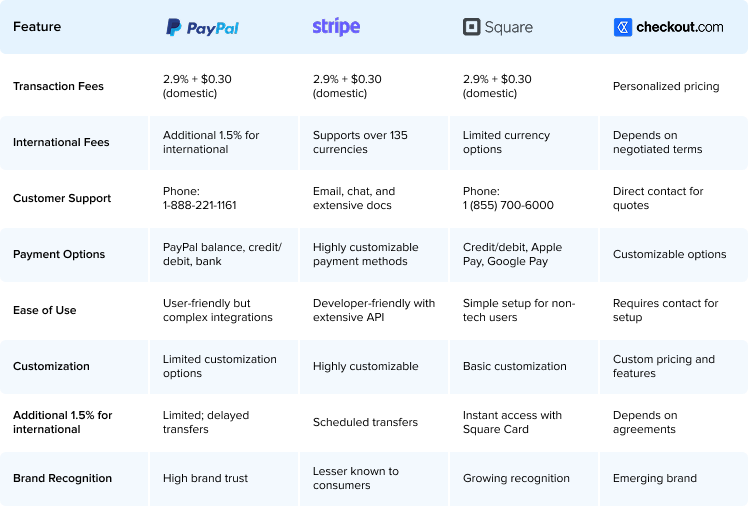

# Code to Cash: The Evolving Landscape of Payments

## Modern Payment Trends

The digital payments landscape has undergone a remarkable transformation in recent years, revolutionizing how consumers and businesses conduct financial transactions. This evolution has been driven by technological advancements, changing consumer preferences, and the growing demand for seamless payment experiences.

## The Evolution of Payment Trends & Technologies
The payments revolution is transforming how value moves globally, evolving from simple transactions into sophisticated ecosystems that drive innovation and shape customer experiences.

Three key forces are accelerating this shift: digital automation of payment processes, rising demand for seamless transactions, and the convergence of payment systems with broader financial services.

Once an operational function, payments have become strategic assets—acting as data-rich touchpoints for engagement, loyalty, and new financial relationships. This shift goes beyond speed, creating an always-on infrastructure where payments initiate relationships rather than just conclude transactions.
### 1. Digital Transformation in Banking

Traditional banking institutions, historically reliant on legacy systems and face-to-face transactions, are now embracing digital transformation to stay competitive. Key developments include:

- **Mobile Banking and Apps**: Banks are investing heavily in mobile apps that provide seamless access to account management, bill payments, and instant transfers.
- **Cloud-Based Infrastructure**: By migrating to cloud-based platforms, banks are improving scalability, reducing operational costs, and enhancing their ability to integrate with fintech solutions.
- **Real-Time Payments**: Traditional payment systems are being upgraded to enable instant payments, reducing settlement times from days to seconds and aligning with consumer and business demands for speed.
- **Focus on User Experience**: Banks are prioritizing intuitive interfaces and personalized experiences to compete with user-friendly fintech platforms.

### 2. The Emergence of Agile Fintech Firms

Fintech companies have become transformative forces in the payment landscape, leveraging their agility and technology-first approaches to deliver customer-centric solutions. Through disruptive innovation, these firms have introduced groundbreaking services ranging from mobile wallets and peer-to-peer platforms to Buy Now Pay Later solutions.

Their API-driven ecosystems facilitate seamless integration with various platforms, allowing businesses to embed payment functionalities directly into applications, as exemplified by Stripe's developer-first approach. Beyond convenience, fintechs are driving financial inclusion by addressing gaps in traditional systems through mobile-based micro-lending and digital wallets for underserved communities.

Meanwhile, challenger banks like Revolut, N26, and Monzo are redefining the banking experience with fee-free transactions, multi-currency accounts, and real-time financial insights, further revolutionizing how people interact with money.

###  3. Consumer Demand for Seamless and Instant Payments

Consumers increasingly expect payment experiences that are fast, secure, and frictionless, leading to a surge in demand for:

- **Contactless Payments**: The adoption of NFC-enabled cards and devices has grown exponentially, driven by convenience and hygiene concerns during the COVID-19 pandemic.
- **Mobile Wallets**: Platforms like Apple Pay, Google Pay, and Samsung Pay have transformed smartphones into powerful payment tools, offering biometric authentication and integration with loyalty programs.
- **One-Click Checkouts**: E-commerce platforms are prioritizing simplified checkout processes to reduce cart abandonment rates, with solutions like Amazon’s one-click purchase and Shopify’s Shop Pay gaining popularity.
- **Subscription Economy Growth**: The rise of subscription-based services (e.g., Netflix, Spotify) has driven the need for recurring payment solutions that are automated and reliable.

### 4. Regulatory Changes and Technological Advancements

Governments and regulatory bodies are adapting to the evolving payment ecosystem by introducing frameworks that promote innovation while ensuring security, transparency, and consumer protection. Regulatory initiatives like PSD2 in Europe and Open Banking in the UK have transformed the financial landscape by requiring banks to share customer data (with consent) through APIs, enabling third-party providers to offer innovative financial services.

Simultaneously, regulations such as GDPR in Europe and CCPA in California are enhancing consumer trust by mandating stricter controls on payment data collection, storage, and usage. On the infrastructure front, governments worldwide are implementing real-time payment systems, including India's UPI, Australia's New Payments Platform (NPP), and SEPA Instant in Europe, facilitating faster and more efficient money transfers.

In response to emerging technologies, policymakers are also addressing regulatory challenges posed by cryptocurrencies, with particular focus on anti-money laundering (AML) compliance, taxation frameworks, and stablecoin oversight to ensure financial stability while enabling responsible innovation.

### 5. The Competitive and Collaborative Ecosystem

The payment landscape is shaped by both competition and collaboration between traditional banks, fintech companies, payment processors, and technology giants. Traditional banks are increasingly partnering with fintechs to integrate innovative solutions into their offerings, with many now providing access to mobile wallets and peer-to-peer payment services.

Simultaneously, tech giants including Apple, Google, and Amazon are leveraging their existing ecosystems to provide integrated payment solutions such as Apple Pay, Google Pay, and Amazon Pay. In Asian markets, super-apps like WeChat and Alipay have created comprehensive platforms that bundle payment

### 6. Technology Driving Innovation

Emerging technologies are acting as catalysts for innovation across the payment industry:

- **Blockchain**: Distributed ledger technology promises faster, more secure, and transparent payment systems, especially for cross-border transactions.
- **Artificial Intelligence (AI)**: AI is being used to enhance fraud detection, optimize payment routing, and provide personalized financial insights to consumers.
- **Biometric Authentication**: Fingerprints, facial recognition, and voice authentication are making payments more secure and user-friendly.
- **IoT Payments**: Connected devices like smartwatches, cars, and even refrigerators are increasingly being integrated with payment functionalities.

###  7. The Global Perspective

The payment landscape varies significantly across regions, influenced by local consumer behavior, infrastructure, and regulations:

- **Asia**: Leads in mobile payments and QR code adoption, with China’s Alipay and WeChat Pay dominating the market.
- **Europe**: Focuses on open banking and real-time payments, with strong regulatory frameworks like PSD2 driving innovation.
- **North America**: Shows strong adoption of contactless payments and digital wallets, with a growing interest in BNPL and cryptocurrency.
- **Africa**: Mobile money services like M-Pesa are driving financial inclusion, enabling millions of unbanked individuals to access digital payments.

## Payment Platforms & Services: A Transformative Journey

In recent years, the landscape of payment solutions has undergone a significant transformation, largely driven by the widespread adoption of mobile wallets. Services such as Apple Pay, Google Pay, and Samsung Pay have turned smartphones into powerful payment tools, fundamentally altering our interactions with money.

### 1. The Rise of Mobile Wallets
The success of mobile wallets can be attributed to several key factors:

- **Enhanced Security**: Sophisticated tokenization technology safeguards user data.
- **Seamless Integration**: These wallets work effortlessly with existing banking infrastructure.
- **Improved User Experience**: Biometric authentication simplifies transactions.
- **Growing Merchant Acceptance**: Worldwide adoption has made these solutions increasingly viable.

### 2. QR Code Payments: A Game Changer
Alongside mobile wallets, QR code payments have emerged as a transformative force, particularly in Asian markets. Their remarkable success can be linked to several compelling advantages:

- **Minimal Implementation Costs**: Merchants can adopt QR payments easily and affordably.
- **Intuitive User Experience**: QR codes offer a straightforward way to make payments.
- **Natural Integration**: They work well with popular social platforms.
- **Reduced Hardware Needs**: No specialized equipment is required.
These characteristics have made QR payments a dominant solution, especially in regions where mobile adoption exceeds traditional payment infrastructure.

### 3. Major Payment Solutions
The global payment processing market offers a diverse array of solutions tailored to various business needs, transaction volumes, and technical requirements. From established giants to innovative newcomers, these platforms vary in:

- **Fee Structures**
- **Geographic Coverage**
- **Integration Complexity**
- **Specialized Features**

Understanding the unique strengths and limitations of each major provider is essential for businesses to select the most suitable payment solution for their operational needs and growth strategy.

###  4. Leading Players in the Market
- **PayPal**: As a global leader, PayPal leverages its early market entry and vast user base. Its strength lies in consumer trust and international reach, making it particularly valuable for cross-border commerce.

- **Stripe**: Revolutionizing the payment industry, Stripe adopts a developer-first approach. Its REST APIs and comprehensive documentation have set new standards for payment integration, appealing to tech-savvy businesses.

- **Square**: This integrated payment processing platform offers user-friendly solutions for small businesses. With features like point-of-sale systems and online sales, Square allows merchants to accept various payment methods easily.

- **Checkout**: Designed for larger enterprises, Checkout provides customizable payment solutions with personalized pricing and advanced features. It focuses on optimizing transactions across multiple payment methods and currencies.

The evolution of payment platforms and services reflects a broader trend towards convenience, security, and user-centric design. By understanding the strengths and offerings of each solution, businesses can better navigate this dynamic landscape, ensuring they select the right tools to meet their unique needs.

## Alternative Payment Methods
### 1. Buy Now Pay Later (BNPL)

The financial services landscape has been significantly disrupted by Buy Now Pay Later services. Companies like Klarna, Affirm, and Afterpay have created a new paradigm in retail financing that resonates strongly with modern consumers.

Their success is built on several innovative features. Interest-free installment payments particularly appeal to younger consumers who seek financial flexibility without traditional credit costs. Instant credit decisions enhance the shopping experience by eliminating lengthy approval processes, allowing for spontaneous purchases with immediate financing options.

These services also offer seamless integration with major e-commerce platforms, making adoption frictionless for both merchants and shoppers. Furthermore, they employ advanced risk assessment models that enable broader credit access, serving customers who might be overlooked by conventional lending institutions.

This combination of consumer-friendly features has positioned BNPL as a compelling alternative to traditional credit cards, especially among digitally-native shoppers seeking transparency and control over their finances.

### 2. Cryptocurrency and Blockchain Payments

While initially viewed primarily as speculative investments, cryptocurrencies are increasingly establishing themselves as viable payment solutions. The cryptocurrency space continues to evolve with several promising developments.

Stablecoins have emerged as practical payment solutions, offering the benefits of blockchain technology while minimizing volatility by pegging their value to established currencies or assets. This stability makes them more suitable for everyday transactions and commerce.

Smart contracts are enabling programmable transactions that automatically execute when predefined conditions are met, eliminating intermediaries and reducing costs while increasing transparency and efficiency in complex financial arrangements.

DeFi protocols have introduced innovative financial instruments that extend beyond simple payments, creating decentralized lending, borrowing, and trading platforms that operate without traditional financial gatekeepers, democratizing access to sophisticated financial services.

Cross-border payments have seen reduced friction through blockchain technology, addressing longstanding inefficiencies in international transfers by offering faster settlement times, lower fees, and greater transparency compared to conventional banking systems.

## Strategic Platform Selection

Selecting the right payment platform and designing a robust architecture requires a holistic approach that balances technical capabilities with business objectives.

#### Strategic Considerations for Platform Selection

When evaluating payment processors, consider these critical factors:

- **Transaction Volumes & Scaling**: Assess current needs and future growth projections to ensure the platform can scale accordingly
- **Geographic Reach**: Verify support for target markets, currencies, and regional payment methods
- **Technical Requirements**: Evaluate API quality, documentation, SDKs, and alignment with your development stack
- **Implementation Resources**: Consider time-to-market requirements and available engineering resources
- **Total Cost Analysis**: Look beyond transaction fees to include setup costs, monthly minimums, and additional service fees

#### Architecture Design Principles

A well-designed payment architecture provides both immediate functionality and long-term flexibility:

- **Abstraction Layer**: Implement a gateway interface that decouples your business logic from specific payment providers, enabling easier provider changes
- **Seamless Integration**: Design processing systems that connect smoothly with order management, inventory, and accounting systems
- **Multi-layered Security**: Incorporate PCI-DSS compliance, tokenization, encryption, and fraud detection mechanisms
- **Comprehensive Monitoring**: Implement robust logging, real-time alerts, and transaction tracking capabilities
- **Future-proof Scalability**: Design with modularity that accommodates growth in transaction volume and expansion to new payment methods

The most successful implementations balance immediate business requirements with a flexible foundation that can evolve with changing market conditions and technological advancements.

## Conclusion

The journey from "Code to Cash" reflects the profound transformation of payment systems. Payments are no longer just transactional; they are becoming integral to user experiences, powered by digital innovation and consumer-centric design.

Businesses must adopt cutting-edge technology by leveraging AI, blockchain, and APIs to stay competitive in this rapidly evolving landscape. Equally important is the implementation of secure systems that prioritize fraud prevention and data protection, establishing trust as a cornerstone of payment interactions.

Customer-centric models focusing on convenience, speed, and personalization have become essential differentiators in a crowded marketplace. These approaches must be complemented by global strategies that embrace regional diversity in payment preferences, recognizing that payment solutions cannot follow a one-size-fits-all approach.

As the payments landscape continues to evolve, businesses that innovate and adapt will thrive in this dynamic ecosystem, paving the way for a future defined by seamless, secure, and inclusive financial transactions.
