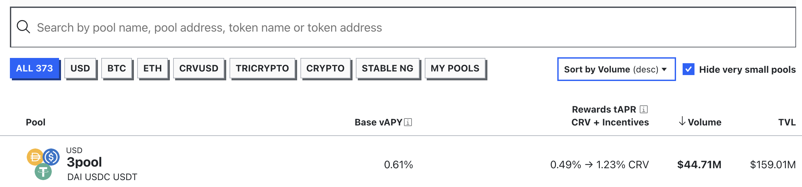
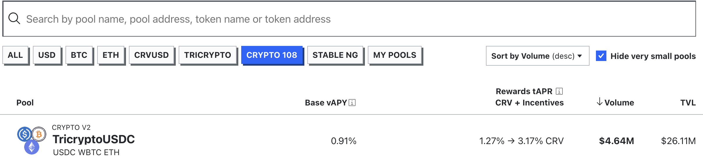
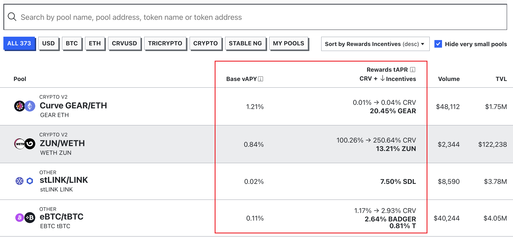
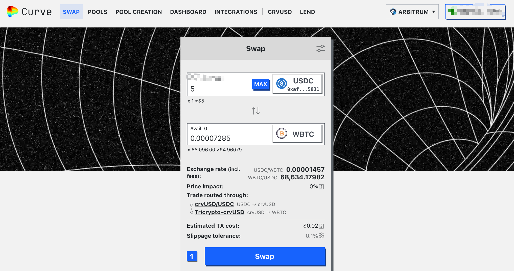

For those unfamiliar with Web3, DeFi (Decentralized Finance) might appear to be a risky, casino-like venture. However, DeFi is a decentralized financial ecosystem that shares some similarities with traditional financial products like stocks and mutual funds. By leveraging blockchain technology, DeFi provides open, transparent, and intermediary-free financial services, reducing trust costs and transaction fees. Popular DeFi platforms include Curve, Uniswap, Aave, and Compound. Today, we'll introduce the basic operations of the Curve platform, examine the smart contract mechanisms involved, and help you gain a better understanding of DeFi. Hopefully, this article will boost your confidence in DeFi investments and offer you a new path for wealth growth.

## Introduction to Curve

[Curve](https://curve.fi/) is a decentralized exchange platform focused on facilitating swaps between stablecoins and similar assets. It operates through a liquidity pool model, allowing users to conduct low-slippage, low-fee transactions without traditional order matching. This design makes Curve ideal for exchanging stablecoins and related assets, particularly as demand for stablecoin swaps continues to grow in the cryptocurrency market. Liquidity providers can earn transaction fees and additional incentives, such as CRV tokens, by contributing their tokens to these pools. Curve is a non-custodial platform, meaning users retain control of their funds, and the platform's non-upgradable smart contracts enhance fund security. Curve’s user interface also displays key financial metrics, helping users evaluate and optimize their returns. Furthermore, Curve supports multiple sidechains and allows users to create new liquidity pools through Curve Factory, promoting decentralization and innovation on the platform.

### Liquidity Pools

Curve's liquidity pools can be thought of as similar to ETFs in the stock market, which bundle various stocks to provide diversified returns while reducing investment risk. On Curve, users can contribute their tokens to a pool, where others can then exchange tokens. Prices are determined by the algorithm within the smart contract, rather than by direct buy/sell matching. This reduces trading friction and improves liquidity, especially for stablecoin exchanges.

Curve offers two main types of liquidity pools: **Stableswap pools** and **Cryptoswap pools**.

Stableswap pools are primarily used for stablecoins or tokens with relatively stable values, such as USDC and USDT. A well-known Stableswap pool on Curve is [3pool](https://curve.fi/#/ethereum/pools/3pool/deposit), which includes USDC, USDT, and DAI, the most common stablecoins. These pools use a specialized algorithm to maintain balance and close-to-1:1 exchange rates between assets.



Cryptoswap pools, on the other hand, are designed for assets with greater price volatility, such as BTC and ETH. A notable Cryptoswap pool is [TricryptoUSDC](https://curve.fi/#/ethereum/pools/factory-tricrypto-0/deposit), which includes BTC, ETH, and USDC for efficient cryptocurrency swaps. These pools maintain market-value balance to account for price fluctuations.



### Rewards

Rewards and returns from liquidity pools primarily include two types:

- Base vAPY (variable annual percentage yield): This refers to the income liquidity providers (LPs) earn from transaction fees accumulated in the pool. As the value of LP tokens increases, so does the wealth of the LPs.
- Reward tAPR (total annual percentage return): This mainly consists of CRV token rewards and other token incentives. LPs can stake the CRV tokens they receive to participate in Curve DAO governance, thereby increasing their returns, though staking CRV requires a lock-in period.

All earnings generated within a liquidity pool go directly to LPs and are not reduced by fees or other pool costs.



### Supported Chains

Curve supports multiple blockchain networks, making it a highly flexible and compatible DeFi platform. Currently, Curve supports a variety of chains, including both main and side chains like Ethereum, Polygon, and Arbitrum. By supporting these different chains, Curve offers users more options, allowing them to diversify investments, reduce risk, and optimize returns. Users can choose a chain based on their preferences, such as lower fees, faster transactions, or a richer asset portfolio. Curve’s multi-chain support enhances platform flexibility and ensures that users can access optimal liquidity and returns across various blockchain ecosystems. The functionality of Curve’s liquidity pools remains consistent across chains, allowing users to transfer assets easily and efficiently.

::: center

:::

## Investment Process

Investing in Curve involves two main processes: depositing and withdrawing. Before investing, users need to convert their tokens into those supported by the liquidity pool. After investing in a liquidity pool, users can also stake LP tokens to earn additional rewards. When withdrawing, users need to unstake their LP tokens before withdrawing them from the liquidity pool back to their wallet. Here is a basic flowchart for investing in Curve:

::: center

:::

Before starting on Curve, there are some preparatory steps. First, set up a wallet by installing a supported Ethereum network wallet, such as [MetaMask](https://metamask.io/), and ensure you have enough ETH for gas fees. Next, switch your wallet to the appropriate blockchain network. Then, prepare funds based on your investment plan—typically stablecoins like USDT, USDC, or DAI—and transfer them to your wallet. It's recommended to start with a **small amount** for testing to get familiar with the process.

Once prepared, you can connect to the Curve platform. Open your browser, visit Curve's [official site](https://curve.fi), and click the **Connect Wallet** button at the top right. A wallet connection request will pop up; check that the address is correct, then authorize the connection in your wallet. Once connected, your wallet address will appear at the top right, indicating that you’re ready to use Curve. Before executing any transactions, it’s helpful to browse the interface to familiarize yourself with the layout and available features.

Let’s walk through a basic investment process using the `2BTC-ng` pool on the `Arbitrum` chain as an example.

### Token Conversion

The `2BTC-ng` liquidity pool accepts `WBTC` or `tBTC` for investments, and you can deposit either or both in a combination. If you don’t have these tokens in your wallet, you can use Curve’s Swap feature to convert other tokens.

First, select the `Arbitrum` network at the top right. On Curve’s main page, click the **SWAP** menu. Choose the token you want to exchange at the top and the token you want to receive at the bottom. Enter the desired amount, and the system will automatically display the amount you’ll receive, along with the exchange rate and price impact. Before confirming, check the **Exchange Rate** and **Price Impact** to ensure they are within a reasonable range. When exchanging a token for the first time, you’ll need to click the **Approve** button to authorize the Curve contract to access your token. After approval, click **Swap** to proceed with the exchange. This process incurs a gas fee, so it’s best to trade when gas prices are low.



### Depositing to a Pool

Return to the Curve homepage, select the **POOLS** menu, and search for `2BTC-ng` in the search bar to locate the appropriate pool.

After selecting the pool, you’ll need to authorize the token transfer before adding liquidity. In the liquidity pool page, select the **Deposit** tab, enter the amount you want to deposit in the input box for the token (either `WBTC` or `tBTC` in the case of `2BTC-ng`). The system will calculate and display the number of LP tokens you’ll receive. Click **Approve Spending** to authorize Curve to use your token. Confirm the authorization in your wallet and pay the gas fee. This is a one-time authorization per token, so you won’t need to repeat it for future deposits.

Once authorized, you can proceed to add liquidity. Before clicking **Deposit**, double-check the information displayed, including the deposit amount, LP token quantity, and exchange rate. If everything looks correct, click **Deposit**, confirm the transaction in your wallet, and pay the gas fee. After the transaction completes, you’ll receive LP tokens, indicating that you’ve successfully added liquidity to the pool.

::: center

:::

After adding liquidity, you’ll start earning Base vAPY rewards. If you want additional rewards, you can stake these LP tokens to earn CRV incentives. Each liquidity pool on Curve has a corresponding Gauge contract for staking. In the Deposit tab, select **Stake** to stake your LP tokens. On the staking page, authorize the Gauge contract to use your LP tokens for the first time, then enter the amount to stake, confirm the transaction, and you’re done.

::: center

:::

You can combine the **Deposit** and **Stake** actions by selecting **Deposit & Stake** in the Deposit tab. Enter the deposit amount and staking quantity

, confirm the transaction, and pay the gas fee. The system will handle both deposit and staking actions in a single transaction.

Once staked, your LP tokens will start generating CRV rewards, known as Reward tAPR. Some pools, like `2BTC-ng`, may also offer additional rewards, such as ARB tokens.

### Claiming Rewards

Claiming rewards on Curve is straightforward. Go to the pool page, enter the `2BTC-ng` liquidity pool, select **Withdraw/Claim**, then **Claim Rewards**. Here you’ll see all available rewards, including CRV, ARB, and other tokens.

::: center

:::

You can click **Claim CRV** to transfer the CRV reward to your wallet, or **Claim Rewards** to claim other token rewards like ARB.

To maximize your returns, it’s important to monitor and manage your rewards regularly. This includes tracking APY changes, keeping an eye on CRV price fluctuations, and calculating your actual yield accordingly. Setting reminders to claim rewards periodically is recommended to avoid missing out.

For the CRV rewards you’ve claimed, you have several management options: you can sell them immediately for stablecoins, hold them in anticipation of price appreciation, or lock them as veCRV to participate in governance and earn additional returns. The strategy depends on the market situation and should be adapted accordingly.

### Exiting an Investment

Withdrawing liquidity from Curve is the reverse of the deposit process. First, unstake your tokens from the Gauge contract. Enter the pool page, select **Withdraw/Claim**, then **Unstake**. Enter the amount of LP tokens to unstake, click **Unstake**, confirm in your wallet, and pay the gas fee. Once the transaction completes, your LP tokens will be returned to your wallet.

::: center

:::

Next, withdraw from the liquidity pool. Go to **Withdraw/Claim**, then select **Withdraw**. Enter the amount of LP tokens to withdraw, and you can choose to receive the entire amount in one token or a mix of tokens. After confirming the details, click **Approve Spending** to authorize the Curve contract to use your LP tokens. When ready, click **Withdraw**, confirm the transaction, and pay the gas fee. Your tokens will then be transferred back to your wallet.

::: center

:::

After exiting, you might want to convert these tokens into your preferred assets. To get the best exchange rate, consider comparing the rates offered by other decentralized exchanges (DEXs) and choose the one most advantageous to you.

## Data Calculation

If you're a developer, you might be curious about how Curve’s smart contracts automatically calculate relevant data and how to apply this knowledge practically. Here, we’ll use the `2BTC-ng` liquidity pool as an example to demonstrate some methods that Curve uses for data calculation, hoping to deepen your understanding of the platform’s mechanics.

### Contracts

Each Curve liquidity pool generally includes two contracts: the **LP Token contract** and the **Gauge contract**.

The LP Token contract, which conforms to the ERC20 standard, represents the user’s share in the liquidity pool. When users contribute assets, the contract mints LP tokens based on the value of the deposited assets. When users wish to withdraw, they burn these LP tokens to redeem the underlying assets. LP tokens also allow users to automatically earn transaction fee income, as fees are distributed according to LP token holdings.

The Gauge contract, also an ERC20 token contract, handles liquidity mining and incentive distribution on Curve. When users stake LP tokens in the Gauge, they start earning CRV token rewards, the amount of which depends on the staked LP tokens and the pool’s weight. The Gauge contract also supports additional reward token distribution, allowing projects to incentivize liquidity in specific pools.

Below are the LP Token and Gauge contract addresses for the `2BTC-ng` pool:

::: center

:::

### Investment Amount

To retrieve a user's investment amount in a Curve liquidity pool, you can call different contract methods depending on the type of investment. Both the LP Token contract and the Gauge contract include a `balanceOf` method. If you've only executed a **Deposit** operation, you can use the `balanceOf` method from the LP Token contract to get your account balance. If you've also performed a **Stake** operation, you’ll need to use the `balanceOf` method from the Gauge contract to obtain your account balance. The `balanceOf` method takes the user’s address as a parameter and returns the user’s balance in the contract. Here’s an example code snippet:

```js
const { Web3 } = require("web3");

// Connect to the Arbitrum One mainnet
const web3 = new Web3("https://arb1.arbitrum.io/rpc");

// Smart contract ABI
const abi = [
  {
    stateMutability: "view",
    type: "function",
    name: "balanceOf",
    inputs: [{ name: "arg0", type: "address" }],
    outputs: [{ name: "", type: "uint256" }],
  },
];

// Pool contract address (taking 2BTC-ng as an example)
const lpTokenContractAddress = "0x186cf879186986a20aadfb7ead50e3c20cb26cec";
const gaugeContractAddress = "0xB7e23A438C9cad2575d3C048248A943a7a03f3fA";
// Wallet address
const walletAddress = "0xd693bc8e4a24097bbec4f7cdbc7021cf356b818c";

(async () => {
  // Create smart contract instances
  const lpTokenContract = new web3.eth.Contract(abi, lpTokenContractAddress);
  const gaugeContract = new web3.eth.Contract(abi, gaugeContractAddress);

  // Invoke contract functions
  const lpTokenBalance = await lpTokenContract.methods
    .balanceOf(walletAddress)
    .call();
  console.log("LP token wallet balance is:", lpTokenBalance);

  const gaugeBalance = await gaugeContract.methods
    .balanceOf(walletAddress)
    .call();
  console.log("Gauge wallet balance is:", gaugeBalance);
})();

// Output
// LP token wallet balance is: 0n
// Gauge wallet balance is: 78988425012240n
```

- First, we create a Web3 instance for the Arbitrum One mainnet.
- Then, we define the ABI for the LP Token and Gauge contracts, which both include the `balanceOf` method.
- Next, we specify the contract addresses for the 2BTC-ng liquidity pool and the user's wallet address.
- We then create LP Token and Gauge contract instances via the Web3 instance.
- Finally, we call the `balanceOf` method to obtain the user’s investment amount on Curve.

After making an investment in a Curve liquidity pool, the invested amount is distributed among the pool assets according to the pool's algorithmically determined proportions. We can also use methods from the LP Token contract to display the distribution of the investment, providing a clearer picture of the user’s holdings within the Curve platform. The LP Token contract includes a `totalSupply` method to get the total supply of the pool’s tokens, and a `balances` method to get the supply of each asset in the pool. By calculating the proportion of each asset in the total supply, we can estimate the user’s investment amount in each asset. Here’s an example code snippet:

```js
// Smart contract ABI
const abi = [
  {
    stateMutability: "view",
    type: "function",
    name: "totalSupply",
    inputs: [],
    outputs: [{ name: "", type: "uint256" }],
  },
  {
    stateMutability: "view",
    type: "function",
    name: "balances",
    inputs: [{ name: "i", type: "uint256" }],
    outputs: [{ name: "", type: "uint256" }],
  },
];

(async () => {
  // ...... previous code
  const totalBalance = lpTokenBalance + gaugeBalance;
  const totalSupply = await lpTokenContract.methods.totalSupply().call();

  let tokenOne = await lpTokenContract.methods.balances(0).call();
  // Since WBTC has 8 decimals, we convert it to ether units
  tokenOne = web3.utils.toWei(tokenOne, "gwei");
  const tokenTwo = await lpTokenContract.methods.balances(1).call();

  const tokenOneRatio = Number(tokenOne) / Number(totalSupply);
  const tokenTwoRatio = Number(tokenTwo) / Number(totalSupply);

  const tokenOneBalance = web3.utils.fromWei(
    Math.floor(tokenOneRatio * Number(totalBalance)).toString(),
    "ether"
  );
  console.log("Token one balance is:", tokenOneBalance);
  const tokenTwoBalance = web3.utils.fromWei(
    Math.floor(tokenTwoRatio * Number(totalBalance)).toString(),
    "ether"
  );
  console.log("Token two balance is:", tokenTwoBalance);
})();

// Output
// Token one balance is: 0.000034135788291198
// Token two balance is: 0.0000450482379098
```

- We define the LP Token contract’s ABI, including the `totalSupply` and `balances` methods.
- Using the user’s balances from both contracts, we calculate the user’s total investment in the liquidity pool.
- We then call `totalSupply` to get the total supply of the pool’s tokens.
- Next, we use `balances` to get the supply of each asset in the pool. Since WBTC has 8 decimals, we convert it to ether units.
- We calculate each asset’s ratio in the total supply.
- Finally, we use the user’s investment amount to calculate the investment in each asset.

### Reward Calculation

On Curve, users can stake LP Tokens to earn CRV token rewards. In addition to CRV, some liquidity pools also offer other token rewards, such as the ARB token in the `2BTC-ng` pool. In the Gauge contract, the methods for retrieving claimable CRV rewards and other token rewards differ. Use `claimable_tokens` for CRV rewards and `claimable_reward` for other token rewards. **Note:** The `claimable_tokens` method has a `nonpayable` stateMutability attribute, meaning you can’t directly call it from the [Explorer page](https://arbiscan.io/address/0xb7e23a438c9cad2575d3c048248a943a7a03f3fa#readContract). However, by adding this method’s ABI to your code and changing `stateMutability` to `view`, you can call it within your code. Here’s an example:

```js
const { Web3 } = require("web3");

const web3 = new Web3("https://arb1.arbitrum.io/rpc");

const abi = [
  {
    stateMutability: "view",
    type: "function",
    name: "claimable_tokens",
    inputs: [{ name: "addr", type: "address" }],
    outputs: [{ name: "", type: "uint256" }],
  },
  {
    stateMutability: "view",
    type: "function",
    name: "claimable_reward",
    inputs: [
      { name: "_user", type: "address" },
      { name: "_reward_token", type: "address" },
    ],
    outputs: [{ name: "", type: "uint256" }],
  },
];

// 2BTC-ng pool gauge contract address
const contractAddress = "0xB7e23A438C9cad2575d3C048248A943a7a03f3fA";
const walletAddress = "0xd693bc8e4a24097bbec4f7cdbc7021cf356b818c";
const arbTokenAddress = "0x912ce59144191c1204e64559fe8253a0e49e6548";

(async () => {
  const contract = new web3.eth.Contract(abi, contractAddress);

  const crvRewards = await contract.methods
    .claimable_tokens(walletAddress)
    .call();
  console.log("CRV tokens amount is:", crvRewards);

  const arbRewards = await contract.methods
    .claimable_reward(walletAddress, arbTokenAddress)
    .call();
  console.log("ARB tokens amount is:", arbRewards);
})();

// Output
// CRV tokens amount is: 25937502765335321n
// ARB tokens amount is: 589955392324932n
```

- We define the Gauge contract’s ABI, including the `claimable_tokens` and `claimable_reward` methods.
- We specify the Gauge contract address, the user’s wallet address, and the ARB token address (note: ARB tokens have different addresses on different networks; here, we use the Arbitrum address).
- We create a Gauge contract instance using Web3.
- We call `claimable_tokens` with the wallet address to get the claimable CRV rewards.
- We call `claimable_reward` with the wallet and ARB token addresses to get the claimable ARB rewards.

The previous method retrieves **claimable** rewards, which represent rewards that haven’t yet been claimed. If you want to check the CRV rewards a user has **already claimed**, use Curve’s `ChildChainGaugeFactory` contract, a sub-contract that manages rewards on the Curve platform. Documentation for the methods in this contract can be found [here](https://docs.curve.fi/curve_dao/liquidity

-gauge-and-minting-crv/evm-sidechains/ChildGaugeFactory/). This smart contract is deployed on every network, and you can find the addresses for each network [here](https://docs.curve.fi/references/deployed-contracts/#evm-sidechain-gauges). In this example, we use the Arbitrum address `0xabC000d88f23Bb45525E447528DBF656A9D55bf5`. Here’s the code:

```js
const abi = [
  {
    stateMutability: "view",
    type: "function",
    name: "minted",
    inputs: [
      { name: "arg0", type: "address" },
      { name: "arg1", type: "address" },
    ],
    outputs: [{ name: "", type: "uint256" }],
  },
];

// Arbitrum network ChildChainGaugeFactory address
const contractAddress = "0xabC000d88f23Bb45525E447528DBF656A9D55bf5";
const walletAddress = "0xd693bc8e4a24097bbec4f7cdbc7021cf356b818c";
// 2BTC-ng pool gauge contract address
const gaugeContractAddress = "0xB7e23A438C9cad2575d3C048248A943a7a03f3fA";

(async () => {
  const contract = new web3.eth.Contract(abi, contractAddress);

  const crvRewards = await contract.methods
    .minted(walletAddress, gaugeContractAddress)
    .call();
  console.log("Claimed CRV tokens amount is:", crvRewards);
})();

// Output
// Claimed CRV tokens amount is: 31262343705302473n
```

- We define the ABI for Curve’s `ChildChainGaugeFactory` contract, including the `minted` method.
- We specify the `ChildChainGaugeFactory` contract address, the user’s wallet address, and the pool’s Gauge contract address.
- Using Web3, we create a `ChildChainGaugeFactory` contract instance.
- We call `minted`, passing the user’s wallet address and the Gauge contract address to retrieve the amount of CRV rewards the user has already claimed.

## Conclusion

In the world of DeFi, Curve is just one of many liquidity pool platforms, but its stability and efficiency make it a top choice for many users. This article introduced the basic concepts and investment processes of the Curve platform, and also provided developers with insights into using smart contracts for data calculation within Curve liquidity pools. We hope this helps you better understand the operational principles and data calculations of the Curve platform.