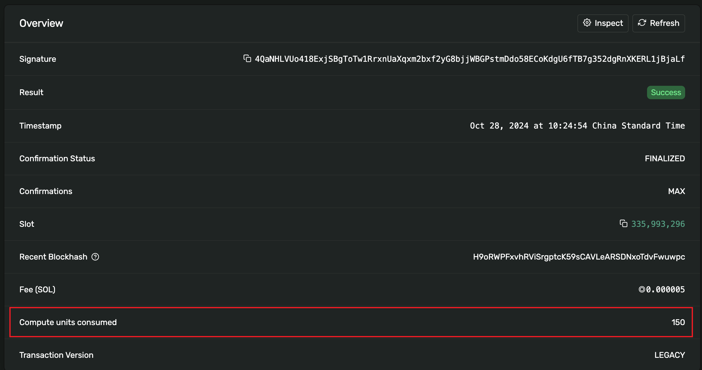
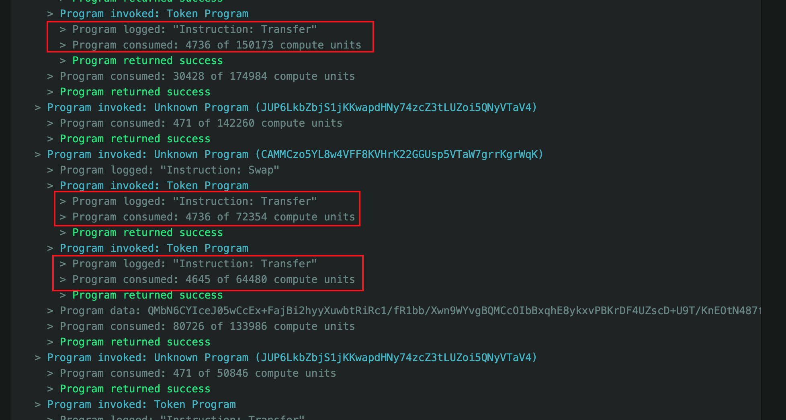

Many developers face a common issue when building Solana programs (or "smart contracts"). Although their program's logic may appear correct, unexpected errors occur when the program runs. These errors often contain terms like "limit" or "exceed," indicating that the program has hit one of Solana's resource constraints. 

As a high-performance blockchain, Solana's core features, such as parallel processing, significantly boost transaction throughput. However, behind this efficiency lies a strict resource management mechanism. Developers need to understand these limitations to build and optimize Solana programs effectively. 

This article exposes the various resource limitations in Solana development, focusing on Compute Unit (CU) restrictions, and provides analyses of multiple real-world scenarios and optimization strategies to illustrate how to avoid such program errors and improve program performance.

## Introduction to Solana

[Solana](https://solana.com/) was launched in 2020 and quickly emerged as a popular blockchain network, becoming one of the leading ecosystems in the cryptocurrency industry. In 2024, Solana accounted for 49.3% of global cryptocurrency investors' interest in specific chains, establishing its dominant position in the market.

Solana is a high-performance public blockchain platform that differs from traditional blockchain networks like Bitcoin and Ethereum. Its core characteristics include high throughput and low latency, thanks to its innovative Proof of History (PoH) consensus mechanism and efficient parallel processing architecture, enabling it to process thousands of transactions per second.

## Types of Resource Limitations

Programs running on Solana are subject to several types of resource limitations. These limitations are designed to maintain the network's efficiency and stability while providing developers with clear boundaries for development. These constraints cover various requirements, from computational power to data storage, ensuring that programs can use system resources fairly while maintaining performance.

### CU Limitations

In the Solana blockchain, a CU is the smallest unit used to measure the computational resources consumed during transaction execution. Each transaction on the chain consumes a certain number of CUs depending on the operations it performs (e.g., account writes, cross-program invocations, or system calls). Every transaction has a CU limit, which can be set to a default value or modified by the program. When a transaction exceeds the CU limit, processing is halted, resulting in a failure. Common operations like executing instructions, transferring data between programs, and performing cryptographic calculations consume CUs. CU systems are designed to manage resource allocation, prevent network abuse, and improve overall efficiency. For more details, refer to the official documentation [here](https://solana.com/docs/core/fees#compute-unit-limit).

CU limits for a transaction containing only one instruction would default to 200,000. The limit can be adjusted using the `SetComputeUnitLimit` instruction, but it cannot exceed the maximum transaction limit of 1.4 million CUs.

### Storage Limitations

In Solana, each account's data structure is called AccountInfo, which includes:

- the account's state,
- program code (if it's a program account),
- balance (in lamports, where 1 SOL = 1 billion lamports), and
- the associated owner program (program ID).

In Solana's account model, each account is owned by a program, and only the program that owns the account can modify the account data or reduce the balance. Adding balance, however, is not restricted. This model ensures the security of account data and the controllability of operations. For more information, check out the documentation [here](https://solana.com/docs/core/accounts#accountinfo).

### Transaction Size Limitations

Solana follows a maximum transmission unit (MTU) limit of 1280 bytes, in line with the IPv6 MTU standard, to ensure the efficient and reliable transmission of cluster information via UDP. After accounting for the 48-byte IPv6 and fragmentation headers, 1232 bytes remain for data, such as serialized transactions. Each Solana transaction, including its signature and message parts, cannot exceed 1232 bytes. Each signature occupies 64 bytes, with the number of signatures depending on the transaction requirements. The message contains instructions, accounts, and metadata, each taking 32 bytes. The total size of a transaction varies depending on the number of instructions it includes. This limit ensures efficient transmission of transaction data across the network. For more details, refer to the documentation [here](https://solana.com/docs/core/transactions#transaction-size).

### Call Depth Limitations

To ensure efficient program execution, Solana imposes limits on each program's call stack depth. If this limit is exceeded, a `CallDepthExceeded` error is triggered. Solana also supports direct calls between programs (cross-program invocations), but the depth of such calls is also limited. Exceeding this depth triggers a `CallDepth` error. These restrictions aim to enhance network performance and resource management efficiency. For more information, refer to the documentation [here](https://solana.com/docs/programs/limitations#call-stack-depth-object-object-error).

### Stack Size Limitations

In Solana's virtual machine architecture, each stack frame has a size limit, using fixed stack frames instead of variable stack pointers. If the stack frame exceeds this limit, the compiler will issue a warning but not block compilation. At runtime, if the stack size is exceeded, an `AccessViolation` error occurs. Regarding heap management, Solana uses a simple heap with fast allocation via the **bump** model, which does not support memory deallocation or reallocation. Each Solana program has access to this memory and can implement custom heap management as needed. These limitations help optimize performance and resource allocation. For more details, refer to the documentation [here](https://solana.com/docs/programs/faq#stack).

### Program Derived Addresses (PDA) Account Limitations

In Solana, Program Derived Addresses (PDAs) offer developers a deterministic method for generating account addresses using predefined **seeds** (such as strings, numbers, or other account addresses) and the program ID. This mechanism mimics an on-chain hash map function. 

Additionally, Solana allows programs to sign transactions using their derived PDAs. The advantage of PDAs is that developers do not need to remember specific account addresses; instead, they only need to remember the input used to derive the address, simplifying account management and improving development efficiency. For more details, check out the documentation [here](https://solana.com/developers/courses/native-onchain-development/program-derived-addresses#seeds).

### Limitations Summary

#### CU

- The maximum CU limit per transaction is **1.4 million**
- The default CU limit per instruction (each transaction contains multiple instructions) is **200,000**
- The CU limit per block is **48 million**
- The CU limit per user in a block is **12 million**

#### Storage

- The maximum storage size for each account in Solana is **10MB**

#### Transaction Size

- The maximum size of each transaction in Solana is **1232 bytes**

#### Call Depth

- The maximum call stack depth per program is **64 layers**
- The maximum depth for cross-program calls is **4 layers**

#### Stack Size

- Each stack frame has a size limit of **4KB**
- The program heap size is **32KB**

#### PDA

- The length of each PDA seed cannot exceed **32 bytes**
- The total number of seeds cannot exceed **16 seeds**

## Detailed Analysis of CU Limitations

Having introduced the various resource limitations in Solana, let's now focus on CU limitations. As mentioned earlier, CU is the smallest unit used to measure the computational resources consumed during transaction execution. Each transaction's CU consumption cannot exceed 1.2 million CUs. Since this concept might not be intuitive for developers new to Solana, we offer examples to help you understand CU consumption better.

### Displaying CU Consumption

Before analyzing CU consumption in programs, let's first review how to display CU consumption in Solana programs. In Solana, the `log` function can output logs, including CU consumption. Here is a simple example:

```rust
use solana_program::log::sol_log_compute_units;

sol_log_compute_units();
// other code
sol_log_compute_units();
```

Each call to `sol_log_compute_units` outputs the current CU consumption. Below is a sample log after the program runs:

```sh
Program consumption: 149477 units remaining
# other logs
Program consumption: 137832 units remaining
```

We can calculate the program's CU consumption by comparing the difference between two `sol_log_compute_units` calls. In this example, the difference between the two values represents CUs consumed by the operations performed between the log calls.

We can also encapsulate this CU logging functionality into a Rust macro for easier program usage. Here is how the code would look:

```rust
// build a macro to log compute units
#[macro_export]
macro_rules! compute_fn {
    ($msg:expr=> $($tt:tt)*) => {{
        msg!(concat!($msg, " {"));
        sol_log_compute_units();
        let res = { $($tt)* };
        sol_log_compute_units();
        msg!(concat!(" } // ", $msg));
        res
    }};
}

// use the macro to log compute units
compute_fn!("create account" => {
    // create account code
});
```

Encapsulating logging as a macro makes it much more convenient to call within the program and access additional information, making debugging easier.

### Solana Program Examples

To better understand CU consumption in Solana programs, you can explore example programs demonstrating CU usage of different operations.

Solana provides many learning resources for beginners, including simple example programs (`program-examples`) designed to help developers understand the Solana development process. These examples can be found in this GitHub [repository](https://github.com/solana-developers/program-examples).

Each example program in this repository typically has two versions: one implemented as a native program and the other using the Anchor framework.

> [Anchor](https://www.anchor-lang.com/) is a widely used development framework for the Solana blockchain. It is designed to simplify the creation of programs (smart contracts) and decentralized applications (DApps). It provides developers with an efficient and intuitive set of tools and libraries, significantly lowering the barrier to entry for Solana application development. Solana officially recommends using Anchor for development.

In the following sections, we'll reference examples from this repository to analyze CU consumption in Solana. We'll break this down from the perspectives of operations and programs.

### Operation Examples

Let's start by examining some common operations in Solana and analyzing their respective CU consumption.

#### Transfer SOL

Transferring SOL is one of the most common operations in Solana. Each transfer consumes a certain number of CUs. How many CUs are required for a single transfer? To find out, we can conduct a simple experiment on Solana's Devnet by performing a SOL transfer and then checking the transaction's CU consumption in the [Solana Explorer](https://explorer.solana.com/). The result is as follows:



From the transaction details in the Explorer, we can see that the transfer consumed **150** CUs. This value is not fixed but generally does not vary significantly. The number of CUs consumed is unrelated to the transfer amount but is determined by the number and complexity of the instructions in the transaction.

#### Create Account

Creating an account is another common operation in Solana. Each account creation consumes a certain number of CUs. We can analyze CU consumption by running an account creation example.

You can find a [sample program for account creation](https://github.com/solana-developers/program-examples/blob/main/basics/create-account/anchor/programs/create-system-account/src/lib.rs#L20C1-L33C12) in the `basic/create-account` directory in the `program-examples` repository. By adding CU logging statements to the code, we can verify CU consumption during execution. Below is the log output after running the program:

```sh
[2024-12-08T07:34:47.865105000Z DEBUG solana_runtime::message_processor::stable_log] Program consumption: 186679 units remaining
[2024-12-08T07:34:47.865181000Z DEBUG solana_runtime::message_processor::stable_log] Program 11111111111111111111111111111111 invoke [2]
[2024-12-08T07:34:47.865209000Z DEBUG solana_runtime::message_processor::stable_log] Program 11111111111111111111111111111111 success
[2024-12-08T07:34:47.865217000Z DEBUG solana_runtime::message_processor::stable_log] Program consumption: 183381 units remaining
[2024-12-08T07:34:47.865219000Z DEBUG solana_runtime::message_processor::stable_log] Program log: Account created successfully.
```

This test found that creating an account consumes approximately **3000** CUs. This value is not fixed but typically remains within a close range.

#### Create a Simple Data Structure

Next, let's analyze CU consumption by creating a simple data structure. An example of this can be found in the `basic/account-data` directory of the `program-examples` repository. The full example program can be found [here](https://github.com/solana-developers/program-examples/blob/main/basics/account-data/anchor/). Below is the data structure defined in the program:

```rust
use anchor_lang::prelude::*;

#[account]
#[derive(InitSpace)] // automatically calculate the space required for the struct
pub struct AddressInfo {
    #[max_len(50)] // set a max length for the string
    pub name: String, // 4 bytes + 50 bytes
    pub house_number: u8, // 1 byte
    #[max_len(50)]
    pub street: String, // 4 bytes + 50 bytes
    #[max_len(50)]
    pub city: String, // 4 bytes + 50 bytes
}
```

This data structure contains three string fields and one `u8` field. Each string field has a maximum length of 50. Testing reveals that creating this simple data structure consumes approximately **7000** CUs.

#### Counter

Solana's official example programs include a simple counter program. This can be found in the `basic/counter` directory of the `program-examples` repository. The example defines a basic counter data structure and provides instructions for creating and incrementing the counter. The full example program is available [here](https://github.com/solana-developers/program-examples/tree/main/basics/counter/anchor).

Testing indicates that initializing the counter consumes approximately **5000** CUs, while incrementing the counter consumes about **900** CUs.

#### Transfer Token

Another relatively common but more complex operation in Solana is transferring Tokens.

> In Solana, Tokens are implemented through the SPL Token standard, an official Solana standard for issuing, transferring, and managing tokens. SPL Token provides a standard interface to simplify token-related operations on Solana.

The `program-examples` repository includes an example program for transferring tokens, which can be found in the `token/transfer-tokens` directory. This program also includes operations for creating tokens, minting tokens, and burning tokens. The full example code is available [here](https://github.com/solana-developers/program-examples/tree/main/tokens/transfer-tokens/native).

Testing results reveal the following CU consumption for token-related operations:

- Creating a token consumes approximately **3000** CUs.
- Minting a token consumes approximately **4500** CUs.
- Burning a token consumes approximately **4000** CUs.
- Transferring a token consumes approximately **4500** CUs.

We can also observe CU consumption of token transfers in an actual transaction. For example, in [this transaction](https://explorer.solana.com/tx/FiqGufYKmKeGWfnyRXAkSx3UXPwp8iyZroBPCmcSNrdxNm1ydFqtBCvfq7iU5hTscc11ZuxzHP5dowVQFbgKv5s), CU consumption for the token transfer can be seen in the log output at the bottom of the transaction details:



#### Summary

Here is a summary of CU consumption for common operations:

| Action                    | CU Cost (approx.)                                                    |
| ------------------------- | -------------------------------------------------------------------- |
| Transfer SOL              | 150                                                                  |
| Create Account            | 3000                                                                 |
| Create Simple data struct | 7000                                                                 |
| Counter                   | 5000 (Init) <br> 900 (Add count)                                     |
| Token                     | 3000 (Create) <br> 4500 (Mint) <br> 4000 (Burn) <br> 4500 (Transfer) |

### Program Examples

After reviewing the CU consumption of common operations in Solana, let's examine the CU consumption of frequently used program constructs and syntax.

#### Loop Statements

Loops are one of the common constructs in Solana programs. By analyzing loop statements, we can understand their CU consumption. Below is a comparison of CU usage for different loop sizes:

```rust
// simple msg print, cost 226 CU
msg!("i: {}", 1);

// simple print for loop 1 time, cost 527 CU
for i in 0..1 {
    msg!("i: {}", i);
}

// simple print for loop 2 times, cost 934 CU
for i in 0..2 {
    msg!("i: {}", i);
}
```

Tests reveal that a simple `msg!` statement consumes 226 CU. Adding a loop that runs once increases CU consumption to 527 CU while running the loop twice raises it to 934 CU. From this, we can deduce the following:

- Initializing a loop costs approximately **301 CU** (527 - 226).
- Each iteration costs about **181 CU** (934 - 2×226 - 301).

To further verify the cost of CUs loops, we can use a more computationally expensive operation, such as printing account addresses:

```rust
// print account address, cost 11809 CU
msg!("A string {0}", ctx.accounts.address_info.to_account_info().key());

// print account address in for loop 1 time, cost 12108 CU
for i in 0..1 {
    msg!("A string {0}", ctx.accounts.address_info.to_account_info().key());
}

// print account address in for loop 2 times, cost 24096 CU
for i in 0..2 {
    msg!("A string {0}", ctx.accounts.address_info.to_account_info().key());
}
```

As shown, loops' CU consumption depends on the logic executed within them. However, the loop itself has a relatively small overhead, roughly **200–300 CU**.

#### If Statements

`If` statements are another common construct. Let's analyze their CU consumption:

```rust
// a base function consumed 221 CU
pub fn initialize(_ctx: Context<Initialize>) -> Result<()> {
    Ok(())
}

// after add if statement, the CU consumed is 339 CU
pub fn initialize(_ctx: Context<Initialize>) -> Result<()> {
    if true {
        Ok(())
    } else {
        Ok(())
    }
}
```

Tests show that an empty function consumes 221 CU. Adding an `if` statement increases the consumption to 339 CU. Therefore, a basic `if` statement consumes approximately **100 CU**.

#### Different Data Structure Sizes

The size of a data structure also affects CU consumption. Here is a comparison of different-sized data structures:

```rust
// use a default vector and push 10 items, it will consume 628 CU
let mut a Vec<u32> = Vec::new();
for _ in 0..10 {
    a.push(1);
}

// use a 64-bit vector and do the same things, it will consume 682 CU
let mut a Vec<u64> = Vec::new();
for _ in 0..10 {
    a.push(1);
}

// use an 8-bit vector and do the same things, it will consume 462 CU
let mut a: Vec<u8> = Vec::new();
for _ in 0..10 {
    a.push(1);
}
```

- A `Vec<u32>` storing 10 items consumes approximately **628 CU**.
- A `Vec<u64>` storing 10 items consumes approximately **682 CU**.
- A `Vec<u8>` storing 10 items consumes approximately **462 CU**.

This shows that the size of the data structure impacts CU usage, with larger types consuming more.

#### Hash Functions

Hash functions are a commonly used feature in Solana programs. Let's analyze their CU consumption using a simple example:

```rust
use solana_program::hash::hash;

pub fn initialize(_ctx: Context<Initialize>) -> Result<()> {
    let data = b"some data";
    let _hash = hash(data);
    Ok(())
}
```

Comparing a program with and without a hash function, we find that using Solana's hash function to compute a hash value consumes approximately **200 CU**.

#### Function Calls

Function calls are essential in programming. Below is an example of analyzing CU consumption of calling a function:

```rust
pub fn initialize(_ctx: Context<Initialize>) -> Result<()> {
    let result = other_func(_ctx)?;
    Ok(())
}

pub fn other_func(_ctx: Context<Initialize>) -> Result<()> {
    Ok(())
}
```

Tests indicate that the number of CUs consumed when calling a function depends on its logic. Calling an empty function consumes approximately **100 CU**.

#### CU Consumption Summary

CU consumption of common program constructs is summarized below:

| Program Construct    | CU Cost (approx.)                                  |
| -------------------- | -------------------------------------------------- |
| For Loop             | 301 (Init) <br> 181 (Per Iteration)                |
| If Statement         | 100                                                |
| Different Data Sizes | 462 (Vec u8) <br> 628 (Vec u32) <br> 682 (Vec u64) |
| Hash Function        | 200                                                |
| Function Call        | 100                                                |

## Comparison of CU Consumption Between Native Programs and Anchor Programs on Solana

As previously mentioned, two main ways to develop Solana programs are using native programs and the Anchor framework. Anchor is the official framework recommended by Solana, providing a set of efficient and intuitive tools and libraries that significantly reduce the barrier to entry for Solana application development. You might be curious about the difference in CU consumption between native and Anchor programs. Next, we will compare both program's CU consumption using the example of **Token Transfer** operations.

### CU Consumption of Native Programs

Let's first examine the native program CU consumption for transferring tokens. The source code for Solana programs is available in [this repository](https://github.com/solana-labs/solana-program-library), and the core method for processing token transfers, `process_transfer`, can be found [here](https://github.com/solana-program/token/blob/main/program/src/processor.rs#L229-L343). In this method, we break down the steps involved and tally up the CU consumption for each step. The results of our analysis are as follows:

| Process | CU Cost                                 |
| -------------------- | -------------------------------------------------- |
| Base consumption <br> Cost to run an empty method  | 939              |
| Transfer initialization <br> Includes account checks and initialization  | 2641              |
| Checking if an account is frozen  | 105               |
| Checking if the source account has sufficient balance  | 107               |
| Verifying Token type match  | 123               |
| Checking Token address and expected decimal places | 107               |
| Handling self-transfers | 107               |
| Updating account balances | 107               |
| Handling SOL transfers | 103               |
| Saving account states | 323               |

The total CU consumption for the token transfer operation is about 4555 CU, which aligns closely with our previous test result (4500 CU). The transfer initialization step has the highest cost, which consumes 2641 CU. We can further break down the initialization phase into more detailed steps with the following CU consumption:

| Process | CU Cost                                 |
| -------------------- | -------------------------------------------------- |
| Initializing the source account  | 106               |
| Initializing mint information  | 111               |
| Initializing the destination account  | 106               |
| Unpacking the source account  | 1361               |
| Unpacking the destination account  | 1361               |

The unpacking operations for both accounts consume the most CU, with each unpacking operation costing around 1361 CU, which is significant. Developers should be aware of this during the development process.

### CU Consumption of Anchor Programs

Now that we have seen native programs' CU consumption, let's look at CUs consumption of Anchor programs. An example of an Anchor program can be found in the `program-examples` repository under the `tokens/transfer-tokens` directory. The source code for the token transfer operation can be found [here](https://github.com/solana-developers/program-examples/blob/main/tokens/transfer-tokens/anchor/programs/transfer-tokens/src/instructions/transfer.rs).

Upon running this instruction for the first time, we were surprised to find that CU consumption for an Anchor program performing a token transfer is around 80,000 to 90,000 CU—nearly **20 times** that of the native program!

Why is CU consumption of an Anchor program so much higher? An Anchor program generally consists of two parts: one for account initialization and the other for instruction execution. Both parts contribute to the CU consumption. When we analyzed the source code of this program, we noticed the following:

| Process | CU Cost                                 |
| -------------------- | -------------------------------------------------- |
| The initialization cost of the Anchor framework  | 10,526               |
| Account initialization (from lines 9-34 in the source code)  | 20,544               |
| The token transfer instruction (from lines 36-67 in the source code)  | 50,387               |
| The total CU consumption of the program  | 81,457               |

Various accounts, such as `sender_token_account` and `recipient_token_account`, and programs like `token_program` and `associated_token_program`, need to be initialized during account initialization, which costs 20,544 CU.

The total cost of executing the token transfer instruction is 50,387 CU. Further breakdown of this process reveals:

| Process | CU Cost                                 |
| -------------------- | -------------------------------------------------- |
| Function initialization costs (even an <br> empty method consumes this much CU)  | 6,213               |
| Print statement #1 (lines 38-41 in the source code) <br> implicitly converts the account address to Base58 encoding, <br> which is highly resource-intensive. <br> This is one of the reasons why <br> [Solana recommends avoiding this operation](https://solana.com/developers/guides/advanced/how-to-optimize-compute)   | 11,770              |
| Print statement #2 (lines 42-45)  | 11,645               |
| Print statement #3 (lines 46-49)  | 11,811               |
| The transfer instruction (lines 52-62), <br> where the `anchor_spl::token::transfer` method is called. <br> This method wraps up the native `transfer` method, <br> adding some extra functionality in addition to calling it  | 7,216               |
| Other miscellaneous costs add up  | 1,732               |
| Total to execute the token transfer instruction  | 50,387               |

From this analysis, we found that the actual CU consumption for the token transfer portion of the program is **7,216** CU. However, due to the initialization of the Anchor framework, account initialization, and print statements, the total CU consumption for the program reaches 81,457 CU.

Although Anchor programs consume more CU, the framework provides more functionality and convenience, making this consumption understandable. Developers can choose the appropriate development method based on their needs.

## Conclusion

This article summarizes various resource limits in Solana development, focusing on the CU limit. We discuss the CU consumption for common operations and programs and compare the CU consumption of native and Anchor programs. Whether you are a beginner or an experienced developer on Solana, we hope this article helps you better understand CU consumption in Solana, enabling you to plan program resources more effectively and optimize performance during development.

We have also compiled some optimization tips based on Solana's official documentation to help developers avoid pitfalls related to CU limits. The tips are as follows:

- Measure compute usage: Displaying CU consumption in logs can help assess the compute cost of code snippets, allowing you to identify high-cost areas.
- Reduce logging: Logging operations (such as using the `msg!` macro) significantly increase CU consumption, especially when dealing with Base58 encoding and string concatenation. For logging public keys and other data, it is recommended to log only essential information and use more efficient methods, such as `.key().log()`.
- Choose appropriate data types: Larger data types (like `u64`) consume more CUs than smaller ones (like `u8`). Use smaller data types whenever possible to reduce CU usage.
- Optimize serialization operations: Serialization and deserialization operations increase CU consumption. Using zero-copy techniques to interact directly with account data can help reduce the overhead of these operations.
- Optimize PDA lookup: The computational complexity of the `find_program_address` function depends on how many attempts are needed to find a valid address. Storing the bump value during initialization and reusing it in subsequent operations can reduce CU consumption.

In future articles, we will discuss other aspects of Solana's resource limits and provide more insights. If you have any questions or comments, please feel free to click the **Build With Us** button below.

## References

- [Solana Docs: Core Fees](https://solana.com/docs/core/fees)
- [Solana Docs: Core Accounts](https://solana.com/docs/core/accounts)
- [Solana Docs: Core Transactions](https://solana.com/docs/core/transactions)
- [Solana Docs: Program-Derived Addresses](https://solana.com/developers/courses/native-onchain-development/program-derived-addresses)
- [Solana Docs: Program Limitations](https://solana.com/docs/programs/limitations)
- [Solana Docs: Program FAQ](https://solana.com/docs/programs/faq)
- [Solana Developers: Program Examples](https://github.com/solana-developers/program-examples)
- [Anchor Lang](https://www.anchor-lang.com/)
- [Solana Developers: How to Optimize Compute](https://solana.com/developers/guides/advanced/how-to-optimize-compute)
