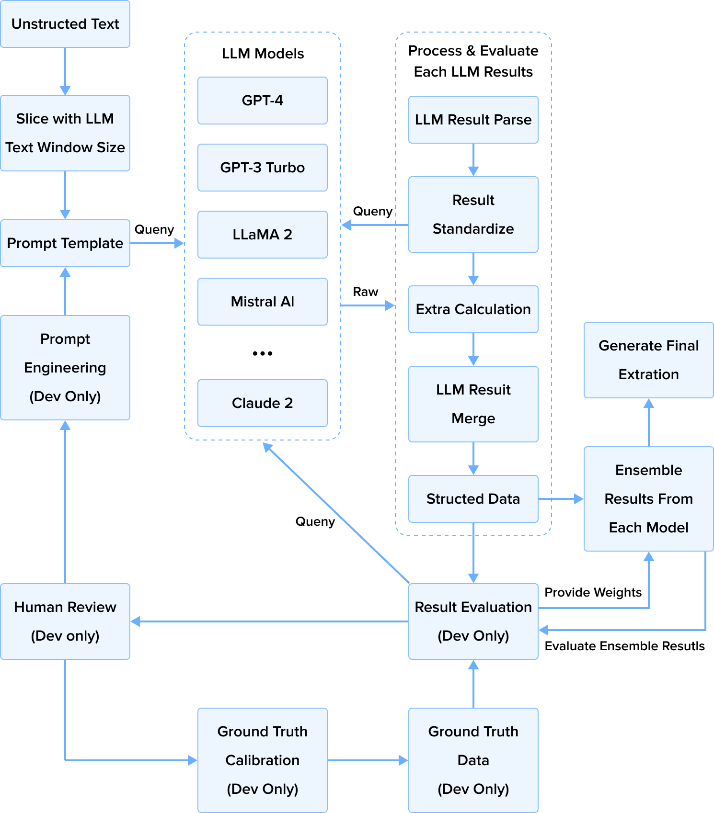
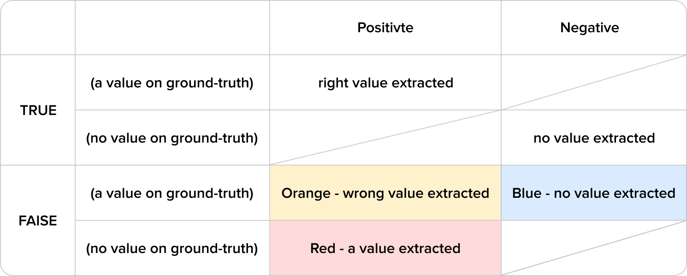
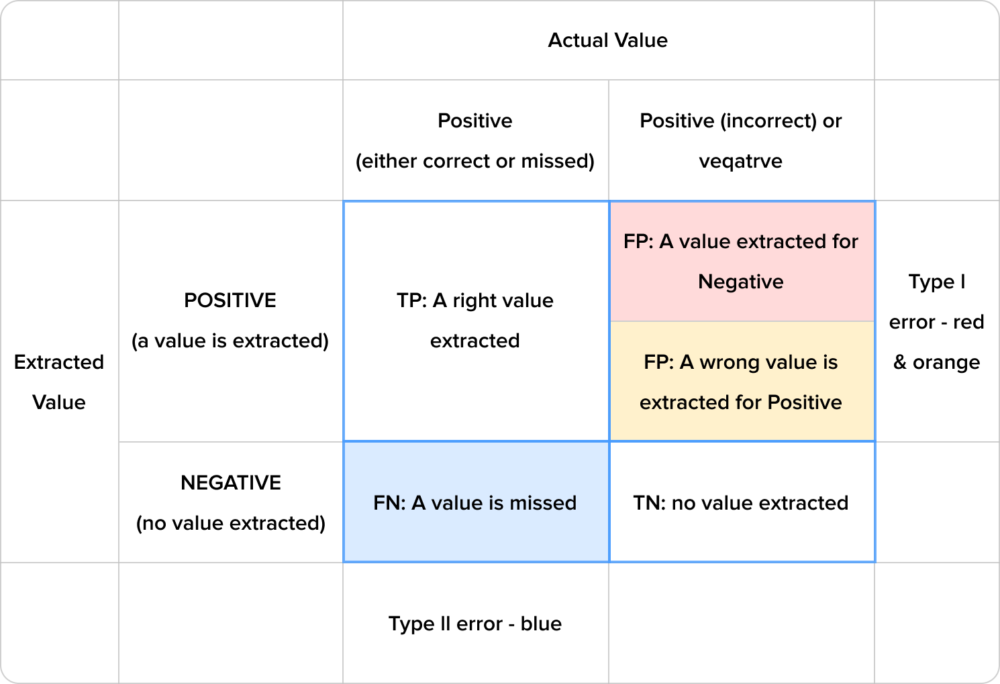

# **Document Information Extraction with Large Language Models (framework, methods, ensemble, and evaluation)**

## 1. Introduction

Information extraction (IE) is vital for converting raw text into structured data usable by various applications. Traditional IE methods often rely on labor-intensive handcrafted rules and patterns, which may struggle to generalize across diverse domains and languages. To tackle these challenges, this project explores the application of Large Language Models (LLMs) for information extraction tasks. Cutting-edge LLM models like the GPT series and Claude AI have showcased remarkable abilities in natural language understanding and generation tasks. In this project, we employed various LLMs such as GPT-3, GPT-4, GPT-4 Turbo, LLaMA 2, Mistral AI, and Claude 2 to help us to extract information from a large number of professional documents and compare the performance. Each of these models exhibits different capabilities in understanding long contexts and extracting information.

## 2. Processing Workflow

Initially, we divide the unstructured text into segments based on the Large Language Models (LLMs) maximum token length, ensuring some overlap between segments to preserve contextual coherence. Subsequently, we input the text and questions into LLMs and obtain the model's initial output, which we then structure further.

During the structuring process, standardizing the raw output ("Result Standardize" in the diagram) becomes necessary. This is crucial because the model sometimes generates answers that are un-parsable. In such cases, we may prompt the model to re-answer the question or pose a follow-up question regarding the provided response.

It's important to emphasize that we only attempt standardization once. This precaution is taken to prevent potential infinite loops, as standardization could theoretically be repeated endlessly without clear stopping criteria. Therefore, if the model still produces an un-parsable answer after the follow-up question, we discard it outright.

In the "Result Merge" step, we establish how to handle answers for the same question derived from different text segments. If answers are identical across segments, only one is retained. Discrepancies prompt the concatenation of answers from each segment, which are then saved for manual review.

In certain specialized fields of literature, specific properties may not be explicitly stated. Instead, the necessary computation factors are provided. However, due to the limited knowledge reservoir of Large Language Models (LLMs) in niche fields, they may not fully grasp the relationship between a property and its calculation factors. In such cases, we can only inquire about the computation factors and then calculate the actual value for the properties of interest based on specific formulas.

Once the extracted data is structured, the next step is to evaluate the results using pre-annotated texts. This allows us to assess the performance of each LLM. For incorrect answers, we conduct further analysis to identify the causes of the error (see the "Error Results Analysis" section for specifics). After analyzing the causes, potential methods such as prompt engineering for more accurate questioning, ground truth correction, and optimization of the LLM Result Processor may be undertaken (details in the "Result Evaluation" section):

Finally, we employ ensemble methods to select outputs from multiple models, aiming to retain the results with the highest accuracy.

## 3. Prompt Engineering

### System Prompt

At the outset, the model is configured with system information and performs as a content extractor. Our goal is to fine-tune the settings to ensure the model relies on explicitly stated content in the text and minimizes speculation. When uncertain about extracted results, we prefer a "not mentioned" result extracted by LLMS over potentially incorrect answers. In information extraction, false positives are deemed more detrimental than false negatives.

### User Prompt

A "User Prompt" entails a question directed at a specific data point. While some queries are straightforward, such as those regarding time and location, others, like determining the production volume of a product over a specific period, can be more intricate. In such cases, guiding the model to make inferences may be necessary, as articles may not explicitly state average production but rather provide total output for a given timeframe.

Complex situations can arise, particularly with range values. For instance, when production volume and capacity are uncertain, outputs may vary and be represented as a range in the text. Crafting prompts to uniformly capture and describe range values becomes crucial in such instances.

Moreover, unit measurements may be required to specify in prompt. To make evaluation easy, we expect LLMs to present units in some firm format if the result comes with a unit. To standardize units through prompts, model outputs often exhibit inconsistencies. Therefore, additional processing such as unit convert may be required to ensure unit forms closely match those in the Ground Truth.

### **Results Ensemble**

Ensemble LLMs amalgamate predictions from multiple LLMs using diverse aggregation strategies like averaging, voting and stacking. This approach is motivated by addressing limitations inherent in individual LLMs, such as understanding complex contexts, performing mathematical calculations, or avoiding hallucination. Ensembles offer a promising solution by aggregating predictions, enhancing overall performance, and bolstering robustness across varied tasks and datasets.

Among Ensemble strategies of Bagging, Boosting and Stacking, Stacking aligns well with our task requirements. Due to certain constraints, training or fine-tuning LLMs may not be viable. Therefore, our emphasis is on meta-model design. We've explored some different methods including random selection, adjusting weights based on historical evaluations, and leveraging confidence scores from LLMs for final result selection. Our ultimate aim is to outperform individual models.

## 4. **Results Evaluation**

### **Alternative Evaluation Approach**

Traditional classification evaluation methods may not be suitable for our task, which involves assessing a combination of different problem types. To simplify evaluation, we devised a customized method based on traditional principles, tailored specifically for tasks akin to ours.

### **Diverse Value Types**

Our task entails extracting numerous properties, each with various value types: binary, multi-class, numerical, and textual. Before extracting the property value, each property is classified as either "mentioned" or "not mentioned". For properties without specific values, such as equipment or techniques mentioned in the text, we would define a binary response from the LLM: "mentioned" and "not mentioned". 

Multi-class properties may have different values across articles, but each article typically has a unique one. If a property is absent, it is marked as "not mentioned". Numeric and textual properties represent values as numbers or text, respectively, and are also marked as "not mentioned" for absence.

### **Sparse and Dense Data**

Generally, the data density is different in each article. Due to the varying theme of each article, some may mention more properties compared to the other articles. If the article is too sparse, simply guessing every property to "not mentioned" may yield an over $90\\%$ accuracy. However, this result is obviously not our expectation.   

During evaluation, we exclude properties marked as "not mentioned" in both the ground truth and LLM results from statistical analysis. Our focus lies on properties with values presented in the Ground Truth but differing from LLMs’ results.

### **Confusion Matrix (Customized)**

We defined a set of TP/TN/FP/FN to evaluate the results.

The below table is the confusion matrix using the definitions above.

There is another version of the confusion matrix that may be a little bit easier to understand.

### **Full Evaluation Metrics**

| **Metrics**  | **Definition**                                  | **Notes**                                                                                                                                                                                                                                                                                                                                                                                       |
|--------------|-------------------------------------------------|-------------------------------------------------------------------------------------------------------------------------------------------------------------------------------------------------------------------------------------------------------------------------------------------------------------------------------------------------------------------------------------------------|
| $TP\\%$      | $TP/(TP+FP+FN)$                                 | Not a standard metric. Since our TN is usually very large, this is used to replace accuracy sometimes.                                                                                                                                                                                                                                                                                          |
| $FP\\%$      | $FP/(TP+FP+FN)$                                 | The lower the better. High value means the model tends to have hallucinations. Type 1 red error is worse than type 1 orange, which is worse than type 2 blue error in our extraction. High value of type-2-orange error means model's reasoning is not correct. We differ type-1-red & type-1-orange errors in extract-ref.xlsx, but have not counted them separately to calculate any metrics. |
| $FN\\%$      | $FN/(TP+FP+FN)$                                 | The lower the better. High value of type-2-blue error means model is too conservative to make extraction                                                                                                                                                                                                                                                                                        |
| $TPR/Recall$ | $TP/(TP+FN)=TP/P$                               | Standard metric. For a given POSITIVE, the probability that can be extracted correctly. If we want the papers to be extracted as much as possible, we need to observe this value closely.                                                                                                                                                                                                       |
| $FPR$        | $FP/(FP+TN)=FP/N$                               | For a given NEGATIVE, the probability that turns into an type-1 error. This might be used to reflect hallucination.                                                                                                                                                                                                                                                                             |
| $TNR$        | $TN/(FP+TN)=TN/N$                               | $1 - FPR$; for a given NEGATIVE, the probability that it'll be correctly extracted.                                                                                                                                                                                                                                                                                                             |
| $FNR$        | $FN/(TP+FN)=FN/P$                               | $1 - Recall$; a given POSITIVE, the probability it'll be a type-2 error.                                                                                                                                                                                                                                                                                                                        |
| $Accuracy$   | $(TP+TN)/(N+P)$                                 | standard metric. Usually very high since our TN is very large compared with TP.                                                                                                                                                                                                                                                                                                                 |
| $Accuracy*$  | $TP\\%$                                         | not a standard metric                                                                                                                                                                                                                                                                                                                                                                           |
| $Precision$  | $TP/(TP+FP)$                                    | standard metric; when there is a POSITIVE extraction, the probability that this extraction is right. From a data consumer perspective, this shall be the most important metric.                                                                                                                                                                                                                 |
| $F1$         | $2 \* recall \* precision / (recall+precision)$ | The standard metric to show the balance between recall and precision.                                                                                                                                                                                                                                                                                                                           |

## 5. **Error Results Analysis**

### **Misunderstanding & Terminology Confusion**

LLMs may occasionally struggle to distinguish between terms like "Injection" and "Re-injection" though they can provide correct answers when queried directly (ask LLM difference between "Injection" and "Re-injection"). In practice, when an article mentions "Injection" , the LLM may misinterpret it as "Re-injection" , potentially overlooking distinctions crucial to our task. To mitigate such errors without extensive model training, we optimize prompts by adding constraints or explanations. However, verbose prompts often yield unsatisfactory results, creating a "Whack-A-Mole" scenario.

### **Unit Conversion Issues** 

Incorrect units accompanying numerical values may distort assessments, even if LLM results are accurate. We address this by parsing units during extraction or employing LLMs for unit conversion.

### **Mathematical Mistakes**

In practice, LLMs may struggle with basic arithmetic operations like addition, subtraction, multiplication, and division, which is possible to lead to inaccuracies in properties such as a property like "Water-to-Oil Ratio". These properties often require mathematical calculations, as the exact values are not provided in the text but the components for calculation are mentioned. Consequently, the model may incorrectly label them as "not mentioned".

To mitigate this issue, we minimize the reliance on LLMs for mathematical operations whenever possible. For example, when extracting the "Water-to-Oil Ratio", we may concurrently extract the necessary factors for calculation. If the extraction is successful, the result would be reserved. Otherwise, if the contributing factors are extracted, we calculate the ratio. If neither is extracted, we would assign a value of "not mentioned" to the property. Additionally, the contributing factors themselves may not always be included in the extraction result evaluation.

### **Human Labeling Errors** 

Unfortunately, the Ground Truth is not always accurate. Various errors may occur during the data annotation process, such as omissions (missing to label) and inaccuracies (incorrect labels). Strictly speaking, these human labeling errors should not be attributed to LLMs’ mistake but to inaccuracies in the Ground Truth. Therefore, when reviewing extraction results, we also need to cross-check the Ground Truth against the original text to enhance its accuracy.

## 6. **Performance**

Despite encountering challenges, we've achieved significant milestones. For annotated documents, we achieved an over $90\\%$ extraction accuracy for all properties and an over $70\\%$ accuracy excluding "not mentioned" properties in both Ground Truth and LLM results. We observed varying extraction accuracy among different LLM models. GPT-4 stands out, surpassing even GPT-4 Turbo, possibly due to its better handling of lengthy text, leading to a more detailed understanding. GPT-4 also excels in adhering to output format constraints. Claude2 demonstrates comparable understanding to GPT-4 and occasionally provides overlooked details. This prompted us to introduce the ensemble approach. Conversely, GPT3-Turbo and LLaMA2 showed a weaker performance, often misunderstanding prompts and disregarding result format requirements. Mistral AI's performance falls between GPT-4 and GPT-3 Turbo.

## 7. **Challenges**

### **Text Expression Diversity**

Text expression may vary significantly across articles due to diverse themes, writing styles, purposes, and authors' cultural backgrounds. Using the same prompt for different articles often yields disparate results, akin to playing "Whack-A-Mole". Covering all expressions exhaustively, especially in large text volumes, is nearly impossible. Tailoring prompts for specific articles may lead to over-fitting, necessitating a focus on encompassing general cases and avoiding overly specific descriptions.

### **Design of Meta-Model of Ensemble**

Designing a meta-model for Ensemble Stacking presents another challenge. Without Ground Truth reference, determining which model performs best for each property when ensemble different LLM results is very difficult. We've explored a meta-model design based on past evaluation results and LLM-provided confidence, marginally improving $TP\\%$ values by approximately $3\\%$ - $5\\%$. Further research may be needed for continued enhancement.

### **Data Annotation**

Data annotation for information extraction is notably challenging. Annotators, particularly for specialized articles, must be professionals or experts to ensure annotation’s accuracy and completeness. Reading articles is time-consuming, especially with thousands of documents. Initial annotation efforts began with a few papers, gradually increasing to dozens, and eventually hundreds or thousands as the program developed. However, this quantity still falls short of reflecting the overall distribution realistically. While programs can alleviate some initial annotation work, manual validation remains necessary, with the required time increasing alongside text volume. 

## 8. **Conclusion**

Compared to traditional machine learning tasks like image recognition and text classification, text information extraction presents greater challenges. Particularly in professional domains, diverse content is generated daily. Comprehending these articles often demands extensive background knowledge and experience. Structured data enables a more intuitive grasp of the information within these articles and streamlines integration with downstream applications. In this project, we explored a pathway for text information extraction using Large Language Models as a powerful tool, and achieving some success. However, our work marks just the beginning of a longer journey ahead.