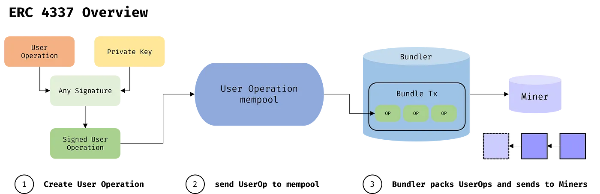
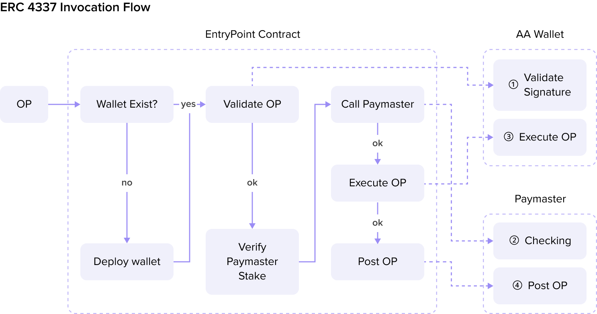
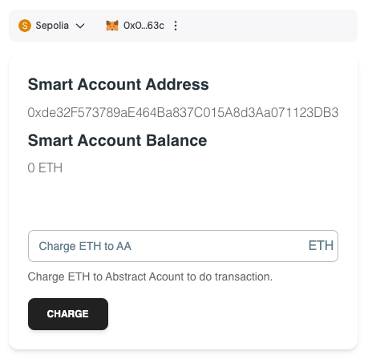
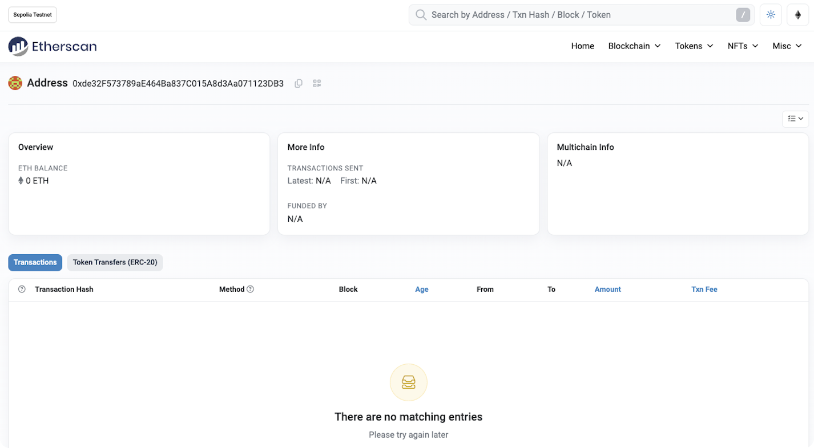
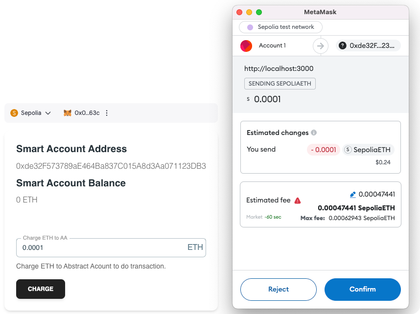
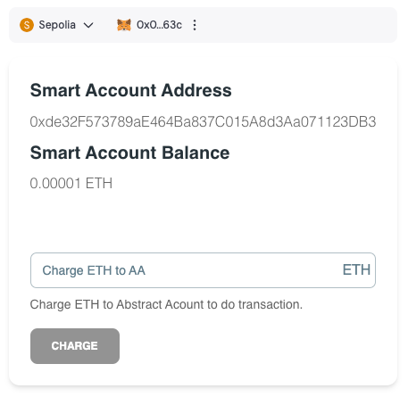
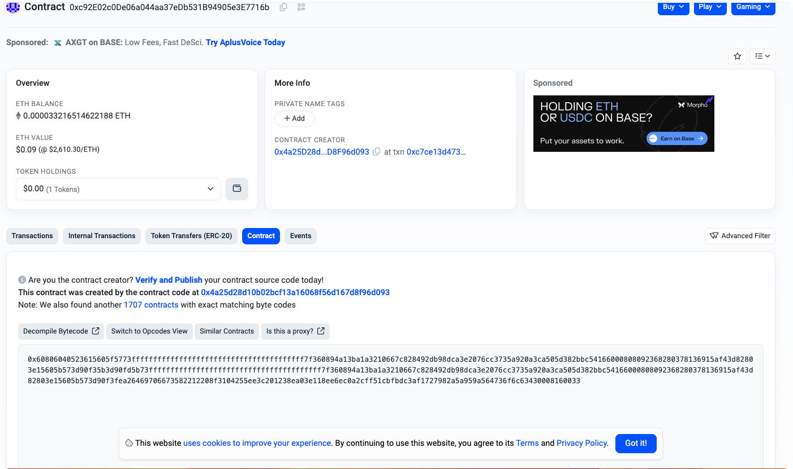

## How Account Abstraction Comes Out
Ethereum has two types of accounts: Externally Owned Accounts (EOAs) and Contract Accounts (CAs). Only EOAs can initiate a transaction (TX), whereas CAs can only be called by EOAs and then interact with other accounts.  EOAs are the main drivers of all transactions on the Ethereum network.

However, EOAs have many limitations, and CAs are constrained by EOAs:
1. They require the maintenance of private keys or mnemonic words, and losing them or being hacked means losing all assets.
2. EOAs lack flexibility and cannot define Functional and Logic Programming (for example, setting up a blacklist and daily transaction limits).
3. EOAs can only use Ether to pay for transaction fees.
4. They do not support native multi-signature wallets and rely on smart contracts to perform tasks.

Given these limitations, the concept of Account Abstraction (AA) accounts has started to take shape.

The concept of AA accounts was initially proposed in [EIP-2938](https://eips.ethereum.org/EIPS/eip-2938), which introduced a complete concept for account abstraction. Subsequently, [EIP-3074](https://eips.ethereum.org/EIPS/eip-3074) introduced a new OpCode AUTH (0xf6) and AUTHCALL (0xf7) for "authorizing smart contracts to act on behalf of EOAs." Finally, [EIP-4337](https://eips.ethereum.org/EIPS/eip-4337) completed the task of account abstraction with maximum compatibility, and currently, we refer to AA wallets as Smart Wallets or Smart Contract Accounts (SCA).

## Here is the Workflow of Account Abstraction
1. The user creates a User Operation.
2. The user signs the User Operation with any signature algorithm (in the past, Ethereum transactions could only use ECDSA).
3. The user sends the User Operation to the off-chain User Operation mempool.
4. The Bundler selects some User Operations from the mempool for bundling.
5. After bundling, it is sent to the miner for mining and then added to the blockchain.



## The Advantages of Account Abstraction
Account Abstraction is similar to a Contract Account with the characteristics of an EOA (Externally Owned Account). It allows transactions and accounts to be decoupled from the underlying layer and become the role of high-level smart contracts.

### Private Key Management
In the [EIP-4337](https://eips.ethereum.org/EIPS/eip-4337), one can freely use the desired signature algorithm because the signature is no longer limited to Ethereum's traditional ECDSA. Therefore, AA Wallet can essentially support native multi-signature wallets (MultiSig Wallets), allowing for more flexible joint account management by multiple parties. It is also possible to reset the ownership of contract accounts through social recovery, using email verification, such as Gmail, to regain access to contract accounts, such as [UniPass Wallet](https://docs.wallet.unipass.id/).

### Enhanced Security
A smart contract allows the AA wallet to implement multi-signature authorization and other functions, requiring approval from multiple parties before the transaction is completed. Compared with relying solely on private keys, this reduces the risk of unauthorized access.

### Pay Tx Fee
Due to the introduction of the Paymaster role as the fee payer, AA Wallet does not have to pay the fees itself. Dapps can assist users in paying the fees for their operations, thereby improving the user experience. Users can also pay fees using ERC20 tokens, which External Owned Accounts (EOAs) could not do in the past.

### Multi-Call
Previously, an EOA could only perform one transaction at a time. However, with ERC 4337, different transactions can all be placed in the callData field of the User Operation, allowing for the atomic execution of multiple different transactions at once.

### Social Media Recovery
Social account recovery is also an advantage of AA Wallet; you can set up a social account as the guardian of the wallet, and you can retrieve the access rights to the contract account through social account verification. Currently, losing the private key means you can never access Ethereum funds. Account Abstraction separates account access from the private key. With social recovery, you can designate trusted contacts (such as family or friends) who can help you regain access if you lose your signing key. This may involve a multi-step verification process or delayed access procedures to prevent unauthorized recovery.

## The Disadvantages of Account Abstraction
### May Result in Higher Gas Fees
In the past, a transfer between EOAs (External Owned Accounts) only required consumption of 21000 Gwei. Still, after using ERC 4337, because a contract call will occur, it also generates additional costs, leading to a higher cost for User Operation. ([Details can be referred to in this article](https://www.stackup.sh/blog/how-much-more-expensive-is-erc-4337)) Currently, the best solution is to use Layer 2 for transactions, which can significantly reduce the cost of gas fees.

### Security
As previously mentioned, the reason why Paymaster needs to stake native tokens to the EntryPoint is to prevent malicious Paymasters from conducting DoS (Denial of Service) attacks. Since the Paymaster is a contract implemented by a third party, following the process below, it can make the Bundler send invalid transactions, such as:

1. Establish a malicious Paymaster contract that returns true for all check functions.
2. When the UserOperation enters the mempool, all simulations and checks will pass.
3. When the Bundler packages and hands it to the miners, the Paymaster can withdraw all the native tokens from the contract and frontrun the Bundler's on-chain request.
4. Ultimately, when the Bundler's transaction is executed, a revert will occur, preventing the Bundler from obtaining compensated native tokens from the postOP. So, when the Paymaster engages in malicious behavior, it can be punished through the mechanisms described in the "reputation, throttling, and banning section."

## Code Pieces
Currently, many Web3 wallets support AA (Account Abstraction). We will use the following two products to help us create an AA wallet and establish a connection between the EOA (External Owned Account) wallet and the AA wallet.

1. [Dynamic](https://www.dynamic.xyz/)
2. [Alchemy](https://accountkit.alchemy.com/)

### Using the Dynamic EOA Wallet

**WalletProvider.tsx**

```tsx
import { QueryClient, QueryClientProvider } from "@tanstack/react-query";
import { WagmiProvider } from "wagmi";
import { PropsWithChildren } from "react"; import {
    DynamicContextProvider,
} from '@dynamic-labs/sdk-react-core';
import { EthereumWalletConnectors } from '@dynamic-labs/ethereum';
import { DynamicWagmiConnector } from '@dynamic-labs/wagmi-connector';
import { wagmiConfig } from "../config";
const queryClient = new QueryClient()

export default function WalletProvider({ children }: PropsWithChildren) {
    return <DynamicContextProvider
        settings={{
            environmentId: process.env.NEXT_PUBLIC_dynamic_env as string,
            walletConnectors: [EthereumWalletConnectors],
        }}
    >
        <WagmiProvider config={wagmiConfig}>
            <QueryClientProvider client={queryClient}>
                <DynamicWagmiConnector>
                    {children}
                </DynamicWagmiConnector>
            </QueryClientProvider>
        </WagmiProvider>
    </DynamicContextProvider>
}
```
**wagmiConfig.ts**

```ts
import { http, createConfig } from 'wagmi';
import { sepolia } from 'wagmi/chains';
export const wagmiConfig = createConfig({
    chains: [sepolia],
    multiInjectedProviderDiscovery: false,
    transports: {
        [sepolia.id]: http(),
    },
});
```

### Use the DynamicWidget to Display the Wallet
**app.tsx**
```tsx
'use client';

import { DynamicWidget } from "@dynamic-labs/sdk-react-core";
import AbstractAcount from "./components/AbstractAcount";
import { useAccount } from "wagmi";
import { Spinner } from "@material-tailwind/react";

export default function Home() {
	const { isConnected, isConnecting, isReconnecting } = useAccount();
	if (isConnecting || isReconnecting) return <main className="w-screen h-screen flex items-center justify-center">
		<Spinner />
	</main>
	return (
		<main className="w-screen h-screen flex items-center justify-center">
			<div>
				<DynamicWidget variant="modal" />
				{
					isConnected && <AbstractAcount />
				}
			</div>
		</main>
	);
}
```
If you finish the code there, click the widget button. Then, you can log in to the EOA wallet you like. In this demo, we use the [Metamask](https://metamask.io/).

### Connecting the EOA Wallet to the AA Wallet
Refer to the [example](https://docs.dynamic.xyz/account-abstraction/aa-providers/alchemy) of Dynamic, which links the EOA wallet with Alchemy's AA wallet. The main task is to pass the Signer to Alchemy for its use. Alchemy will create a smart contract wallet called a Client. Through the Client, you can obtain the wallet address and balance, and of course, you can also use the Client to conduct transactions.

**SmartAccountClientProvider.tsx**
```tsx
import useDynamicSigner from "@/hooks/useDynamicSigner";
import { createModularAccountAlchemyClient } from "@alchemy/aa-alchemy";
import { SmartAccountClient, SmartAccountSigner, sepolia } from "@alchemy/aa-core";
import { createContext, useEffect, useState } from "react";
import { Address } from "viem";
export default function SmartAccountClientProvider({ children }: any) {
    const [AAadress, setAAadress] = useState<Address>('' as Address);
    const [AAbalance, setAAbalance] = useState('');
    const [loadingBalance, setLoadingBalance] = useState(false);
    const [loadingAddress, setLoadingAddress] = useState(false);
    const [smartAccountClient, setSmartAccountClient] = useState<SmartAccountClient | null>(null)
    const dynamicSigner = useDynamicSigner(); // dynamic can provide the signer
    const getBalance = async (client: SmartAccountClient, address: Address) => {
        try {
            setLoadingBalance(true)
            const balance = await client?.getBalance({ address })
            setAAbalance(balance.toString())
        } catch (err) {
            throw err;
        } finally {
            setLoadingBalance(false)
        }
    }
    const createSmartAccountClient = async (signer: SmartAccountSigner<any>) => {
        try {
            setLoadingAddress(true)
            const smartAcClient = await createModularAccountAlchemyClient({
                apiKey: process.env.NEXT_PUBLIC_alchemy_apikey,
                chain: sepolia,
                signer,
            });
            setSmartAccountClient(smartAcClient)
            setAAadress(smartAcClient.getAddress())
            await getBalance(smartAcClient, smartAcClient.getAddress())
        } catch (err) {
            throw err;
        } finally {
            setLoadingAddress(false)
        }
    }
    const loadAABalance = async () => {
        try {
            if (smartAccountClient) {
                await getBalance(smartAccountClient, AAadress as Address)
            }
        } catch (err) {
            throw err;
        }
    }
    useEffect(() => {
        if (dynamicSigner) {
            createSmartAccountClient(dynamicSigner)
        }
    }, [dynamicSigner]);
    return <SmartAccountClientContext.Provider
        value={{
            smartAccountClient,
            AAadress,
            AAbalance,
            loadingBalance,
            loadingAddress,
            loadAABalance
        }}
    >
        {children}
    </SmartAccountClientContext.Provider>
}
```
### Sending Transactions Using the AA Wallet
Since the balance of the wallet newly created by the Client is still 0, some funds need to be transferred into the smart wallet before initiating transactions for its use.



Create the  `AbstractAcount.tsx`  component to display information about the current AA wallet and the functionality for funding it. 

**AbstractAcount.tsx**
```tsx
import { SmartAccountClientContext } from "@/alchemy/SmartAccountClientProvider";
import { Card, CardBody, CardFooter, Typography, Button, Input, Spinner } from "@material-tailwind/react";
import Link from "next/link";
import { ChangeEventHandler, useContext, useMemo, useState } from "react";
import { parseEther } from "viem";
import { useSendTransaction } from "wagmi";

export default function AbstractAcount() {
    const {
        AAadress,
        AAbalance,
        loadingBalance,
        loadingAddress,
        loadAABalance
    } = useContext(SmartAccountClientContext);
    const [value, setValue] = useState('');
    const { sendTransaction, isPending, isError } = useSendTransaction()
    const handleChange: ChangeEventHandler<HTMLInputElement> = (e) => {
        const val = e.target.value;
        setValue(val)
    }
    const isValid = useMemo(() => {
        if (!value) return false;
        if (isNaN(Number(value))) return false;
        return true;
    }, [value])

    const handleCharge = () => {
        chargeAA()
    }

    const chargeAA = async () => {
        sendTransaction({
            to: AAadress,
            value: parseEther(value)
        }, {
            onSuccess: () => {
                loadAABalance();
            },
        });
    }
    return <Card className="flex flex-col gap-2 mt-4">
        <CardBody>
            <Typography variant="h5" color="blue-gray">
                Smart Account Address
            </Typography>
            <Typography className="my-2">
                {loadingAddress ? <Spinner /> : <Link
                    className="hover:text-capstackBlue"
                    target="_blank"
                    href={`https://sepolia.etherscan.io/address/${AAadress}`}
                >{AAadress}</Link>}
            </Typography>
            <Typography variant="h5" color="blue-gray">
                Smart Account Balance
            </Typography>
            <Typography className="my-2">
                {loadingBalance ? <Spinner /> : `${Number(AAbalance) / 1e18} ETH`}
            </Typography>
        </CardBody>
        <CardFooter>
            <div className="mb-4">
                <Input
                    value={value}
                    type="text"
                    label="Charge ETH to AA"
                    crossOrigin={undefined}
                    onChange={handleChange}
                    icon={<div className="absolute">ETH</div>}
                />
                <Typography
                    variant="small"
                    color="gray"
                    className="mt-2 flex items-center gap-1 font-normal"
                >
                    Charge ETH to the Abstract Account to do the transactions.
                </Typography>
            </div>
            <Button
                disabled={!isValid}
                onClick={handleCharge}
            >Charge</Button>
        </CardFooter>
    </Card>
}
```


Use the transaction functionality provided by Wagmi to fund the AA wallet. After the funding is completed, the interface will refresh to display the amount that was just funded, which you can view at the corresponding address.




### Send Multiple Transactions Using the AA Wallet
Since the AA wallet sends transactions using calldata, we only need to construct the corresponding calldata for the operations we want to perform to initiate multiple actions within a single transaction (TX).

**txSample.ts**
```ts
import { Address, BatchUserOperationCallData, UserOperationCallData } from "@alchemy/aa-core";
import { encodeFunctionData } from "viem";

export type UserOperationRequests = UserOperationCallData[] | BatchUserOperationCallData[]

const ApproveAbi = [
    {
        "inputs": [
            {
                "internalType": "address",
                "name": "spender",
                "type": "address"
            },
            {
                "internalType": "uint256",
                "name": "amount",
                "type": "uint256"
            }
        ],
        "name": "approve",
        "outputs": [
            {
                "internalType": "bool",
                "name": "",
                "type": "bool"
            }
        ],
        "stateMutability": "nonpayable",
        "type": "function"
    },
]

const newOrInvestToVaultPositionAbi = [
    {
        "inputs": [
            {
                "components": [
                    {
                        "internalType": "uint256",
                        "name": "vaultId",
                        "type": "uint256"
                    },
                    {
                        "internalType": "uint256",
                        "name": "vaultPositionId",
                        "type": "uint256"
                    },
                    {
                        "internalType": "uint256",
                        "name": "amount0Invest",
                        "type": "uint256"
                    },
                    {
                        "internalType": "uint256",
                        "name": "amount0Borrow",
                        "type": "uint256"
                    },
                    {
                        "internalType": "uint256",
                        "name": "amount1Invest",
                        "type": "uint256"
                    },
                    {
                        "internalType": "uint256",
                        "name": "amount1Borrow",
                        "type": "uint256"
                    },
                    {
                        "internalType": "uint256",
                        "name": "amount0Min",
                        "type": "uint256"
                    },
                    {
                        "internalType": "uint256",
                        "name": "amount1Min",
                        "type": "uint256"
                    },
                    {
                        "internalType": "uint256",
                        "name": "deadline",
                        "type": "uint256"
                    },
                    {
                        "internalType": "uint256",
                        "name": "swapExecutorId",
                        "type": "uint256"
                    },
                    {
                        "internalType": "bytes",
                        "name": "swapPath",
                        "type": "bytes"
                    }
                ],
                "internalType": "struct IVeloVaultPositionManager.NewOrInvestToVaultPositionParams",
                "name": "params",
                "type": "tuple"
            }
        ],
        "name": "newOrInvestToVaultPosition",
        "outputs": [],
        "stateMutability": "payable",
        "type": "function"
    },
]

function enterTransaction(
    formData: FormData,
    labels: string[],
) {
    const data: any = {}
    labels.forEach(l => {
        data[l] = formData.get(l)
    })
    const amount = data.amount ? Number(data.amount) : 0;
    if (amount) {
        const userOperations: UserOperationRequests = [
            {
                target: '0xEDfa23602D0EC14714057867A78d01e94176BEA0' as Address,
                data: encodeFunctionData({
                    abi: ApproveAbi,
                    functionName: ApproveAbi[0].name,
                    args: ['0xf9cFB8a62f50e10AdDE5Aa888B44cF01C5957055', BigInt(1 * 1e18)],
                }),
            },
            {
                target: '0xf9cFB8a62f50e10AdDE5Aa888B44cF01C5957055' as Address,
                data: encodeFunctionData({
                    abi: newOrInvestToVaultPositionAbi,
                    functionName: newOrInvestToVaultPositionAbi[0].name,
                    args: [{
                        vaultId: BigInt(63),
                        vaultPositionId: 0,
                        amount0Invest: 0,
                        amount0Borrow: 0,
                        amount1Invest: BigInt(amount * 1e18),
                        amount1Borrow: 0,
                        amount0Min: 0,
                        amount1Min: 0,
                        deadline: BigInt(Date.now() + 15 * 60 * 1000),
                        swapExecutorId: 0,
                        swapPath: '0x',
                    }],
                }),
            }
        ]
        return userOperations;
    }
    return [];
}
export default enterTransaction;

const { hash } = await smartAccountClient.sendUserOperation({ uo: userOperations });
const txhash = await smartAccountClient.waitForUserOperationTransaction({ hash });
```
First, use the `encodeFunctionData` method provided by viem to convert the parameters for calling the contract function into calldata. Then, all user operations are sent to the smart wallet for transactions using the  `sendUserOperation`  provided by the smart client.

After the transaction is sent, Alchemy will mount the contract for the smart wallet, making it a true contract wallet.



However, the consumption of gas fees in this process is more expensive than one might think, which contradicts the previously mentioned advantage of reducing gas fees. This is because users will inevitably make calls between contracts once they start using the AA wallet, which also incurs costs. 

The best solution currently is to use Layer 2 for transactions, which can significantly reduce gas fees.

## Summary
Leveraging AA's characteristics can significantly lower the barrier to entry for web3 and create a new era of wallet applications with various functionalities. 
- Simplify the joining process through familiar login methods or without immediate encryption requirements.
- Provide recovery options to eliminate losing web3 assets due to key loss.
- Integrate with fiat currency gateways so that users can directly purchase web3 assets.