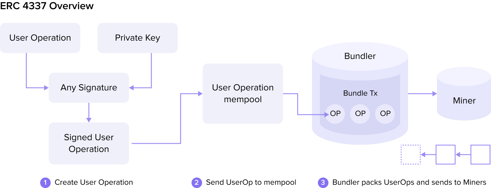

## Introduction
The AA concept has emerged as a significant innovation in the evolving blockchain technology landscape. 
Traditional Ethereum accounts, or Externally Owned Accounts (EOAs), have several limitations that hinder flexibility and security. 
AA addresses these limitations by decoupling transactions and accounts from the underlying layer, 
allowing for more advanced functionalities and enhanced security. 

This article delves into the origins and workflow of AA and highlights the advantages and disadvantages. As we explore how to build and optimize AA wallets using Dynamic and Alchemy, 
we’ll provide you with practical insights through front-end code examples.

Whether you are a developer looking to implement AA wallets or simply interested in understanding this cutting-edge technology, this article will guide you through the essential concepts and practical steps.

## How Account Abstraction Emerges
Ethereum has two types of accounts: Externally Owned Accounts (EOAs) and Contract Accounts (CAs). Only EOAs can initiate a transaction (TX), 
and CAs can only be called by EOAs to interact with other accounts. EOAs are the main drivers of all transactions on the Ethereum network.

However, EOAs have many limitations, and CAs are constrained by EOAs. Here is why:
1. EOAs require the maintenance of private keys or mnemonic words. Losing them or being hacked means losing all assets.
2. EOAs lack flexibility and cannot define Functional and Logic Programming. (For example, setting up a blacklist and daily transaction limits)
3. EOAs can only use Ether to pay for transaction fees.
4. EOAs do not support native multi-signature wallets and rely on smart contracts to perform tasks.

Given these limitations, a new solution, as defined by Account Abstraction, has started to take shape.

## The Concept of Account Abstraction (AA)
AA is a concept in blockchain technology, particularly in Ethereum, that enhances the flexibility and security of account management.

AA was initially proposed in [EIP-2938](https://eips.ethereum.org/EIPS/eip-2938). Subsequently, 
[EIP-3074](https://eips.ethereum.org/EIPS/eip-3074) introduced a new OpCode AUTH (0xf6) and AUTHCALL (0xf7) 
for "authorizing smart contracts to act on behalf of EOAs." Finally, [EIP-4337](https://eips.ethereum.org/EIPS/eip-4337) 
completed the task of account abstraction with maximum compatibility, and currently, we refer to AA wallets as 
Smart Wallets or Smart Contract Accounts (SCA).

## Workflow of Account Abstraction
How to get started using AA in your accounts:

1. The user creates a User Operation.
2. The user signs the User Operation with any signature algorithm (in the past, Ethereum transactions could only use Elliptic Curve Digital Signature Algorithm (ECDSA)).
3. The user sends the User Operation to the off-chain User Operation mempool.
4. The Bundler selects some User Operations from the mempool for bundling.
5. After bundling, it is sent to the miner for mining and then added to the blockchain.




## Advantages of Account Abstraction
AA is similar to a CA in that it has the characteristics of an EOA. 
It allows transactions and accounts to be decoupled from the underlying layer and assume the role of high-level smart contracts. 

This decoupling brings several key advantages, which are detailed below:

### 1. Private Key Management
In the [EIP-4337](https://eips.ethereum.org/EIPS/eip-4337), one can freely use the desired signature algorithm because 
the signature is no longer limited to Ethereum's traditional ECDSA. Therefore, an AA Wallet can support native 
multi-signature wallets (MultiSig Wallets), allowing for more flexible joint account management by multiple parties. It 
is also possible to reset Contract Account Ownership through social recovery and email verification, such as 
Gmail, to regain access to contract accounts like [UniPass Wallet](https://docs.wallet.unipass.id/).

### 2. Enhanced Security
A smart contract allows the AA wallet to implement multi-signature authorization and other related functions, requiring approval 
from multiple parties before the transaction is completed. This reduces the 
risk of unauthorized access to an account compared to relying solely on private keys.

### 3. Pay Tx Fee
Since introducing the Paymaster role as the fee payer, AA Wallet has not had to pay the fees. DApps can 
assist users in paying the fees for their operations to improve the user experience. Users can also pay fees using 
ERC20 tokens, which EOAs could not do in the past.

### 4. Multi-Call
Previously, an EOA could only perform one transaction at a time. However, with ERC 4337, different transactions can all be 
placed in the callData field of the User Operation, allowing for the atomic execution of multiple different transactions at once.

### 5. Social Account Recovery
Social account recovery is also an advantage of AA Wallet. You can set up a social account as the guardian of the wallet and 
retrieve the access rights to the contract account through social account verification. Currently, losing the private 
key means you can never access Ethereum funds. Account Abstraction separates account access from the private key. With social 
recovery, you can designate trusted contacts (such as family or friends) who can help you regain access if you lose your signing 
key. This may involve a multi-step verification process or delayed access procedures to prevent unauthorized recovery.

## Disadvantages of Account Abstraction
While AA offers several advantages, it also has some disadvantages that need to be considered. 

Disadvantages can include:

### 1. May Result in Higher Gas Fees
In the past, a transfer between EOAs only required consumption of 21000 Gwei. However, using ERC-4337 
creates a contract call, which results in higher costs for the User Operation. 
([Details can be found in this article](https://medium.com/@intuofficial/erc-4337-gas-fees-a-comparative-analysis-of-deoas-and-erc-4337-81361a51b66b#:~:text=The%20fee%20is%20determined%20by,wallet%20only%20needs%2021%2C000%20gas.).) Currently, 
the best solution is to use Layer 2 for transactions, which can significantly reduce the cost of gas fees.

### 2. Need to Mitigate Malicious Paymaster Risks in Account Abstraction
As previously mentioned, Paymasters need to stake native tokens to the EntryPoint to prevent malicious Paymasters 
from conducting DoS (Denial of Service) attacks. Since the Paymaster is a contract implemented by a third party, the Bundler can send invalid transactions. 
Here’s how:

- **i**. Establish a malicious Paymaster contract that returns true for all check functions.
- **ii**. All simulations and checks will pass when the User Operation enters the mempool.
- **iii**. When the Bundler packages and hands it to the miners, the Paymaster can withdraw all the native tokens from the contract and frontrun the Bundler's on-chain request.
- **iv**. Ultimately, when the Bundler's transaction is executed, a revert will occur, preventing the Bundler from obtaining compensated native tokens from the postOP. So, when the Paymaster engages in malicious behavior, it can be punished through the mechanisms described in the "reputation, throttling, and banning section."

## Code Examples for Account Abstraction Implementation
Currently, many Web3 wallets support AA. In this demo, we use the following two products to help create 
an AA wallet and establish a connection between the EOA wallet and the AA wallet.

### Tech Stacks
1. [Dynamic](https://www.dynamic.xyz/), to connect EOA and provide EOA account information to Smart Account.
2. [Alchemy](https://accountkit.alchemy.com/), we use its Smart Account Lib to build our Smart Account Controller.
3. [React](https://react.dev/) is a popular front-end framework we use to build our DApp demo.

### Online Playground
To review the code, click [here](https://codesandbox.io/p/devbox/abstract-account-hslydc) to 
access the online demo.

### Using the Dynamic EOA Wallet
In this step, we use the `DynamicContextProvider` component to build a connection to `Dynamic` using `DynamicKey`
and then `DynamicWagmiConnector` to connect the Chrome extension EOA wallet. The `WagmiProvider` component will
help us use wagmi lib functions in our DApp more easily, almost like we are switching networks, getting account information, and interacting with contracts.

***In the DApp demo, you can see the address and balance of this AA account.***


#### **WalletProvider.tsx**
```tsx
import { QueryClient, QueryClientProvider } from "@tanstack/react-query";
import { WagmiProvider } from "wagmi";
import { PropsWithChildren } from "react"; import {
    DynamicContextProvider,
} from '@dynamic-labs/sdk-react-core';
import { EthereumWalletConnectors } from '@dynamic-labs/ethereum';
import { DynamicWagmiConnector } from '@dynamic-labs/wagmi-connector';
import { http, createConfig } from 'wagmi';
import { sepolia } from 'wagmi/chains';

const queryClient = new QueryClient()
const wagmiConfig = createConfig({
    chains: [sepolia],
    multiInjectedProviderDiscovery: false,
    transports: {
        [sepolia.id]: http(),
    },
});

export default function WalletProvider({ children }: PropsWithChildren) {
    return <DynamicContextProvider
        settings={{
            environmentId: DynamicKey as string,
            walletConnectors: [EthereumWalletConnectors],
        }}
    >
        <WagmiProvider config={wagmiConfig}>
            <QueryClientProvider client={queryClient}>
                <DynamicWagmiConnector>
                    {children}
                </DynamicWagmiConnector>
            </QueryClientProvider>
        </WagmiProvider>
    </DynamicContextProvider>
}
```

### Use the DynamicWidget to Display the Wallet
In this step, we create DApp's home page. Because we registered the wagmi context with `WagmiProvider` in the last step, 
we can use the `useAccount` hook provided by wagmi here. Note that this hook can give us our connection status with the EOA wallet.

Further, because we register dynamic context by `DynamicContextProvider`, we can use `DynamicWidget` to connect our 
EOA wallets to those installed in the Chrome extension. 

When the connection status displays "connected", you can see the Smart Account Component.

#### **app.tsx**
```tsx
import { DynamicWidget } from "@dynamic-labs/sdk-react-core";
import AbstractAccount from "./components/AbstractAccount";
import { useAccount } from "wagmi";
import { Spinner } from "@material-tailwind/react";

export default function Home() {
	const { isConnected, isConnecting, isReconnecting } = useAccount();
	if (isConnecting || isReconnecting) return <main className="w-screen h-screen flex items-center justify-center">
		<Spinner />
	</main>
	return (
		<main className="w-screen h-screen flex items-center justify-center">
			<div>
				<DynamicWidget variant="modal" />
				{
					isConnected && <AbstractAccount />
				}
			</div>
		</main>
	);
}
```
If you finish the code there, click the widget button. Then, you can log in to the EOA wallet you choose. In this demo, we use the [Metamask](https://metamask.io/).

### Connecting the EOA Wallet to the AA Wallet
Here, we use the React context to create a `SmartAccountClientProvider` to allow the AA account client to be used 
in our DApp. The `smartAccountClient` is generated by `createModularAccountAlchemyClient`, which Alchemy provides.

Secondly, we need to provide `apiKey` and `signer` to `createModularAccountAlchemyClient`. The `apiKey` should be registered on 
the Dynamic website, and Dynamic will provide it to the signer.

Refer to this [example](https://docs.dynamic.xyz/account-abstraction/aa-providers/alchemy) of Dynamic,
which links the EOA wallet with Alchemy's AA wallet. 

The main task is to send the Signer to Alchemy for use. Alchemy will create an AA contract wallet called "Client." Through the "Client," you
can obtain the wallet address and balance and conduct transactions.

#### **SmartAccountClientProvider.tsx**
```tsx
import useDynamicSigner from "@/hooks/useDynamicSigner";
import { createModularAccountAlchemyClient } from "@alchemy/aa-alchemy";
import { SmartAccountClient, SmartAccountSigner, sepolia } from "@alchemy/aa-core";
import { createContext, useEffect, useState } from "react";
import { Address } from "viem";
export default function SmartAccountClientProvider({ children }: PropsWithChildren) {
    const [AAaddress, setAAaddress] = useState<Address>('' as Address);
    const [AAbalance, setAAbalance] = useState('');
    const [loadingBalance, setLoadingBalance] = useState(false);
    const [loadingAddress, setLoadingAddress] = useState(false);
    const [smartAccountClient, setSmartAccountClient] = useState<SmartAccountClient | null>(null)
    const dynamicSigner = useDynamicSigner(); // dynamic can provide the signer
    const getBalance = async (client: SmartAccountClient, address: Address) => {
        try {
            setLoadingBalance(true)
            const balance = await client?.getBalance({ address })
            setAAbalance(balance.toString())
        } catch (err) {
            throw err;
        } finally {
            setLoadingBalance(false)
        }
    }
    const createSmartAccountClient = async (signer: SmartAccountSigner<any>) => {
        try {
            setLoadingAddress(true)
            const smartAcClient = await createModularAccountAlchemyClient({
                apiKey: alchemy_apikey,
                chain: sepolia,
                signer,
            });
            setSmartAccountClient(smartAcClient)
            setAAaddress(smartAcClient.getAddress())
            await getBalance(smartAcClient, smartAcClient.getAddress())
        } catch (err) {
            throw err;
        } finally {
            setLoadingAddress(false)
        }
    }
    const loadAABalance = async () => {
        try {
            if (smartAccountClient) {
                await getBalance(smartAccountClient, AAaddress as Address)
            }
        } catch (err) {
            throw err;
        }
    }
    useEffect(() => {
        if (dynamicSigner) {
            createSmartAccountClient(dynamicSigner)
        }
    }, [dynamicSigner]);
    return <SmartAccountClientContext.Provider
        value={{
            smartAccountClient,
            AAaddress,
            AAbalance,
            loadingBalance,
            loadingAddress,
            loadAABalance
        }}
    >
        {children}
    </SmartAccountClientContext.Provider>
}
```
### Deposit the AA Wallet
After creating SmartAccountClient in the previous step, you should now have an on-chain AA account wallet.
However, the wallet will have a zero balance, so if you want to use it for any transaction, you should send 
some ETHs to the AA account.

Create the  `AbstractAccount.tsx`  component to display information about the current AA wallet and the functionality for funding it. 

***The Deposit Step***


#### **AbstractAccount.tsx**
```tsx
import { SmartAccountClientContext } from "@/alchemy/SmartAccountClientProvider";
import { Card, CardBody, CardFooter, Typography, Button, Input, Spinner } from "@material-tailwind/react";
import Link from "next/link";
import { ChangeEventHandler, useContext, useMemo, useState } from "react";
import { parseEther } from "viem";
import { useSendTransaction } from "wagmi";

export default function AbstractAccount() {
    const {
        AAaddress,
        AAbalance,
        loadingBalance,
        loadingAddress,
        loadAABalance
    } = useContext(SmartAccountClientContext);
    const [value, setValue] = useState('');
    const { sendTransaction, isPending, isError } = useSendTransaction()
    const handleChange: ChangeEventHandler<HTMLInputElement> = (e) => {
        const val = e.target.value;
        setValue(val)
    }
    const isValid = useMemo(() => {
        if (!value) return false;
        if (isNaN(Number(value))) return false;
        return true;
    }, [value])

    const handleClick = () => {
        deposit()
    }

    const deposit = async () => {
        sendTransaction({
            to: AAaddress,
            value: parseEther(value)
        }, {
            onSuccess: () => {
                loadAABalance();
            },
        });
    }
    return <Card className="flex flex-col gap-2 mt-4">
        <CardBody>
            <Typography variant="h5" color="blue-gray">
                Smart Account Address
            </Typography>
            <Typography className="my-2">
                {loadingAddress ? <Spinner /> : <Link
                    className="hover:text-blue"
                    target="_blank"
                    href={`https://sepolia.etherscan.io/address/${AAaddress}`}
                >{AAaddress}</Link>}
            </Typography>
            <Typography variant="h5" color="blue-gray">
                Smart Account Balance
            </Typography>
            <Typography className="my-2">
                {loadingBalance ? <Spinner /> : `${Number(AAbalance) / 1e18} ETH`}
            </Typography>
        </CardBody>
        <CardFooter>
            <div className="mb-4">
                <Input
                    value={value}
                    type="text"
                    label="Deposit AA"
                    crossOrigin={undefined}
                    onChange={handleChange}
                    icon={<div className="absolute">ETH</div>}
                />
                <Typography
                    variant="small"
                    color="gray"
                    className="mt-2 flex items-center gap-1 font-normal"
                >
                    Deposit ETH into the Abstract Account to conduct transactions.
                </Typography>
            </div>
            <Button
                disabled={!isValid}
                onClick={handleClick}
            >Deposit</Button>
        </CardFooter>
    </Card>
}
```
***Also we can search our smart account address on the [sepolia explore](https://sepolia.etherscan.io/)***


Here, we fill the ETH into the input in our DApp, then click "charge." Next, 
our DApp will call the EOA wallet transaction, sending a modal connected by Dynamic 
to confirm the transaction in the system.

After the transaction has finished, our DApp will refresh automatically. Once that happens, you will discover that the balance changed, and your charge was successful.

### Send Multiple Transactions Using the AA Wallet
The process starts when the AA wallet sends the user operations. Then, user operations need to convert structured data into 
callData format. You will need to use `encodeFunctionData` to convert structured data into callData.

In the code snippet below, we can see one of the features of the AA wallet, which combines multiple
operations into a single transaction. This transaction is a common investment operation. 

The first step is to request a transaction for the Approve operation, followed by the transaction for the specific 
Approve operation. The AA wallet then combines these two steps into a user operation list and sends it 
out as a single transaction.

#### **txSample.ts**
```ts
import { Address, BatchUserOperationCallData, UserOperationCallData } from "@alchemy/aa-core";
import { encodeFunctionData } from "viem";

export type UserOperationRequests = UserOperationCallData[] | BatchUserOperationCallData[]

const ApproveAbi = [
    {
        "inputs": [
            {
                "internalType": "address",
                "name": "spender",
                "type": "address"
            },
            {
                "internalType": "uint256",
                "name": "amount",
                "type": "uint256"
            }
        ],
        "name": "approve",
        "outputs": [
            {
                "internalType": "bool",
                "name": "",
                "type": "bool"
            }
        ],
        "stateMutability": "nonpayable",
        "type": "function"
    },
]

const newOrInvestToVaultPositionAbi = [
    {
        "inputs": [
            {
                "components": [
                    {
                        "internalType": "uint256",
                        "name": "vaultId",
                        "type": "uint256"
                    },
                    {
                        "internalType": "uint256",
                        "name": "vaultPositionId",
                        "type": "uint256"
                    },
                    {
                        "internalType": "uint256",
                        "name": "amount0Invest",
                        "type": "uint256"
                    },
                    {
                        "internalType": "uint256",
                        "name": "amount0Borrow",
                        "type": "uint256"
                    },
                    {
                        "internalType": "uint256",
                        "name": "amount1Invest",
                        "type": "uint256"
                    },
                    {
                        "internalType": "uint256",
                        "name": "amount1Borrow",
                        "type": "uint256"
                    },
                    {
                        "internalType": "uint256",
                        "name": "amount0Min",
                        "type": "uint256"
                    },
                    {
                        "internalType": "uint256",
                        "name": "amount1Min",
                        "type": "uint256"
                    },
                    {
                        "internalType": "uint256",
                        "name": "deadline",
                        "type": "uint256"
                    },
                    {
                        "internalType": "uint256",
                        "name": "swapExecutorId",
                        "type": "uint256"
                    },
                    {
                        "internalType": "bytes",
                        "name": "swapPath",
                        "type": "bytes"
                    }
                ],
                "internalType": "struct IVeloVaultPositionManager.NewOrInvestToVaultPositionParams",
                "name": "params",
                "type": "tuple"
            }
        ],
        "name": "newOrInvestToVaultPosition",
        "outputs": [],
        "stateMutability": "payable",
        "type": "function"
    },
]

function enterTransaction(
    formData: FormData,
    labels: string[],
) {
    const data: any = {}
    labels.forEach(l => {
        data[l] = formData.get(l)
    })
    const amount = data.amount ? Number(data.amount) : 0;
    if (amount) {
        const userOperations: UserOperationRequests = [
            {
                target: '0xEDfa23602D0EC14714057867A78d01e94176BEA0' as Address,
                data: encodeFunctionData({
                    abi: ApproveAbi,
                    functionName: ApproveAbi[0].name,
                    args: ['0xf9cFB8a62f50e10AdDE5Aa888B44cF01C5957055', BigInt(1 * 1e18)],
                }),
            },
            {
                target: '0xf9cFB8a62f50e10AdDE5Aa888B44cF01C5957055' as Address,
                data: encodeFunctionData({
                    abi: newOrInvestToVaultPositionAbi,
                    functionName: newOrInvestToVaultPositionAbi[0].name,
                    args: [{
                        vaultId: BigInt(63),
                        vaultPositionId: 0,
                        amount0Invest: 0,
                        amount0Borrow: 0,
                        amount1Invest: BigInt(amount * 1e18),
                        amount1Borrow: 0,
                        amount0Min: 0,
                        amount1Min: 0,
                        deadline: BigInt(Date.now() + 15 * 60 * 1000),
                        swapExecutorId: 0,
                        swapPath: '0x',
                    }],
                }),
            }
        ]
        return userOperations;
    }
    return [];
}
export default enterTransaction;

const { hash } = await smartAccountClient.sendUserOperation({ uo: userOperations });
const txhash = await smartAccountClient.waitForUserOperationTransaction({ hash });
```
After the transaction has been sent, Alchemy will deploy the contract for the smart wallet, 
making it a true contract wallet. Once completed, you should find a contract tab on your wallet address website.


Further, we can search the transaction hash on Explore. 
To illustrate, view this [demo transaction](https://basescan.org/tx/0x11e00f019f1efec4f626ebcdc9c0f896eb29df0b81db55b1725c9bdce6c29898).

Note that the consumption of gas fees in this process is more expensive than one might think, which contradicts the previously mentioned advantage 
of reducing gas fees. This is because users will inevitably make calls between contracts once they start using the AA wallet. And these calls incur additional costs. 

## Optimizing Gas Fees with Layer 2 Solutions

To mitigate the high gas fees associated with AA wallets, it is advisable to use Layer 2 networks for transactions. 
This approach can significantly reduce costs while maintaining the advantages of account abstraction.

## Conclusion
AA provides Ethereum users with a more flexible and secure way to manage their accounts. Users benefit from:
- The enhanced security and flexibility of private key management offers an improved the experience. 
- AA innovation combines the best features of EOA and CA, allowing users to control their accounts more effectively.
- Users avoid sacrificing security or functionality via social recovery with easy integration into EOA wallets and control of AA through EOA wallets.

Account abstraction has disadvantages, such as possible increased gas costs and the complexity of managing 
third-party tellers, but as described earlier, there are ways to address these issues to provide better service to Ethereum users.
