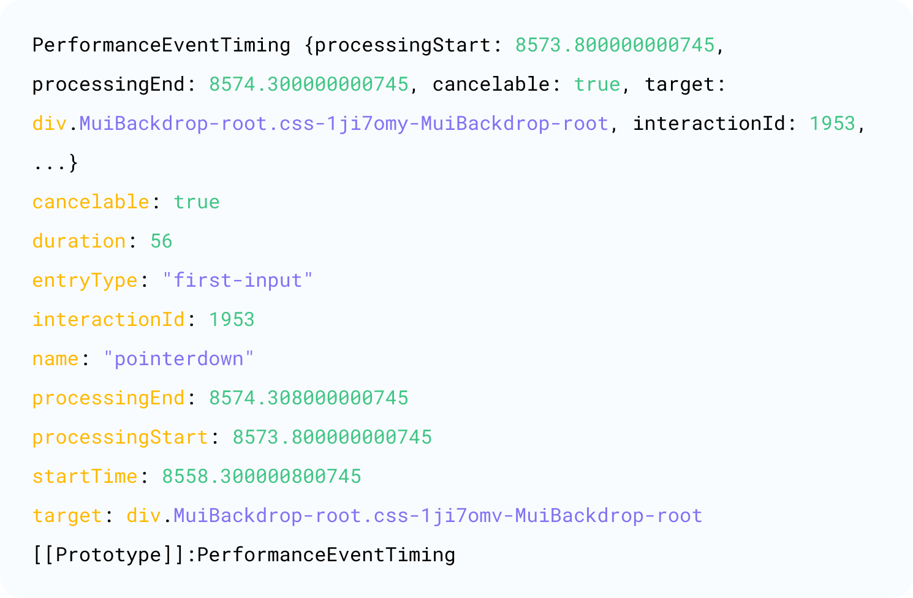
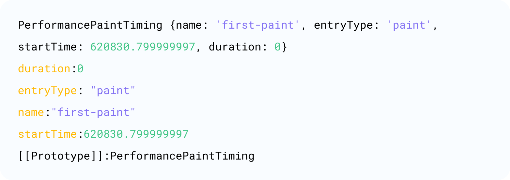

In the current digital landscape, a website's performance is critical factor in attracting and retaining users. With users expecting pages to load within a few seconds, sites and apps that deliver fast-loading, resolution-responsive pages tend to retain visitors for longer and experience improved conversion rates. Front end performance optimization plays a pivotal role in achieving these outcomes. This article delves into key frontend performance optimization strategies that can enhance website speed, interactivity, and user satisfaction.


According to Addy Osmani in his article, “The Cost of Javascript,” when a webpage loads in your browser, it isn’t a single-step process but a journey comprising several critical stages. Each stage needs to provide appropriate feedback to users so they understand that more content and functionality is loading onto the screen. By showing page load progress, users feel that the site is loading faster and will be worth the wait, improving their experience. Osmani identified three phases users will see when a page loads:

- Loading Feedback Phase - confirmation that the page is loading (Is it happening?)
- Content Rendering Phase - see useful content quickly (Is it useful?), and finally,
- Interactive Phase - access a fully interactive and functional page (Is it usable?).

Let’s explore the stages of the journey in more depth:

1. Loading Feedback Phase (Is it happening?):
   This phase provides users immediate feedback and confirmation that their request to load the webpage (after clicking a link or entering a URL) has been received by the system and the system is delivering that request to the browser. Visual indicators like a loading spinner, progress bar, or any form of initial feedback reassure users that system activity is happening. Metrics like First Contentful Paint (FCP) and First Paint (FP) indicate how quickly first content becomes visible to a user.
2. Content Rendering Phase (Is it useful?) :
   During this phase, the webpage renders useful content in the browser relatively quickly even if the page hasn’t fully loaded. Essential parts of the webpage, like main text, images, or primary navigation elements, appear. Users can start understanding page structure and potentially get some value from the displayed content, even if they can’t yet interact with all page elements.
3. Interactive Phase (Is it usable?):
   This final phase of the page load journey indicates to the user that the page is fully functional. All resources, including JavaScript and CSS, have been loaded, parsed, and executed, and users can interact with it smoothly without timing delays. Users can complete activities like clicking buttons and filling out forms. The Time to Interactive (TTI) metric is typical for this phase.

For this article, I introduce measurement tools to determine how quickly a browser’s page load journey happens, outline key metrics to indicate where trouble may be happening, and provide recommendations to improve frontend performance.

## Measurement Tools

As a developer, you have the power to ensure your site meets key metrics by using a few common front end development measurement tools that are used to ensure that we are meeting key metrics.

- Chrome Developer Tools: [Lighthouse](https://developer.chrome.com/docs/lighthouse/overview), [Performance](https://developer.chrome.com/docs/devtools/performance/reference)
- [WebPageTest](https://www.webpagetest.org/)
- [PerformanceObserver](https://developer.mozilla.org/en-US/docs/Web/API/PerformanceObserver)

I prefer to use PerformanceObserver because it integrates well with other APIs and tools that developers might use for performance analysis and optimization.
Here, we’ll list and explain the core Web Vitals and important performance metrics supported by PerformanceObserve.

## Web Vitals

Web Vitals are a collection of essential metrics that evaluate key aspects of real-world user experience on the web. They include specific measurements and target thresholds for each metric, assisting developers in understanding whether their site's user experience is classified as "good," "needs improvement," or "poor." By focusing on these vitals, you can directly impact and improve your users' experience.

### 1. LCP (Largest Contentful Paint) - Core Metric

   **When to use in loading journey**: Loading Feedback Phase, Content Rendering Phase

   During the Loading Feedback and Content Rendering Phases, developers use the LCP metric to determine the render time of the largest image or text block visible in the viewport relative to when the user first navigates to the page. LCP is a crucial, stable Core Web Vital metric for measuring perceived load speed as it signifies the point in the page load timeline when the page's main content has likely loaded. A fast LCP reassures the user that the page is useful. [This article](https://web.dev/articles/lcp#how_to_measure_lcp) provides a more detailed understanding of this metric.

   
   ::: center
   Metric and measurement ranges
   :::

   The Largest Contentful Paint (LCP) analysis considers all content it discovers including content removed from the DOM, like a loading spinner. Each time a new largest content space is found, it creates a new entry, so there may be multiple objects. However, LCP analysis stops searching for larger content. Therefore, LCP data takes the last-found content as the result.

   ```ts
   const observer = new PerformanceObserver((list) => {
     const entries = list.getEntries();
     const lastEntry = entries[entries.length - 1];
     console.log(lastEntry);
   });
   observer.observe({ type: "largest-contentful-paint", buffered: true });
   ```

   

   Following are explanations and descriptions of the metrics:
   | Element | Description |
   | ----------- | ------------------------------|
   | element | The current largest content rendering element. |
   | loadingTime | Loading time or time to download and display all content of a web page in a browser. |
   | renderTime | Rendering time, or how long it takes for a web page to load so the user can engage with the content and functionality. If it's a cross-origin request, it will be 0. |
   | size | The area of the element itself. |
   | startTime | If renderTime is not 0, it returns renderTime; otherwise, it returns loadingTime. |

   In this example, the LCP is represented by loadingTime, and its value is 1.6, which is considered good. It indicates that the largest content element (an image in this case) was successfully rendered within 1.6 seconds, meeting the criteria for a relatively good user experience.

### 2. FCP (First Contentful Paint) - Not a core metric

   **When to use in loading journey**: Loading Feedback Phase

   The FCP metric measures from when the user first navigates to the page to when any part of the page's content is rendered on the screen. FCP is a crucial, user-focused metric for assessing perceived load speed. It indicates the first moment in the page load journey when the user can see any content on the screen. A quick FCP reassures the user that progress is being made by loading the page. A more in-depth explanation is provided in this article. FP (First Paint) is a similar metric representing the time it takes for the first pixel to be painted on the screen.

   
   ::: center
   Metric and measurement ranges
   :::

   ```ts
   const observer = new PerformanceObserver((list) => {
     list.getEntries().forEach((entry) => {
       console.log(entry);
     });
   });
   observer.observe({ type: "paint", buffered: true });
   ```

   Following are explanations and descriptions of the metrics:

   

   | Element   | Description                                                                                |
   | --------- | ------------------------------------------------------------------------------------------ |
   | duration  | Represents the time from `startTime` to the next rendering paint, which is 0 in this case. |
   | startTime | Returns the timestamp when the painting occurred.                                          |

   In this example, FCP is represented by `startTime`, which is less than one second. According to the provided standards, this is considered good.

### 3. FID (First Input Delay) - Core Metric

   **When to use in loading journey**: Content Rendering Phase, Interactive Phase

   FID measures the initial impression of site interactivity and responsiveness. Or rather, the time it takes from the user's first interaction with the page to when the browser can begin processing the event to respond to that interaction. Technically, we measure the incremental time between receiving the input event and the next idle period of the main thread. You can only track FID on discrete event operations, such as clicks, touches, and key presses. In contrast, this metric does not include actions like zooming, scrolling, and continuous events (for example, mouse move, pointer move, touch move, wheel, and drag). Note that this metric is measured even in cases where event listeners are not registered. More detailed information is available in this [article](https://web.dev/articles/fid#what_counts_as_a_first_input).

   

   ::: center
   Metric and measurement ranges
   :::

   ```ts
   const observer = new PerformanceObserver((list) => {
     list.getEntries().forEach((entry) => {
       const FID = entry.processingStart - entry.startTime;
       console.log(entry);
     });
   });
   observer.observe({ type: "first-input", buffered: true });
   ```

   

   Following are explanations and descriptions of the metrics:

   | Element         | Description                                                                      |
   | --------------- | -------------------------------------------------------------------------------- |
   | duration        | Represents the time from startTime to the next rendering paint. paint.           |
   | processingStart | Measures the time between a user interaction and the start of the event handler. |
   | processingEnd   | Measures the time taken by the event handler to run.                             |
   | target          | Returns the DOM associated with the event.                                       |

   In the example code, FID equals `8574 (processingEnd) - 8558 (processingStart) = 16`. According to the provided standards, this is considered good.

### 4. INP (Interaction to Next Paint) - Not a Core Metric

   **When to use in loading journey**: Interactive Phase

   INP assesses a page’s overall responsiveness to user interactions by observing the delays in all clicks, touches, and keyboard interactions throughout the page's lifecycle. The final INP value is the longest observed interaction, disregarding outliers. INP replaced FID as a core Web Vitals metric on March 12, 2024.

   
   ::: center
   Metric and measurement ranges
   :::

   INP is influenced only by the following events:

   - Mouse clicks
   - Taps on devices with touch screens
   - Pressing a key on a physical keyboard or a on-screen keyboard
     Relationship with FID:
     INP may sound like FID, but there is a notable difference–INP considers all page interactions, whereas FID only considers the first interaction. INP comprehensively assesses responsiveness by sampling all interactions on a page, making INP a more reliable overall responsiveness metric compared to FID.

   Since the Performance API does not provide responsiveness information for INP, specific examples are not provided here. For information measuring this metric, please refer to [this article at Google's web.dev resource](https://web.dev/articles/inp#how_is_inp_different_from_first_input_delay_fid).

### 5. CLS (Cumulative Layout Shift) - Core Metric

   **When to use in loading journey**: Content Rendering Phase, Interactive Phase

   Usually, we measure the maximum CLS value that occurs throughout the entire lifecycle of a page. In this evaluation, only instances where elements change their initial positions or sizes are considered such as adding new elements to the DOM or altering the width and height of the original page element. For additional information, please refer to this [article](https://web.dev/articles/cls).

   
   ::: center
   Metric and measurement ranges
   :::

   

   Following are explanations and descriptions of the metrics:

   | Metric         | Description                                                                                                                                                                                                                                                 |
   | -------------- | ----------------------------------------------------------------------------------------------------------------------------------------------------------------------------------------------------------------------------------------------------------- |
   | value          | Returns the layout shift score calculated as: layout shift score = impact fraction \* distance fraction.                                                                                                                                                    |
   | hadRecentInput | Returns true if lastInputTime is less than 500 milliseconds ago.                                                                                                                                                                                            |
   | lastInputTime  | Returns the time of the most recent excluded user input, or 0 if there is none. Only unexpected shifts due to discrete events like clicking links, buttons, or showing loading indicators in response to user interaction are considered reasonable shifts. |

   In this example, CLS is represented by the value 0, which is considered good according to provided standards.

### 6. Long Task - Not a core metric

   **When to use in loading journey**: Loading Feedback Phase, Content Rendering Phase, Interactive Phase (or all phases)

   Tasks that block the main thread for over 50 milliseconds can lead to various adverse effects, including delayed responses to events and stuttering animations. When long tasks occupy the main thread, the browser cannot promptly respond to user input and handle other events, affecting the user experience.
   Possible causes for these challenges include:
   Long-running event handlers.
   Costly reflows and other re-rendering operations, such as DOM manipulations, animations, etc.
   Long-running loops exceeding 50 milliseconds.

   ```ts
   const observer = new PerformanceObserver((list) => {
     list.getEntries().forEach((entry) => {
       console.log(entry);
     });
   });

   observer.observe({ type: "longtask", buffered: true });
   ```

   

   Following are explanations and descriptions of the metrics:

   | Metric                | Description                                                                                                                                                                                                                                                                                                                                                                                                                                                                                                                 |
   | --------------------- | --------------------------------------------------------------------------------------------------------------------------------------------------------------------------------------------------------------------------------------------------------------------------------------------------------------------------------------------------------------------------------------------------------------------------------------------------------------------------------------------------------------------------- |
   | duration              | Represents the duration of the task, i.e., the time elapsed from start to finish.                                                                                                                                                                                                                                                                                                                                                                                                                                           |
   | TaskAttributionTiming | This is an object associated with Long Tasks, used to track and attribute the execution of long tasks. This object may contain detailed information about the long task, such as its source, triggering events, etc. Through this object, developers can gain a better understanding of the context and reasons for long tasks, facilitating performance optimization and debugging. Because long tasks significantly impact user experience, they are highlighted separately, even though they are not part of Web Vitals. |

### 7. FP (First Paint) - Not a core metric

   **When to use in loading journey**: Loading Feedback Phase

   
   ::: center
   Metric and measurement ranges
   :::

   FP is a web performance metric that measures the time it takes for the user to see any visual content (such as background color or text) in the browser for the first time. FP doesn’t particularly focus on the specifics of the page content but instead on the time elapsed from the moment the user initiates the page load (like clicking a link) to the appearance of the first visual element on the screen. FP is important because it reflects the user's initial perception of the page load speed.

   ```ts
   const observer = new PerformanceObserver((list) => {
     for (const entry of list.getEntriesByType("paint")) {
       if (entry.name === "first-paint") {
         console.log(entry);
       }
     }
   });

   observer.observe({ type: "paint", buffered: true });
   ```

   

   | Element   | Description                                                                              |
   | --------- | ---------------------------------------------------------------------------------------- |
   | duration  | Represents the time from startTime to the next rendering paint, which is 0 in this case. |
   | startTime | Returns the timestamp when the painting occurred.                                        |

   Now, let’s say your Web Vital numbers could improve and you want to improve them. The following sections provide strategies to do that.

## Optimization Measures

There are several optimization measures to improve website performance. Here, we outline the ten most used strategies for improving Web Vitals metrics.

### 1. Code Splitting And Lazy Loading

    Code splitting and lazy loading offer significant benefits in frontend development. The main goal of code splitting is to reduce the initial JavaScript file size required during the loading phase, which improves the initial page load speed, thus improving LCP and FCP. In more technical terms, code splitting breaks down the application code into multiple chunks, often based on routes or features, allowing for on-demand loading. It also alleviates the main thread workload, which reduces FID and INP latency, and minimizes Long Tasks.
    By implementing code splitting, we can improve load times, optimize caching support, and reduce bandwidth usage since only necessary code is loaded at first making the site more efficient. This practice also helps manage and debug smaller bundles (HTML, JavaScript, images, or CSS) easily.
    Lazy loading is a strategy that allows you to defer loading certain heavy resources like components, resources, or functionalities until later in the journey or when they are needed rather than loading them during the initial page load. By deferring the loading of non-critical resources, the initial load time is significantly decreased, enhancing LCP and FCP. This delay also optimizes memory usage and prioritizes content loading, while reducing the resource burden during the initial load, improving page speed. This approach ensures critical content is available, resulting in a seamless user experience. When working with React, we often combine implementing code splitting with lazy loading. See the example below illustrating how this is addressed.

    ```tsx
    const DownloadFile = lazy(() => import("./page/OperateFile/OperateFile"));
    const TimeSelect = lazy(() => import("./page/TimeSelect/TimeSelect"));

    export const router: Router[] = [
      {
        path: "/",
        element: <App />,
        name: "Home",
      },
      {
        path: "/download-file",
        element: <DownloadFile />,
        name: "Download File",
      },
      {
        path: "/time-select",
        element: <TimeSelect />,
        name: "Time Select",
      },
    ];
    ```

### 2. Http Cache
    HTTP caching has several benefits.

    - It significantly reduces website load times allowing browsers access and load cached files, effectively improving LCP and FCP by enabling faster resource retrieval.
    - By minimizing server requests, caching decreases server load and enhances overall performance.
    - Cached content remains available even when the server is down, further increasing reliability.
    - Caching reduces bandwidth usage and operational costs, benefiting FID and INP indirectly.

    And, as we know, faster page load times contribute to better SEO rankings.
    [Read this article at MDN Web Docs](https://developer.mozilla.org/en-US/docs/Web/HTTP/Headers/Cache-Control#cache_directives) to get a more detailed understanding

    - For HTML files with a high update frequency, the directive settings commonly used are:

      ```ts
      Cache-Control: no-cache
      ```

      This code snippet indicates that caching occurs for the page. However, it also indicates to the system that the browser should check the server to ensure it displays the latest data. If the client or browser already is displaying and using the latest data, the server typically responds with 304 (Not Modified) response; otherwise, new data will be provided from the server. This approach ensures that each retrieval obtains the latest response. Since most HTTP/1.0 does not support no-cache, we can adopt a backup solution for backward support and compatibility.

      ```ts
      Cache-Control: max-age=0, must-revalidate
      ```

      Typically with this code snippet, we also include the following information:
      a. If the resource belongs to user-specific content, it can be specified as private; otherwise, it is public. One way to determine if a resource is personal data is to check if the Authorization field is in the request header. If it is, that indicates that this displays personal data, and there is usually no need to explicitly specify it as private.

      Additionally, if the cache control header includes “must-revalidate,” it indicates that this is personal data. This means that before each resource retrieval, it needs to be validated for freshness, using the new data if it is new or the cached old data if it is not. This approach helps ensure the real-time and consistent handling of personal data.

    - For frontend static resources, such as bundled scripts and stylesheets, it is common to append a hash or version number to the file name. This practice aids in more effective cache management. For such static files, we typically set the following cache directives:

      ```ts
      Cache-Control: public, immutable, max-age=31536000
      Last-Modified: Wed, 21 Oct 2023 07:28:00 GMT
      ETag: "33a64df551425fcc55e4d42a148795d9f25f89d4"
      ```

      - Max-age: This directive can be added to both request and response to indicate the expiration time of the cached resource in seconds. For example, in the given example, `max-age=31536000` means the resource will expire in the client cache after 365 days.
      - Immutable: Exists in the response and indicates that the resource will not be updated before a new version is available. In this example, if the hash or version of the static file changes, the resource is considered new, triggering a re-fetch and storage. This pattern is known as [cache-busting](https://www.keycdn.com/support/what-is-cache-busting).
      - ETag: Used to identify whether a resource is a specified version, while Last-Modified is a fallback for ETag, representing the last modification time on the server. ETag and Last-Modified allow the client to send a condition request to the server. If the resource has not changed, the server returns a 304 response, indicating that the cached version is still current. Otherwise, it sends a new request to fetch the resource from the server.

      ETag, Last-Modified, and Immutable can prevent resource revalidation, especially when reloading a page. These mechanisms help optimize cache management, ensuring the consistency and validity of resources.

    - Similar settings are typically used for resources such as favicon.ico, images, API endpoints, etc. Conditional requests are initiated using Last-Modified and ETag to check if the resource is up to date.

      ```ts
      Cache-Control: no-cache
      Last-Modified: Tue, 22 Feb 2022 20:20:20 GMT
      ETag: AAPuIbAOdvAGEETbgAA2ABwqAsAAE
      ```

    In some scenarios, Cache-Control may appear in both the request and response, and in case of conflicts, the settings on the response usually take precedence.

### 3. Content Delivery Network (CDN)
    CDN is a distributed server network that caches resources from the origin server and delivers these resources through servers located closer to the user's geographical location. CDN can efficiently deliver content by reducing round-trip time (RTT) and implementing optimization strategies for HTTP/2 or HTTP/3, caching, and compression, enhancing user access experience and reducing LCP and FCP values. The CDN's ability to deliver optimized and cached content also helps to minimize layout shifts, thus positively impacting CLS. Additional insights explained in this [web.dev article](https://web.dev/articles/content-delivery-networks).

### 4. Code Minimization
    Code minimization involves reducing the size of your codebase by removing unnecessary characters. Consequently, LCP and FCP benefit from quicker resource loading, and reduced file sizes lead to less strain on the main thread, indirectly improving FID and INP. Additionally, minimizing code can decrease the overall load time and reduce the chances of layout shifts, positively influencing CLS.

    - To minimize and compress JavaScript code, we currently utilize the Terser tool. This tool includes removing unused code (Tree Shaking), shortening variable names, and eliminating spaces and uglifiers. This optimization technique has been applied in both Rollup.js and Webpack to reduce code volume and decrease download time.
    - Regarding CSS, in Webpack, the mini-css-extract-plugin plugin is commonly employed for optimization. This plugin independently extracts a single CSS file from each JavaScript file that contains CSS, enabling styles to be loaded separately. Furthermore, the plugin supports on-demand loading and Source Maps, providing a more flexible and efficient way for style management.
    - For image resources, using the WebP format instead of JPEG and PNG can significantly reduce file sizes, typically achieving a reduction of 25%-35%.\*\* Optimizing image loading with Content Delivery Networks (CDN) has a notable effect, often reducing image file sizes by 40%-80%. To account for compatibility, the following approaches can be employed:

      ```html
      <picture>
        <source type="image/webp" srcset="flower.webp" />
        <source type="image/jpeg" srcset="flower.jpg" />
        
      </picture>
      ```

### 5. Bundling Optimization

    In the era of HTTP/2.0 and HTTP/3.0, there is a shift away from more traditional performance optimization techniques used for HTTP/1.0. This opens new opportunities for developers to focus on other aspects of performance optimization and better adapt to the new protocol features. However, bundling optimization may still be relevant in specific scenarios where backward compatibility with HTTP/1.x is required or for the optimized handling of certain resource types that benefit from minimized round-trip times.

    As we know, each time the frontend requests a resource, a TCP connection is established, and after completing the request, the TCP connection is closed, as shown in the diagram below:

    

    The HTTP protocol has undergone several version updates, primarily HTTP/1.0, HTTP/1.1, and HTTP/2.0. The following are some key differences in the request aspect across different versions of HTTP, presented in chart form:

    

    For web developers, adopting HTTP/3 has yet to bringabout significant changes, as HTTP/3 still adheres to the core principles of the HTTP protocol. With the support of the QUIC (Quick UDP Internet Connections) protocol, HTTP/3 provides lower latency during connection establishment, improves multiplexing efficiency, and introduces a more flexible flow control mechanism. Due to these advantages, HTTP/3 shows performance improvements. However, as the implementation of HTTP/3 mainly occurs at the protocol level, web developers typically do not need extensive application changes, so HTTP/3 is not often included in comparisons.

    HTTP/2.0 introduced the Server Push feature, a significant advancement that greatly improves l frontend performance. This feature allows servers to proactively push resources to the frontend. For instance, when the client requests an HTML file, the server can push CSS and JavaScript resources directly to the client, saving the time it takes for the client to initiate requests. This proactive approach to resource delivery can significantly enhance frontend performance.

    However, it's important to note that the Chrome browser currently does not support HTTP/2 Server Push. Detailed support information can be found at this link. However, developers can still leverage other performance optimization techniques, such as resource concatenation, caching strategies, etc., to enhance frontend loading performance.
    ::: center
    
    :::
    The above description outlines the evolution of the HTTP protocol, all aimed at reducing loading times and improving request efficiency. Traditional performance optimization techniques emerged, such as resource inlining and image spiriting. These techniques bundle multiple small files into a single large file and transmit them over a single connection, helping reduce the overhead of transmission headers. This can significantly reduce the initial load time, improving LCP and FCP. Efficient bundling can also minimize the overhead of repeated downloads and parsing, benefiting FID and INP. During the era of HTTP/1.0 and HTTP/1.1, such techniques were considered effective performance optimization practices.

    With the introduction of HTTP/2.0, the need for traditional performance optimization techniques, such as bundling, has significantly reduced. HTTP/2.0’s ability to allow the simultaneous request of multiple resources on the same connection without establishing a separate TCP connection for each resource has made bundling optimization and other "hack" techniques less necessary because multiplexing on a single connection significantly improves the efficiency of parallel resource transmission. While HTTP/2 reduces the need forbundling, the strategy should be evaluated on a case-by-case basis, considering specific performance characteristics and requirements.

### 6. Critical Path Optimization

    Four approaches to optimizing the frontend based on page load order exist.

    1. Render-Blocking Resources
        As you may know, loading CSS and JavaScript on a page can block the rendering of other page elements until all the CSS and JavaScript elements are loaded (see the diagram below). That makes it crucial to identify and optimize the loading order of key resources based on their business importance to enhance load times.
        Currently, a non-standard attribute, blocking=render, allows developers to explicitly designate a `link`,`script`, or `style` element as rendering-blocking, which will block rendering until that specific element is processed. However, the key distinction is that using this attribute permits the parser to process the rest of the page. This feature gives developers more control over the rendering behavior of critical resources, allowing for a fine-tuned approach to optimizing the loading sequence.
        We can significantly enhance key performance metrics like LCP, FCP, FID, INP, and CLS by optimizing or deferring render-blocking resources, such as CSS and synchronous JavaScript. This leads to faster page rendering, improved load times, and a better overall user experience.

        

    2. Browser Resource Hint

        These commands help developers optimize page loading times by informing the browser how to load and prioritize resources. These approaches can significantly improve key performance metrics like LCP, FCP, FID, and INP by proactively fetching and loading critical resources. The specific operations are as follows:

        - prefetch: Used for the browser to fetch and cache resources that might be used in future subpage loads, thereby reducing loading times. This mechanism has a lower priority and is suitable for resource fetching during main thread idle periods.
        - dns-prefetch: Optimizes the time to resolve a domain to an IP address (DNS Lookup), especially useful when loading resources from third-party domains.
        - preconnect: Encompasses steps like DNS query, TLS negotiation, and TCP handshake, thoroughly preparing the connection to a remote server.

          It is recommended to use DNS Prefetch and preconnect together, but careful configuration is advised to avoid overuse and potential resource wastage.

          ```html
          <link rel="preconnect" href="https://third-party-domain.com" />
          <link rel="dns-prefetch" href="https://third-party-domain.com" />
          ```

          The test results are shown in the following diagram:
          

        - prerender: The prerender feature is like prefetch, but this command pre-renders the entire page instead of specific, individual resources.
        - preload: preload informs the browser that upon page load, the system should download resources as soon as possible. This is typically used for critical resources that need to be downloaded in advance, such as crucial CSS or images affecting Largest Contentful Paint (LCP).

    3. Defer Vs Async

        Async and defer allow external scripts to load page elements without blocking the HTML parser while scripts (including inline scripts) with type "module" are deferred automatically.
        

    4. Fetch Priority API
        As a developer, you can indicate the priority of a resource using the `fetchpriority` attribute of the Fetch Priority API. This attribute can be employed within `<link>`, ``, and `<script>` elements.
        - high: Fetches the image with higher priority compared to other images.
        - low: Fetches the image with lower priority compared to other images.
        - auto: Default mode, indicating no preference for fetch priority. The browser decides the most advantageous approach for the user.

### 7. Img

    The img embeds an image into a webpage in HTML. This tag is self-closing, meaning it does not require an end tag.
    Here are some key attributes and usages of the  tag to improve performance:

    - `Loading`: The loading attribute informs the browser how to load images.
      - `eager`: Loads the image immediately, regardless of its visibility.
      - `lazy`: Delays the image loading until it appears in the viewport, saving bandwidth. It is recommended that width and height attributes be included in the images.
    - The `fetchpriority` attribute can specify the priority of loading images.

      Using these attributes based on the business value of images (one example is loading ads first for encouraged engagement and revenue), you can optimize Web Core Vitals metrics and enhance overall performance. Preloading critical image resources can also be achieved using the link tag.

      ```html
      <link
        rel="preload"
        fetchpriority="high"
        as="image"
        href="image.webp"
        type="image/webp"
      />
      ```

    - Size:

      - Images should not be resized using code, or the source file should not be larger or smaller than what is rendered on the user's screen.
      - Use responsive images by specifying multiple versions; the browser will choose the most suitable version.

      ```html
      
      ```

      `480w` informs the browser that the image width is equivalent to 480 pixels when downloading the image unnecessary.
      `sizes` specifies the expected display size of the image.

    - Width And Height:

      - Both the `width` and `height` attributes should be specified appropriately to ensure that the browser allocates the correct space in the layout. This helps avoid layout shifts, improving Cumulative Layout Shift (CLS) user experience.
      - If the specific width and height cannot be determined, consider setting an aspect ratio as a solution.

      ```css
      img {
        aspect-ratio: 16 / 9;
        width: 100%;
        object-fit: cover;
      }
      ```

    - Image Format

      For image resources, choosing the appropriate image format based on specific business requirements to optimize performance. Here are simplified and optimized recommendations:

      - Raster Images: Represented as pixel grids, including GIF, PNG, JPEG, and WebP.
      - Vector Images: Primarily used for logos and icons, defined by curves, lines, and shapes, resolution-independent, providing clear results.

      | Image Type | Suit case                                                                                                           |
      | ---------- | ------------------------------------------------------------------------------------------------------------------- |
      | JPEG       | Suitable for photographic images, reducing file size through lossy and lossless optimization.                       |
      | SVG        | Used for icons and logos, containing geometric shapes, maintaining clarity regardless of scaling.                   |
      | PNG        | Suitable for high-resolution images, lossless compression, while WebP generally has smaller file sizes.             |
      | Video      | For animations, it is recommended to use video instead of GIF due to GIF's color limitations and larger file sizes. |

    - Decoding

      This image property tells the browser how to decode the image the system provides. It specifies whether the system should wait for the image to be fully decoded before rendering other content updates or simultaneously rendering, allowing other content to render during the decoding process.

      - **`sync`**: Synchronously decodes the image to render it along with other.
      - **`async`**: Asynchronously decodes the image, allowing rendering of other content before its completion.
      - **`auto`**: No preference for decoding mode; the browser decides the most favorable way for the user. This is the default value, but different browsers have different default values:

        - Chromium defaults to "sync".
        - Firefox defaults to "async".
        - Safari defaults to "sync".

      The effect of the **`decoding`** property may only be significant on very large, high-resolution images, as these images have longer decoding times.

    Like preload and preconnect for images, decode can substantially enhance key performance metrics such as LCP, FCP, FID, and INP. By fetching and loading critical images earlier, these strategies result in faster content rendering, reduced latency, and improved user interactivity, leading to a better overall user experience.

### 8. Video Preload

    The `preload` attribute is designed to provide the browser “hints” about what content the author believes should be preloaded before video playback to ensure the best user experience. Video preload strategies can significantly improve performance metrics such as LCP, FCP, FID, and INP.

    This attribute can have the following values:

    - `none`: Indicates that the video should not be preloaded.
    - `metadata`: Signifies fetching only video metadata (such as length).
    - `auto`: Indicates that the entire video file can be downloaded, even if the user is not expected to use it.
    - An empty string: Synonymous with the value `auto`.

    The default value can vary for each browser. The specification recommends setting it to `metadata`. If you want to defer the loading of the video, it can be written as follows:

    ```html
    <video controls preload="none" poster="placeholder.jpg">
      <source src="video.mp4" type="video/mp4" />
      <p>
        Your browser doesn't support HTML video. Here is a
        <a href="myVideo.mp4" download="myVideo.mp4">link to the video</a>
        instead.
      </p>
    </video>
    ```

    **For video acting as an animated GIF replacement**

    Video files are typically smaller than GIF images at the same visual quality. The following example demonstrates lazy loading applied to a video with autoplay. It utilizes IntersectionObserver to monitor whether the video enters the visible range and loads and plays it when necessary. This approach can enhance the initial loading time.

    ```html
    <!--The playsinline attribute is compatible with autoplay on iOS for automatically playing videos.-->
    <!--The poster attribute serves as a placeholder for a video.-->
    <video
      class="lazy"
      autoplay
      muted
      loop
      playsinline
      width="610"
      height="254"
      poster="one-does-not-simply.jpg"
    >
      <source data-src="one-does-not-simply.webm" type="video/webm" />
      <source data-src="one-does-not-simply.mp4" type="video/mp4" />
    </video>

    <script>
      document.addEventListener("DOMContentLoaded", function () {
        var lazyVideos = [].slice.call(document.querySelectorAll("video.lazy"));

        if ("IntersectionObserver" in window) {
          var lazyVideoObserver = new IntersectionObserver(function (
            entries,
            observer
          ) {
            entries.forEach(function (video) {
              if (video.isIntersecting) {
                for (var source in video.target.children) {
                  var videoSource = video.target.children[source];
                  if (
                    typeof videoSource.tagName === "string" &&
                    videoSource.tagName === "SOURCE"
                  ) {
                    videoSource.src = videoSource.dataset.src;
                  }
                }

                video.target.load();
                video.target.classList.remove("lazy");
                lazyVideoObserver.unobserve(video.target);
              }
            });
          });

          lazyVideos.forEach(function (lazyVideo) {
            lazyVideoObserver.observe(lazyVideo);
          });
        }
      });
    </script>
    ```

    If the video serves as the Largest Contentful Paint (LCP) element, it's beneficial to pre-fetch a placeholder image for the poster. This helps enhance LCP performance.

    ```html
    <link rel="preload" as="image" href="poster.jpg" fetchpriority="high" />
    ```

### 9. Pre-render

    Pre-rendering techniques such as Server-Side Rendering (SSR) and Static Site Generation (SSG) can significantly boost key performance metrics like LCP, FCP, FID, and INP. By generating HTML content on the server or at build time, these optimizations deliver fast initial page loads, improve content rendering, and enhance user interactivity, resulting in a superior user experience.

    1. SSR (Server-Side Rendering)

       Server-Side Rendering involves executing client application logic on the server and generating a response that contains the complete HTML markup in response to requests for HTML documents. By requesting relevant resource files on the server, SSR improves the initial page loading speed and enhances Search Engine Optimization (SEO) results. Although SSR requires additional server processing time and needs to regenerate for each page request, this trade-off is often worthwhile.

       Remember that network and device performance are out of your control as a developer, but server processing time can be managed and improved. In practice, the advantages of SSR often outweigh its drawbacks, especially when considering improvements to user experience and search engine rankings.

    2. SSG (Static-Site Generation)

       Static-Site Generation is the process of compiling and rendering a website program during build time. It generates static files, including HTML files, JavaScript, and CSS assets. These static files are reused on each request without regeneration. By caching statically generated pages on a CDN, performance without additional configuration.

       SSG is particularly suitable when the rendered page content is the same for all users, relatively fixed, or updated infrequently. Some examples include blogs and documentation sites. Pre-rendering during the build process generates static files, allowing them to be cached for quick access and, reducing the burden on the server during runtime while providing better performance.

### 10. Optimizing Javascript Execution

    **For UI changes, use `requestAnimationFrame`**

    `requestAnimationFrame` is called by the browser before the next repaint, and compared to `setInterval` or `setTimeout`, it can optimize more intelligently within the browser's frame rendering. Using `setInterval` or `setTimeout` may lead to the callback running at some point within a frame, potentially at the end of the frame, often resulting in missing a frame and causing interface stutter. `requestAnimationFrame `ensures that the callback is executed when the browser is ready for the next repaint, making the animation smoother.

    **Avoid long tasks, optimize code**

    Avoid long tasks and optimize code.
    Long tasks take more than 50 milliseconds to execute and can be released on the Main Thread by:

    - **Web Workers:** Web Workers run in the background as independent threads with their own stack, heap memory, and message queue. Communication with the main thread can only be done through the `postMessage` method, and direct manipulation of the DOM is not possible. That makes Web Workers well-suited for tasks that do not require direct interaction with the DOM.
      For example, a Web Worker can perform operations such as sorting or searching on large datasets, avoiding blocking the main thread with computationally intensive tasks and ensuring the responsiveness of the main thread.
      By executing these time-consuming tasks in a Web Worker, the performance and responsiveness of the main thread be improved, and it also takes better advantage of the performance benefits of multi-core processors. Separating computational tasks from user interface operations helps improve the overall user experience and ensures smooth page operation.

    - **Service Worker:** A Service Worker is a script that runs in the background and intercepts or handles network requests. By making reasonable use of Service Workers, reducing dependence on the main thread and improving application performance, resources can be cached.

    - **Long Task**: To ensure that long-running tasks do not block the main thread, we can break these long tasks into small, asynchronously executed sub-tasks. Such strategies include:

      1. Using `requestIdleCallback` as an optimization schedules the execution of low-priority or background tasks when the main thread is idle, improving page responsiveness. This method helps ensure that task execution does not interfere with user interaction and page rendering, but occurs when the main thread is idle.

      2. Manually deferring code execution can cause tasks to be placed at the end of the queue without being able to specify priority directly. The code might look like:

         ```ts
         function yieldToMain() {
           //Wrapping with Promise is for presenting it in a synchronous manner."
           return new Promise((resolve) => {
             setTimeout(resolve, 0);
           });
         }

         //isInputPending is true when user attempts to interact with the page
         // performance.now() >= deadline is isInputPending fallback
         if (
           navigator.scheduling?.isInputPending() ||
           performance.now() >= deadline
         ) {
           await yieldToMain();
           deadline = performance.now() + 50;
           continue;
         } else {
           otherTask();
         }
         ```

      3. Scheduler.postTask is a mechanism that allows a developer to schedule tasks more granularly and determine task priorities in the browser, ensuring that low-priority tasks can release the main thread. Although most browsers do not fully support it, detailed information can be found [in this MDN resource](https://developer.mozilla.org/en-US/docs/Web/API/Scheduler/postTask).

      4. Scheduler.yield is typically used to release the main thread. ([Learn more in this Chrome article](https://developer.chrome.com/blog/introducing-scheduler-yield-origin-trial)).

         This means that the main thread remains busy during the execution of microtasks and does not release itself to perform other tasks. A detailed visualization can be seen [here](https://www.jsv9000.app/). This mechanism is crucial when dealing with asynchronous tasks because it ensures that the logic in microtasks is executed immediately after the current task is finished. This is particularly useful for handling the results of Promises or other asynchronous operations, but it's important to note that it does not release the main thread.

         

      5. Batch processing: React's virtual DOM mechanism employs batch processing as an optimization strategy. It applies all changes to the virtual DOM and then submits them to the browser for redrawing the first time, significantly reducing actual DOM manipulations. This approach effectively releases the main thread, enhancing performance. Batch processing is beneficial when there are many DOM operations or frequent changes. Consolidating multiple operations into a single batch reduces the number of browser redraws, optimizing performance. This mechanism helps improve page responsiveness in React, avoiding unnecessary, redundant computations and rendering.

    Implementing strategies such as using requestAnimationFrame and avoiding long tasks can significantly enhance key performance metrics like LCP, FCP, FID, and INP. By ensuring smoother animations, reducing central thread blocking, and improving interaction responsiveness, these optimizations lead to a faster, more interactive, and user-friendly web experience.

## Conclusion

Frontend performance optimization is an ongoing process that requires continuous attention and improvement. Considering the comprehensive strategies mentioned above, you can improve your website's speed, interactivity, and user satisfaction.
By continuously monitoring frontend performance using tools, evaluating metrics, and taking appropriate improvement measures, you will ensure that your website consistently delivers an outstanding user experience. In today's competitive internet landscape, frontend performance optimization is indispensable for success.

## References

- [JavaScript Start-up Performance](https://medium.com/reloading/javascript-start-up-performance-69200f43b201)
- [The cost of javascript 2017](https://medium.com/dev-channel/the-cost-of-javascript-84009f51e99e)
- [The cost of javascript 2019](https://medium.com/@addyosmani/the-cost-of-javascript-in-2018-7d8950fbb5d4)
- [Web Dev](https://web.dev/)
- [MDN](https://developer.mozilla.org/en-US/)
- [Understanding Event Loop, Call Stack, Event & Job Queue in Javascript](https://medium.com/@Rahulx1/understanding-event-loop-call-stack-event-job-queue-in-javascript-63dcd2c71ecd)
