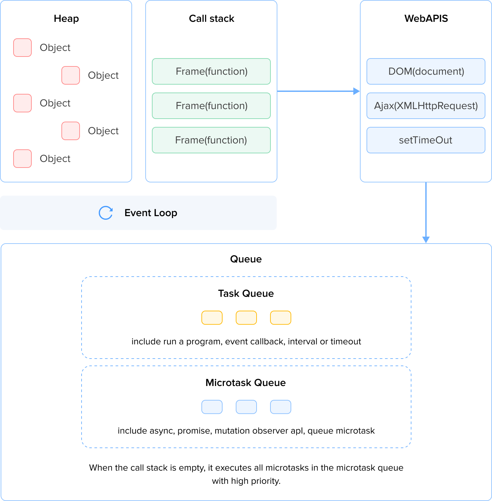

In today's digital era, the performance of a website is crucial for attracting and retaining users. Users are reluctant to wait for slow loading times, and fast-responsive pages will help retain visitors and improve conversion rates. Frontend performance optimization is a key factor in achieving this goal. In this article, we will explore some important frontend performance optimization strategies to enhance website speed, interactivity, and user satisfaction.

## Measurement Standards


### Measurement Tools

- Chrome Developer Tools: [Lighthouse](https://developer.chrome.com/docs/lighthouse/overview), [Performance](https://developer.chrome.com/docs/devtools/performance/reference)
- [WebPageTest](https://www.webpagetest.org/)
- [PerformanceObserver](https://developer.mozilla.org/en-US/docs/Web/API/PerformanceObserver)

Now, taking **Performance Observer** as an example, let's delve into the specific implementation of several important performance metrics.

### Web Vitals

#### LCP

LCP reports the render time of the largest image or text block visible in the viewport, relative to when the user first navigated to the page. You can assess its standards by examining screenshots. For a more in-depth understanding, please click [here](https://web.dev/articles/lcp#how_to_measure_lcp).

The analysis of Largest Contentful Paint (LCP) takes into account all content it discovers, even including content that has been removed from the DOM. Each time a new largest content is found, it creates a new entry, so there may be multiple objects. However, when scrolling or input events occur, LCP analysis stops searching for larger content. Therefore, in general, LCP data takes the last-found content as the result.

```ts
const observer = new PerformanceObserver((list) => {
  const entries = list.getEntries();
  const lastEntry = entries[entries.length - 1];
  console.log(lastEntry);
});
observer.observe({ type: "largest-contentful-paint", buffered: true });
```


Here is an explanation and description of the given metrics:

- **`element`**: The current largest content rendering element.
- **`loadingTime`**: Loading time.
- **`renderTime`**: Rendering time. If it's a cross-origin request, it will be 0.
- **`size`**: The area of the element itself.
- **`startTime`**: If **`renderTime`** is not 0, it returns **`renderTime`**; otherwise, it returns **`loadingTime`**.

In this example, the LCP is represented by **`loadingTime`**, which is 1.6. According to the mentioned metrics, this is considered good. It indicates that the largest content element (an image in this case) in the viewport successfully rendered within 1.6 seconds, meeting the criteria for a relatively good user experience.

#### FCP

The FCP metric measures the time from when the user first navigated to the page to when any part of the page's content is rendered on the screen. You can understand the standards by examining screenshots. For a more in-depth understanding, you can click . Another similar metric is FP (First Paint), representing the time it takes for the first pixel to be painted on the screen.


```ts
const observer = new PerformanceObserver((list) => {
  list.getEntries().forEach((entry) => {
    console.log(entry);
  });
});
observer.observe({ type: "paint", buffered: true });
```


In the given metric:

- **`duration`**: Duration, which is 0 in this case.
- **`startTime`**: Returns the timestamp when the painting occurred.

In this example, FCP is represented by **`startTime`**, which is less than 1 second. According to the provided standards, this is considered good.

#### FID

FID refers to the time it takes from the user's first interaction with the page to the moment when the browser can actually begin processing the event to respond to that interaction. FID measures the increment between receiving the input event and the next idle period of the main thread. FID is measured even in cases where event listeners are not registered. Additionally, FID focuses only on discrete event operations, such as clicks, touches, and key presses. In contrast, actions like zooming, scrolling, and continuous events (such as mousemove, pointermove, touchmove, wheel, and drag) are not included in this metric. For more detailed information, you can click [here](https://web.dev/articles/fid#what_counts_as_a_first_input).


```ts
const observer = new PerformanceObserver((list) => {
  list.getEntries().forEach((entry) => {
    const FID = entry.processingStart - entry.startTime;
    console.log(entry);
  });
});
observer.observe({ type: "first-input", buffered: true });
```


In the given metrics:

- **`duration`**: Represents the time from **`startTime`** to the next rendering paint.
- **`processingStart`**: Measures the time between user interaction and the start of the event handler.
- **`processingEnd`**: Measures the time taken by the event handler to run.
- **`target`**: Returns the DOM associated with the event.

In the example code, FID is equal to **`8574 (processingEnd) - 8558 (processingStart) = 16`**. According to the provided standards, this is considered good.

#### INP

The INP metric assesses the overall responsiveness of a page to user interactions by observing the delays in all clicks, touches, and keyboard interactions occurring throughout the page's lifecycle. The final INP value is the longest observed interaction, disregarding outliers. INP is set to replace FID as a core Web Vitals metric starting from March 12, 2024.

NIP (Navigation and Input Timing) is influenced only by the following events:

- Mouse clicks
- Taps on devices with touch screens
- Pressing a key on a physical keyboard or a on-screen keyboard

Relationship with FID:

INP considers all page interactions, whereas FID only considers the first interaction. INP goes beyond focusing on the initial interaction, instead, it comprehensively assesses responsiveness by sampling all interactions, making INP a more reliable overall responsiveness metric compared to FID.

Since the Performance API does not provide responsiveness information for INP, specific examples are not provided here. For information on how to measure this metric, please refer to [link](https://web.dev/articles/inp#how_is_inp_different_from_first_input_delay_fid).

#### CLS

Measure the maximum Cumulative Layout Shift (CLS) that occurs throughout the entire lifecycle of a page. In this evaluation, only cases where elements change their initial position are considered, and changes such as adding new elements to the DOM or altering the width and height of elements are not taken into account. For more details, you can click [here](https://web.dev/articles/cls).


There are several metrics within this context:

- **`value`**: Returns the layout shift score calculated as: **`layout shift score = impact fraction * distance fraction`**.
- **`hadRecentInput`**: Returns **`true`** if **`lastInputTime`** is less than 500 milliseconds ago.
- **`lastInputTime`**: Returns the time of the most recent excluded user input, or 0 if there is none. Only unexpected shifts due to discrete events like clicking links, buttons, or showing loading indicators in response to user interaction are considered reasonable shifts.

In this example, CLS is represented by the value, which is 0. According to the provided standards, this is considered good.

#### Long Task

- Tasks that block the main thread for more than **50** milliseconds can lead to various adverse effects, including delayed response to events and stuttering animations. When the main thread is occupied by long tasks, the browser cannot promptly respond to user input and handle other events, thereby affecting the user experience.

Possible main causes include:

- Long-running event handlers.
- Costly reflows and other re-rendering operations, such as DOM manipulations, animations, etc.
- Long-running loops exceeding 50 milliseconds.

```ts
const observer = new PerformanceObserver((list) => {
  list.getEntries().forEach((entry) => {
    console.log(entry);
  });
});

observer.observe({ type: "longtask", buffered: true });
```


There are several metrics within this context:

- **`duration`**: Represents the duration of the task, i.e., the time elapsed from start to finish.
- **`TaskAttributionTiming`**: This is an object associated with Long Tasks, used to track and attribute the execution of long tasks. This object may contain detailed information about the long task, such as its source, triggering events, etc. Through this object, developers can gain a better understanding of the context and reasons for long tasks, facilitating performance optimization and debugging.

Because long tasks significantly impact user experience, they are separately highlighted even though they are not part of Web Vitals.

## Optimization Measures

### Code splitting and lazy loading

Lazy loading and code splitting are both strategies used to optimize frontend performance, but they have different goals and applications.

1. **Code Splitting**:

   **Goal**: The main aim of code splitting is to reduce the initial JavaScript file size required during the loading phase, improving the initial page loading speed. It breaks down the application code into multiple chunks, often based on **routes** or **features**, allowing for **on-demand loading**.

2. **Lazy Loading**:

   **Goal**: Lazy loading is a strategy that allows you to **defer the loading** of certain components, resources, or functionalities, rather than loading them during the initial page load. This helps reduce the resource burden during the initial load, improving page speed.

In the context of React, these concepts are often applied by combining code splitting with lazy loading.

```ts
const DownloadFile = lazy(() => import("./page/OperateFile/OperateFile"));
const TimeSelect = lazy(() => import("./page/TimeSelect/TimeSelect"));

export const router: Router[] = [
  {
    path: "/",
    element: <App />,
    name: "Home",
  },
  {
    path: "/download-file",
    element: <DownloadFile />,
    name: "Download File",
  },
  {
    path: "/time-select",
    element: <TimeSelect />,
    name: "Time Select",
  },
];
```

### Http cache

Usually, we configure appropriate directives based on the update frequency of resources to retrieve them from the cache. This helps reduce request frequency and improve loading efficiency. This involves specific configurations for responses and requests. The specific configuration directives may vary depending on the circumstances. For detailed information, please click [here](https://developer.mozilla.org/en-US/docs/Web/HTTP/Headers/Cache-Control#cache_directives).

1. For HTML files with a high update frequency, the directive settings commonly used are:

```ts
Cache-Control: no-cache
```

Indicates caching, but before use, it will validate with the server to ensure it has the latest data. If the client already has the latest data, the server typically responds with 304 (Not Modified); otherwise, new data will be provided. This approach ensures that each retrieval obtains the latest response. As most HTTP 1.0 does not support no-cache, we can adopt a fallback solution.

```ts
Cache-Control: max-age=0, must-revalidate
```

Here's an additional detail: typically, we also include the following information. If the resource belongs to user-specific content, it can be specified as private; otherwise, it is public. One way to determine if a resource is personal data is to check if the Authorization field is present in the request header. If it is, it implies that this is personal data, and there is usually no need to explicitly specify it as private. Additionally, if the cache control header includes must-revalidate, it also indicates that this is personal data. This means that before each resource retrieval, it needs to be validated for freshness, using the new data if it is new or the cached old data if it is not. This approach helps ensure the real-time and consistent handling of personal data.

2.For frontend static resources, such as bundled scripts and stylesheets, it is common to append a hash or version number to the file name. This practice aids in more effective cache management. For such static files, we typically set the following cache directives:

```ts
Cache-Control: public, immutable, max-age=31536000
Last-Modified: Wed, 21 Oct 2023 07:28:00 GMT
ETag: "33a64df551425fcc55e4d42a148795d9f25f89d4"
```

- **Max-age**: This directive can be added in both request and response to indicate the expiration time of the cached resource in seconds. For example, in the given example, **`max-age=31536000`** means the resource will expire in the client cache after 365 days.
- **Immutable**: Exists in the response and indicates that the resource will not be updated before a new version is available. In this example, if the hash or version of the static file changes, the resource is considered new, triggering a re-fetch and storage. This pattern is known as [cache-busting](https://www.keycdn.com/support/what-is-cache-busting).
- **ETag**: Used to identify whether a resource is a specified version, while Last-Modified is a fallback for ETag, representing the last modification time on the server. ETag and Last-Modified allow the client to send a condition request to the server. If the resource has not changed, the server returns a 304 response, indicating that the cached version is still current. Otherwise, it sends a new request to fetch the resource from the server.

ETag, Last-Modified, and Immutable can prevent resource revalidation, especially when reloading a page. These mechanisms help optimize cache management, ensuring the consistency and validity of resources.

3.For other resources such as favicon.ico, images, API endpoints, etc., typically, similar settings are used. Conditional requests are initiated using Last-Modified and ETag to check if the resource is up-to-date.

```ts
Cache-Control: no-cache
Last-Modified: Tue, 22 Feb 2022 20:20:20 GMT
ETag: AAPuIbAOdvAGEETbgAA2ABwqAsAAE
```

In some scenarios, Cache-Control may appear in both the request and response, and in case of conflicts, the settings on the response usually take precedence.

### CDN

Content Delivery Network (CDN) is a distributed server network that caches resources from the origin server and delivers these resources through servers located closer to the user's geographical location. By reducing round-trip time (RTT) and implementing optimization strategies such as HTTP/2 or HTTP/3, caching, and compression, CDN can efficiently deliver content, enhancing user access experience. For more details, you can click [here](https://web.dev/articles/content-delivery-networks) to learn more.

### Code Minimization

- For minimizing and compressing JavaScript code, we currently utilize the **Terser** tool. This includes operations such as removing unused code (Tree Shaking), shortening variable names, and eliminating spaces and uglifiers. This optimization technique has been applied in both Rollup.js and Webpack to reduce code volume and decrease download time.
- Regarding CSS, in Webpack, the **`mini-css-extract-plugin`** plugin is commonly employed for optimization. This plugin independently extracts a single CSS file from each JavaScript file that contains CSS, enabling separate loading of styles. Furthermore, the plugin supports on-demand loading and Source Maps, providing a more flexible and efficient way for style management.
- For image resources, using the WebP format instead of JPEG and PNG can significantly reduce file sizes, typically achieving a reduction of 25%-35%. Additionally, optimizing image loading with Content Delivery Networks (CDN) has a notable effect, often resulting in savings of 40%-80% of image sizes. To account for compatibility, the following approaches can be employed

```ts
<picture>
 <source type="image/webp" srcset="flower.webp">
 <source type="image/jpeg" srcset="flower.jpg">
 
</picture>
```

### bundling optimization

Each time the frontend requests a resource, a TCP connection is established, and after completing the request, the TCP connection is closed, as shown in the diagram below:


The HTTP protocol has undergone several version updates, primarily including HTTP/1.0, HTTP/1.1, and HTTP/2.0. The following are some key differences in the request aspect across different versions of HTTP, presented in chart form:


For web developers, the adoption of HTTP/3 has not brought about significant changes, as HTTP/3 still adheres to the core principles of the HTTP protocol. With the support of the QUIC (Quick UDP Internet Connections) protocol, HTTP/3 provides lower latency during connection establishment, improves multiplexing efficiency, and introduces a more flexible flow control mechanism. Due to these advantages, HTTP/3 shows performance improvements. However, as the implementation of HTTP/3 mainly occurs at the protocol level, web developers typically do not need extensive application changes, so HTTP/3 is not often included in comparisons.

It is worth noting that HTTP/2.0 introduced the Server Push feature, which is highly beneficial for improving frontend performance. Server Push allows servers to proactively push resources to the frontend. For example, when the client requests an HTML file, the server can push CSS and JavaScript resources directly to the client, saving the time it takes for the client to initiate requests.

However, it's important to note that due to some limitations in the Server Push mechanism, the Chrome browser currently does not support HTTP/2 Server Push. Detailed support information can be found at this [link](https://developer.chrome.com/blog/removing-push). Despite this, developers can still leverage other performance optimization techniques, such as resource concatenation, caching strategies, etc., to enhance frontend loading performance.


The above description outlines the evolution of the HTTP protocol, all aimed at reducing loading times and improving request efficiency. In this process, traditional performance optimization techniques emerged, such as resource inlining and image spriting. These techniques bundle multiple small files into a single large file and transmit them over a single connection, helping reduce the overhead of transmission headers and thus improving performance. During the era of HTTP/1.0 and HTTP/1.1, such techniques were considered effective performance optimization practices.

However, with the introduction of HTTP/2.0, this situation changed. HTTP/2.0 allows the simultaneous request of multiple resources on the same connection without needing to establish a separate TCP connection for each resource. This feature makes bundling optimization and other "hack" techniques less necessary in the HTTP/2.0 era because multiplexing on a single connection significantly improves the efficiency of parallel resource transmission. Therefore, in the era of HTTP/2.0, there is less urgency to rely on these traditional performance optimization techniques, allowing developers to focus more on other aspects of performance optimization to better adapt to the new protocol features. In many projects, developers may have reduced or stopped using such techniques, directing their attention to more effective performance optimization methods.

### Render-blocking resources

The rendering path is illustrated in the diagram below, where it can be observed that CSS and JavaScript can block rendering. Hence, it is crucial to identify and optimize the loading order of key resources based on their business importance to enhance loading times. Currently, there is a non-standard attribute blocking=render which allows developers to explicitly designate a **`link`**,**`script`**, or**`style`** element as rendering-blocking, meaning it will block rendering until the specific element is processed. However, the key distinction is that it still permits the parser to continue processing the rest of the document in the meantime. This feature provides developers with more control over the rendering behavior of critical resources, allowing for a fine-tuned approach to optimizing the loading sequence for improved performance.


### Browser Resource Hint

Help developers optimize page loading times by informing the browser how to load and prioritize resources. The specific operations are as follows:

- **prefetch:** Used to suggest to the browser to fetch and cache resources that might be used in future subpage loads, thereby reducing loading times. This mechanism has a lower priority and is suitable for resource fetching during main thread idle periods.
- **dns-prefetch:** Optimizes the time taken to resolve a domain to an IP address (DNS Lookup), especially useful when loading resources from third-party domains.
- **preconnect:** Encompasses steps like DNS query, TLS negotiation, and TCP handshake, thoroughly preparing the connection to a remote server.

For compatibility, it is recommended to use DNS Prefetch and preconnect together, but careful configuration is advised to avoid overuse and potential resource wastage.

```ts
<link rel="preconnect" href="https://third-party-domain.com" />
<link rel="dns-prefetch" href="https://third-party-domain.com" />
```

The test results are shown in the following diagram:


- **prerender**: The prerender feature is similar to prefetch, but the difference lies in the fact that it pre-renders the entire page instead of specific resources.
- **preload**: preload hints to the browser to download resources as soon as possible, typically used for some **critical resources** that need to be downloaded in advance, such as crucial CSS or images affecting Largest Contentful Paint (LCP).

#### Defer vs async

async and defer allow external scripts to load without blocking the HTML parser while scripts (including inline scripts) with type="module" are deferred automatically.


#### Fetch Priority API

You can enhance the priority of a resource using the **`fetchpriority`** attribute of the Fetch Priority API. This attribute can be employed within **`<link>`**, **``**, and **`<script>`** elements.

- **`high`**: Fetches the image with higher priority compared to other images.
- **`low`**: Fetches the image with lower priority compared to other images.
- **`auto`**: Default mode, indicating no preference for fetch priority. The browser decides the most advantageous approach for the user.

### Img

- **loading Attribute:**
  - The **`loading`** attribute informs the browser how to load images.
    - **`eager`**: Loads the image immediately, regardless of its visibility.
    - **`lazy`**: Delays the loading of the image until it appears in the viewport, saving bandwidth. It is recommended to include width and height attributes for images.
- The **`fetchpriority`** attribute can specify the priority of loading images.

By using these attributes based on the business value of images, you can optimize Web Core Vitals metrics and enhance overall performance. Additionally, preloading critical image resources can also be achieved using the **`link`** tag.

```ts
<link rel="preload" fetchpriority="high" as="image" href="image.webp" type="image/webp">
```

**size:**

- Images should not provide versions larger than what is rendered on the user's screen.
- Use responsive images by specifying multiple versions, and the browser will choose the most suitable version.

```ts

```

**`480w`** indicates informing the browser, in situations where downloading the image is not necessary, that the width is equivalent to 480 pixels.

**`sizes`** specifies the expected display size of the image.

- **width 和 height：**
  - Both the **`width`** and **`height`** attributes should be specified appropriately to ensure that the browser allocates the correct space in the layout. This helps avoid layout shifts, improving the user experience in terms of Cumulative Layout Shift (CLS).
  - If the specific width and height cannot be determined, consider setting an aspect ratio as a solution.

```ts
img {
  aspect-ratio: 16 / 9;
  width: 100%;
  object-fit: cover;
}
```

- image formate
  For image resources, it is essential to choose the appropriate image format based on specific business requirements to optimize performance. Here are simplified and optimized recommendations:
  - **Raster Images:** Represented as pixel grids, including GIF, PNG, JPEG, and WebP.
  - **Vector Images:** Primarily used for logos and icons, defined by curves, lines, and shapes, resolution-independent, providing clear results.
    **Image Formats and Use Cases:**
  - JPEG: Suitable for photographic images, reducing file size through lossy and lossless optimization.
  - SVG: Used for icons and logos, containing geometric shapes, maintaining clarity regardless of scaling.
  - PNG: Suitable for high-resolution images, lossless compression, while WebP generally has smaller file sizes.
  - Video: For animations, it is recommended to use video instead of GIF due to GIF's color limitations and larger file sizes.
- **Decoding**
  This property provides a hint to the browser on how it should decode the image. Specifically, it specifies whether to wait for the image to be fully decoded before rendering other content updates or allow rendering other content simultaneously during the decoding process.
  - **`sync`**: Synchronously decode the image to render it along with other content.
  - **`async`**: Asynchronously decode the image, allowing rendering of other content before its completion.
  - **`auto`**: No preference for decoding mode; the browser decides the most favorable way for the user. This is the default value, but different browsers have different default values:
    - Chromium defaults to "sync".
    - Firefox defaults to "async".
    - Safari defaults to "sync".
      The effect of the **`decoding`** property may only be significant on very large, high-resolution images, as these images have longer decoding times.

### Video

**Preload**

The **`preload`** attribute is designed to provide the browser with hints about what content the author believes should be preloaded before video playback to ensure the best user experience. It can have the following values:

- **`none`**: Indicates that the video should not be preloaded.
- **`metadata`**: Signifies fetching only video metadata (such as length).
- **`auto`**: Indicates that the entire video file can be downloaded, even if the user is not expected to use it.
- An empty string: Synonymous with the value **`auto`**.

The default value varies for each browser. The specification recommends setting it to **`metadata`**. Specifically, if you want to defer the loading of the video, it can be written as follows:

```ts
<video controls preload="none" poster="placeholder.jpg">
  <source src="video.mp4" type="video/mp4">
	<p>
    Your browser doesn't support HTML video. Here is a
    <a href="myVideo.mp4" download="myVideo.mp4">link to the video</a> instead.
  </p>
</video>
```

**For video acting as an animated GIF replacement**

Video files are typically smaller than GIF images at the same visual quality. The following example demonstrates lazy loading a video with autoplay. It utilizes IntersectionObserver to monitor whether the video enters the visible range and loads and plays it when necessary. This approach can enhance the initial loading time.

```ts
//The playsinline attribute is compatible with autoplay on iOS for automatically playing videos.
//The poster attribute serves as a placeholder for a video.
<video class="lazy" autoplay muted loop playsinline width="610" height="254" poster="one-does-not-simply.jpg">
  <source data-src="one-does-not-simply.webm" type="video/webm">
  <source data-src="one-does-not-simply.mp4" type="video/mp4">
</video>
document.addEventListener("DOMContentLoaded", function() {
  var lazyVideos = [].slice.call(document.querySelectorAll("video.lazy"));

  if ("IntersectionObserver" in window) {
    var lazyVideoObserver = new IntersectionObserver(function(entries, observer) {
      entries.forEach(function(video) {
        if (video.isIntersecting) {
          for (var source in video.target.children) {
            var videoSource = video.target.children[source];
            if (typeof videoSource.tagName === "string" && videoSource.tagName === "SOURCE") {
              videoSource.src = videoSource.dataset.src;
            }
          }

          video.target.load();
          video.target.classList.remove("lazy");
          lazyVideoObserver.unobserve(video.target);
        }
      });
    });

    lazyVideos.forEach(function(lazyVideo) {
      lazyVideoObserver.observe(lazyVideo);
    });
  }
});
```

If the video serves as the Largest Contentful Paint (LCP) element, it's beneficial to pre-fetch a placeholder image for the poster. This helps enhance LCP performance.

```ts
<link rel="preload" as="image" href="poster.jpg" fetchpriority="high">
```

### Pre-render

1. **SSR (Server-Side Rendering)**

   Server-Side Rendering involves executing client application logic on the server and generating a response that contains the complete HTML markup in response to requests for HTML documents. By requesting relevant resource files on the server, SSR improves the initial page loading speed and enhances Search Engine Optimization (SEO) results. Although SSR requires additional server processing time and needs to regenerate with each request, this trade-off is often worthwhile. Server processing time is within the developer's control, while user network and device performance are uncontrollable. In practice, the advantages of SSR often outweigh its drawbacks, especially when considering improvements to user experience and search engine rankings.

2. **SSG (Static-Site Generation)**

   Static-Site Generation is the process of compiling and rendering a website program during build time. It generates a series of static files, including HTML files, JavaScript, and CSS assets. These static files are reused on each request without regeneration. By caching statically generated pages on a CDN, performance can be improved without the need for additional configuration.

   SSG is particularly suitable for scenarios where the rendered page content is the same for all users. Therefore, for websites with relatively fixed content such as blogs and documentation sites, SSG is a very suitable approach. Pre-rendering during the build process generates static files, allowing them to be cached for quick access. This static generation method is suitable for content that doesn't change frequently, reducing the burden on the server during runtime while providing better performance.

### Optimizing Javascript Execution

1. **For UI changes, use `requestAnimationFrame`**

**`requestAnimationFrame`** is called by the browser before the next repaint, and compared to **`setInterval`** or **`setTimeout`**, it can optimize more intelligently within the browser's frame rendering. Using **`setInterval`** or **`setTimeout`** may lead to the callback running at some point within a frame, potentially at the end of the frame, often resulting in missing a frame and causing interface stutter. **`requestAnimationFrame`** ensures that the callback is executed when the browser is ready for the next repaint, making the animation smoother.

2. **Avoid long tasks, optimize code**

Long tasks refer to tasks that take more than 50 milliseconds to execute and can be released on the Main Thread by:

- **Web Workers:** Web Workers run in the background as independent threads with their own stack, heap memory, and message queue. Communication with the main thread can only be done through the **`postMessage`** method, and direct manipulation of the DOM is not possible. Therefore, Web Workers are well-suited for tasks that do not require direct interaction with the DOM. For example, performing operations such as sorting or searching on large datasets can be done in a Web Worker, avoiding the blocking of the main thread by these computationally intensive tasks, ensuring the responsiveness of the main thread. By executing these time-consuming tasks in a Web Worker, not only can the performance and responsiveness of the main thread be improved, but it also takes better advantage of the performance benefits of multi-core processors. This separation of computational tasks from user interface operations helps improve the overall user experience and ensures smooth page operation.
- **Service Worker:** A Service Worker is a script that runs in the background and intercepts and handles network requests. By making reasonable use of Service Workers, resources can be cached, reducing dependence on the main thread and improving application performance.
- **Long Task**: To ensure that long-running tasks do not block the main thread, we can adopt a strategy of breaking these long tasks into small, asynchronously executed sub-tasks. Strategies include:
  1. Using **`requestIdleCallback`** as an optimization, which schedules the execution of low-priority or background tasks when the main thread is idle, improving the responsiveness of the page. This method helps ensure that task execution does not interfere with user interaction and page rendering, but occurs when the main thread is idle.
  2. Manually deferring code execution can face the issue of tasks being placed at the end of the queue without being able to directly specify priority. The code might look like:

```ts
function yieldToMain() {
  //Wrapping with Promise is for presenting it in a synchronous manner."
  return new Promise((resolve) => {
    setTimeout(resolve, 0);
  });
}

//isInputPending is true when user attempts to interact with the page
// performance.now() >= deadline is isInputPending fallback
if (navigator.scheduling?.isInputPending() || performance.now() >= deadline) {
  await yieldToMain();
  deadline = performance.now() + 50;
  continue;
} else {
  otherTask();
}
```

3. scheduler.postTask allows scheduling tasks in a more granular way and is a mechanism to help the browser determine task priorities, ensuring that low-priority tasks can release the main thread. Although most browsers do not fully support it at present, detailed information can be found [here](https://developer.mozilla.org/en-US/docs/Web/API/Scheduler/postTask).

4. scheduler.yield is a mechanism for releasing the main thread. For detailed information, refer to [here](https://developer.chrome.com/blog/introducing-scheduler-yield-origin-trial/).
   It's important to note that microtasks do not release the main thread. For example, when using Promise to create a microtask, it is placed in the microtask queue, waiting to be executed immediately after the main thread finishes execution. Even microtasks created through **`queueMicrotask`** will be executed as the first one. This means that the main thread remains busy during the execution of microtasks and does not release itself to perform other tasks.A detailed visualization can be seen [here](https://www.jsv9000.app/).

This mechanism is crucial when dealing with asynchronous tasks because it ensures that the logic in microtasks is executed immediately after the current task is finished. This is particularly useful for handling the results of Promises or other asynchronous operations, but it's important to note that it does not release the main thread.


5. **Batch Processing**

For example, React's virtual DOM mechanism employs batch processing as an optimization strategy. It applies all changes to the virtual DOM and then submits them to the browser for redraw in one go, significantly reducing actual DOM manipulations. This approach effectively releases the main thread, enhancing performance. Batch processing is beneficial in situations where there are many DOM operations or frequent changes. By consolidating multiple operations into a single batch, it reduces the number of browser redraws, optimizing performance. In React, this mechanism helps improve page responsiveness, avoiding unnecessary redundant computations and rendering.

### **Conclusion**

Front-end performance optimization is an ongoing process that requires continuous attention and improvement. By considering the comprehensive strategies mentioned above, you can enhance your website's speed, interactivity, and user satisfaction. Continuously monitoring performance using tools, evaluating, and taking appropriate measures for improvement will help ensure that your website consistently delivers an outstanding user experience. In today's competitive internet landscape, front-end performance optimization is an indispensable component for achieving success.
