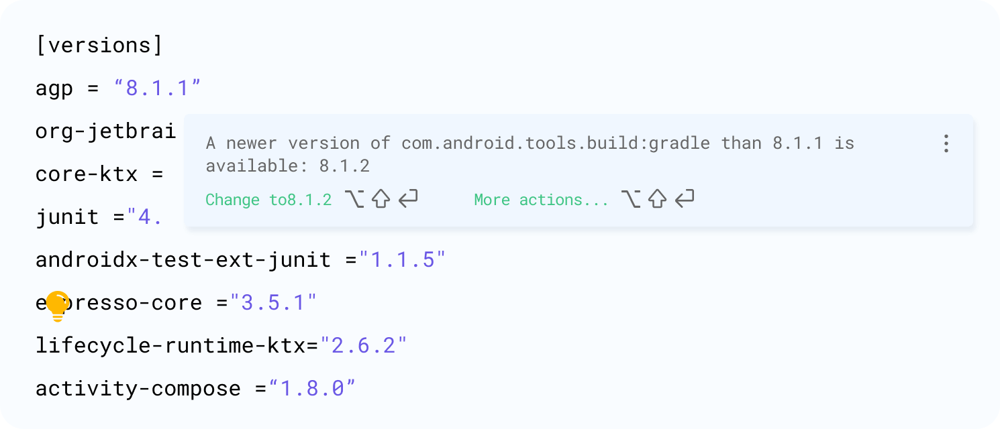
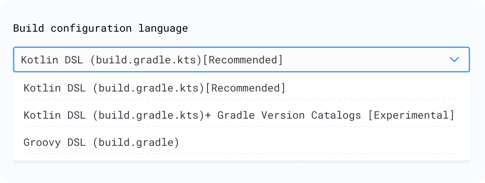
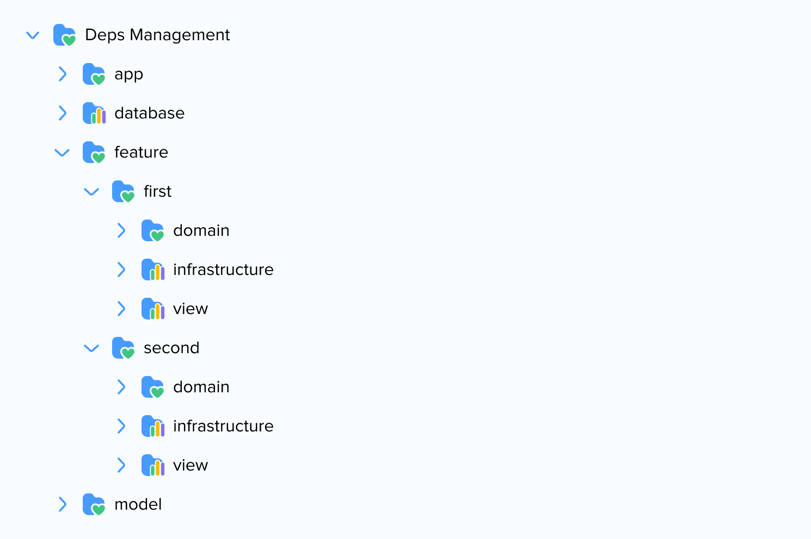
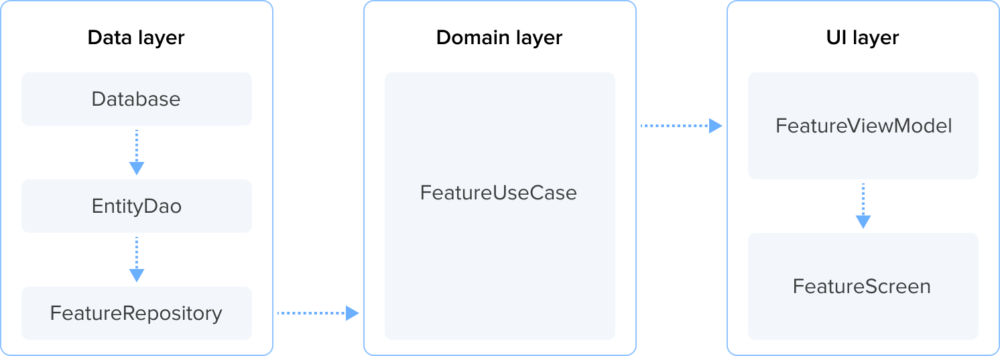
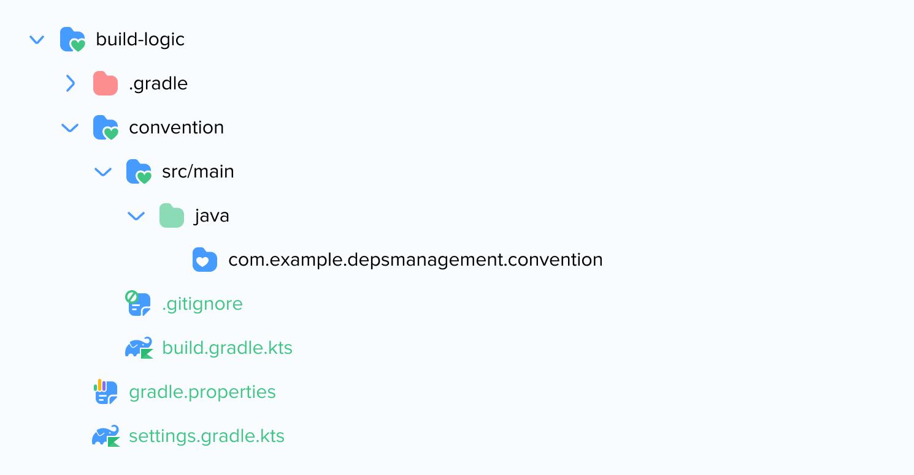

## Introduction

Efficient dependency management is a critical aspect of Android development. In the dynamic landscape of Android app creation, where Gradle serves as the build automation tool, applying good architectural practices to our code (like single responsibility or reusability) is just the beginning. Sometimes, we overlook the significance of well-organized Gradle dependencies. 
This oversight becomes more pronounced when working on large, multi-modular projects, where problems related to dependency management can significantly impact project efficiency. Whether you're developing a feature-rich social networking app or a performance-oriented gaming application, mastering Gradle is paramount to ensure a smooth and optimized development process.

Another crucial aspect that often goes hand in hand with efficient dependency management is the need for [Dependency Injection (DI)](https://martinfowler.com/articles/injection.html). Dependency injection is a design pattern that plays a pivotal role in adhering to the principles of [Clean Architecture](https://blog.cleancoder.com/uncle-bob/2012/08/13/the-clean-architecture.html), particularly the Inversion of the Control (IoC) principle.

In Clean Architecture, the Inversion of Control principle suggests that high-level modules (which contain the core business logic) should not depend on low-level modules (which contain details like database access or UI rendering). Instead, both should depend on abstractions. This is where dependency injection comes into play. By injecting dependencies from higher-level modules into lower-level modules, we achieve a more flexible and maintainable architecture.

The absence of proper dependency injection can lead to tightly coupled components, making it challenging to replace or modify one component without affecting others. In Android development, where modularity is essential for scalability and maintainability, adopting a robust dependency injection framework becomes imperative.

[It's possible that at some point, Bazel will become the optimal tool for building Android applications](https://developer.squareup.com/blog/stampeding-elephants/). But, at present, we must pay attention to all the tools Gradle provides to [save development hours and reduce the cognitive load when interpreting our build scripts](https://developer.squareup.com/blog/herding-elephants/).

This article delves into the challenges faced in Android dependency management, offering solutions through tools like Convention Plugins and Version Catalogs. This [sample repository](https://github.com/ramruizni/DepsManagement) demonstrates the before-and-after results of implementing such a migration. Additionally, it emphasizes the need for proper dependency injection as an integral part of maintaining a clean and modular codebase, in alignment with the principles of Clean Architecture.

## Challenges in Dependency Management

Dependency management issues can balloon into major setbacks, causing build failures, preventing scalability, and complicating team collaboration. By acknowledging these potential pitfalls upfront, we equip ourselves with the necessary awareness to preemptively address them. In the following list, we will explore common challenges teams face when managing dependencies, their implications for your projects, and how these obstacles can be systematically tackled to streamline development processes, improve build times, and ultimately deliver a more robust product.

- **There is often a lot of repeated code**: Some plugins (such as when using Hilt) are commonly used in similar modules. The same happens with dependencies. For example, many modules containing views often include Android libraries, Material, Compose, Lifecycle, etc. Other logic blocks, like buildFeatures or kotlinOptions, are repeated quite frequently. This repeated code often leads to errors because one module may have a dependency while the other does not, even though their responsibilities are similar.

- **Multiple versions of SDK, Java, Kotlin, JVM target, and more**: It's quite common for many modules to contain similar code snippets like:

```gradle
compileOptions {
    sourceCompatibility = JavaVersion.VERSION_1_8
    targetCompatibility = JavaVersion.VERSION_1_8
}

kotlinOptions {
    jvmTarget = "1.8"
}
```

Ensuring that each module lists the correct versions can be a tedious task and often leads to bugs when interacting with other modules.

- **No update highlights on some configurations**: Many guides for setting up projects from scratch don't integrate seamlessly with Android Studio and don't notify the user when a new version of a library is available. Here are two examples:

```kts
// File: settings.gradle.kts

dependencyResolutionManagement {
    versionCatalogs {
        create("deps") {
            version("androidx-work", "2.8.1")
            version("appauth", "0.11.1")
            version("billing", "6.0.1")
        ...
	}
...
```

```gradle
// File: versions.gradle

ext.deps = [:]

def versions = [:]
versions.androidx_sqlite = '2.2.0'
versions.sql_cipher = '4.4.2'
versions.appcompat = '1.6.0-rc01'
```

Such configurations also often do not allow for automatic dependency updates through their automated toolkits.

- **The specific architecture of a project is not taken into account**: Android Studio provides us with plugins to distinguish, for example, an Android library (com.android.library) from a Java library (java-library). But what if we want to differentiate between a module containing use cases and another containing repositories? In that case, we would have to use the same dependencies in similar modules, leading to duplicated code once again.

- **Using the buildSrc folder**: Many projects (including some [Google architecture samples](https://github.com/android/compose-samples)) use it to store build logic. However, it is advisable to separate the build logic from the **buildSrc** folder [through the use of composite builds](https://proandroiddev.com/stop-using-gradle-buildsrc-use-composite-builds-instead-3c38ac7a2ab3), maintaining a single source of truth for common module configurations.

Let's take a look at what we can do to solve these issues.


## Using Gradle Version Catalogs

Version Catalogs offer flexibility that surpasses many alternatives. They simplify dependency management by allowing bundles, reducing Gradle file clutter. These catalog files are shareable, promoting consistency across projects and allowing third-party plugins to automate version updates. This article provides an illustrative example of their usage while acknowledging that [their suitability for specific projects is a subject of discussion](https://github.com/jjohannes/idiomatic-gradle/issues/4).

The dependencies are stored in a .toml file with sections for versions, libraries, and plugins, offering us suggestions when new versions become available.



The current version of Android Studio (Android Studio Hedgehog | 2023.1.1 Patch 2) provides the option to create a project with Version Catalogs. To migrate an existing project, you can follow the [official guide](https://developer.android.com/build/migrate-to-catalogs).




Finally, we can use tools to automate the updating of dependencies in our Version Catalogs, such as [VersionCatalogUpdatePlugin](https://github.com/littlerobots/version-catalog-update-plugin) or [RenovateBot](https://github.com/renovatebot/renovate).


## Base Project Architecture

We’ve created a [sample project](https://github.com/ramruizni/DepsManagement) to demonstrate how to configure dependencies effectively, overcoming the issues we previously faced. Many code examples in this project are adapted from the nowinandroid application, which, as stated in its [GitHub repository](https://github.com/android/nowinandroid), 'follows Android design and development best practices and is intended to be a useful reference for developers'.

We start with a base project that embraces a modular architecture to foster maintainability, scalability, and a clear separation of concerns. The project includes the following modules:




- **app**: The core module contains the base application, navigation files, and essential dependency injection modules. It orchestrates interactions between features.
- **model**: Stores shared entities to maintain consistency across features.
- **feature-\[feature_name]-domain**: Business logic specific to a particular feature. It houses use cases, which define the interactions between different parts of the application. The business logic abstraction ensures that core functionalities remain independent of external changes, protecting them from the impact of modifications in the UI or data layer.
- **feature-\[feature_name]-infrastructure**: Acts as the bridge between business logic and the data layer. It includes the repository, connecting use cases to the database. This isolation shields core business logic from data implementation details.
- **feature-\[feature_name]-view**: Presentation layer for a feature, containing the screen composable, view model, and base navigation components. Separating UI concerns in this module prevents compromising the underlying business logic with changes in the user interface.
- **database**: Dedicated to the data layer, including the database, Data Access Objects (Daos), and entities.



Initially, we add the dependencies (sorted alphabetically) that we will use in our **libs.versions.toml** file to each respective section:

```toml
# File: libs.versions.toml

[versions]
android-desugar-jdk-libs = "2.0.4"
androidx-compose-compiler = "1.5.10"
androidx-hilt-navigation-compose = "1.2.0"
androidx-lifecycle = "2.7.0"
androidx-navigation = "2.7.7"
appcompat = "1.6.1"
hilt = "2.50"
hilt-ext = "1.2.0"
kotlin = "1.9.22"
kotlin-gradle-plugin = "1.8.20"
kotlinx-coroutines = "1.7.3"
ksp = "1.9.22-1.0.17"
material = "1.11.0"
room = "2.6.1"
org-jetbrains-kotlin-jvm = "1.9.22"

[libraries]
android-gradle-plugin = { group = "com.android.tools.build", name = "gradle", version.ref = "agp" }
android-desugar-jdk-libs = { group = "com.android.tools", name = "desugar_jdk_libs", version.ref = "android-desugar-jdk-libs" }
androidx-hilt-navigation-compose = { group = "androidx.hilt", name = "hilt-navigation-compose", version.ref = "androidx-hilt-navigation-compose" }
androidx-lifecycle-runtime-compose = { group = "androidx.lifecycle", name = "lifecycle-runtime-compose", version.ref = "androidx-lifecycle" }
androidx-lifecycle-view-model-compose = { group = "androidx.lifecycle", name = "lifecycle-viewmodel-compose", version.ref = "androidx-lifecycle" }
androidx-navigation-compose = { group = "androidx.navigation", name = "navigation-compose", version.ref = "androidx-navigation" }
appcompat = { group = "androidx.appcompat", name = "appcompat", version.ref = "appcompat" }
hilt-android = { group = "com.google.dagger", name = "hilt-android", version.ref = "hilt" }
hilt-android-testing = { group = "com.google.dagger", name = "hilt-android-testing", version.ref = "hilt" }
hilt-compiler = { group = "com.google.dagger", name = "hilt-android-compiler", version.ref = "hilt" }
hilt-ext-compiler = { group = "androidx.hilt", name = "hilt-compiler", version.ref = "hilt-ext" }
hilt-ext-work = { group = "androidx.hilt", name = "hilt-work", version.ref = "hilt-ext" }
kotlin-gradle-plugin = { module = "org.jetbrains.kotlin:kotlin-gradle-plugin", version.ref = "kotlin-gradle-plugin" }
kotlinx-coroutines-android = { group = "org.jetbrains.kotlinx", name = "kotlinx-coroutines-android", version.ref = "kotlinx-coroutines" }
ksp-gradle-plugin = { group = "com.google.devtools.ksp", name = "com.google.devtools.ksp.gradle.plugin", version.ref = "ksp" }
material = { group = "com.google.android.material", name = "material", version.ref = "material" }
room-compiler = { group = "androidx.room", name = "room-compiler", version.ref = "room" }
room-ktx = { group = "androidx.room", name = "room-ktx", version.ref = "room" }
room-gradle-plugin = { group = "androidx.room", name = "room-gradle-plugin", version.ref = "room" }
room-runtime = { group = "androidx.room", name = "room-runtime", version.ref = "room" }

[plugins]
com-android-library = { id = "com.android.library", version.ref = "agp" }
hilt = { id = "com.google.dagger.hilt.android", version.ref = "hilt" }
kotlin-serialization = { id = "org.jetbrains.kotlin.plugin.serialization", version.ref = "kotlin" }
ksp = { id = "com.google.devtools.ksp", version.ref = "ksp" }
room = { id = "androidx.room", version.ref = "room" }
```


## Using Composite Builds

Configuring a project through the buildSrc folder [invalidates the caching and incremental builds](https://proandroiddev.com/stop-using-gradle-buildsrc-use-composite-builds-instead-3c38ac7a2ab3) used by Gradle. In contrast, Composite Builds enable us to [decompose a large multi-project build into smaller, more isolated chunks](https://docs.gradle.org/current/userguide/composite_builds.html) without causing this invalidation.

We create the following package structure to store the build logic:



We configure the **versionCatalogs** in this file to recognize the original libs.versions.toml:

```kts 
// File: build-logic/settings.gradle.kts

dependencyResolutionManagement {
    repositories {
        google()
        mavenCentral()
    }
    versionCatalogs {
        create("libs") {
            from(files("../gradle/libs.versions.toml"))
        }
    }
}

rootProject.name = "build-logic"
include(":convention")
```

We define the use of **kotlin-dsl** and specify a Java version for the plugins we will define in the future:

```kts 
// File: build-logic/convention/build.gradle.kts

plugins {
    `kotlin-dsl`
}

group = "com.example.depsmanagement.buildlogic"

// Configure the build-logic plugins to target JDK 17
// This matches the JDK used to build the project, and is not related to what is running on device.
java {
    sourceCompatibility = JavaVersion.VERSION_17
    targetCompatibility = JavaVersion.VERSION_17
}
tasks.withType<org.jetbrains.kotlin.gradle.tasks.KotlinCompile>().configureEach {
    kotlinOptions {
        jvmTarget = JavaVersion.VERSION_17.toString()
    }
}

dependencies {
    compileOnly(libs.android.gradle.plugin)
    compileOnly(libs.kotlin.gradle.plugin)
    compileOnly(libs.ksp.gradle.plugin)
    compileOnly(libs.room.gradle.plugin)
}
```

We add to the global settings.gradle.kts of the project to include our build-logic folder:

```kts 
// File: settings.gradle.kts

pluginManagement {
    includeBuild("build-logic")
    repositories {
        ...
    }
}
...
```

Now that we have placed the build logic correctly, we will create our Gradle plugins.


## Gradle Convention Plugins

[Gradle, at its core, is not equipped to compile Java code by itself. Instead, compiling Java is handled by specific plugins](https://docs.gradle.org/current/userguide/plugins.html). Applying a plugin to a module allows it to extend another's capabilities (like compiling Kotlin or importing [Room](https://mvnrepository.com/artifact/androidx.room/room-gradle-plugin/2.6.0) components). One that we use all the time is the [Android Library Gradle Plugin](https://mvnrepository.com/artifact/com.android.library/com.android.library.gradle.plugin?repo=google), which allows us to build Android applications.

Plugins tend to be more useful if they are additive, composable and have a single responsibility. You should be able to add Room to your project without needing to add Hilt as well.

In this section, we will look at some Plugin examples that we can add to our project to minimize the overall build logic of our modules.

We start by creating this extension to access the Version Catalogs from our plugins:

```kt 
// File: build-logic/convention/src/main/java/com/example/depsmanagement/convention/ProjectExtensions.kt

val Project.libs
    get(): VersionCatalog = extensions.getByType<VersionCatalogsExtension>().named("libs")
```

Now that the extension is in place, let's add some plugins to our build-logic/convention folder. The first will be the AndroidHiltConventionPlugin from [nowinandroid](https://github.com/android/nowinandroid). It allows us to apply the dagger.hilt.android.plugin and org.jetbrains.kotlin.kapt plugins, along with the hilt.android and hilt.compiler dependencies:


```kt 
// File: build-logic/convention/src/main/java/AndroidHiltConventionPlugin.kt

import com.example.depsmanagement.convention.libs
import org.gradle.api.Plugin
import org.gradle.api.Project
import org.gradle.kotlin.dsl.dependencies

class AndroidHiltConventionPlugin : Plugin<Project> {
    override fun apply(target: Project) {
        with(target) {
            with(pluginManager) {
 apply("com.google.devtools.ksp")
                apply("dagger.hilt.android.plugin")
            }

            dependencies {
                "implementation"(libs.findLibrary("hilt.android").get())
                "ksp"(libs.findLibrary("hilt.compiler").get())
            }
        }
    }
}
```

Let's also add the AndroidRoomConventionPlugin:

```kt 
// File: build-logic/convention/src/main/java/AndroidRoomConventionPlugin.kt

​​import androidx.room.gradle.RoomExtension
import com.example.depsmanagement.convention.libs
import org.gradle.api.Plugin
import org.gradle.api.Project
import org.gradle.kotlin.dsl.configure
import org.gradle.kotlin.dsl.dependencies

class AndroidRoomConventionPlugin : Plugin<Project> {
    override fun apply(target: Project) {
        with(target) {
            pluginManager.apply("androidx.room")
            pluginManager.apply("com.google.devtools.ksp")

            extensions.configure<RoomExtension> {
                // The schemas directory contains a schema file for each version of the Room database.
                // This is required to enable Room auto migrations.
                // See https://developer.android.com/reference/kotlin/androidx/room/AutoMigration.
                schemaDirectory("$projectDir/schemas")
            }

            dependencies {
                add("implementation", libs.findLibrary("room.runtime").get())
                add("implementation", libs.findLibrary("room.ktx").get())
                add("ksp", libs.findLibrary("room.compiler").get())
            }
        }
    }
}
```

So that the rest of the project can recognize them, we register our plugins in our **build-logic** kts file:

```kts 
// File: build-logic/convention/build.gradle.kts

gradlePlugin {
    plugins {
        register("android-hilt") {
            id = "depsmanagement.android.hilt"
            implementationClass = "AndroidHiltConventionPlugin"
        }
        register("android-room") {
            id = "depsmanagement.android.room"
            implementationClass = "AndroidRoomConventionPlugin"
        }
    }
}
```

And then, we add the IDs to the Version Catalogs with an unspecified version:


```toml 
# File: libs.versions.toml

[plugins]
depsmanagement-android-hilt = { id = "depsmanagement.android.hilt", version = "unspecified" }
depsmanagement-android-room = { id = "depsmanagement.android.room", version = "unspecified" }
```

The good thing about these plugins is that they are **composable** and **additive**. If we want to add Room and Hilt in any of our modules, we can now simply reference these plugins, saving us a lot of code:

```kts
plugins {
    alias(libs.plugins.depsmanagement.android.room)
    alias(libs.plugins.depsmanagement.android.hilt)
}
```

To standardize the version of Kotlin we want to use across all project libraries, we can use the AndroidLibraryConventionPlugin (from [nowinandroid](https://github.com/android/nowinandroid) as well):


```kt 
// File: build-logic/convention/src/main/java/AndroidLibraryConventionPlugin.kt

import com.android.build.api.variant.LibraryAndroidComponentsExtension
import com.android.build.gradle.LibraryExtension
import com.example.depsmanagement.convention.ProjectConfig
import com.example.depsmanagement.convention.configureKotlinAndroid
import com.example.depsmanagement.convention.disableUnnecessaryAndroidTests
import org.gradle.api.Plugin
import org.gradle.api.Project
import org.gradle.kotlin.dsl.configure
import org.gradle.kotlin.dsl.dependencies
import org.gradle.kotlin.dsl.kotlin

class AndroidLibraryConventionPlugin : Plugin<Project> {
    override fun apply(target: Project) {
        with(target) {
            with(pluginManager) {
                apply("com.android.library")
                apply("org.jetbrains.kotlin.android")
            }

            extensions.configure<LibraryExtension> {
                configureKotlinAndroid(this)
                defaultConfig.targetSdk = ProjectConfig.targetSdk
            }
            extensions.configure<LibraryAndroidComponentsExtension> {
                disableUnnecessaryAndroidTests(target)
            }
            dependencies {
                add("testImplementation", kotlin("test"))
                add("androidTestImplementation", kotlin("test"))
            }
        }
    }
}
```

The plugin uses this extension function to standardize the versions:

```kt 
// File: build-logic/convention/src/main/java/com/example/depsmanagement/convention/KotlinAndroid.kt

package com.example.depsmanagement.convention

import com.android.build.api.dsl.CommonExtension
import org.gradle.api.JavaVersion
import org.gradle.api.Project
import org.gradle.api.plugins.JavaPluginExtension
import org.gradle.kotlin.dsl.configure
import org.gradle.kotlin.dsl.dependencies
import org.gradle.kotlin.dsl.provideDelegate
import org.gradle.kotlin.dsl.withType
import org.jetbrains.kotlin.gradle.tasks.KotlinCompile

/**
 * Configure base Kotlin with Android options
 */
internal fun Project.configureKotlinAndroid(
    commonExtension: CommonExtension<*, *, *, *, *>,
) {
    commonExtension.apply {
        compileSdk = ProjectConfig.compileSdk

        defaultConfig {
            minSdk = ProjectConfig.minSdk
        }

        compileOptions {
            // Up to Java 11 APIs are available through desugaring
            // https://developer.android.com/studio/write/java11-minimal-support-table
            sourceCompatibility = JavaVersion.VERSION_11
            targetCompatibility = JavaVersion.VERSION_11
            isCoreLibraryDesugaringEnabled = true
        }
    }

    configureKotlin()

    dependencies {
        add("coreLibraryDesugaring", libs.findLibrary("android.desugar.jdk.libs").get())
    }
}

/**
 * Configure base Kotlin options for JVM (non-Android)
 */
internal fun Project.configureKotlinJvm() {
    extensions.configure<JavaPluginExtension> {
        // Up to Java 11 APIs are available through desugaring
        // https://developer.android.com/studio/write/java11-minimal-support-table
        sourceCompatibility = JavaVersion.VERSION_11
        targetCompatibility = JavaVersion.VERSION_11
    }

    configureKotlin()
}

/**
 * Configure base Kotlin options
 */
private fun Project.configureKotlin() {
    // Use withType to workaround https://youtrack.jetbrains.com/issue/KT-55947
    tasks.withType<KotlinCompile>().configureEach {
        kotlinOptions {
            // Set JVM target to 11
            jvmTarget = JavaVersion.VERSION_11.toString()
            // Treat all Kotlin warnings as errors (disabled by default)
            // Override by setting warningsAsErrors=true in your ~/.gradle/gradle.properties
            val warningsAsErrors: String? by project
            allWarningsAsErrors = warningsAsErrors.toBoolean()
            freeCompilerArgs = freeCompilerArgs + listOf(
                "-opt-in=kotlin.RequiresOptIn",
                // Enable experimental coroutines APIs, including Flow
                "-opt-in=kotlinx.coroutines.ExperimentalCoroutinesApi",
                "-opt-in=kotlinx.coroutines.FlowPreview",
            )
        }
    }
}
```

With this, we have successfully standardized the Kotlin versions of all Android libraries in our project and reduced a significant amount of boilerplate code when using Room or Hilt.


## Using the plugins with our architecture

We anticipate that each view module in our project will share common dependencies such as UI, Material, Navigation, and Lifecycle. To streamline our project, we'll create a plugin for each module type we use. For instance, we have the ArchViewConventionPlugin, which we define for every feature view in our application.

```kt 
// File: build-logic/convention/src/main/java/ArchViewConventionPlugin.kt

import com.android.build.gradle.LibraryExtension
import com.example.depsmanagement.convention.libs
import org.gradle.api.Plugin
import org.gradle.api.Project
import org.gradle.kotlin.dsl.configure
import org.gradle.kotlin.dsl.dependencies

class ArchViewConventionPlugin : Plugin<Project> {
    override fun apply(target: Project) {
        with(target) {
            pluginManager.apply {
                apply("depsmanagement.android.library")
                apply("depsmanagement.android.library.compose")
                apply("depsmanagement.android.hilt")
            }
            extensions.configure<LibraryExtension> {
                defaultConfig {
                    testInstrumentationRunner =
                        "androidx.test.runner.AndroidJUnitRunner"
                }
            }

            dependencies {
                add("implementation", libs.findLibrary("core.ktx").get())
                add("implementation", libs.findLibrary("lifecycle.runtime.ktx").get())
                add("implementation", libs.findLibrary("activity.compose").get())
                add("implementation", platform(libs.findLibrary("compose.bom").get()))
                add("implementation", libs.findLibrary("ui").get())
                add("implementation", libs.findLibrary("ui.graphics").get())
                add("implementation", libs.findLibrary("ui.tooling.preview").get())
                add("implementation", libs.findLibrary("material3").get())
                add("testImplementation", libs.findLibrary("junit").get())
                add("androidTestImplementation", libs.findLibrary("androidx.test.ext.junit").get())
                add("androidTestImplementation", libs.findLibrary("espresso.core").get())
                add("androidTestImplementation", platform(libs.findLibrary("compose.bom").get()))
                add("androidTestImplementation", libs.findLibrary("ui.test.junit4").get())
                add("debugImplementation", libs.findLibrary("ui.tooling").get())
                add("debugImplementation", libs.findLibrary("ui.test.manifest").get())

                add("implementation", libs.findLibrary("androidx.hilt.navigation.compose").get())
                add("implementation", libs.findLibrary("androidx.lifecycle.runtime-compose").get())
                add("implementation", libs.findLibrary("androidx.lifecycle.view.model.compose").get())
                add("implementation", libs.findLibrary("kotlinx.coroutines.android").get())
            }
        }
    }
}
```

Because we can now use this plugin, we will transition from using a file like this:

```kts 
// File: build-logic/convention/src/main/java/// File (old): feature/first/view/build.gradle.kts

plugins {
    alias(libs.plugins.com.android.library)
    alias(libs.plugins.org.jetbrains.kotlin.android)
    id("dagger.hilt.android.plugin")
    id("org.jetbrains.kotlin.kapt")
}

android {
    namespace = "com.example.depsmanagement.feature.first.view"
    compileSdk = 34

    defaultConfig {
        minSdk = 24

        testInstrumentationRunner = "androidx.test.runner.AndroidJUnitRunner"
        consumerProguardFiles("consumer-rules.pro")
    }
    compileOptions {
        sourceCompatibility = JavaVersion.VERSION_11
        targetCompatibility = JavaVersion.VERSION_11
        isCoreLibraryDesugaringEnabled = true
    }
    kotlinOptions {
        jvmTarget = JavaVersion.VERSION_11.toString()
    }
    buildFeatures {
        compose = true
    }
    composeOptions {
        kotlinCompilerExtensionVersion = libs.versions.androidx.compose.compiler.get()
    }
}

dependencies {

    implementation(libs.core.ktx)
    implementation(libs.lifecycle.runtime.ktx)
    implementation(libs.activity.compose)
    implementation(platform(libs.compose.bom))
    implementation(libs.ui)
    implementation(libs.ui.graphics)
    implementation(libs.ui.tooling.preview)
    implementation(libs.material3)
    testImplementation(libs.junit)
    androidTestImplementation(libs.androidx.test.ext.junit)
    androidTestImplementation(libs.espresso.core)
    androidTestImplementation(platform(libs.compose.bom))
    androidTestImplementation(libs.ui.test.junit4)
    debugImplementation(libs.ui.tooling)
    debugImplementation(libs.ui.test.manifest)

    implementation(libs.hilt.android)
    kapt(libs.hilt.compiler)
    kaptAndroidTest(libs.hilt.compiler)
    kaptTest(libs.hilt.compiler)

    implementation(libs.androidx.hilt.navigation.compose)
    implementation(libs.androidx.lifecycle.runtime.compose)
    implementation(libs.androidx.lifecycle.view.model.compose)
    implementation(libs.kotlinx.coroutines.android)

    coreLibraryDesugaring(libs.android.desugar.jdk.libs)

    implementation(project(":feature:first:domain"))
}
```

To one like this:

```kts 
// File (new): feature/first/view/build.gradle.kts

plugins {
    alias(libs.plugins.depsmanagement.arch.view)
}

android {
    namespace = "com.example.depsmanagement.feature.first.view"
}

dependencies {
    implementation(project(":feature:first:domain"))
}
```

We can also define a plugin for the infrastructure and domain modules:

```kt 
// File: build-logic/convention/src/main/java/ArchInfrastructureConventionPlugin.kt

import org.gradle.api.Plugin
import org.gradle.api.Project
import org.gradle.kotlin.dsl.dependencies
import org.gradle.kotlin.dsl.project

class ArchInfrastructureConventionPlugin : Plugin<Project> {
    override fun apply(target: Project) {
        with(target) {
            pluginManager.apply {
                apply("depsmanagement.android.library")
            }

            dependencies {
                add("implementation", project(":database"))
                add("implementation", project(":model"))
            }
        }
    }
}
```

```kt 
// File: build-logic/convention/src/main/java/ArchDomainConventionPlugin.kt

import org.gradle.api.Plugin
import org.gradle.api.Project
import org.gradle.kotlin.dsl.dependencies
import org.gradle.kotlin.dsl.project

class ArchDomainConventionPlugin : Plugin<Project> {
    override fun apply(target: Project) {
        with(target) {
            pluginManager.apply {
                apply("depsmanagement.jvm.library")
            }

            dependencies {
                add("implementation", project(":model"))
            }
        }
    }
}
```

It's advisable not to include all Gradle values in a convention plugin. For example, **versionCode** and **versionName** in the app module are often extensively used in CI platforms like Bitrise to be modified based on a build ID. Additionally, values like **android.namespace** are unique to each module. It's best to use convention plugins only to encapsulate reusable logic.


## Closing thoughts

As we can see, we have significantly reduced the lines of code in each of the new modules in our project. We also have a way to reuse and standardize the dependencies for each module based on its type, avoiding bugs resulting from different Java/Kotlin versions and/or different configurations. When used in conjunction with Version Catalogs, we have good support for library updates.

To access the code samples presented in this article, please refer to the [sample project](https://github.com/ramruizni/DepsManagement). If you're interested in delving deeper, I highly recommend exploring the [nowinandroid](https://github.com/android/nowinandroid) repository, which offers a wealth of additional examples showcasing the capabilities of Convention Plugins, including the definition of [Flavors](https://developer.android.com/build/build-variants?hl=zh-cn), integration of testing libraries, establishment of [Baseline Profiles](https://developer.android.com/topic/performance/baselineprofiles/overview?hl=zh-cn), configuration of [Gradle Managed Devices](https://developer.android.com/studio/test/gradle-managed-devices), Firebase modules, and more.


## External resources

[1] [https://developer.squareup.com/blog/herding-elephants/](https://developer.squareup.com/blog/herding-elephants/)

[2] [https://github.com/android/nowinandroid](https://github.com/android/nowinandroid)

[3] [https://docs.gradle.org/current/userguide/composite_builds.html](https://docs.gradle.org/current/userguide/composite_builds.html)

[4] [https://proandroiddev.com/using-version-catalog-on-android-projects-82d88d2f79e5](https://proandroiddev.com/using-version-catalog-on-android-projects-82d88d2f79e5)

[5] [https://blog.cleancoder.com/uncle-bob/2012/08/13/the-clean-architecture.html](https://blog.cleancoder.com/uncle-bob/2012/08/13/the-clean-architecture.html)

[6] [https://martinfowler.com/articles/injection.html](https://martinfowler.com/articles/injection.html)

[7] [https://www.youtube.com/watch?v=cNypb-kIwZg](https://www.youtube.com/watch?v=cNypb-kIwZg)

[8] [https://developer.squareup.com/blog/stampeding-elephants/](https://developer.squareup.com/blog/stampeding-elephants/)
