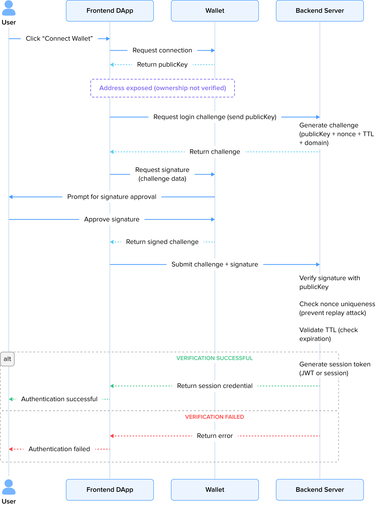

## Article Overview

Teams are moving EVM projects to Solana for higher throughput, lower fees, and better UX. We've done this in production — migrated multiple Ethereum protocols to Solana across different industries. The hard parts are contract architecture, data models, transaction logic, and frontend-backend coordination. We've learned what breaks and what works.

This article is part of a broader series on migrating Ethereum protocols to Solana. We split the work across contracts, backend, and frontend — each post builds on the same staking example in [evm-to-solana](https://github.com/57blocks/evm-to-solana).

**You are here:** Frontend (Part 1) — the infrastructure layer: wallets, ALTs, priority fees, transaction retry, and Jito Bundles.

If you're new to the series, start with the [Preamble](https://57blocks.com/blog/how-to-migrate-an-ethereum-protocol-to-solana-preamble) for account models, execution, and fees, then the [Contracts](https://57blocks.com/blog/how-to-migrate-an-ethereum-protocol-to-solana-contracts-part-1) guides. After this post, continue with [Frontend (Part 2)](https://57blocks.com/blog/how-to-migrate-an-ethereum-protocol-to-solana-frontend-part-2) for a complete staking demo, or the [Backend](https://57blocks.com/blog/how-to-migrate-an-ethereum-protocol-to-solana-backend) guide for event sync and automation.

| Layer | Article | What it covers |
| --- | --- | --- |
| Foundation | [Preamble](https://57blocks.com/blog/how-to-migrate-an-ethereum-protocol-to-solana-preamble) | Account model, execution, fees |
| Contracts | [Part 1](https://57blocks.com/blog/how-to-migrate-an-ethereum-protocol-to-solana-contracts-part-1) / [Part 2](https://57blocks.com/blog/how-to-migrate-an-ethereum-protocol-to-solana-contracts-part-2) | Account model, CPI, PDAs, limits, staking port |
| Frontend | **[Part 1 (this article)](https://57blocks.com/blog/how-to-migrate-an-ethereum-protocol-to-solana-frontend-part-1)** | Wallets, ALTs, priority fees, retry, Jito |
| Frontend | [Part 2](https://57blocks.com/blog/how-to-migrate-an-ethereum-protocol-to-solana-frontend-part-2) | Staking demo: read/write state, events |
| Backend | [Backend](https://57blocks.com/blog/how-to-migrate-an-ethereum-protocol-to-solana-backend) | Event sync, log parsing, cron automation |

This article covers the frontend pieces you actually touch when moving a DApp from EVM to Solana: wallet connection (including custom mobile adapters for wallets without official support), hardware wallet login via `signTransaction` + Memo, Address Lookup Tables, priority fees, transaction retry, and Jito Bundles. Not a staking demo — that's Part 2. Everything below comes with working code you can use.

## 1. Connecting Wallets

Connecting a wallet to a Solana frontend is easy. Keeping the experience consistent across platforms is not:

- Desktop: the wallet injects itself as a browser extension.
- Mobile: you need Deeplink / Universal Link to wake up a separate wallet app.
- In-app browser (e.g., Phantom Browser): the wallet injects a global object and pre-connects.

A wallet's capabilities and behavior vary across these environments. Adapting to each wallet and platform individually doesn't scale. `@solana/wallet-adapter` (from Anza) solves this with an Adapter pattern — you write against a single interface, and it handles the rest.

Below is the standard setup from the official docs ([APP.md](https://github.com/anza-xyz/wallet-adapter/blob/master/APP.md)), then we'll get into something the docs don't cover well: what happens on mobile when a wallet doesn't have an adapter yet.

When integrating a wallet with a Solana DApp, you'll face:

- **Adapter Availability:** Not every wallet ships an official adapter.
- **Mobile Connectivity:** Desktop users can often connect through an injected object even without an adapter. On mobile, without an official adapter or deep link support, the wallet app simply can't be reached.
- **The fix:** Build a custom wallet adapter backed by a deep link as a fallback for mobile.

### 1.1 Standard Connection Flow: `ConnectionProvider` + `WalletProvider`

In a typical React application, the minimum recommended access method for `@solana/wallet-adapter` is:

- Use `ConnectionProvider` to provide an RPC connection.
- Use `WalletProvider` to register a set of supported wallets (official adapters are already implemented for common wallets).
- Use UI components (e.g., `WalletModalProvider` + `WalletMultiButton`) for interaction.

In a desktop environment, as long as the wallet injects an object conforming to expectations via `window.xxx`, the connection or signing can often be completed through "non-standard methods" even without explicit adapter registration.

However, this method does not naturally migrate to mobile scenarios.

### 1.2 The Reality: The Adapter Gap on Mobile

In practice, you hit these problems:

1. Some wallets have not yet provided an official wallet adapter.
2. Some multi-chain wallets support Solana, but their injected objects, connection flow, or signing interface are not fully consistent with the standard adapter's expectations.
3. In mobile browsers, wallets typically do not inject a global object, and the only viable entry point for the DApp is the deeplink.

This leads to a crucial difference:

- On desktop, "no adapter" is usually just an experience issue.
- On mobile, "no adapter" often means the user cannot connect the wallet at all.

The official documentation mainly describes the problem from the perspective of "[how a wallet should implement an adapter](https://github.com/anza-xyz/wallet-standard/blob/master/WALLET.md)", but in reality, the progress of wallet-side adaptation is not entirely controllable. As a DApp developer who has adopted the `@solana/wallet-adapter` system, you naturally face this problem: if a certain wallet does not have an official adapter yet, but you still want to provide a clear, usable connection entry point for mobile users, what should you do?

### 1.3 Solution: Custom Wallet Adapter as a Mobile Fallback

`@solana/wallet-adapter`'s core abstraction is the `WalletAdapter` interface (defined in `@solana/wallet-adapter-base`). The application layer doesn't care whether an adapter is official or custom — it just needs something that implements the interface.

So we build a custom adapter backed by a deep link, with:

- Basic identification information: `name / url / icon / deepLink`.
- Connection status: `publicKey / connecting / readyState`.
- Core methods:
  - `connect() / disconnect() / isConnected()`
  - `sendTransaction(tx, connection, options)` and others.

From the application layer perspective:

- The custom adapter is completely equivalent to official adapters like Phantom and Solflare.
- They can be registered together in `WalletProvider`.
- The UI layer (e.g., `WalletMultiButton`) does not need to perform any special checks.

This makes a custom adapter very suitable as a fallback solution for scenarios where "the official adapter has not yet covered this wallet, but mobile users must have an entry point."

As long as the same interface is implemented, you can register your `CustomWalletAdapter` just like registering Phantom, and it will be included in the `WalletProvider`'s wallet list.

```typescript
export class CustomWalletAdapter extends BaseWalletAdapter {
  readonly name: WalletName;
  readonly icon: string;
  readonly url: string;
  readonly deepLink: string;
  readonly supportedTransactionVersions = new Set<"legacy" | 0>(["legacy", 0]);

  private _connecting: boolean = false;
  private _publicKey: PublicKey | null = null;
  private _readyState: WalletReadyState;

  constructor(config: CustomWalletConfig) {
    super();
    this.name = config.name;
    this.icon = config.icon;
    this.url = config.url;
    this.deepLink = config.deepLink;
    // Loadable: The wallet can be loaded (via deep link) but isn't installed as browser extension
    this._readyState = WalletReadyState.Loadable;
  }

  get publicKey(): PublicKey | null {
    return this._publicKey;
  }

  get connecting(): boolean {
    return this._connecting;
  }

  get connected(): boolean {
    return !!this._publicKey;
  }

  get readyState(): WalletReadyState {
    return this._readyState;
  }

  async autoConnect(): Promise<void> {
    // Deep link adapters should never auto-connect
    // Auto-redirect without user interaction is bad UX
    // Do nothing - require explicit user action to connect
  }

  async connect(): Promise<void> {
    try {
      // For deep link adapters, we only redirect to the wallet app
      // The actual connection happens in the wallet's in-app browser
      // We don't emit "connect" here because the connection isn't established yet
      window.location.href = this.deepLink;
    } catch (error) {
      this.emit("error", new WalletConnectionError((error as Error).message));
      throw error;
    }
  }

  async disconnect(): Promise<void> {
    this._publicKey = null;
    this.emit("disconnect");
  }

  async sendTransaction<T extends Transaction | VersionedTransaction>(
    _transaction: T,
    _connection: Connection,
    _options?: SendOptions,
  ): Promise<TransactionSignature> {
    // Deep link adapters handle transactions within the wallet app
    // The actual signing happens after the deep link redirect
    throw new Error(
      "sendTransaction is handled by the wallet app after deep link redirect",
    );
  }

  async signTransaction<T extends Transaction | VersionedTransaction>(
    _transaction: T,
  ): Promise<T> {
    throw new Error(
      "signTransaction is handled by the wallet app after deep link redirect",
    );
  }

  async signAllTransactions<T extends Transaction | VersionedTransaction>(
    _transactions: T[],
  ): Promise<T[]> {
    throw new Error(
      "signAllTransactions is handled by the wallet app after deep link redirect",
    );
  }

  async signMessage(_message: Uint8Array): Promise<Uint8Array> {
    throw new Error(
      "signMessage is handled by the wallet app after deep link redirect",
    );
  }
}
```

Based on this basic adapter, we can further wrap a utility method to create different wallet adapters based on configuration, such as Backpack.

```typescript
/**
 * Build the Backpack deep link URL for mobile.
 * Uses Universal Link format for iOS/Android.
 */
const buildBackpackDeepLink = (): string => {
  const currentUrl = getCurrentUrl();
  const origin = getCurrentOrigin();

  // Backpack Universal Link format
  return `https://backpack.app/ul/v1/browse/${encodeURIComponent(
    currentUrl,
  )}?ref=${encodeURIComponent(origin)}`;
};

/**
 * Create a Backpack wallet adapter.
 *
 * On mobile: Uses deep link to open Backpack app
 * On desktop: Redirects to Chrome extension installation page
 */
export function createBackpackWalletAdapter(): CustomWalletAdapter {
  return createCustomWalletAdapter({
    name: "Backpack" as WalletName<"Backpack">,
    icon: BACKPACK_ICON,
    url: BACKPACK_URL,
    deepLinkBuilder: () =>
      isMobile() ? buildBackpackDeepLink() : BACKPACK_CHROME_EXTENSION_URL,
  });
}

/**
 * Create Backpack adapter only for mobile devices.
 * Returns null on desktop (where the official adapter should be used).
 */
export function createBackpackMobileAdapter(): CustomWalletAdapter | null {
  if (!isMobile()) {
    return null;
  }
  return createBackpackWalletAdapter();
}
```

In this way, we can register `BackpackWalletAdapter()` as a "custom wallet" in `WalletProvider` to provide a fallback for scenarios not yet covered by the official adapter.

### 1.4 Deeplink: The Last Mile to Connect Mobile Wallets

In a mobile environment, most Solana wallets exist as standalone Apps, and communication between the DApp and the wallet is typically through Deeplink / Universal Link. The typical flow is:

1. The DApp constructs a URL defined by the wallet, for example: `mywallet://connect?dapp_url=...&session=...`
2. The browser redirects to this URL, and the system wakes up the wallet App.
3. After the wallet completes authorization or signing, it returns the result to the DApp via a callback URL.

In the custom adapter design above:

- The custom adapter encapsulates all the details of the deeplink protocol internally, while still exposing unified methods like `connect()`, `sendTransaction()`, etc.
- To the application, both browser extension wallets and mobile wallets launched via deeplink are, at the code level, merely different implementations of `WalletAdapter`.
- Therefore, when an official adapter temporarily does not cover a certain wallet, you can still use the "deeplink + custom adapter" route to provide a discoverable and usable connection entry point for the user, without breaking the existing `@solana/wallet-adapter` integration pattern.

Thus, when an official adapter is temporarily unavailable for a wallet:

You can still use the "Custom Adapter + Deeplink" approach to provide a clear, discoverable, and maintainable connection entry point for mobile users, without disrupting the existing `@solana/wallet-adapter` architecture.

## 2. Wallet Login with Signature: Sign Message vs. Sign Transaction

In a Solana DApp, simply getting the user's `publicKey` through "connecting the wallet" does not prove that the address is indeed controlled by the current user. The safer and more standard approach is to introduce a **Challenge-Response** protocol, requiring the user to sign a message generated by the backend to complete the login verification.

### 2.1 Challenge-Response Basic Flow

The typical wallet login flow is as follows:

1. **User Connects Wallet**
   
   The user clicks "Connect Wallet" on the frontend, and the DApp establishes a connection with the wallet via the wallet adapter and obtains the user's `publicKey`.
   This step only indicates that the user agrees to expose the address and does not constitute identity verification.

2. **Frontend Requests Challenge from Backend**
   
   The frontend sends the obtained `publicKey` to the backend, requesting the generation of a login Challenge.

3. **Backend Generates Challenge (Challenge Information)**
   
   The Challenge typically includes:
   
   - Wallet address (`publicKey`)
   - Random number (`nonce`)
   - Expiration time (`timestamp / TTL`)
   - DApp identifier (e.g., domain name, application name, etc.)

4. **Frontend Requests Wallet Signature**
   
   The frontend passes the Challenge to the wallet, requesting the user to sign it.

5. **Frontend Submits Signature Result**
   
   The frontend sends the original Challenge and the signature generated by the user to the backend.

6. **Backend Verifies Signature and State**
   
   The backend performs the following checks:
   
   - Verifies the signature's validity using `publicKey`.
   - Checks if the wallet address in the Challenge matches the `publicKey` in the request.
   - Checks if the `nonce` has not been used (to prevent replay attacks).
   - Checks if the Challenge is within its validity period.

7. **Login Success**
   
   After successful verification, the backend issues a session credential (e.g., JWT or Session) for that wallet address, used for subsequent identity identification.



### 2.2 Signature Method Compatibility Issues

- **`signMessage`**: Most software wallets support signing arbitrary messages, making it the simplest and most direct way to implement login.
- **`signTransaction`**: Some hardware wallets (e.g., Ledger, Trezor, etc.) typically do not support signing arbitrary messages; they only allow signing standard Solana Transactions.

To accommodate these wallets, we construct a "special transaction" that contains only a Memo or other side-effect-free instruction, and ask the user to complete the login signature via `signTransaction`. Note: this transaction is only for local signing and backend verification. It is _not_ sent on-chain — it's an _off-chain_ signature that doesn't record anything on-chain or consume gas.

Below we introduce both paths, aiming to reuse a single set of verification logic on the frontend and backend as much as possible.

**Constructing and Signing a Message**

A readable message format, similar to "Sign-In with Solana," can be used, for example:

```typescript
const generateSignInMessage = useCallback((walletAddress: PublicKey) => {

  const timestamp = new Date().toISOString();
  const nonce = Math.random().toString(36).substring(7);

  return `${appName} wants you to sign in with your Solana account:
  ${walletAddress.toBase58()}

  Please sign in to verify your ownership of this wallet

  URI: https://${domain}
  Version: 1
  Network: Solana
  Nonce: ${nonce}
  Issued A

  // ... (rest of the message) ...
}, [appName, domain]);
```

Then, use the wallet's `signMessage` for signing. When using `@solana/wallet-adapter`, `signMessage` is an optional method, so its existence must be checked first:

```typescript
const signMessageForAuth = useCallback(
  async (message: string): Promise<SignMessageResult> => {
    if (!publicKey || !signMessage) {
      throw new Error(
        "Wallet not connected or does not support message signing",
      );
    }
    const encodedMessage = new TextEncoder().encode(message);
    const signature = await signMessage(encodedMessage);
    const signatureBase58 = bs58.encode(signature);
    return {
      signature: signatureBase58,
      publicKey: publicKey.toBase58(),
      success: true,
    };
  },
  [publicKey, signMessage],
);
```

Here, we choose to base58 encode the `messageBytes` (`serializedMessage`). This allows the backend to uniformly handle the "signature + original signed bytes" (two pieces of data) to be compatible with both the `signMessage` and the `signTransaction` solution discussed later.

### 2.3 Backend: Verifying `signMessage` Signature

The backend logic is essentially standard Ed25519 signature verification. In Node.js, for example:

```typescript
const publicKeyObj = new PublicKey(publicKeyStr);

// Decode the base58 encoded inputs
const signatureBytes = bs58.decode(signature);
const messageBytes = bs58.decode(serializedMessageBase58);

// Verify the signature using the ed25519 algorithm
const isValid = ed25519.verify(
  signatureBytes,
  messageBytes,
  publicKeyObj.toBytes(),
);

// Note: The commented-out code below shows an alternative
// verification method using nacl.
// const isValid = nacl.sign.detached.verify(
//   messageBytes,
//   signatureBytes,
//   publicKeyObj.toBytes()
// );

return isValid;
```

Before calling the signature verification function, the backend must also:

- Read the Challenge from storage.
- Verify:
  - The `nonce` has not been used.
  - The current time is within the validity period.
  - The address declared in the Challenge matches `publicKeyStr`.
- After successful verification, immediately invalidate the Challenge and issue its own login session.

That's the `signMessage`-based signature login flow, which works for most software wallets.

### 2.4 Hardware Wallet: `signTransaction` + Memo Disguised as Sign Message

In the security model of many hardware wallets, only signing a Transaction is allowed, but not signing an arbitrary sequence of bytes. Therefore, at the adaptation layer, you might encounter:

- `wallet.signMessage` does not exist or throws a "not supported" error directly.
- Users with Ledger / Trezor cannot follow the `signMessage` login flow.

To ensure compatibility with these wallets, the Challenge can be embedded into a transaction that is "only for signing, not necessarily for going on-chain," allowing the wallet to complete the signature with the same meaning via `signTransaction`.

#### 2.4.1 Wallet Signs via `signTransaction` + Memo

Example implementation (Frontend):

```typescript
const signTransactionForAuth = useCallback(
  async (message: string): Promise<SignMessageResult> => {
    if (!publicKey || !signTransaction) {
      throw new Error(
        "Wallet not connected or does not support transaction signing",
      );
    }
    const blockhashResponse = await connection.getLatestBlockhash();
    const lastValidBlockHeight = blockhashResponse.lastValidBlockHeight - 150;

    const memoInstruction = new TransactionInstruction({
      keys: [],
      programId: MEMO_PROGRAM_ID,
      data: Buffer.from(message, "utf-8"),
    });

    const tx = new Transaction({
      feePayer: publicKey,
      blockhash: blockhashResponse.blockhash,
      lastValidBlockHeight: lastValidBlockHeight,
    }).add(memoInstruction);

    // Sign the transaction
    const signedTx = await signTransaction(tx);

    // Get the signature from the signed transaction
    const txSignature = signedTx.signatures[0];
    const signatureBase58 = bs58.encode(txSignature.signature!);

    // Get the serialized message that was actually signed
    // This is what the wallet signed - the serialized transaction data
    const serializedMessage = signedTx.serializeMessage();
    const serializedMessageBase58 = bs58.encode(serializedMessage);

    return {
      signature: signatureBase58,
      publicKey: publicKey.toBase58(),
      success: true,
      serializedMessage: serializedMessageBase58,
    };
  },
  [publicKey, signTransaction, connection],
);
```

In the hardware wallet path, you also obtain two core pieces of data:

- `signatureBase58`: The Ed25519 signature of the transaction message.
- `serializedMessageBase58`: The raw message bytes obtained by calling `tx.serializeMessage()`.

The format is consistent with the `signMessage` path, allowing the backend to use the same set of verification logic.

#### 2.4.2 Backend: How to Verify `signTransaction` Signature

When the backend receives this type of request (which can be treated as `type: 'transaction'`), it first needs to verify that the signature was generated by the private key corresponding to the address:

```typescript
const publicKeyObj = new PublicKey(publicKeyStr);
const signatureBytes = bs58.decode(signature);
const messageBytes = bs58.decode(serializedMessageBase58);

// Verify the signature using ed25519
const isValid = ed25519.verify(
  signatureBytes,
  messageBytes,
  publicKeyObj.toBytes(),
);

return isValid;

// The commented-out nacl verification is also provided for reference:
/*
// Verify the signature using nacl
const isValidNacl = nacl.sign.detached.verify(
  messageBytes,
  signatureBytes,
  publicKeyObj.toBytes()
);
*/
```

On this basis, it can also cooperate with the Challenge for additional verification:

- The Challenge (including its `nonce/expiration time/address`, etc.) is still generated and saved by the backend.
- The frontend writes the Challenge into the `data` field when constructing the Memo.
- For stronger security, the backend can further parse the transaction content corresponding to `messageBytes`, find the Memo instruction, and compare its `data` to ensure it matches the Challenge (this step is an enhanced verification, and the specific parsing code is not expanded here).

Overall, the security semantics of this path are the same as the `signMessage` path: the user performed a non-repudiable signature on a Challenge initiated by the backend, and the backend establishes a login session for that address after verifying the signature and the Challenge's validity.

## 3. Data and Indexing Layer

Fetching and querying on-chain data efficiently matters for any DApp's frontend. The Solana ecosystem has its own indexing story — different from EVM's but covering the same needs.

### 3.1 Data Indexing in EVM: Subgraphs

In the EVM ecosystem, Subgraph is a tool used to build custom GraphQL APIs specifically for indexing blockchain data. Developers can use Subgraphs to:

- Aggregate application-specific blockchain data for fast frontend access.
- Listen for smart contract events and store the data in a Graph Node.
- Provide real-time query interfaces to support complex frontend requirements.

#### 3.1.1 How to use Subgraph

The specific steps to build a Subgraph can be found in the official tutorial: [The Graph Quick Start](https://thegraph.com/docs/en/quick-start/).

#### 3.1.2 Querying Data

Once a Subgraph is created, the frontend can query on-chain data via GraphQL, eliminating the need to call RPC nodes directly, which greatly improves query efficiency.

Querying the latest reward claim records:

```typescript
import { gql, request } from "graphql-request";
import { useQuery } from "@tanstack/react-query";

const REWARD_HISTORY_QUERY = gql`
  {
    rewardClaimeds(first: 10, orderBy: blockNumber, orderDirection: desc) {
      id
      user
      reward
      blockNumber
    }
  }
`;

const useRewardHistory = () => {
  const { data, refetch, isLoading, error, isRefetching } = useQuery<{
    rewardClaimeds: RewardRecord[];
  }>({
    queryKey: ["reward-history"],
    queryFn: async () => {
      const graphqlUrl = process.env.NEXT_PUBLIC_GRAPH_URL || "";
      return await request(graphqlUrl, REWARD_HISTORY_QUERY, {}, headers);
    },
    refetchInterval: 30000, //Refetch every 30 seconds
    refetchOnWindowFocus: true, //  Refetch when window gains focus
    staleTime: 10000, // Data is considered stale after 10 seconds
  });

  return { data, refetch, isLoading, error, isRefetching };
};
```

### 3.2 Solana Ecosystem: RPC and Third-Party Services

Solana RPC nodes are fast at reading state — good for single-account queries and simple filtering. [@solana/rpc-graphql](https://github.com/anza-xyz/kit/tree/main/packages/rpc-graphql) gives you a GraphQL interface on top of RPC, which handles multi-account aggregation and complex data access without extra traversal code.

However, native RPC and `rpc-graphql` still have limitations:

- Complex cross-program queries or event backtracking still require additional handling.
- Queries for large volumes of historical data may be less efficient than specialized indexing services.

Therefore, third-party indexing services remain valuable, such as **Helius** high-performance API and event subscription, which supports NFT, transaction events, and staking data queries.

While Solana native RPC + `rpc-graphql` can address most query needs, third-party indexing services remain indispensable for complex queries, event subscriptions, and historical data access.

#### 3.2.1 Self-Built Backend Indexer + REST API

Event backtracking can also be implemented based on the Solana RPC without relying on third-party indexing services. The core idea is:

1. Determine the Backtracking Range: Use the slot as the timeline to define the backtracking scope (usually avoiding the latest slot to ensure data stability).
2. Fetch Transaction Signatures: Call the RPC's getSignaturesForAddress method for the set of addresses to be monitored, fetching transaction signatures in pages within the specified range.
3. Get Transaction Details: After obtaining the signatures, concurrently call **getParsedTransaction** to fetch the details of each transaction.
4. Extract Events: Use a custom event parser to extract business events from transaction instructions, inner instructions, or logs.
5. Data Integration: Consolidate and sort the scattered events by slot/time, and output a new checkpoint (the synchronized slot) for the next round of incremental synchronization.

This method can cover the needs of "historical playback + resuming from a breakpoint," but specialized indexing services are still more efficient in scenarios like complex cross-program analysis, real-time subscriptions, and retrieving massive amounts of historical data.

We built a [working indexer](https://github.com/57blocks/evm-to-solana/tree/main/backend/solana-backend) with NestJS: it periodically pulls new transactions from the chain, uses Anchor's **EventParser** to extract events, stores them in a database, and exposes aggregated data to the frontend through a REST API.

#### 3.2.2 Querying Data

With the backend handling indexing and aggregation, the frontend's job is straightforward: call a REST API.

```typescript
const API_BASE = import.meta.env.VITE_API_BASE_URL || "http://localhost:3000";

async function fetchRewards(userAddress: string): Promise<UserRewardResponse> {
  const res = await fetch(`${API_BASE}/api/rewards/${userAddress}`);
  if (!res.ok) {
    throw new Error(`Failed to fetch rewards: ${res.statusText}`);
  }
  return res.json();
}

const rewards = useQuery<UserRewardResponse>({
  queryKey: ["reward-history", address],
  queryFn: () => fetchRewards(address),
  enabled: !!address,
  refetchInterval: 30000,
  staleTime: 10000,
});
```

## 4. Address Lookup Table (ALT)

When developing DApps on Solana, a common limitation is that **a single transaction can reference a maximum of 32 accounts, and each transaction has a size limit of 1232 bytes**. The 1232-byte transaction size limit is not arbitrary but directly derived from the MTU constraints in real network environments, ensuring that transactions can be reliably broadcast without packet fragmentation (see Solana official [transaction documentation](https://solana.com/docs/core/transactions)).

This can become a bottleneck in complex scenarios, such as:

- DeFi protocol calls involving multiple Token accounts and auxiliary accounts.
- Batch NFT Mint or Transfer operations.

To solve this problem, Solana provides the **Address Lookup Table (ALT)** — a specialized on-chain structure used to store account addresses.

### 4.1 Core Mechanism

- **Account Storage**: You can write frequently used account addresses into the ALT.
- **Index Reference**: The transaction no longer carries the full account address but resolves it from the ALT via an index.
- **Extension Capabilities**:
  - Each ALT can store up to 256 account addresses.
  - Each `extend` operation can write up to 20 addresses.
- **Transaction Compatibility**: ALT relies on the v0 version of the transaction format (`Versioned Transaction`), which can break the 32-account limit and reduce transaction size.

### 4.2 Use Cases

- **Breaking the Account Limit**: Complex cross-protocol interactions and batch NFT operations can be completed in one go.
- **Reducing Transaction Size**: Compressing account addresses through indexing reduces the number of bytes, leading to lower fees.

### 4.3 Usage Flow and Example (Anchor Frontend Call Code Example)

1. Creating and Extending the Address Lookup Table

```typescript
/**
 * Create an Address Lookup Table (ALT) for stake accounts
 */
export const createLookupTable = async (
  connection: Connection,
  payer: PublicKey,
  accounts: AltAccountInfo,
  signTransaction: <T extends Transaction | VersionedTransaction>(
    tx: T,
  ) => Promise<T>,
): Promise<AddressLookupTableAccount | null> => {
  const recentSlot = await connection.getSlot();

  // Create lookup table instruction
  const [lookupTableInst, lookupTableAddress] =
    AddressLookupTableProgram.createLookupTable({
      authority: payer,
      payer,
      recentSlot,
    });

  // Add accounts to lookup table instruction
  const addAccountsInst = AddressLookupTableProgram.extendLookupTable({
    payer: payer,
    authority: payer,
    lookupTable: lookupTableAddress,
    addresses: [
      accounts.state,
      accounts.userStakeInfo,
      accounts.userTokenAccount,
      accounts.stakingVault,
      accounts.rewardVault,
      accounts.userRewardAccount,
      accounts.tokenProgram,
      accounts.blacklistEntry,
      accounts.systemProgram,
      accounts.clock,
    ],
  });

  // Combine both instructions in a single transaction
  const combinedTx = new Transaction()
    .add(lookupTableInst)
    .add(addAccountsInst);

  combinedTx.recentBlockhash = (
    await connection.getLatestBlockhash()
  ).blockhash;
  combinedTx.feePayer = payer;

  const signedTx = await signTransaction(combinedTx);
  await sendAndConfirmTransaction(connection, signedTx.serialize());

  // Fetch the created lookup table
  const lookupTableResponse =
    await connection.getAddressLookupTable(lookupTableAddress);

  return lookupTableResponse.value;
};
```

2. Executing a Stake Transaction using ALT (v0 transaction)

```typescript
try {
  const accountInfo = await createStakeAccountInfo(publicKey!, program!);

  const accounts: AltAccountInfo = {
    state: accountInfo.statePda,
    userStakeInfo: accountInfo.userStakeInfoPda,
    userTokenAccount: accountInfo.userTokenAccount,
    stakingVault: accountInfo.stakingVault,
    rewardVault: accountInfo.rewardVault,
    userRewardAccount: accountInfo.userRewardAccount,
    tokenProgram: TOKEN_PROGRAM_ID,
    blacklistEntry: accountInfo.blacklistPda,
    systemProgram: anchor.web3.SystemProgram.programId,
    clock: anchor.web3.SYSVAR_CLOCK_PUBKEY,
  };

  const lookupTable = await getOrCreateLookupTable(accounts);
  if (!lookupTable) {
    onError({ message: ERROR_MESSAGES.FAILED_TO_LOAD_LOOKUP_TABLE });
    return;
  }

  const versionedTx = await createVersionedStakeTransaction(
    connection,
    publicKey!,
    program!,
    stakeAmount,
    lookupTable,
  );

  const signedVersionedTx = await signTransaction!(versionedTx);

  const signature = await sendAndConfirmTransaction(
    connection,
    signedVersionedTx.serialize(),
  );

  setTransactionSignature(signature);
  onSuccess();
  setTransactionSignature(undefined);
} catch (err) {
  const errorInfo = formatErrorForDisplay(err);
  onError(errorInfo);
} finally {
  setIsStaking(false);
}
```

If your transaction only involves a few dozen accounts, a regular transaction is sufficient. However, for **batch operations** or **complex cross-protocol interactions**, ALT can significantly reduce development complexity, improve performance, and lower Gas costs.

[This transaction](https://explorer.solana.com/tx/2pm9x29zuVerX8N9p2KKJBvKnHbDdNemjBrkiBeFXoaQAVT74c8KVzDWbXi7xbgNgzbZGnaSupDNbEEh1NryVjwX?cluster=devnet) is a transaction without lookup, and [this transaction](https://explorer.solana.com/tx/5uiw41GgowkdFHUXPVt7AEKPqkVgYy93mxrP5jTQNw9VEzbjWRJs5tHtGJWTtM793Sdn4SuS8oKHECheMfSA9bQU?cluster=devnet) is a transaction with lookup, showing a significant fee reduction from 0.000025 SOL to 0.000005 SOL, a saving of 80%.

## 5. Solana Fee Optimisation: Compute Units and Priority Fee

In Solana, the transaction fee consists of two parts: **base fee** and **priority fee**. The base fee is fixed and very low, while the priority fee allows users to pay an additional amount to boost the transaction's packing priority during periods of high **account contention**.

### 5.1 Account Contention and Priority Fees

- **The unit of transaction contention is the account**, not the transaction itself.
- **Account contention** occurs when multiple transactions simultaneously access the same account within the same block (e.g., writing to the state account of a liquidity pool).
- In this situation, validators prioritize transactions with a higher bid (more priority fee).

If the account you are interacting with has no contention (e.g., personal wallet transfers, or a staking account only used by yourself), **no extra priority fee is needed**, and the transaction will still be landed normally.

### 5.2 Typical Scenarios Requiring Priority Fees

- Hot NFT mints, where thousands of users simultaneously write to the same global state account.
- AMM liquidity pools or DEX order placements, where everyone accesses the same market state account.
- High-frequency trading or arbitrage bots, competing concurrently on the same accounts.

### 5.3 Compute Units

The computing resources consumed by each transaction in the network are measured in **Compute Units (CU)**. By default, setting the CU too high leads to unnecessary waste, while setting it too low might cause transaction execution failure. Solana provides two mechanisms to help developers find the "appropriate CU request":

Use `simulateTransaction` to estimate the CU required for transaction execution. You can first simulate the execution using `simulateTransaction` + the transaction containing all instructions, then read the consumed units. Add 10% on top of this value.

```typescript
export const estimateComputeUnits = async (
  connection: Connection,
  transaction: VersionedTransaction,
): Promise<number> => {
  try {
    const simulation = await connection.simulateTransaction(transaction, {
      sigVerify: false,
      replaceRecentBlockhash: true,
    });

    if (simulation.value.err) {
      console.warn("Simulation failed:", simulation.value.err);
      return DEFAULT_COMPUTE_UNITS;
    }

    const estimatedCU = simulation.value.unitsConsumed || 0;

    if (estimatedCU === 0) {
      return DEFAULT_COMPUTE_UNITS;
    }

    // Add 10% safety margin
    return addSafetyMargin(estimatedCU, 0.1);
  } catch (error) {
    console.warn("Failed to estimate compute units:", error);
    return DEFAULT_COMPUTE_UNITS;
  }
};
```

Note that the Compute Unit Limit is an upper bound, and the priority fee is calculated **based on this upper bound**, not the actual consumed CU. If you set a high CU Limit but use very little in practice, you might still pay an "overestimated" priority fee.

### 5.4 Using Priority Fees to Increase Transaction Priority

Solana provides the `getRecentPrioritizationFees` RPC method to query the priority fee situation for recently landed transactions on specified accounts.

- You should pass the accounts involved in your transaction as parameters.
- The RPC returns the minimum priority fee for recently landed transactions.
- This value can be used as a baseline, and then appropriately increased based on the importance of your business operation.

```typescript
/**
 * Fetch recent priority fees for given accounts
 */
export const getRecentPriorityFees = async (
  connection: Connection,
  publicKey: PublicKey,
  accountInfo: StakeAccountInfo,
): Promise<number> => {
  try {
    const response = await connection.getRecentPrioritizationFees({
      lockedWritableAccounts: [
        publicKey,
        accountInfo.statePda,
        accountInfo.userStakeInfoPda,
        accountInfo.userTokenAccount,
        accountInfo.stakingVault,
        accountInfo.rewardVault,
        accountInfo.userRewardAccount,
        accountInfo.blacklistPda,
      ],
    });

    if (!response || response.length === 0) {
      return DEFAULT_PRIORITY_FEE;
    }

    const allFees = response.map((item) => item.prioritizationFee);
    const validFees = filterValidFees(allFees);

    if (areAllFeesZero(validFees)) {
      return DEFAULT_PRIORITY_FEE;
    }

    return calculateRecommendedFee(validFees);
  } catch (error) {
    console.warn("Failed to fetch priority fees:", error);
    return DEFAULT_PRIORITY_FEE;
  }
};
```

### 5.5 [Optimal Compute Budget](https://solana.com/developers/guides/advanced/how-to-use-priority-fees)

The priority fee is calculated using the formula:

**Prioritization Fee = Compute Unit Limit x Compute Unit Price**

When constructing a transaction, priority fee parameters can be explicitly specified via instructions:

```typescript
const instructions = [
  createComputeUnitPriceInstruction(priorityFee),
  createComputeUnitLimitInstruction(estimatedCU),
  instruction,
];

const versionedTx = await createVersionedTransaction(
  connection,
  publicKey!,
  instructions,
);

const signedTx = await signTransaction!(versionedTx);

const signature = await sendAndConfirmTransaction(
  connection,
  signedTx.serialize(),
);
```

## 6. Transaction Retry

The mechanism for transaction broadcast and confirmation in Solana is significantly different from EVM.

- **EVM Model**: After a transaction is submitted, as long as it enters the mempool, a miner will eventually package and execute it. Transaction nonces are strictly sequential, and there is no "packet loss" issue.
- **Solana Model**: Uses **high-concurrency + UDP broadcast**. There is no mempool, and a transaction must be packaged within a limited block height (the validity period of the blockhash), otherwise it will expire directly.

This means that in high-load scenarios, transactions may fail to land due to packet loss, queue overflow, or fork rollback, thus requiring developers to implement **retry logic** on the client to ensure reliable transaction delivery.

### 6.1 The Role of Blockhash

Every Solana transaction must carry a `recentBlockhash`, which serves two purposes:

1. **Anti-Replay**: Prevents the same transaction from being broadcast indefinitely.
2. **Setting Expiration Time**: A blockhash is valid for approximately 151 slots (about 60-75 seconds). After this time, the transaction will be rejected.

Therefore, **the core of the retry logic** is: continuously re-broadcast the transaction before the blockhash expires.

### 6.2 Retry Logic

The common retry logic is as follows:

1. Fetch the `recentBlockhash` and its corresponding `lastValidBlockHeight`.
2. Calculate a safety buffer, such as `lastValidBlockHeight - 150`, to avoid retrying too close to expiration.
3. Keep re-sending the transaction while `blockHeight < lastValidBlockHeight`, until the transaction is confirmed or expires.
4. If the transaction still fails to land, it needs to be re-signed (with a new blockhash) and broadcast again.

```typescript
/**
 * Executes the stake transaction with blockhash retry logic.
 * Returns the transaction signature if successful, or undefined on error.
 */
const executeStakeWithRetry = async (): Promise<string | undefined> => {
  // Get latest blockhash and set lastValidBlockHeight
  const blockhashResponse = await connection.getLatestBlockhash();

  // Subtract a small safety buffer to ensure we stop retrying
  // before the transaction actually expires, avoiding failures near expiration
  const SAFETY_BUFFER = 100; // blocks
  const lastValidBlockHeight =
    blockhashResponse.lastValidBlockHeight - SAFETY_BUFFER;

  // Create stake instruction using the common utility
  const { instruction } = await createStakeInstruction({
    publicKey: publicKey!,
    program: program!,
    stakeAmount,
  });

  // Create transaction with blockhash and lastValidBlockHeight
  const transaction = new Transaction({
    feePayer: publicKey,
    blockhash: blockhashResponse.blockhash,
    lastValidBlockHeight: lastValidBlockHeight,
  }).add(instruction);

  const signedTransaction = await signTransaction!(transaction);
  const rawTransaction = signedTransaction.serialize();

  // Get current block height
  let blockHeight = await connection.getBlockHeight();
  let confirmedSignature: string | undefined;

  // Keep sending transaction until block height exceeds lastValidBlockHeight
  while (blockHeight < lastValidBlockHeight) {
    try {
      const signature = await connection.sendRawTransaction(rawTransaction, {
        // skipPreflight: true is REQUIRED for retry logic
        // Reasons:
        // 1. We intentionally send the same transaction multiple times
        // 2. Preflight checks would fail on repeat sends with "Transaction already exists"
        // 3. During network congestion, transactions may be dropped and need resending
        // 4. We want to maximize chances of the transaction being accepted
        // 5. Final confirmation is handled separately with proper validation
        skipPreflight: true,
      });
      const confirmation = await connection.confirmTransaction(
        {
          signature,
          blockhash: blockhashResponse.blockhash,
          lastValidBlockHeight: lastValidBlockHeight,
        },
        "confirmed",
      );
      if (!confirmation.value.err) {
        confirmedSignature = signature;
        onSuccess();
        break;
      }
      await sleep(500);
      blockHeight = await connection.getBlockHeight();
    } catch (error) {
      // Ignore send errors, continue retrying
      await sleep(500);
      blockHeight = await connection.getBlockHeight();
    }
  }

  // Check if we had a successful confirmation
  if (!confirmedSignature) {
    onError({
      message:
        "Transaction failed to send during the valid block height window. Please try again with a new transaction.",
      title: "Transaction Failed",
    });
    return;
  }

  return confirmedSignature;
};
```

Solana official documentation also provides relevant implementations for transaction retry; details can be found [here](https://solana.com/docs/advanced/retry).

## 7. Error Handling

Solana-related errors can generally be divided into three categories:

1. **Wallet Adapter Errors**: Connection failure, user rejection of signature, unsupported capability (e.g., `signMessage`).
2. **RPC / Network Errors**: Node unreachable, blockhash expired, rate limit, etc.
3. **On-Chain Program Errors**: Including errors thrown by System Programs and custom business contract errors.

A robust DApp needs to achieve "categorization, noise reduction, and user-friendly prompts" at all three levels.

### 7.1 Unified Frontend Error Handling Entry

All errors captured on the frontend or during the transaction process are handed over to a "classifier" for categorization, thereby simplifying the error handling logic in the UI layer.

The UI layer only needs to be concerned with one of the following four error types:

1. **Wallet Adapter Issues (`ErrorLevel.WalletAdapter`)**
2. **RPC/Network Issues (`ErrorLevel.RpcNetwork`)**
3. **On-Chain Program Business Logic Issues (`ErrorLevel.OnChainProgram`)**
4. **Unknown Error (`ErrorLevel.Unknown`)**

The utility function `classifyError(error)` serves as this **unified entry point**, responsible for categorizing any error into one of the four `ErrorLevel` types.

```typescript
/**
 * Classifies any error into one of four error levels.
 * This is the unified entry point for all error handling.
 */
export function classifyError(error: unknown): ClassifiedError {
  if (!error) {
    return {
      level: ErrorLevel.Unknown,
      error: null,
      originalError: error,
    };
  }

  const errorObj = error as { message?: string; msg?: string };
  const errorMessage = errorObj?.message || errorObj?.msg || String(error);

  // Level 1: Check for wallet adapter errors first
  const walletError = matchWalletAdapterError(errorMessage);
  if (walletError) {
    return {
      level: ErrorLevel.WalletAdapter,
      error: walletError,
      originalError: error,
    };
  }

  // Level 2: Check for RPC/network errors
  const rpcError = matchRpcNetworkError(errorMessage);
  if (rpcError) {
    return {
      level: ErrorLevel.RpcNetwork,
      error: rpcError,
      originalError: error,
    };
  }

  // Level 3: Check for on-chain program errors
  const programError = parseProgramErrorInternal(error);
  if (programError) {
    return {
      level: ErrorLevel.OnChainProgram,
      error: programError,
      originalError: error,
    };
  }

  // Unknown error
  return {
    level: ErrorLevel.Unknown,
    error: null,
    originalError: error,
  };
}
```

`formatErrorForDisplay(error)`: Builds upon error classification to output a structure readily usable by the UI, containing the following fields:

- **title**
- **message**
- **code?** (optional)
- **level?** (optional)

```typescript
/**
 * Formats an error for display in the UI.
 * This function classifies the error and returns a structure
 * suitable for ErrorModal.
 */
export function formatErrorForDisplay(error: unknown): FormattedError {
  const classified = classifyError(error);
  const userMessage = getUserFriendlyError(error);
  const title = getTitleForLevel(classified.level);

  const result: FormattedError = {
    title,
    message: userMessage,
    level: classified.level,
  };

  // Add error code if available
  if (classified.error?.code) {
    result.code = classified.error.code;
  }

  return result;
}
```

## 8. Jito Bundle

### 8.1 Limitations of Solana's Native Scheduling Model

In Solana, most transactions are submitted via RPC nodes. The RPC forwards the transaction to the current and next Leader, where it enters the Leader's execution queue and is packaged into a block. Before the Leader actually executes it and the network votes, the transaction only exists in the memory queues of the client and the forwarding node. The core constraint: **the scheduling unit is a single transaction, and competing transactions are ordered in the public forwarding path.**

While this model offers extremely high throughput under high parallel execution, it is not ideal for complex chained operations. If a business process involves multiple dependent transactions (e.g., borrow -> swap -> repay), these transactions are propagated, ordered, and executed independently. The system cannot guarantee their atomic submission as a whole or ensure strict execution in the intended order. Consequently, the native model lacks the ability for "multi-transaction atomic submission" and "deterministic sequential scheduling."

### 8.2 Jito Bundle: Extended Scheduling

The Jito Bundle wraps a group of transactions into an ordered sequence: `Bundle = [Tx1, Tx2, ..., TxN]`. The execution semantic: all transactions run in order, and state commits only if every transaction succeeds. If any fail, the whole bundle rolls back. By making the scheduling unit a "transaction sequence" instead of a single transaction, Bundles provide atomicity and sequential guarantees for complex multi-step operations — without changing the underlying execution engine.

Under the hood, Bundles travel through Jito Labs' Block Engine — a private scheduling channel separate from public RPC. The Block Engine receives the transaction sequence and routes it directly to validators running the Jito-Solana client. In the standard path, transactions enter the candidate queue individually and compete for ordering. A Bundle skips this — it's treated as one indivisible unit with its internal order locked.

A Jito Bundle isn't a new transaction type — it's a scheduling layer on top of the existing execution model. It upgrades the scheduling unit from "single transaction" to "transaction sequence," giving you atomic execution and deterministic ordering for multi-transaction workflows.

### 8.3 Use Cases

Bundles are useful in two ways: the atomicity semantics, and the engineering support for complex chained strategies. Typical cases:

- **MEV Arbitrage**: Packaging a user's transaction with an arbitrage transaction into an atomic sequence for execution, ensuring that both the buy and sell operations are completed under the same price state, preventing the intermediate state from being interrupted or price slippage from causing the strategy to fail.
- **Liquidations**: Packaging an oracle price update transaction with a liquidation transaction for submission, ensuring the liquidation logic is executed atomically based on the latest price, avoiding execution failure or contention conflicts caused by separating price updates and liquidation.
- **Batching Complex Operations**: When a single transaction is limited by transaction size or Compute Budget, multiple steps can be split into multiple transactions and encapsulated within the same Bundle to complete the complex operation with sequential execution and atomic submission.

The common feature of these scenarios is their dependence on "sequential determinism and atomic submission semantics among multiple transactions." Under the standard model of public propagation and independent ordering, these strategies are susceptible to scheduling competition and state changes. By encapsulating the transaction sequence into a Bundle and submitting it through Jito Labs' private scheduling channel, the execution order can be locked, and overall consistency can be guaranteed before entering the block construction phase.

### 8.4 Practical Implementation

Based on the above capabilities, the following section will focus on the typical scenario of **MEV Protection**, demonstrating how to submit a Staking transaction through the Jito Bundle's private channel to enhance result determinism and strategy stability in a price-sensitive execution environment.

#### 8.4.1 Transaction Submission Methods

The Jito Block Engine provides two transaction submission interfaces:

- **`sendBundle`** is used to submit a Bundle containing multiple related transactions, suitable for complex scenarios requiring atomic execution of multiple operations (e.g., flash loan arbitrage, multi-step DeFi operations).
- **`sendTransaction`** is a simplified interface for single transactions, when paired with the `bundleOnly=true` parameter, also gains MEV protection and rollback protection capabilities.

For the Stake operation in this project, since it only involves a single transaction, we choose `sendTransaction` over `sendBundle` to simplify the implementation while maintaining the same level of protection:

```typescript
POST https://<region>.block-engine.jito.wtf/api/v1/transactions?bundleOnly=true
```

The `bundleOnly=true` parameter treats the transaction as a single-transaction Bundle — if execution fails, all state changes roll back. No partial execution.

```typescript
export const sendJitoTransaction = async (
  signedTransaction: Transaction,
): Promise<string> => {
  try {
    // Serialize and encode the transaction for the API body
    const serialized = signedTransaction.serialize();
    const base58Tx = bs58.encode(serialized);

    const endpointUrl = `${JITO_BLOCK_ENGINE_URL}/api/v1/transactions?bundleOnly=true`;

    const requestBody = {
      jsonrpc: "2.0",
      id: 1,
      method: "sendTransaction",
      params: [base58Tx],
    };

    // Send the transaction via a POST request to Jito's API
    const response = await fetch(endpointUrl, {
      method: "POST",
      headers: {
        "Content-Type": "application/json",
      },
      body: JSON.stringify(requestBody),
    });

    // Check for HTTP errors
    if (!response.ok) {
      throw new Error(
        `Jito API request failed: ${response.status} ${response.statusText}`,
      );
    }

    const result = await response.json();

    // Check for JSON-RPC errors returned in the response body
    if (result.error) {
      throw new Error(
        `Jito sendTransaction error: ${result.error.message || JSON.stringify(result.error)}`,
      );
    }

    // Success: Return the transaction signature
    const signature = result.result;
    return signature;
  } catch (error) {
    // Log and re-throw a standardized error
    console.error("Failed to send transaction via Jito:", error);
    throw new Error(
      `Jito transaction failed: ${error instanceof Error ? error.message : "Unknown error"}`,
    );
  }
};
```

#### 8.4.2 Fee Strategy

`sendBundle` and `sendTransaction` **have fundamental differences in their fee strategies:**

- **`sendBundle`**: Only requires a Jito Tip. Bundles are sent directly to the Jito Block Engine and prioritized by Jito validators. Priority Fee has no effect on Bundle processing priority — validators decide whether to accept and process a Bundle based on the Tip amount.
- **`sendTransaction`**: A **70/30 allocation principle** is recommended, allocating 70% of the total fee as the **Priority Fee** and 30% as the **Jito Tip**. The Priority Fee is set via `ComputeBudgetProgram.setComputeUnitPrice()`, increasing the transaction's priority in the validator's queue. The Jito Tip incentivizes Jito validators to prioritize the transaction.

| **Submission Method** | **Priority Fee** | **Jito Tip** | **Core Explanation**                            |
|:--------------------- |:---------------- |:------------ |:----------------------------------------------- |
| `sendBundle`          | Not Required     | Required     | Tip determines the Bundle's processing priority |
| `sendTransaction`     | 70%              | 30%          | Both work together to increase success rate     |

**Important Notes on the Tip:**

1. **Do not use Address Lookup Table (ALT) for the Tip account**. The Tip instruction must directly include the full account address; using ALT compression will prevent the Tip from being correctly recognized.
2. **The Tip is only effective for Jito-Solana Leaders**. If the current slot Leader is not running the Jito-Solana client, the Tip will have no preferential processing effect, essentially wasting funds. Fortunately, Jito validators control about 95% of the network stake, so your transaction will encounter a Jito Leader in most cases.

The fee amount determination relies on the `tip_floor` API:

```typescript
GET https://bundles.jito.wtf/api/v1/bundles/tip_floor
```

This interface returns the statistical distribution of Tips for recently successfully landed transactions. For `sendTransaction`, we use the `landed_tips_50th_percentile` (median) as a benchmark and calculate the 70/30 ratio:

```typescript
export const calculateJitoFees = async () => {
  const tipFloor = await fetchTipFloor();
  const baseFee = Math.ceil(
    tipFloor.landed_tips_50th_percentile * LAMPORTS_PER_SOL,
  );
  const totalFee = Math.max(JITO_MIN_TIP_LAMPORTS, baseFee);
  return {
    priorityFee: Math.ceil(totalFee * 0.7),
    jitoTip: Math.max(JITO_MIN_TIP_LAMPORTS, Math.ceil(totalFee * 0.3)),
  };
};
```

#### 8.4.3 Tip Accounts and Load Balancing Strategy

The Jito Tip must be transferred to a specific Tip account. The API interface for fetching these accounts is:

```typescript
POST https://<region>.block-engine.jito.wtf/api/v1/getTipAccounts
```

Jito maintains 8 Tip accounts for receiving tips. To achieve load balancing, one account should be randomly selected when constructing the transaction:

```typescript
export const getRandomTipAccount = async (): Promise<PublicKey> => {
  const tipAccounts = await fetchTipAccounts();
  const randomIndex = Math.floor(Math.random() * tipAccounts.length);
  return new PublicKey(tipAccounts[randomIndex]);
};
```

Alternative Solution: If the above API is unavailable, the static accounts listed [here](https://docs.jito.wtf/lowlatencytxnsend/#response-example-tips) can be used as a substitute.

#### 8.4.4 Network Environment and CORS Handling

The Jito Block Engine's test environment only supports Solana Testnet, not Devnet. Ensure that your contract is deployed to Testnet and that your wallet and RPC are connected to Testnet during development and debugging.

Additionally, the `tip_floor` API has CORS restrictions, meaning browsers cannot access it directly. The development environment can use a Vite proxy to resolve this, while the production environment requires configuring an Nginx reverse proxy or forwarding the request through a backend service.

```typescript
// vite.config.ts

import { defineConfig } from "vite";

export default defineConfig({
  server: {
    proxy: {
      // Proxy requests starting with "/api/v1/bundles/tip_floor"
      // to the Jito Bundles API
      "/api/v1/bundles/tip_floor": {
        target: "https://bundles.jito.wtf",
        changeOrigin: true, // Needed for cross-origin requests
      },
    },
  },
});
```

## 9. Conclusion

If you're coming from EVM, Solana mechanisms like ALT, priority fees, blockhash expiration, and account contention will feel unfamiliar. ALT isn't a gas optimization — it's a constraint you work within when your transaction touches many accounts. Priority fees aren't validator tips; they're bids on contentious accounts. Blockhash expiration gives your transaction a shelf life of about 60 seconds — your retry logic needs to account for that.

Once these patterns click, you can build interactions that play to Solana's strengths: complex operations in a single transaction, predictable costs, stability under load.

Part 2 walks through a complete Staking demo, connecting all the frontend patterns covered here into a working end-to-end example.

We recommend tackling one piece at a time — ALT, priority fee estimation, or the error handler — and getting it solid before adding the rest. Full sample code: [evm-to-solana](https://github.com/57blocks/evm-to-solana).

## References

- [EVM-To-Solana](https://github.com/57blocks/evm-to-solana)
- [Solana extensions to the Wallet Standard](https://github.com/anza-xyz/wallet-standard)
- [Subgraphs](https://thegraph.com/docs/en/subgraphs/quick-start/)
- [Retrying Transactions](https://solana.com/developers/guides/advanced/retry)
- [Jito](https://docs.jito.wtf/)
- [Solana JavaScript SDK](https://github.com/anza-xyz/kit)
- [Solana Document](https://solana.com/docs)
