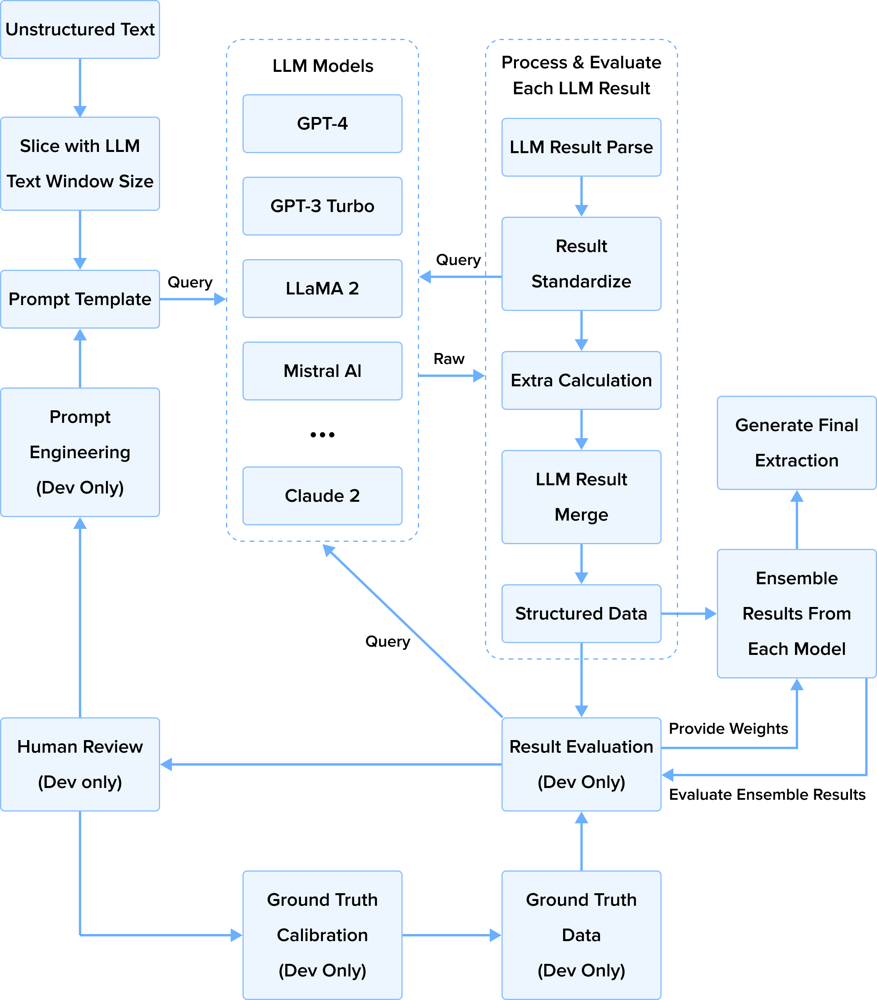
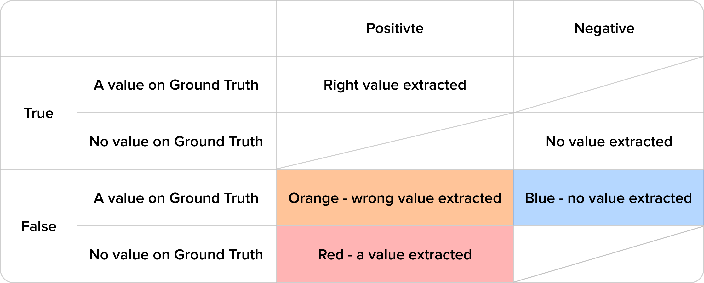
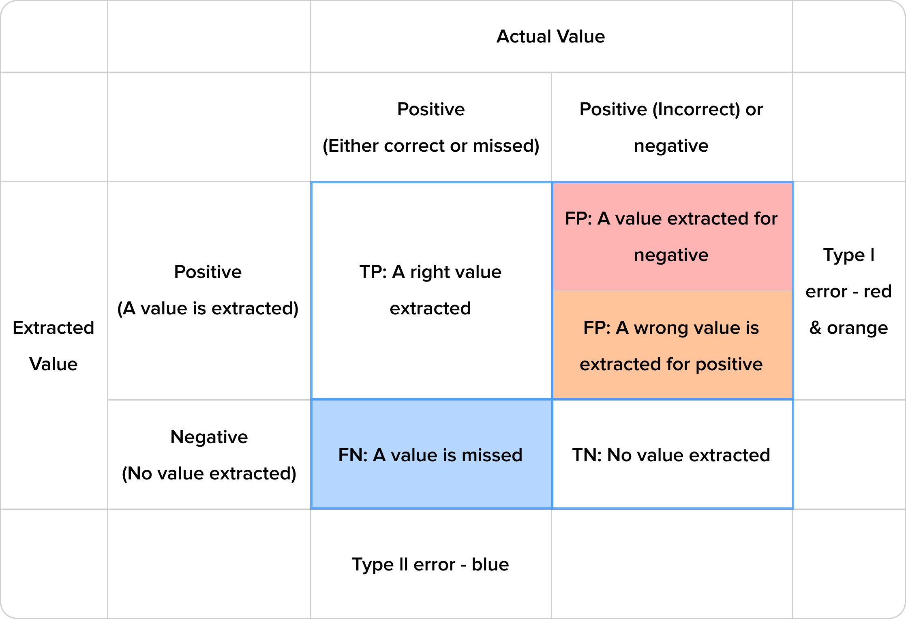

# How to Use LLMs to Extract Document Information

## Introduction

Information extraction (IE) is vital for converting raw text into structured data that is usable by various applications. Traditional IE methods often rely on labor-intensive handcrafted rules and patterns, which may struggle to generalize across diverse domains and languages. To tackle these challenges, this project explores the application of Large Language Models (LLMs) for information extraction tasks. Cutting-edge LLM models like the GPT series and Claude AI have showcased remarkable abilities in natural language understanding and generation tasks. In this project, we employed various LLMs such as GPT-3, GPT-4, GPT-4 Turbo, LLaMA 2, Mistral AI, and Claude 2 to help us extract information from a large number of academic papers and compare the performance. Each model exhibits different capabilities in understanding long contexts and extracting information.

## Processing Workflow

Our processing workflow is meticulously designed. We start by dividing the unstructured text into segments based on the maximum token length of the large language models (LLMs), ensuring some overlap between segments to preserve contextual coherence. We then input the text and questions into LLMs and obtain the model's initial output, which we then structure further. This attention to detail ensures the integrity of our results.

Standardizing the raw output is a crucial step in our process. We exercise caution during this process, as the model sometimes generates unparsable answers. In such cases, we may prompt the model to answer the question again or pose a follow-up question regarding the provided response. This careful approach ensures the reliability of our results.

It's important to emphasize that we only attempt standardization once. This precaution prevents potential infinite loops, as standardization could be repeated endlessly without clear stopping criteria. Therefore, if the model still produces an unparsable answer after the follow-up question, we discard it outright.

In the 'Result Merge' step, we establish how to handle answers for the same question derived from different text segments. If answers are identical across segments, only one is retained. Discrepancies prompt the concatenation of answers from each segment, which are then saved for manual review.

This step is crucial to ensure that the final result is accurate and comprehensive. Specific properties may not be explicitly stated in certain specialized fields of literature. Instead, the necessary computation factors are provided. However, due to the limited knowledge reservoir of LLMs in niche fields, they may not fully grasp the relationship between a property and its calculation factors. In such cases, we can only inquire about the computation factors and then calculate the actual value for the properties of interest based on specific formulas.

Once the extracted data is structured, the next step is to evaluate the results using pre-annotated texts. This allows us to assess the performance of each LLM. For incorrect answers, we conduct further analysis to identify the causes of the error. Then methods such as prompt engineering for more accurate questioning, Ground Truth correction, and optimization of the LLM Result Processor will be used (see the "Error Analysis" section for specifics).

Finally, we employ ensemble methods to select outputs from multiple models to retain the results with the highest accuracy.

## Prompt Engineering

### System Prompt

At the outset, the model is configured with system information and performs as a content extractor. Our goal is to fine-tune the settings to ensure the model relies on explicitly stated content in the text and minimizes speculation. When uncertain about extracted results, we prefer a "not mentioned" result extracted by LLMs over displaying potentially incorrect answers. In information extraction, especially from academic papers, false positives are deemed more detrimental than false negatives. False positive results mean LLM makes up data that does not exist in the original article. This should be avoided as much as possible. False-negative results (the article mentioned data could not be extracted) are much less harmful.

### User Prompt

A 'User Prompt' entails a question directed at a specific data point. While some queries are straightforward, such as those regarding time and location, others, like determining the production volume of a product over a specific period, can be more intricate. In such cases, guiding the model to make inferences may be necessary, as articles may not explicitly state average production but provide total output for a given timeframe. The 'User Prompt' is a tool we use to guide the model's understanding and ensure it provides the most accurate and relevant information.

Complex situations can arise, particularly with range values. For instance, when production volume and capacity are uncertain, outputs may vary and be represented as a range in the text. Crafting prompts to capture and describe range values uniformly becomes crucial.

In addition, unit measurements may be required to be specified in the prompt. To make evaluation easy, we expect LLMs to present units in some firm format if the result comes with a unit. To standardize units through prompts, model outputs often exhibit inconsistencies. Therefore, additional processing, such as unit conversion, may be required to ensure unit forms closely match those in the Ground Truth.

### Results Ensemble

Ensemble LLMs amalgamate predictions from multiple LLMs using various strategies, such as averaging, voting, and stacking. Developers choose this approach to address limitations inherent in individual LLMs, such as understanding complex contexts, performing mathematical calculations, or avoiding hallucinations. Ensembles offer a promising solution by aggregating predictions, enhancing overall performance, and bolstering robustness across varied tasks and datasets.

Among the Ensemble strategies of Bagging, Boosting, and Stacking, Stacking aligns well with our task requirements. Due to certain constraints, training or fine-tuning LLMs may not be viable. Therefore, our emphasis is on meta-model design. We've explored some different methods, including random selection, adjusting weights based on historical evaluations, and leveraging confidence scores from LLMs for final result selection. Our ultimate aim is to outperform individual models.

## Results Evaluation

### Alternative Evaluation Approach

Traditional classification evaluation methods may not be suitable for our task, which involves assessing a combination of different problem types. To simplify evaluation, we devised a customized method based on traditional principles tailored specifically for tasks akin to ours.

### Diverse Value Types

Our task entails extracting numerous properties with various value types: binary, multi-class, numerical, and textual. Before extracting the property value, each property is classified as "mentioned" or "not mentioned." For properties without specific values, such as equipment or techniques mentioned in the text, we would define a binary response from the LLM: "mentioned" and "not mentioned."

Multi-class properties may have different values across articles, but each article typically has a unique one. If a property is absent, it is marked as "not mentioned." Numeric and textual properties represent values as numbers or text, respectively, and are marked as "not mentioned" for absence.

### Sparse and Dense Data

Generally, the data density is different in each article. Due to the varying themes of each article, some may mention more properties than the other articles. If the article is too sparse, guessing every property to "not mentioned" may yield an over $90\\%$ accuracy. However, this result is different from our expectation.   

During the evaluation, we excluded properties marked as "not mentioned" in both the Ground Truth and LLM results from statistical analysis. Our focus is on properties whose values presented in the Ground Truth differ from LLMs' results.

### Confusion Matrix (Customized)

We defined a set of True, False, Positive, and Negative cases to evaluate the results.

* Positive: A value is extracted by LLM.
* Negative: The LLM extracted nothing.
* True: The extracted result is a True result. This may include LLM extracting a correct value if it is in Ground Truth (TP), and nothing is extracted by LLM if there is no value in Ground Truth(TN).
* False: The extracted result is a False result. This includes LLM extracting a wrong value if it is in Ground Truth and (FP) and LLM extracting nothing but a value in Ground Truth (FN).

To optimize the extraction result, the TP, TN, FP, and FN cases must be investigated thoroughly. Another version of the confusion matrix shows the details.

The False Positive cases may consist of two different cases. LLM extracts an incorrect value and makes up a value that doesn't exist in Ground Truth (this we usually call LLM's hallucination).  

### Full Evaluation Metrics

| **Metrics**       | **Definition**                                      | **Notes**                                                                                                                                                                                                                                                                                                                                                                                                   |
|-------------------|-----------------------------------------------------|-------------------------------------------------------------------------------------------------------------------------------------------------------------------------------------------------------------------------------------------------------------------------------------------------------------------------------------------------------------------------------------------------------------|
| $TP\\%$           | $\frac{TP}{TP+FP+FN}$                               | It is not a standard metric. Since our TN is usually very large, this is sometimes used to replace accuracy.                                                                                                                                                                                                                                                                                                      |
| $FP\\%$           | $\frac{FP}{TP+FP+FN}$                               | The lower, the better. A high value means the model tends to have hallucinations. Type I —— Red error is worse than Type I —— Orange error, which is worse than Type II —— Blue error in our extraction. A high value of Type I —— Orange error means the model's reasoning is not correct. We differ from Type I —— Red & Type I —— Orange errors in the result representation sheet but have not counted them separately to calculate metrics. |
| $FN\\%$           | $\frac{FN}{TP+FP+FN}$                               | The lower, the better. A high value of Type II —— Blue error means that the model is too conservative to make an extraction.                                                                                                                                                                                                                                                                                      |
| $TPR$ or $Recall$ | $\frac{TP}{TP+FN}=\frac{TP}{P}$                     | Standard metric. This value represents the probability that LLM can extract a value correctly. We need to observe this value closely if we want the papers to be extracted as much as possible.                                                                                                                                                                                                    |
| $FPR$             | $\frac{FP}{FP+TN}=\frac{FP}{N}$                     | False Positive Rate. For a set of Negative cases (nothing is extracted), this value indicates the probability that the nothing extractions are Type I errors. This might be used to reflect the hallucination of LLMs.                                                                                                                                                                                      |
| $TNR$             | $\frac{TN}{FP+TN}=\frac{TN}{N}$                     | $1 - FPR$. For a set of Negative cases (nothing is extracted), this value shows the probability that the nothing extractions are correct.                                                                                                                                                                                                                                                                   |
| $FNR$             | $\frac{FN}{TP+FN}=\frac{FN}{P}$                     | $1 - Recall$. For a set of Positive cases, this value shows the probability that the extracted results are Type II errors.                                                                                                                                                                                                                                                                                  |
| $Accuracy$        | $\frac{TP+TN}{N+P}$                                 | Standard metric. Usually, it is very high since our TN is very large compared with TP.                                                                                                                                                                                                                                                                                                                             |
| $Accuracy*$       | $TP\\%$                                             | It's not a standard metric.                                                                                                                                                                                                                                                                                                                                                                                      |
| $Precision$       | $\frac{TP}{TP+FP}$                                  | Standard metric. For a set of Positive cases, this value indicates the probability that the extracted results are correct. From a data consumer perspective, this is the most important metric.                                                                                                                                                                                                         |
| $F1$              | $\frac{2 \* Recall \* Precision}{Recall+Precision}$ | The standard metric to show the balance between recall and precision.                                                                                                                                                                                                                                                                                                                                       |

## Error Analysis

### Misunderstanding and Terminology Confusion

LLMs may occasionally struggle to distinguish between terms like "Injection" and "Re-injection." However, they can provide correct answers when queried directly (ask LLM the difference between "Injection" and "Re-injection"). When an article mentions "Injection," the LLM may misinterpret it as "Re-injection," potentially overlooking distinctions crucial to our task. To mitigate such errors without extensive model training, we optimize prompts by adding constraints or explanations. However, verbose prompts often yield unsatisfactory results, creating a "Whack-A-Mole" scenario.

### Unit Conversion Issues

Incorrect units accompanying numerical values may distort assessments, even if LLM results are accurate. We address this by parsing units during extraction or employing LLMs for unit conversion.

### Mathematical Mistakes

In practice, LLMs may struggle with basic arithmetic operations like addition, subtraction, multiplication, and division, which can lead to inaccuracies in properties like "Water-to-Oil Ratio." These properties often require mathematical calculations, as the exact values are not provided in the text but the components for calculation are mentioned. Consequently, the model may incorrectly label them as "not mentioned."

To mitigate this issue, we minimize the reliance on LLMs for mathematical operations whenever possible. For example, when extracting the "Water-to-Oil Ratio," we may concurrently extract the necessary factors for calculation. If the extraction is successful, the result will be reserved. Otherwise, if the contributing factors are extracted, we calculate the ratio. If neither is extracted, we would assign a value of "not mentioned" to the property. Additionally, the contributing factors may not always be included in the evaluation of the extraction result.

### Human Labeling Errors 

The Ground Truth is theoretically always 100% correct. Humans label the annotation results as Ground Truth, but they might be wrong. Various mistakes, such as omissions (missing labels) and inaccuracies (incorrect labels), may occur. These kinds of mistakes should not be attributed to LLMs but to inaccuracies of the Ground Truth. Therefore, when reviewing extraction results, it is necessary to cross-check the Ground Truth against the original text to enhance its accuracy.

## Performance

Despite encountering challenges, we've achieved significant milestones. For annotated documents, we achieved an over $90\\%$ extraction accuracy for all properties and an over $70\\%$ accuracy excluding "not mentioned" properties in both Ground Truth and LLM results. We observed varying extraction accuracy among different LLM models. 
* GPT-4 stands out, surpassing even GPT-4 Turbo, possibly due to its better handling of lengthy text, leading to a more detailed understanding. GPT-4 also excels in adhering to output format constraints. 
* Claude 2 demonstrates a comparable understanding to GPT-4 and occasionally provides overlooked details. This prompted us to introduce the ensemble approach. 
* Conversely, GPT3-Turbo and LLaMA2 showed a weaker performance, often misunderstanding prompts and disregarding result format requirements. 
* Mistral AI's performance falls between GPT-4 and GPT-3 Turbo.

## Challenges

### Text Expression Diversity

Text expression may vary significantly across articles due to diverse themes, writing styles, purposes, and authors' cultural backgrounds. Using the same prompt for different articles often yields disparate results, which again is akin to playing "Whack-A-Mole." Covering all expressions exhaustively, especially in large text volumes, is nearly impossible. Tailoring prompts for specific articles may lead to over-fitting, necessitating a focus on encompassing general cases and avoiding overly specific descriptions.

### Design of Meta-Model of Ensemble

Designing a meta-model for Ensemble Stacking presents another challenge. With Ground Truth references, determining which model performs the best for each property when combining different LLM results is easier. We've explored a meta-model design based on past evaluation results and LLM-provided confidence, marginally improving $TP\\%$ values by approximately $3\\%$ - $5\\%$. Further research may be needed for continued enhancement.

### Data Annotation

Data annotation for information extraction is notably challenging. Annotators must be professionals or experts to ensure annotation's accuracy and completeness, particularly for academic papers. Reading articles is time-consuming, especially with thousands of documents. Initial annotation efforts began with a few papers, gradually increasing to dozens and eventually hundreds or thousands as the program developed. However, this quantity still falls short of realistically reflecting the overall distribution. While programs can alleviate some initial annotation work, manual validation remains necessary, with the required time increasing alongside the text volume. 

## Conclusion

Compared to traditional machine learning tasks like image recognition and text classification, text information extraction presents more significant challenges. Particularly in professional domains, where diverse content is generated daily. Comprehending these articles often demands extensive background knowledge and experience. Structured data enables a more intuitive grasp of the information within these articles and streamlines integration with downstream applications. In this project, we explored a pathway for text information extraction using Large Language Models as a powerful tool, and achieving some success. However, our work marks just the beginning of a longer journey ahead.
