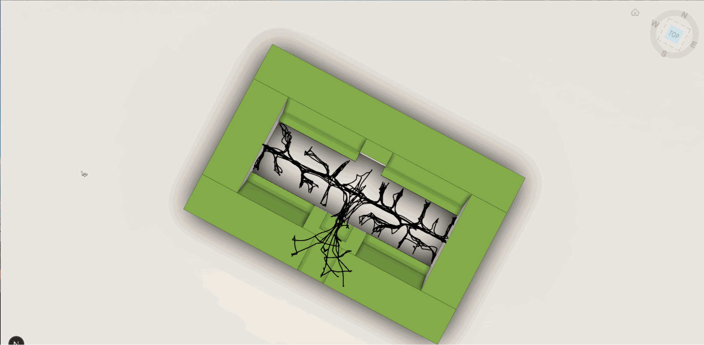
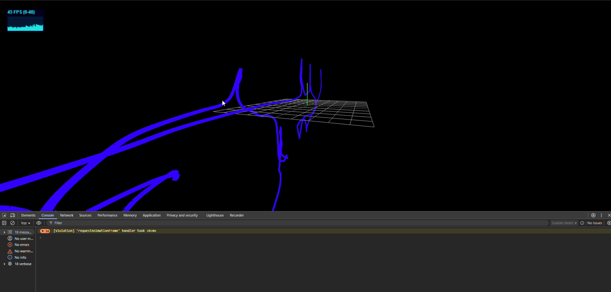
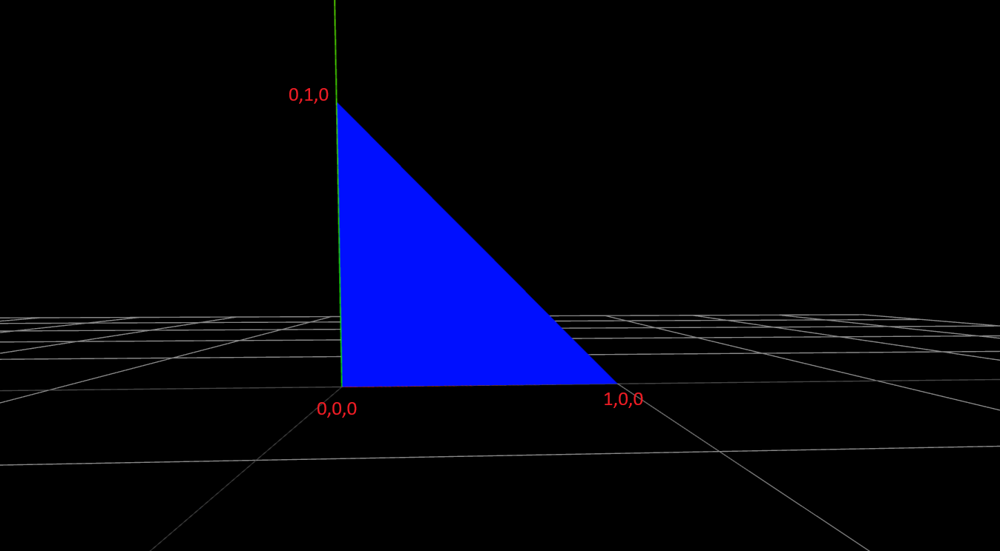
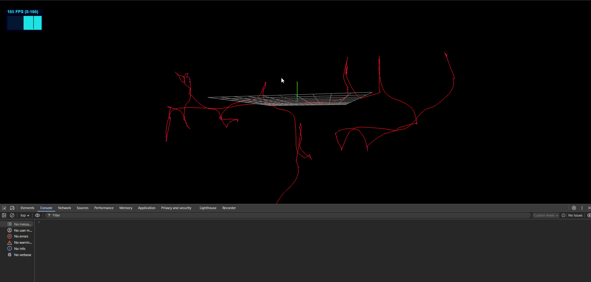
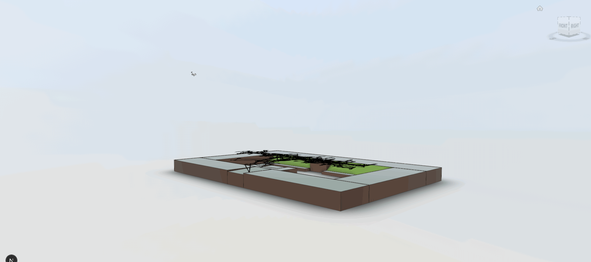

# Improve Performance on Three.js Scenes Using Custom Meshes and BufferGeometry

**Three.js** is a JavaScript library that lets developers build 3D experiences for the web. It comes with a full set of tools for creating objects, lights, cameras, animations, and more.
But what happens when we need more complex objects, or we run into a situation where the library doesn’t provide exactly what we need out of the box?
In this article, we’ll explore a real-world case where it was necessary to dive into some of Three.js’s more advanced concepts to improve performance and create a smooth experience.

## Introduction

[Three.js'](https://threejs.org/) main goal is to drastically simplify the process of creating a 3D scene. It was created by Ricardo Cabello, better known as Mr.doob, and has grown into one of the most popular 3D libraries for the web. Its popularity comes from the fact that it makes working with WebGL far more accessible–developers can create 3D scenes with just a few lines of code, without needing to master the complexities of low-level graphics programming. This ease of use, combined with its flexibility and open-source nature, has attracted a large community of developers who continue to contribute new features, fixes, and examples.

That said, there are times when we need to rely on more advanced techniques and drop down a layer of abstraction. For example, when rendering becomes **sluggish and unnatural, animations stutter, objects don’t feel smooth, and the scene looks more “computer generated” than real-time interactive, we need finer control to improve performance.** Three.js makes this possible because it’s built directly on top of WebGL, which means we can still interact with the lower-level API when we need finer control, as in this example.

**WebGL**(Web Graphics Library) is a JavaScript API that enables rendering interactive 2D and 3D graphics inside compatible browsers, using a `<canvas>`. It’s based on [OpenGL ES](https://www.khronos.org/opengles/) (a variant designed for embedded systems) and managed by the **Khronos Group**. Its speed comes from leveraging the device’s GPU to handle heavy graphics calculations.

## Basic Concepts

Before diving into performance optimizations, it’s important to revisit a few **basic concepts in Three.js and WebGL**. These terms will appear throughout this article, and having a clear understanding of them will make it easier to follow along with the examples and reasoning.

* **Mesh**: A geometric representation that defines the shape and appearance of a 3D object. In Three.js, a `Mesh` is created by combining a **Geometry** and a **Material**.
* **Geometry**: Defines the points (vertices) and faces (triangles or polygons) that make up a 3D model.
* **Material**: Defines the visual appearance of a 3D object’s surface. Materials control how light interacts with the surface, affecting color, brightness, transparency, textures, and other visual effects.
* **Shader**: A program written in **GLSL** that runs on the GPU. Shaders are used to position each vertex of a geometry and to determine the color of each visible pixel.
* **Vertex Shader**: Its purpose is to compute the final position of the geometry’s vertices on the screen.
* **Fragment Shader**: Its purpose is to assign a color to each fragment (potential pixel) of the visible geometry.
* **World Transformations**: Transformations applied to a 3D object to position, rotate, and scale it within the global space or "world" of the scene. These transformations define how an object is positioned and oriented relative to the scene's global coordinate system.

## Optimizing rendering speed

Some companies provide libraries or tools that come with preconfigured scenes, making it easy for users to load and visualize their models. One example is **[Autodesk Forge Viewer,](https://aps.autodesk.com/blog/new-autodesk-forge-viewer-70-now-available)** a tool designed to display BIM (Building Information Modeling) models. BIM is a methodology for creating and managing digital representations of buildings and infrastructure, and it’s widely adopted across the industry.[ It’s what we used in this example.](https://videos.autodesk.com/zencoder/content/dam/autodesk/videos/bim-for-architects-page/Autodesk_What%20is%20BIM_20211207.mp4)

Forge Viewer itself is built on top of **Three.js **and has become a common solution for companies that need to share and interact with complex 3D models directly in the browser.

However, since every company has its own niche and specific requirements, the viewer often needs features that go beyond what the standard Three.js API provides. A good example is **sectioning and measurement tools**. Forge Viewer adds such tools on top of Three.js because industries like architecture and engineering rely on them, although they’re not part of the base Three.js API.

In this case,** Forge Viewer runs on Three.js version r71**, while at the time of writing this article the library has already reached version **r180**. This gap limits the number of modern features and functionalities that can be used directly.

For the case study in this article, the requirement was to render paths made up of multiple points (around **11,000 or more**). The first approach was to use the Three.js API with the built-in <code>[CylinderGeometry](https://threejs.org/docs/?q=cylinder#api/en/geometries/CylinderGeometry)</code>. However, the performance when interacting with the scene turned out to be very poor, the model felt **laggy and not smooth**, with frame rates dropping to around **25–30 FPS**. For reference, a stable **60FPS (Frames Per Second) is generally considered the standard for a smooth real-time experience**, since faster speeds aren’t perceived as being any smoother by the human eye.

As you can see in the following example, moving the model caused noticeable stuttering, making the interaction uncomfortable and far from real-time. 



In modern **Three.js**, you can use <code>[InstancedMesh](https://threejs.org/docs/?q=instanced%20mesh#api/en/objects/InstancedMesh)</code>, a special type of <code>[Mesh ](https://threejs.org/docs/?q=instanced%20mesh#api/en/objects/Mesh)</code>designed to optimize performance when rendering many objects that share the** same geometry and material** but have **different world transformations (position, rotation, scale)**. This feature would have been a perfect fit for our requirement of rendering thousands of path segments.

The problem is that `InstancedMesh` wasn’t introduced until **Three.js version r122**, long after the **version r71** that Forge Viewer is built on. This meant we couldn’t rely on that optimization in our setup.

Faced with this limitation, we had to look for an alternative that solved the performance issue and worked within the constraints of Three.js r71 and the Forge Viewer architecture.** Rather than create** **thousands of individual geometries**, we decided to find a way to batch the rendering of paths into a single draw call, or at least as few as possible.

## Object Pool Design Pattern

This pattern keeps** a pool of pre-created objects and reuses them as needed**, rather than constantly instantiating and destroying objects. This avoids the overhead of frequent allocation and garbage collection, which can significantly degrade performance when thousands of objects are involved.

A classic example can be found in video games with projectiles: instead of creating a new bullet object every time the player shoots a gun, the engine keeps a pool of 100 pre-made bullets that are simply “activated” and “deactivated” in the animation automatically as needed This way, the system doesn’t waste time and resources creating and cleaning up objects on every shot.

In our case with **Three.js r71 inside Forge Viewer**, we applied the Object Pool pattern to manage cylindrical geometries used as path segments. Whenever a new segment needed to be rendered, we reused an existing geometry from the pool rather than creating a brand-new one.

However, this strategy was not enough to significantly improve performance. While the **Object Pool** slightly reduced the cost of creating and destroying geometries, the main bottleneck remained in the sheer number of draw calls and how Three.js r71 handled rendering thousands of objects.

We continued optimizing performance and decided to directly leverage how Three.js sits right on top of WebGL to explore a more low-level solution that’s closer to the hardware and more suitable for this scenario.

## Step 1: replicate the problem in an isolated environment

To get a clearer picture of the problem, we created a brand-new scene, completely isolated from the main project. In this scene, we replicated only the **core feature**: rendering paths built from thousands of points.

This allowed us to observe the performance issue in its purest form, without interference from the rest of the viewer logic or the application itself. The goal was simple: **pinpoint exactly where the bottleneck was** and use that insight to design a more effective optimization strategy.

The main content of the code is:

```dart

const validPointsData = thousandsOfPointsIn3DSpace;
const material = new THREE.MeshBasicMaterial({color: 0xFFF});

for (let i = 0; i < validPointsData.length - 1; i++) {
    …
    const cylinder = new THREE.CylinderBufferGeometry(radius, radius, 1, 3, 3);
    …
    const line = new THREE.Mesh(geometry, material);
    scene.add(line);
}

```

Which creates a path trajectory using the points in 3D space.

It shows a performance below the 30 FPS:



## Step 2: Using Buffer Geometry And Custom Mesh to improve performance

Luckily, Three.js provides **[BufferGeometry](https://threejs.org/docs/?q=buffera#api/en/core/BufferGeometry)**, which is a representation of mesh, line, or point geometry. With `BufferGeometry` you can manually define where in space the vertices of your custom geometry will be located. This feature was introduced in **r58 **so we can use it in Forge Viewer.

The classic example is drawing a triangle. First, we create an empty `BufferGeometry`:


```dart
const geometry = new THREE.BufferGeometry()
```

Then we define the positions of the vertices. A triangle has **3 vertices**, and each vertex is described by **X, Y, Z** coordinates. That means we need to store 9 values in total. For this we use a <code>[Float32Array](https://developer.mozilla.org/en-US/docs/Web/JavaScript/Reference/Global_Objects/Float32Array)</code>, a **native JavaScript typed array** with a fixed length. It’s commonly used to load buffers to the GPU efficiently.


```dart
const positionsArray = new Float32Array([
    0, 0, 0, // First vertex
    0, 1, 0, // Second vertex
    1, 0, 0  // Third vertex
])
```


Remember, the **Vertex Shader** is responsible for positioning each vertex of a geometry. Since shaders run on the **GPU**, we need to pass the data from the CPU to the GPU.

Three.js makes this possible with **[BufferAttribute](https://threejs.org/docs/?q=buffera#api/en/core/BufferAttribute)**, which stores data for an **attribute **that can then be consumed by shaders. **Attributes **are variables used to pass data to vertices in the Vertex Shader. This data can vary from vertex to vertex.

In this case, we add an attribute named `position`, because that’s what the built-in Three.js shaders expect for vertex positions.


```dart
const positionsAttribute = new THREE.BufferAttribute(positionsArray, 3)
geometry.setAttribute('position', positionsAttribute)
```


So, the final code looks like this:


```dart
const geometry = new THREE.BufferGeometry()
const positionsArray = new Float32Array([
    0, 0, 0, // First vertex
    0, 1, 0, // Second vertex
    1, 0, 0  // Third vertex
])
const positionsAttribute = new THREE.BufferAttribute(positionsArray, 3)
geometry.setAttribute('position', positionsAttribute)

const material = new THREE.MeshBasicMaterial({ color: 0xFFF);
const mesh = new THREE.Mesh(geometry, material)
scene.add(mesh)
```


This small example draws a **triangle at the low-level**, directly controlling how vertex data is stored and passed to the GPU.



Now that we understand how `BufferGeometry` works, we can take advantage of external libraries that simplify the process of rendering advanced lines. A great example is[ THREE.MeshLine](https://github.com/elifer5000/THREE.MeshLine) which solves several challenges when drawing lines in Three.js, such as thickness, smooth curves, and support for trajectories defined by a large number of points.

What makes this particularly useful is that this library actually requires us to define a `BufferGeometry` first, so it fits perfectly with the technique we just explored.

Applied to our scenario with thousands of path points, the simplified code looks like this:


```dart
const validPointsData = thousandsOfPointsIn3DSpace;
const material = customMaterial; // Custom material provided by Lines Library
const meshLine = new MeshLine(); // Lines library

const positions = new Float32Array(validPointsData.length * 3);
validPointsData .forEach((point, i) => {
    positions[i * 3] = point[0];
    positions[i * 3 + 1] = point[1];
    positions[i * 3 + 2] = point[2];
});

const geometry = new THREE.BufferGeometry();
geometry.setAttribute('position', new THREE.Float32BufferAttribute(positions, 3));
meshLine.setGeometry(geometry, () => 10); // Line thickness
const mesh = new THREE.Mesh(meshLine.geometry, material);
scene.add(mesh);
```

The results were immediate–the FPS jumped up to over **160FPS**, which is far beyond the stable 60FPS usually recommended for a smooth experience. We can attribute the fast results to the fact that we’re no longer rendering **thousands of individual Meshes**, but rather a **single Mesh** with geometry defined by all the path points.



After applying this technique on the Autodesk Forge Viewer project, the difference was clear. The interaction became **smooth and responsive**, with frame rates climbing to **over 160 FPS**—far above the 60 FPS baseline that is generally considered the standard for a fluid real-time experience.



## Conclusion

As we’ve seen, by taking more control over how the geometry is defined, we were able to boost performance from **30 FPS or less** up to **165 FPS**, which translates to about a **450% improvement** in a controlled environment.

Many geometries are simple enough to be represented directly with **BufferGeometry**, which brings us closer to the low-level power of WebGL, while still keeping the ease-of-use and abstraction provided by [Three.js](https://threejs.org/).

**BufferGeometry is particularly valuable when**:


* You need to render **a large number of repeated objects** (paths, particles, repeated segments).

* You want to minimize the number of **draw calls** for better GPU efficiency.

* You need **custom or uncommon geometries** not included in Three.js built-in primitives.

* You want to optimize how data is passed between CPU and GPU by leveraging **typed arrays** and compact attributes.


In short, **stepping into BufferGeometry gives you the best of both worlds**: more control, better performance, and the flexibility to customize your scenes while staying inside the Three.js ecosystem.

# Useful Resources

* [https://videos.autodesk.com/zencoder/content/dam/autodesk/videos/bim-for-architects-page/Autodesk_What%20is%20BIM_20211207.mp4](https://videos.autodesk.com/zencoder/content/dam/autodesk/videos/bim-for-architects-page/Autodesk_What%20is%20BIM_20211207.mp4)
* [https://aps.autodesk.com/developer/learn/viewer-app/overview](https://aps.autodesk.com/developer/learn/viewer-app/overview)
* [https://sbcode.net/threejs/geometry-to-buffergeometry/](https://sbcode.net/threejs/geometry-to-buffergeometry/)
* [https://mattdesl.svbtle.com/drawing-lines-is-hard](https://mattdesl.svbtle.com/drawing-lines-is-hard)
* [https://threejs.org/examples/?q=lines#webgl_interactive_lines](https://threejs.org/examples/?q=lines#webgl_interactive_lines)
* [https://codeburst.io/improve-your-threejs-performances-with-buffergeometryutils-8f97c072c14b](https://codeburst.io/improve-your-threejs-performances-with-buffergeometryutils-8f97c072c14b)

