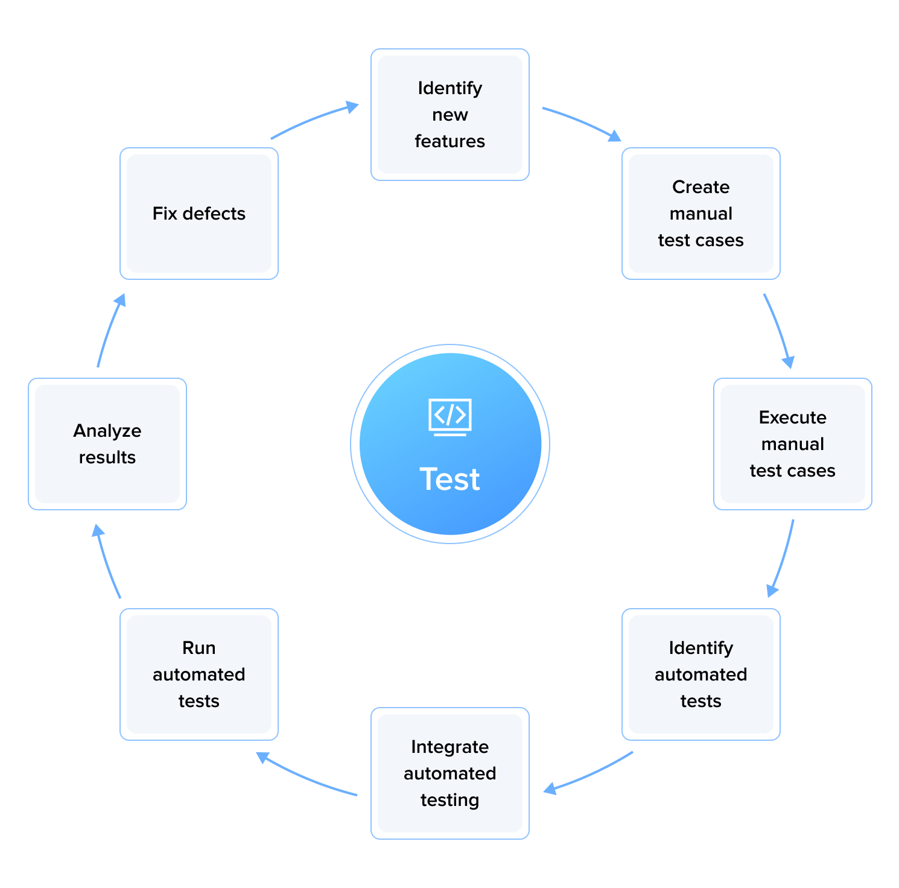
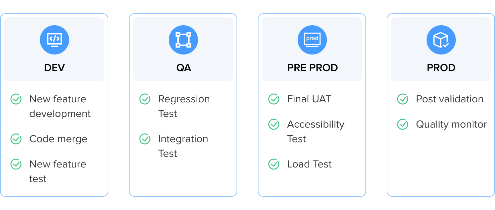
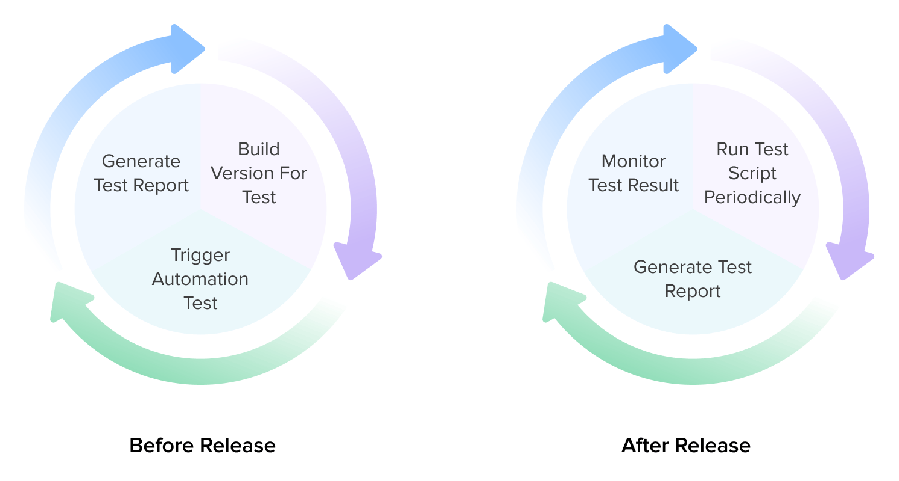

## Introduction

Testing, at its core, is a practice to ensure that software behaves as intended while identifying any discrepancies or defects before they impact the end user. However, effective testing is not just about finding bugs but instilling confidence in the development team and stakeholders that the software will perform consistently under diverse conditions and over time.

A multitude of goals drives the adoption of testing best practices. These include affirming the software's quality, enhancing the user experience, and safeguarding against future complexities. A well-defined testing strategy can streamline development cycles, optimize resources, and minimize post-release issues, ultimately leading to a more successful product and a satisfied customer base.

Despite the benefits, these practices come with their own set of challenges. Complex codebases, evolving technologies, tight deadlines, and resource constraints pose significant hurdles. With the myriad of tests—from unit to integration to system testing—the need to prioritize becomes paramount. Moreover, there's a pressing requirement to incorporate these practices into agile methodologies and continuous integration pipelines, ensuring they add value and not overhead.

This article delves into the testing best practices 57blocks QA teams leverage to overcome these obstacles. These practices are both theoretical ideals and pragmatic approaches honed by real-project experiences. We'll explore how adopting these practices can alleviate difficulties and transform them into opportunities for improving software quality, team efficiency, and project outcomes.

## New feature manual testing and automated regression tests

- **Identify the new features**: When new features are added to the software, it is important to identify them, know how they work (within the system and how they impact the system), and ensure they are tested thoroughly.
- **Create and review manual test cases**: Manual test cases should be created and reviewed to test the new features, including any edge cases or scenarios that automated testing may not cover. Here are the critical elements to consider when writing a manual test case: Test Case ID, Title, Description, Preconditions, Module/Feature, Test Steps, Test Data, Expected Result, Actual Result (to be filled during test execution), Status (to be filled during test execution), Priority, Owner, Severity, Comments/Notes.
- **Execute manual test cases**: The test cases should ensure the new features work as intended and identify any issues or defects. Implementing new features may affect existing automated test cases, so start building automated tests in parallel to ensure the new functionality is integrated and doesn't impact the automated test cases.
- **Identify, create and update automated tests**: Consider which tests should be identified to automate. Automate repetitive, time-consuming regression tests that verify core functionality and don't change frequently. Also existing automated tests affected by changes and new features should be updated.
- **Integrate automated testing**: Once the manual testing of new features is complete, automated testing should be integrated into the testing process.
- **Run automated tests**: Automated regression tests should be run to ensure that the new features do not negatively impact existing software functionality.
- **Analyze test results**: The results of both manual testing and automated regression testing should be analyzed to identify any issues or defects.
- **Fix issues and defects**: Any issues or defects identified during testing should be fixed, and the testing process should be repeated until all issues are resolved.

This process should be repeated for each release, focusing on testing new features and ensuring that the software's existing functionality is not impacted.

## Why you should prepare multiple environments

Multiple test environments ensure that the software application is thoroughly tested and validated before it is released to end-users. Each environment serves a specific purpose in the software development and testing process.

- **Development environment**: Developers use the development environment to write and test code. This location is typically used for unit testing and integration testing, and it may include tools such as debuggers, code editors, and other development tools.
- **QA environment**: The QA environment tests the software application in a more realistic environment. This environment is typically used for regression, user acceptance, and performance testing and environment should closely resemble the production environment to ensure accurate testing.
- **Pre-production environment**: Perform final UAT, load testing, and accessibility testing in pre-production. It tests the software application in a production-like environment. It is typically used for testing the deployment process, integration with other systems, and final testing before the release.
- **Production environment**: Monitor, optimize and minimally test in production. This is the live environment where the software application is deployed and used by end-users. It should be stable, secure, and reliable and be closely monitored to ensure availability and performance.

## Using Jenkins for continuous testing, quality monitoring, and deployment

Using Jenkins to build a project, trigger tests, and generate a test report before releasing the software application helps ensure that the software is thoroughly tested and validated before it is released to end-users. Jenkins can help minimize the risk of issues and defects in the final product and ensure that the software meets the quality standards of the development team.

Before release, Jenkins can integrate development and automated testing to detect risks as early as possible.

- **The first step in the development environment**: Creating and configuring a new project in Jenkins. This involves defining the steps necessary to build the software application, such as compiling the code, packaging it, and deploying it to a test environment.
- **Configure test automation**: Once the build job is configured, the next step is configuring automated tests to run as part of the build process. This can include unit tests, integration tests, and other automated tests.
- **Configure a trigger**: Jenkins can be configured to automatically trigger a build when code changes are committed to the version control system. This ensures that builds are automatically QA-checked whenever changes are made to the codebase. We can extend this functionality to create different triggers, such as a trigger for code changes, a trigger to happen at a specified time, or a manual trigger.
- **Run automated tests**: Once the build job is triggered, Jenkins will automatically run the configured automated tests. The tests will be run in the test environment, and Jenkins will record the results.
- **Generate a test report**: Once completed, Jenkins will generate a report summarizing the test results. The report will include information such as the number of tests that passed, the number of failed tests, and any errors or issues encountered during the testing process.
- **Review and analyze the test report**: The test report should be reviewed and analyzed to ensure the software application is ready for release. Any issues or errors identified during testing should be addressed before releasing the software application.
- **Release the software application**: Once the testing process is complete and all issues or errors have been addressed, the software application can be released to production.

After the software application has been released, here’s how Jenkins can monitor the production environment for any issues or errors.

- **Set up monitoring tools and automated test jobs**: To monitor the production environment, you will need to run automated test jobs and set up monitoring tools such as log aggregation tools, performance monitoring tools, and error tracking tools. These tools will help identify any issues or errors in the production environment.
- **Analyze logs**: Jenkins can analyze metrics and logs from the production environment to identify any issues or errors. This can include analyzing performance metrics, error logs, and other relevant data.
- **Automate remediation**: If issues or errors are detected in the production environment, Jenkins can automatically remediate them or alert the relevant team members to address them.
- **Continuously improve**: Monitoring the production environment using Jenkins is an ongoing process. By analyzing the data and identifying areas for improvement, the development team can continuously improve the software application and ensure that it meets the end user’s needs.

## Choose a suitable script/language/framework for the project and team

Different kinds of tests require different frameworks. Most test frameworks can support multiple languages. 57Blocks has projects using both Python and Javascript. The choice between Python and JavaScript will depend on the project requirements and the team's skills. JavaScript may be better if the project is web-based and requires front-end testing. However, if you are looking for a language that is easy to learn and has a rich set of test libraries, then Python may be the better choice.

### The benefits of the Python test framework:

- **Easy to learn**: Python is known for its simple syntax, which makes it easy for beginners to learn and use.
- **Large community**: Python has a large and active community, which means a wealth of resources and support is available.
- **Rich test libraries**: Python has a rich set of test libraries, such as PyTest and unittest, offering a range of automation testing features.
- **Multi-purpose language**: Python is a multi-purpose language that can be used for various tasks beyond automation testing.

### Benefits of the JavaScript test framework

JavaScript is a popular choice for web applications, which means it is well-suited for automation testing web-based applications.
- **Front-end testing**: JavaScript is commonly used for front-end testing, which means it can be integrated with popular front-end frameworks such as React and Angular.
- **Large community**: JavaScript has a large and active community, which means a wealth of resources and support is available.
- **Cross-functional testing**: JavaScript can be used for both front end and backend testing. When both front end and backend tests are written in JavaScript, they can be managed using the same tools. Developers and testers can run them as part of a Continuous Integration/Continuous Deployment (CI/CD) pipeline. This ensuring that tests for both the client and server sides are automatically running on every commit.

## Set up an automation framework

Setting up an automation framework for a project can help you streamline your testing efforts and improve the overall quality of your application.

- **Identify reusable UI components**: This includes page objects like text boxes, buttons, links, etc. that are reused across tests and the site.
- **Use locators wisely**: Locators like ID, name, XPath, CSS, etc. are used to find UI elements. Elements may sometimes change due to new features and bug fixes. Using locators wisely  in automated tests is important and helps reduce changes in automated tests. Make the locators as specific as possible. We prefer using ID and name over XPath.
- **Modularize the tests**: Break down large end-to-end tests into smaller, focused tests based on functionality. This makes the tests easier to maintain and debug. Integrating the automated testing framework with BDD (Behavior-driven development) or BDD thinking is better for making the test easier to understand and reducing code changes caused by business changes.
- **Use data-driven testing**: Pass test data from external files (Excel, CSV) and iterate your tests over the data. This allows you to expand test coverage without writing too many repetitive tests.
- **Add assertions**: Validate that the actual results of UI interactions match the expected results. Check and verify elements like page title, URL, button text, form field values, etc.
- **Add screenshots and videos**: This helps debug failed tests and understand what went wrong at runtime.
- **Run tests in a CI/CD pipeline**: Run automated UI tests in a continuous integration server like Jenkins, Travis CI, etc. This ensures the tests are run for every code change and maintains the quality of the build.
- **Maintain the test suites**: Keep the test code clean and up to date with the changes in the application.
    - Refactor tests when the UI changes
    - Delete redundant tests
    - Add new tests as needed to support new functionality. 

- **Report intelligently**: In many cases, the best solution is to combine framework-provided reports for immediate feedback with extensive Jenkins reports for continuous tracking and visualization.
    - Use the test framework's reporting features to view reports, statistics and graphics based on test runs. This gives you visibility into the quality and coverage of automated tests. The framework-provided reports typically include test results of pass/fail status for each test, often with error messages and stack traces for failures. It also provides timing information regarding how long each test took to run, which can help identify slow tests or potential performance issues. These reports are valuable for immediate feedback on the latest changes. We run tests locally or on a development server to see whether the recent code changes have caused any regressions.
    - Jenkins-generated reports allow the team to monitor the average test run duration, providing a clear visual if there has been a gradual increase in testing times due to recent commits.

