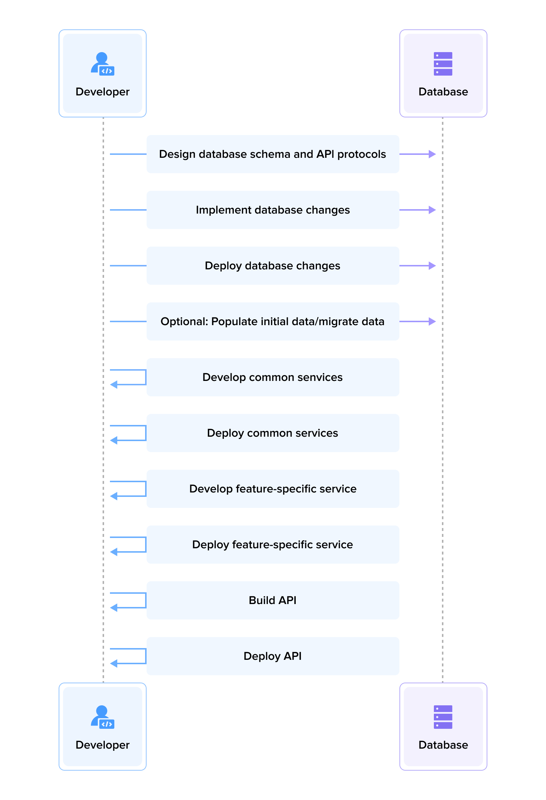
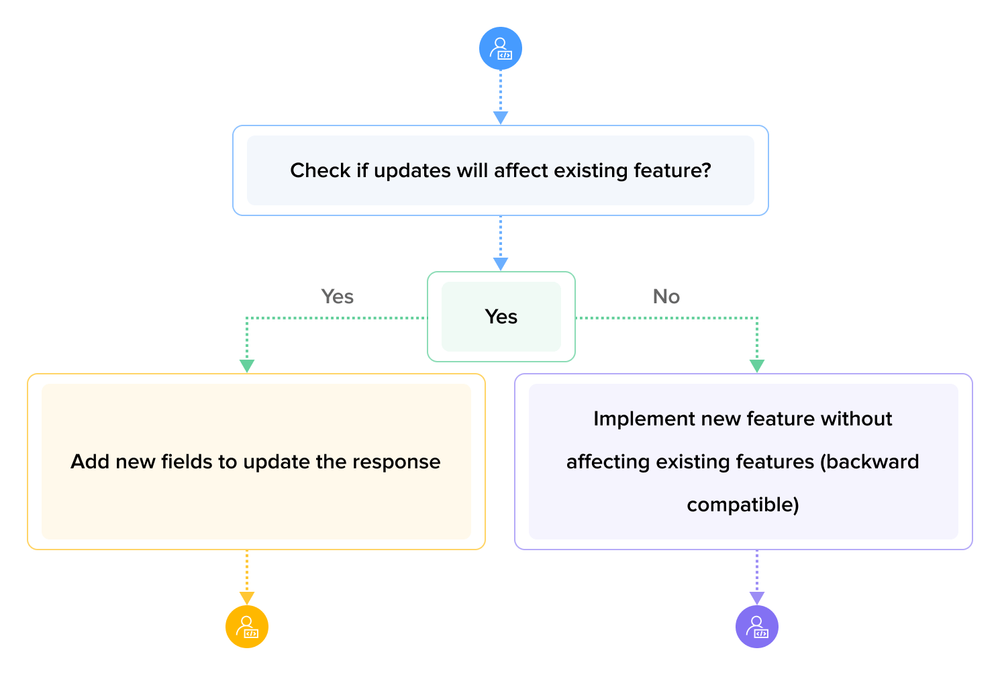

## Abstract

Do you face challenges when deploying large features? Do you need to temporarily shut down services to ensure the smooth functioning of an entire feature, such as managing basic data feeding, migrating legacy data, or avoiding disruptions to dependent clients? 

In most cases, you can avoid this by adopting the practice of shipping as small as possible, which aligns with the principles of Continuous Integration and Continuous Deployment (CI/CD).

## Getting Started

It is essential to break down features into manageable components to achieve the goal of shipping small, solid, and deliverable changes. The following principles can guide us in this process.

### New Features

Building new features without exposing them to clients or users is relatively easy. However, it’s important to keep them as small as possible. Here's a recommended approach:

- Create the basic or common changes required as a foundation for upcoming logic or features. This may include database modifications and the development of common services/components.
- Build the feature from the bottom up or in reverse order, starting from the database layer, moving to the service layer, and finally constructing the protocol/interface layer.
- Construct new exposed UI/APIs.

### Existing Features

When constructing features that build upon existing ones, consider compatibility for the new and updated features. This ensures a smooth transition and prevents disruptions to existing systems. Here are some approaches to consider: 

1. Don’t initialize new changes if dependencies are not ready, such as setting up a new message queue or SMS service.
2. Add a feature flag that allows the changes to be disabled based on specific conditions. For example, you may want to hide all change information from users or specific user groups.
3. Instead of updating existing features directly, consider adding new features alongside the old ones. For example, if you need to modify a field in the response, it is better to mark the old field as deprecated and introduce a new field. This ensures compatibility with different services that rely on the old field.
4. Create a new API version when the changes significantly alter the original structure or if the response data structure needs a different format.

### Other Considerations

To ensure smooth shipping, you should take additional actions in these areas:

- Split the feature into deliverable pieces during the technical design phase.
- Use pull requests to facilitate team review and minimize the risk of system disruptions.
- Leverage CI/CD to run tests that cover the core logic.
- Establish a reliable shipment channel to notify the team about changes.
- Enable A/B testing for clients to validate the new feature changes.

## Pros

Adopting the practice of shipping as small as possible offers several advantages:

- Reasonable splitting of changes.
- Easy review of each change, allowing for the detection of potential issues before deployment.
- Simplification of the branch model.
- Faster delivery of changes.
- Preemptive data feeding and migration of legacy data to new schemas.
- Verify changes by clients before their release.
- Ability to release new features to clients at any time.

## Cons

There are some considerations and challenges associated with shipping small changes.

- There is a risk of breaking existing features if changes are incompatible with existing clients.
- There is a need to block public client access to changes during specific stages.
- Setting up feature flags to enable changes when needed and removing them once the new version is stable.

## Examples

### Build a New API

For backend services, creating new APIs for new features typically follows this sequence:

1. Design the database schema and API protocols.
2. Implement the database changes and deploy them to production without causing disruptions.
3. Optional: Populate initial data for the new data schema if necessary.
4. Develop and deploy common services required for upcoming APIs.
5. Build the APIs incrementally, shipping them one by one.
6. Ensure careful access control to prevent premature exposure of new APIs.

### Update Existing APIs

When modifying APIs used by various components, it’s important to avoid breaking existing systems. Instead, consider these approaches:

- Determine whether changes can be made to the existing API without causing issues.

    - If yes, add new fields to update the response. For example, if the existing API only returns a user's name but requirements dictate displaying the user's information, add an object field to contain all user information.
    - If not, create a new version of the API to replace the existing one.

### Build a New UI

The same principles applied to building new APIs can be followed when building new user interfaces. However, it is important to consider when to expose the UI publicly. Confirm the following:

1. Define who can access the UI and when.
2. Develop the appropriate entry point for users to access the new UI.
3. Determine the process for shipping the new UI once it is completed.

### Update Existing UIs

Updates to existing user interfaces often require new APIs. In such cases, both versions of the UI can coexist to allow for a gradual transition. Use a feature flag to determine which version is displayed to each user. Once one version is confirmed to be successful, update the feature flag to make the preferred version available to all users.

## Summary

By adopting the practice of shipping as small as possible, you can expedite the deployment of changes without waiting for the entire feature to be completed. This approach minimizes the risk of rolling back an entire feature if it doesn't function as expected since reverting to previous features can be done on a smaller scale.

Shipping small changes offers numerous benefits, including reasonable change splitting, ease of review, streamlined branch models, faster delivery, early data feeding, seamless legacy data migration, client verification before release, and the ability to release new features anytime. However, the potential drawbacks include the risk of breaking existing features, the need to control public client access to changes, and the management of feature flags.

By following the recommended approaches and considering these examples, you can effectively manage small shipping changes, ensure smoother deployments, and minimize system disruptions.
