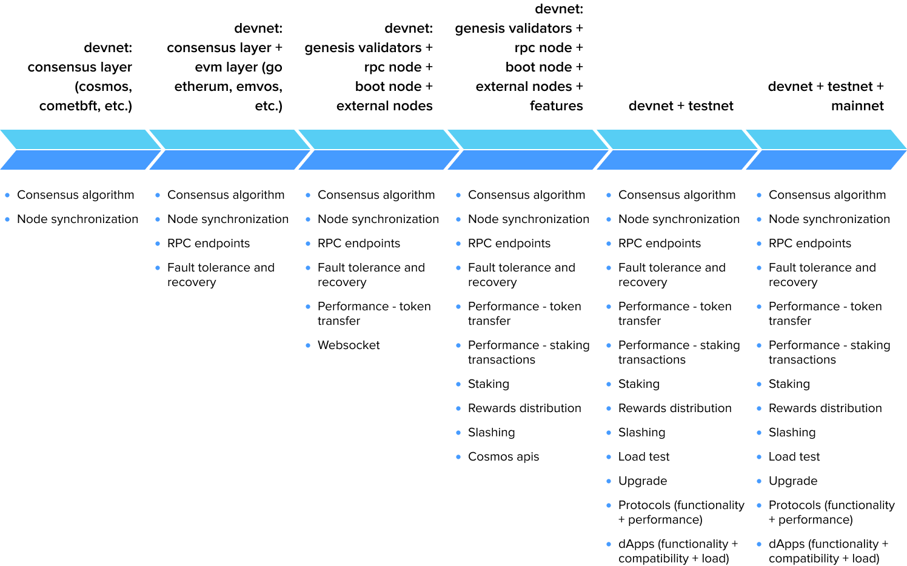
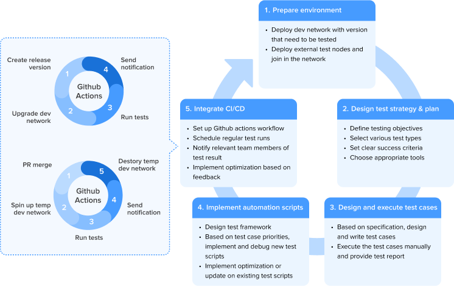
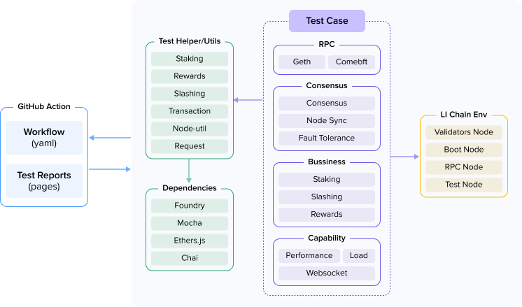

## Introduction

Layer 1 blockchains, like any software, always needs to be tested before deployment. But testing a Layer 1 blockchain requires a very different mindset to approach QA strategy and test plans since bugs can't simply be patched after deployment and these bugs can cause catastrophic outages and significant investment loss. Here, we describe the best practices we use to approach Layer 1 blockchain testing to reduce immutability, financial exposure, systemic risks, boundary complexity, cryptoeconomic attacks, and adversarial environments.

### What the Article Will Cover

This article is a comprehensive guide tailored for developers and QA testers aiming to master the intricacies of testing L1 blockchains built with EVM and Cosmos. We will delve into the necessity of testing these foundational systems, exploring various types of testing including functional, performance, and smart contract testing. Additionally, we will provide a step-by-step guide on conducting efficient L1 blockchain testing, from setting up the testing environment to implementing automation and leveraging modern test frameworks. By the end of this guide, you will gain a deeper understanding of strategies and tools essential for ensuring that you have robust, secure, and scalable blockchain solutions.

### Brief Explanation of L1 Blockchain

A Layer 1 (L1) blockchain is the base layer of a blockchain network that provides the fundamental infrastructure for decentralized transactions and applications. It handles transaction validation, consensus, and security directly on its protocol.

Examples:

* Bitcoin: The first and most well-known L1 blockchain focused on secure, peer-to-peer digital currency transactions.  
* Ethereum: A platform for building decentralized applications and smart contracts, enabling complex programmable transactions.  
* Solana: Offers high throughput and fast transaction times, ideal for scalable decentralized apps.  
* Stellar: Designed for quick, low-cost cross-border payments and financial transactions.

Layer 1 blockchains serve as the foundational networks upon which other layers and applications rely. These blockchains maintain the protocol rules, consensus algorithms, and network architecture essential for transaction validation and data recording. EVM-based blockchains, such as Ethereum, offer robust environments for decentralized application (dApp) development through smart contracts, enabling automated and trustless transactions. In contrast, Cosmos leverages a modular approach with its SDK, facilitating the creation of sovereign blockchains interoperable within a wider ecosystem via the Inter-Blockchain Communication (IBC) protocol.

EVM and Cosmos represent different approaches to blockchain architecture, but have developed significant interconnectivity. While EVM-based chains like Ethereum use a single shared execution environment where all applications compete for resources, Cosmos creates specialized, sovereign blockchains optimized for specific applications. However, Cosmos bridges this architectural gap through EVM-compatible zones like Evmos and Cronos, allowing developers to deploy Ethereum-compatible smart contracts within the Cosmos ecosystem. These zones benefit from Cosmos's scalability and interoperability while maintaining compatibility with EVM tooling and libraries. Through IBC, Ethereum assets and data can flow between Cosmos chains, and solutions like Gravity Bridge facilitate direct communication between Cosmos and Ethereum mainnet. This relationship provides developers flexibility to leverage the security and network effects of Ethereum while accessing Cosmos's sovereignty and interconnection capabilities.

### Importance of Thorough Testing in Blockchain Technology

The complexity and security demands of L1 blockchains necessitate rigorous testing to ensure their functionality, security, and resilience. Testing is vital for identifying and mitigating vulnerabilities, ensuring that the consensus mechanisms operate flawlessly, while optimizing performance under various conditions. With financial transactions and critical data processing at stake, any flaw can lead to significant economic losses, data breaches, or network outages. Thus, comprehensive testing not only safeguards the blockchain's integrity but also builds trust among users and developers and is vital to prevent catastrophic failures. For instance: 

**Solana Network Outages (2022):** Repeated crashes under high traffic highlighted the consequences of insufficient stress testing. Simulating real-world transaction loads pre-launch could have improved network resilience.  

**The DAO Hack (2016):** A reentrancy vulnerability in Ethereum’s DAO smart contract, undetected due to inadequate adversarial testing, led to a $50M theft and forced a chain split. Rigorous audits could have identified the flaw. 

**BSV 100-Block Reorganization (2021):** Bitcoin SV (BSV) experienced a massive 100-block reorganization attack when an attacker took advantage of its increased block size. This protocol-level vulnerability showed inadequate testing of consensus security with larger blocks, a fundamental parameter of the blockchain.

**Polygon's Heimdall Bridge Critical Bug (2021):** A vulnerability in Polygon's Heimdall bridge (core infrastructure for the Polygon blockchain) could have allowed an attacker to drain all funds. This was a critical bug in the consensus mechanism of a Layer-2 solution, showing inadequate formal verification of bridge consensus.

**Solana's Durable Nonce Bug (2022):** A protocol-level bug in Solana's transaction processing caused inconsistent behavior between validators when handling durable nonce transactions. Some validators accepted resubmitted transactions while others rejected them, creating a network fork and 4.5-hour outage. This was a fundamental consensus-level issue that better transaction edge case testing would have caught.

These cases demonstrate that comprehensive testing at the blockchain protocol level is critically important, far exceeding the significance in traditional software development. Addressing six key factors in a test strategy and plan could identify bugs early and prevent outages and attacks described in the cases above: 

* **Immutability**: The immutability of blockchain code makes errors difficult to fix, as demonstrated by the Polygon Heimdall Bridge vulnerability persisting for 5 years;
* **Financial Exposure**: Protocol-level vulnerabilities directly threaten user funds, potentially leading to billions in losses as seen in the DAO hack;
* **Systemic Risks**: Systemic risks enable cascading failures, as the Heimdall vulnerability could have collapsed the entire bridge system;
* **Boundary Complexity**: Complexity at system boundaries, like the Ethereum Log Confusion error, requires thorough testing to discover;
* **Cryptoeconomic Attacks**: Novel cryptoeconomic models must be tested against game-theoretic attacks, exemplified by the Polygon consensus bypass vulnerability;
* **Adversarial Environment**: The highly adversarial environment means that even attacks costing ``$50,000-$100,000`` to execute remain worthwhile for attackers eyeing a potential $2 billion payoff.

These factors collectively create an urgent need for rigorous, comprehensive testing of blockchain protocols.

## Types of L1 Blockchain Testing

Depending on the development stage of the L1 blockchain, various tests will be carried out step by step.
:::center

:::
### Functional Testing

This type of testing ensures every feature of the blockchain works as intended, including negative and positive tests. It covers several critical aspects. 

* #### Consensus Algorithm Integrity

Verify that the consensus protocols are functioning correctly in maintaining agreement across the network. Also be sure to test for common scenarios where nodes might deviate due to bugs or malicious attempts.

* #### Node Sync

Node sync testing ensures that nodes in the network can synchronize and share data without errors. Further, this testing evaluates how efficiently and accurately a node can sync with the rest of the network, from the initial block to the current state. It involves validating the complete download and verification of blockchain data, assessing the time taken for a node to sync under various network conditions, and ensuring that the node remains fully operational and accurate throughout the process. Additionally, node sync tests should cover scenarios involving network interruptions or bandwidth limitations, examining how well nodes can recover from or adapt to such disruptions.

* #### RPC

Ensure that the RPC module is working as expected for EVM and consensus layer endpoints of all genesis validator nodes, including request and response schema validation as well as response status code validation.

* #### Fault Tolerance and Recovery

Be sure to test the blockchain’s ability to recover from node downtime or failure. This testing approach involves simulating node crashes and examining recovery procedures, ensuring that the network sustains its integrity and performance after such events.

* #### Staking

Staking is the process by which validators lock up a certain amount of cryptocurrency to secure the network and validate transactions. Testing the staking mechanism involves validating that users can stake and un-stake their assets correctly, verifying that the staking balance updates accurately, and ensuring that the staking process respects consensus rules. 

* #### Slashing

Slashing serves as a deterrent for malicious actions, such as double signing or prolonged downtime by validators. Testing slashing mechanisms involves simulating scenarios where validators engage in unauthorized activities or fail to meet performance criteria. It’s important to ensure that penalties are transparent, proportionate, and deter harmful behavior without affecting network reliability. This involves testing the accuracy of slashing scripts and their ability to execute penalties precisely under different conditions.

* #### Rewards distribution

Validators and stakers are incentivized through rewards, which must be distributed fairly and accurately. Testing rewards distribution involves validating the calculations for reward payouts based on network contributions and ensuring that transaction fees and newly minted tokens are allocated correctly. Testers need to simulate various stake distributions and network activity scenarios to ensure reward mechanisms function as expected, even during forks or network upgrades.

* #### Websocket

WebSocket is commonly used to facilitate real-time communication between clients and blockchain nodes. Usually the websocket method is called periodically to monitor whether the communication is connected.

* #### Cosmos API (Optional)

Testing the Cosmos API is particularly relevant for blockchains that are built on the Cosmos SDK or are part of the Cosmos ecosystem. Functional testing, in particular, verifies that the API behaves as expected and meets the requirements stipulated in its design. Similar to regular API testing, it covers all possible combinations of required and optional parameters, the limits of data inputs, especially the API related to staking, which may be customized or modified by different L1 chains.

### Upgrade Testing

Upgrade testing ensures the blockchain can handle new software updates without disruption. The test focuses on validating both soft fork and hard fork upgrades, each presenting unique challenges. A soft fork, which is backward-compatible, requires testing to ensure that nodes running older versions continue to operate correctly with upgraded peers, maintaining consensus without disruption. Conversely, a hard fork necessitates a complete protocol change, where nodes must adopt the new rules to remain part of the network. Testing involves simulating the upgrade process to ensure that nodes transition smoothly from the old protocol to the new one, without data loss or service interruption. 

* #### Ethereum's Upgrade through Rolling Upgrade

For Ethereum, upgrades typically involve a coordinated approach where nodes are incrementally updated using a rolling upgrade strategy. This strategy enables gradual adoption of new protocol changes, minimizing disruption by upgrading subsets of nodes one at a time. This process allows for verification and testing of each updated node, ensuring stability and consensus across the network. Rolling upgrades are particularly effective in large decentralized networks like Ethereum, as they prevent network-wide outages and facilitate smoother transitions.

* #### Cosmos's Upgrade through Cosmovisor

In contrast, Cosmos employs Cosmovisor for its upgrade process. Cosmovisor is a lightweight process manager designed to automate the upgrade of blockchain applications built using the Cosmos SDK. It efficiently manages and transitions between different versions of node binaries. By using Cosmovisor, node operators can reduce downtime and error risk during upgrades, as it automates key aspects of the upgrade process. Cosmovisor is particularly beneficial for managing upgrades within the diverse and multi-chain environment of Cosmos, ensuring seamless transitions and maintaining network stability.

### Performance Testing

This type of testing focuses on key metrics such as throughput, typically measured in transactions per second (TPS), as well as transaction latency and overall resource utilization including CPU, memory, and network bandwidth. The objective is to assess the blockchain's scalability, reliability, and robustness under various load conditions.

### Load Testing

Load testing is an essential process for understanding how a L1 blockchain handles a large volume of transactions and interactions under normal and peak operating conditions. Simulate continuous real-time batch transaction concurrency, monitor CPU and memory, and analyze and evaluate test results to determine the network's capacity and bottlenecks in real scenarios.

### Smart Contract Testing

Since smart contracts automate processes within the blockchain, testing ensures they operate flawlessly and securely. (Learn more about [smart contract testing](https://57blocks.io/blog/how-to-qa-smart-contracts-on-blockchain).)

## How To Conduct L1 Blockchain Testing

This section serves as your starting point in the blockchain testing journey, offering detailed guidelines and methodologies to help you understand the intricacies of testing within a blockchain environment. You can expect to learn how to set up a realistic test environment, formulate a robust testing strategy, and implement automation tools effectively. Our aim is to equip you with the knowledge needed to perform thorough assessments of your blockchain's performance, security, and stability, ensuring a reliable and efficient deployment.

### Test Process

The diagram below illustrates a streamlined workflow for testing and deploying blockchain networks using GitHub Actions and CI/CD integration. It consists of two key loops and five distinct stages.
The five distinct stages are:

1. Prepare Environment: Set up the test environment by deploying a dev network with the required version and external test nodes.  
2. Design Test Strategy/Plan: Define testing objectives, select test types, set success criteria, and choose appropriate tools.  
3. Design and Execute Test Cases: Develop test cases based on specifications, execute them manually, and provide test results.  
4. Implement Automation Scripts: Create and debug test scripts using the test framework, optimize them, and update as needed.  
5. Integrate CI/CD: Configure GitHub Actions workflows, schedule runs, notify teams of results, and implement optimizations based on feedback.

The two loops represent automated workflows for managing dev networks during release creation and pull request (PR) merges, ensuring efficient testing and validation processes.  
:::center

:::

#### How to prepare the testing environment

* Configure virtual machines or cloud instances (e.g., AWS, Google Cloud) to create a realistic test environment.  
* Deploy an isolated development network that mimics mainnet and public testnet settings. Use deployment scripts with GitHub Actions to enable quick network resets for testing.
* Deploy external test nodes and join the development network.
* Implement firewalls and Grafana to monitor network activity and protect the infrastructure.

#### How to develop a comprehensive testing strategy and plan

* Define Testing Objectives: Involves identifying what you want to achieve with the testing process. It focuses on outlining the specific goals and areas of the blockchain system that need evaluation.
  * Identify key performance metrics such as transaction throughput, latency, and confirmation times with consideration on business requirements, infrastructure capabilities, consensus mechanism limitation.
  * Determine security and stability requirements like resistance to double spending or denial of service.
* Select Appropriate Testing Types: Choose a variety of testing methods (functional, performance, security, network, compatibility, and user experience) tailored to assess different components of the blockchain system.
* Define Success Criteria: Involves determining the standards and benchmarks that must be met for the test to be successful. These criteria provide clear thresholds that can be used to evaluate the test results. They usually include quantifiable goals, such as meeting certain functionality under expected and extreme conditions, specific performance metrics (such as transactions per second), acceptable latency ranges, and security compliance levels.

#### How to design and execute test cases

* Test Case Design: Write detailed test cases covering critical functionalities like block validation, consensus mechanism, transaction processing, and node communication.  
* Prioritize Test Scenarios: Focus initially on core functionality, then extend to edge cases and potential failure points.  
* Execute Test Cases:   
  * Perform tests in controlled environments to verify expected outcomes.  
  * Utilize test data to simulate real-world scenarios and blockchain operations.  
* Document Results: Record the output and behavioral logs for each test case execution to assist in troubleshooting and bug fixes.

#### How to implement automation tests

* Select an Automation Framework: Use frameworks such as Mocha, Chai, and blockchain-specific toolkits like Hardhat, Foundry.  
* Design a test framework structure: Create an architectural foundation for the automated test system.
* Develop Automation Scripts: Write scripts to automatically run repetitive test cases and validation checks based on test case priorities.  
* Maintain Test Scripts: Regularly update and optimize scripts to align with blockchain codebase updates.

#### How to run tests with CI/CD (GitHub Actions)

* Setup a Continuous Integration (CI) Environment:  
  * Define workflows for automating build and test sequences.  
  * Incorporate necessary environment variables and secrets securely through GitHub secrets.  
* Schedule/Trigger Test Runs:   
  * Implement cron jobs or other scheduling tools to run automation suites at regular intervals.  
  * PR merge triggers the establishment of a temporary development network and runs tests. After the test is completed, the temporary development network is destroyed and a test report notification is sent.  
  * Creating a release version triggers an upgrade to the development network and tests it. After the test is complete, a test report notification is sent.  
* Monitor Build and Test Output:  
  * Generate test report and upload to GitHub Actions.  
  * Analyze logs and outputs from test runs for anomalies or failures.  
  * Utilize alert systems to notify relevant team members of failed tests or build issues.  
* Continuous Feedback Loop:  
  * Implement feedback mechanisms to streamline updates and improvements based on CI/CD outputs.  
  * Regularly refine testing scenarios to accommodate new features or updates to the blockchain protocol.

### Leverage a Test Framework

The test framework is designed to validate and analyze blockchain-related functionalities, integrating multiple components to enable a comprehensive testing workflow.

Prerequisites:
* Set up the infrastructure and start the L1 test blockchain.
* Knowledge about TypeScript, Foundry, Mocha, Ethers.js, and Chai.

Modules:
* GitHub Actions serves as the starting point, with workflows defined in YAML to automate the testing process. Test reports are generated and stored as accessible pages.
* Test Helper/Utils provides a suite of utilities for core testing areas, including staking, rewards, slashing, transactions, and node operations, built on dependencies such as Foundry, Mocha, Ethers.js, and Chai.
* Test Case Categories encompass RPC testing, consensus validation (mechanisms, node synchronization, and fault tolerance), business logic (staking, slashing, and rewards), and capability testing (performance, load, and WebSocket functionalities). 
* L1 Chain Environment represents the chain profile, describing various blockchain nodes like validators, boot nodes, RPC nodes, and test nodes.
:::center

:::

#### How to create test cases

* Implementation: Test cases are written in TypeScript due to its strong typing, which reduces runtime errors and improves code maintainability. TypeScript allows for easier refactoring and faster development due to its autocompletion and code navigation features.  
* Structure: Organize test cases into directories based on specific features or components of the blockchain to ensure logical separation and easier maintenance.  
* Annotation and Documentation: Annotate test cases clearly to describe the scenario, expected behavior, and any setup or teardown procedures necessary for execution. Incorporate comments or docstrings to clarify intent for other developers.  
* Set up and clean the data as needed for clear tests: Set reasonable preconditions for the test and clean up the data after the test is completed to ensure that each test is independent and repeatable to avoid affecting the others.

#### When to use Test Helper/Utils

* Auxiliary Functions: Implement reusable utility functions that handle common tasks, such as setup and teardown procedures, generating mock data, or interacting with blockchain nodes. 
* Tool Classes: Create specialized classes that encapsulate functions relevant to frequently used testing operations such as classes dealing with blockchain transactions, network simulations, or cryptographic functions.  
* Error Handling and Logging: Integrate comprehensive error handling within helper functions to catch exceptions early and provide meaningful error messages. Implement logging to capture detailed information for debugging purposes.

#### How to address dependencies

* Package Management: Use `package.json` to define and manage the project's dependencies, ensuring that the testing environment is consistent and reproducible across different setups.  
* Testing Libraries: Common libraries might include testing frameworks like Jest or Mocha, or assertion libraries such as Chai.  
* Blockchain-Specific Tools: Address dependencies for blockchain clients, SDKs, or emulators needed for simulating node behavior or interacting with blockchain networks (e.g., Hardhat or Truffle for Ethereum development).  
* Version Control: Pin dependency versions as necessary to avoid breaking changes, especially important in environments where stability is crucial for reliable test outcomes.

#### How to use GitHub for blockchain testing

* Define workflows in YAML files under the .github/workflows directory to automate the running of test suites.  
* Generate and display test reports directly on GitHub Action pages, providing immediate visibility into test results and facilitating easier traceability of failures.

## Conclusion

The blockchain industry has learned expensive lessons from failures like the DAO hack and Solana's outages. These incidents highlight a fundamental truth: traditional software testing approaches are insufficient for blockchain systems where bugs can't simply be patched after deployment.

### What You Should Take Away

Testing L1 blockchains requires a fundamentally different mindset. You're not just testing code-you're validating economic models, consensus mechanisms, and systems that handle real financial value. The six-factor risk model we described earlier (immutability, financial exposure, systemic risks, boundary complexity, cryptoeconomic attacks, and adversarial environments) makes comprehensive testing non-negotiable.

The testing pyramid we've outlined–from functional testing of consensus algorithms to performance testing under load–provides a practical roadmap for any L1 blockchain project. Whether you're working with EVM-based chains or Cosmos SDK implementations, the core principles remain: test early, test thoroughly, and automate everything possible.

Your testing environment should mirror production conditions as closely as possible. Use CI/CD pipelines to catch issues before they reach mainnet. Simulate network failures, test upgrade mechanisms, and validate economic incentives under stress.

### The Bottom Line

Blockchain testing isn't just about preventing bugs-it's about protecting user funds and maintaining network integrity. The cost of comprehensive testing is always less than the cost of a single major failure. As the industry matures, robust testing practices will separate successful projects from cautionary tales.

## Looking Ahead: Open Source Testing Framework
To help teams put these principles into practice, an open source blockchain testing framework, ChainSmith, will soon be released.
ChainSmith is 57Blocks’ new open-source framework and managed-service offering for chain-layer reliability testing. It lets us and our clients describe complex, real-world failure scenarios and run them automatically on L1 devnet/testnet.

## References

[https://docs.cosmos.network/](https://docs.cosmos.network/)  
[https://docs.cosmos.network/main/build/tooling/cosmovisor](https://docs.cosmos.network/main/build/tooling/cosmovisor)   
[https://docs.cometbft.com/v0.38/](https://docs.cometbft.com/v0.38/)  
[https://geth.ethereum.org/docs](https://geth.ethereum.org/docs)  
[https://docs.ethers.org/v6/](https://docs.ethers.org/v6/)  
[https://web3js.org/](https://web3js.org/)  
[https://viem.sh/](https://viem.sh/)   
[https://mochajs.org/](https://mochajs.org/)  
[https://www.chaijs.com/](https://www.chaijs.com/)   
[https://www.foundry.com/](https://www.foundry.com/)  
[https://hardhat.org/hardhat-runner/docs/getting-started\#overview](https://hardhat.org/hardhat-runner/docs/getting-started#overview)
