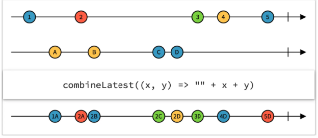

# Reactive Programming in Tokenpad (Part 2)

## Description

In the [last article](https://57blocks.io/blog/getting-started-with-reactive-programming), we created the `PortfoliosSubscriber` class, which implements Tokenpad's Consolidated Tokens view using the Observer Pattern. This approach lets us update the application's data once new events are received. A caveat to this approach is that the code depends on the event's argument and piles inside the `processEvent` block.
In this article, we'll share the approach used in Tokenpad, which​​ uses Reactive Programming to improve the `PortfoliosSubscriber` class.

## Introduction

Reactive Programming allows us to reuse the required data-transforming logic at different places inside Tokenpad so that the code is not piled inside a single block. This allows us to create our own modified and reusable reactive data sources.

Before sharing the Tokenpad's implementation, it's necessary to understand Reactive Programming operators–the different available types, how they work, and how to combine multiple `Stream` instances.

## Background: Operators in Reactive Programming

Reactive Programming operators enable the manipulation of the data sequence that flows through a `Stream` in any way the application needs. Its operators are one of the main benefits of using Reactive Programming. Dart, the programming language used to create Flutter applications, includes multiple `Stream` operators by default and allows the creation of custom operators.

Like [Dart's `Iterable` operators](https://dart.dev/codelabs/iterables), such as `map` or `where`, help in processing collections, viewing a `Stream` as an [asynchronous `Iterable`](https://dart.dev/tutorials/language/streams) can help us understand the `Stream`'s equivalent operators. Following are some examples.

### Map

```dart
final Stream<int> numbers = Stream.fromIterable([1, 2, 3, 4, 5]);

numbers.map((number) => number * number)
  .listen(
    (int squaredValues) {
      // Here we have access to the squaredValues one at a time:
      // 1, then 4, 9, 16 and finally 25
    },
  );
```

`Stream`'s [`map`](https://dart.dev/codelabs/iterables#mapping) operator allows us to modify each item received in any way we decide.
It will return the same amount of received items, each one modified by the received operation (squared in the example) while maintaining the original order.

### Where

```dart
final Stream<int> numbers =
      Stream.fromIterable([1, 2, 3, 4, 5, 6]);

  numbers
      .where((number) => number.isEven)
      .listen(
        (int squaredValues) {
          // Here we have access to the even values
          // 2, then 4 and finally 6
        },
      );
```

`Stream`'s [`where`](https://dart.dev/codelabs/iterables#example-using-where) operator allows us to filter the received items in any way we decide. It will return the same number of received items or fewer. When evaluating the received predicate, the returned elements are those that return `true`. In this example, the `where` operator will filter out the odd numbers and keep the even ones.

`Stream`'s [`map`](https://dart.dev/codelabs/iterables#mapping) and [`where`](https://dart.dev/codelabs/iterables#example-using-where) operators are the direct equivalent of their `Iterable` counterparts. The only difference is that `Iterable` data is fully allocated in memory or is lazily calculated synchronously. `Stream` data, once again, is asynchronous and thus can be thought of as coming into existence as soon as an event is received carrying the data.

`Iterable`'s `map` and `where` operators return a new `Iterable` instance.

The `Stream`'s equivalents return a new `Stream` instance as well.

That feature allows `Stream` operators to be chainable, meaning you can concatenate the result of one operator as the entry for the next operator using a dot notation.

```dart
final numbers = Stream.fromIterable([1, 2, 3, 4, 5, 6]);

numbers
    .where((number) => number.isEven)
    .map((evenNumber) => evenNumber * evenNumber)
    .listen(
      (int squaredValues) {
        // Here we have access to the squaredValues of only original even numbers
        // 4, 16 and 36
      },
    );
```

In the example, two operators are chained:

- First, odd numbers are filtered from the original `Stream`, keeping the even ones (`where`).
- Then, we square the even numbers (`map`).

The fact that each operator returns a new `Stream` makes Reactive Programming very powerful. You can split your calculations into different `Stream` instances with different operators. Then, with each `Stream` being the source of some data, you can reuse the streams generated from different *upstream* calculations for different *downstream* calculations.

Let me explain what *downstream* and *upstream* in this context means.

If we consider Dart `Stream` instances as a flow of data (similar to a flowing river), *upstream* is a relative term that means all the operations that happened **before** a specific operator, and *downstream* is another relative term that means all the operations that happen **after** a specific operator.

Before giving you an example, I'll explain the [`distinct`](https://api.flutter.dev/flutter/dart-async/Stream/distinct.html) `Stream` operator. Understanding the three operators involved will help explain both concepts, *upstream and downstream*.

### Distinct

```dart
  final numbers = Stream.fromIterable([1, 1, 1, 2, 3, 4, 4]);

  numbers
      .distinct()
      .listen(
        (int values) {
          // Here we only receive in order: 1, 2, 3 and 4
          // Without successive repeated elements
        },
      );
```

`Stream`'s `distinct` operator filters out all **successive** elements that are **repeated**. In the example, the `distinct` operator filters the second and third successive 1 and the second successive 4, allowing only the succession 1, 2, 3, and 4\.

Let's see this example to understand *downstream* and *upstream*:

```dart
  final numbers = Stream.fromIterable([1, 2, 3, 4, 5, 6, 6, 6]);

  numbers
      .where((number) => number.isEven) // 1: First operation
      .distinct() // 2: Second operation
      .map((evenNumber) => evenNumber * evenNumber) // 3: Third operation
      .listen(
    (int squaredValues) {
      // Here we have access to the squaredValues of
      // only original and non-contiguously repeated even numbers
    },
  );
```

We have four different `Stream` instances:

- `numbers` `Stream` (The original data source).
- The `Stream` created by the `where` operator when applied to the `numbers` `Stream`.
- The `Stream` created by the `distinct` operator when applied to the `Stream` created by `where`.
- The `Stream` created by the `map` operator when applied to the `Stream` created by `distinct`.

Relative to the `numbers` `Stream`, there are no *upstream* operators. All the operators are applied *downstream*.

There are no *downstream* operators relative to the `map`, and all the previous `Stream` instances (created by `where` and `distinct`) are considered *upstream*. In summary, *upstream* and *downstream* are always relative in a `Stream` operator chain.

Keeping this in mind, let's re-implement the Consolidated Tokens screen using Reactive Programming.

```dart
class PortfoliosRepository {
  String get _currentlyFilteredChain => "Polygon";

  /// Assume that here we receive a List of Portfolio
  /// whenever there's new data
  final Stream<List<Portfolio>> _portfoliosStream =
      Stream<List<Portfolio>>.fromIterable(<List<Portfolio>>[]);

  Stream<List<Portfolio>> get _filteredPortfolios =>
      _portfoliosStream.map((List<Portfolio> portfolios) => portfolios
          .where((element) =>
              element.chain ==
              _currentlyFilteredChain) // 1: Filter Portfolios by selected chain
          .toList());

  Stream<List<Portfolio>> get filteredPortfolios =>
      CombineLatestStream.combine2(
          _portfoliosStream,
          _currentlyFilteredChain,
          (List<Portfolio> portfolios, String currentlyFilteredChain) =>
              portfolios
                  .where((element) =>
                      element.chain ==
                      currentlyFilteredChain) // 1: Filter Portfolios by selected chain
                  .toList());

  Stream<List<Token>> get filteredTokens => filteredPortfolios
      .map((List<Portfolio> portfolios) => portfolios
          .map((Portfolio portfolio) => portfolio.tokens)
          .toList()) // 2: Extract Tokens from Portfolios
      .map(
        (List<List<Token>> tokensMatrix) => tokensMatrix
            .expand((tokens) => tokens)
            .toList(), // 3: Flatten matrix of Token into List of Token
      );

  Stream<Map<String, List<Token>>> get groupedTokensByCode =>
      filteredTokens.map(
        (List<Token> filteredTokens) =>
            groupBy(filteredTokens), // 4: Group all Tokens by Token code field
      );

  Stream<List<Token>> get tokensWithAddedValue => groupedTokensByCode.map(
        (Map<String, List<Token>> tokensByCode) => calcTotalValueByTokenCode(
            tokensByCode
                .values), // 5: Add up all the usdValue of the Tokens for each code
      );

  Stream<List<Token>> get sortedTokensWithAddedValue =>
      tokensWithAddedValue.map(
        (List<Token> tokens) {
          tokens.sort(
            (Token a, Token b) => a.usdValue.compareTo(
                b.usdValue), // 6: Sort the Tokens by its added usdValue
          );

          return tokens;
        },
      );

  Stream<List<TokenAndPercentage>> get top4Tokens =>
      sortedTokensWithAddedValue.map(
        (List<Token> tokens) =>
            calculateTop4Tokens(tokens), // 7: Extract top 4 Token
      );

  // 8: Show the `sortedTokensWithAddedValue` in the screen
  // 9: Show the `top4Tokens` in the screen

  List<Token> calcTotalValueByTokenCode(Iterable<List<Token>> values) {
    /// TODO: Add up all tokens values and return a single representative
    /// of the Token with its usdValue field having the calculated addition
  }

  Map<String, List<Token>> groupBy(List<Token> tokens) {
    // TODO: Group all tokens by its code field
  }

  List<TokenAndPercentage> calculateTop4Tokens(
      List<Token> tokensWithAddedValue) {
    /// TODO: Calculate the percentage of each token wrt the total
    /// and return the top4 and "Other"
  }
}
```

Even though the code looks verbose, it creates the same result as the Observer Pattern example with multiple advantages:

- The code is split into different interconnected `Stream` instances, such as the original source `_portfoliosStream` and `_filteredPortfolios`.
- Each  `Stream` can be reused as the source for different calculations, like `_filteredPortfolios` being used to create a new `Stream` (`filteredTokens`), effectively decoupling the calculations and making them reusable for different purposes.
  - **In the Observer Pattern example**, all the calculations had to be done inside the `processEvent` method.
  - **In the Reactive Programming alternative**, most `Stream` instances depend on an *upstream* operation, but every intermediate step can be reused in isolation for new calculations. The data will be kept current as soon as new events arrive with new data from the source (or sources because the `Stream` instances will potentially depend on *upstream* sources). Now, everything is reduced to create a new `Stream` that listens (directly or after applying operators) to the original `_portfoliosStream` to do the proper calculations.


Since each step is a different code block, the code tends to be more concise and easier to understand, making it easier to maintain.

There's a trick in the previous example: `_currentlyFilteredChain` is a static field. Currently, the code will only be filtered by the Polygon chain. It's not fully reactive at the end.

## Combine multiple Streams

To fix the non-reactivity in `_currentlyFilteredChain`, we can turn it into a `Stream`.

Everything can be a `Stream`.

Imagine that `_currentlyFilteredChain` is a `Stream<String>` instead of a hardcoded `String`.

Assuming that `_currentlyFilteredChain` emits a new `String` whenever the app user changes the current chain filter, we can use both `_currentlyFilteredChain` and `_portfoliosStream` to filter the latest portfolios according to the currently selected chain.

Using [Marble Diagrams](https://rxmarbles.com/#combineLatest) to explain Reactive Programming operators more visually, let's review how the `CombineLatest` operator works.


A Marble Diagram visually represents all `Stream` instances, events, operators, and their results in a single place.

- Each horizontal line represents a `Stream`. The arrow shows the time flow from past to future.
- Each marble in a `Stream` represents an event. As the `Stream` is asynchronous, the marbles located on the left are events emitted **before** the marbles located on the right.
- The content inside each marble represents the event's data.
- The vertical lines at the end of the `Stream` mark the end of the events for that `Stream`.
- The elevated rectangle is the used operator:
  - `combineLatest` is the operator's name in the example.
  - The arguments for the operator are all the `Stream` instances located above the elevated rectangle.
  - The lambda expression inside `combineLatest` is the operation to be executed by the operator whenever that operator is invoked. It's optional, depending on the operator. In the picture, `combineLatest` receives the **latest** emitted event from each `Stream` as arguments and concatenates the received events' data.
- The `Stream` below the operator results from running the operator with the received `Stream` arguments.

Going to [the Rx Marbles website](https://rxmarbles.com) lets you discover and experiment with interactive examples of multiple operators, helping you better grasp the concepts and how each operator works.

The `combineLatest` operator combines the **latest** event from all the `Stream` instances used as arguments. The condition for executing the `combineLatest`'s lambda expression is that every `Stream` argument **must** have emitted a value at **least once**; otherwise, `combineLatest` will not emit any value in the resulting `Stream`.

Analyzing the Marble Diagram, we have:

- The topmost `Stream` emits the value **1** first.
- Given that the second `Stream` hasn't emitted yet, `combineLatest`'s lambda expression **is not** executed, and the resulting `Stream` doesn't emit a value (it's empty at that time).
- As soon as the second `Stream` emits the value, **A**, the `combineLatest` lambda expression is immediately executed, concatenating both values. The resulting `Stream` gets its first emission, **1A,** because **1** and **A** are the **latest** emitted values from each original `Stream`.
- When the topmost `Stream` emits the value **2,** the `combineLatest`'s lambda expression is executed, with the **latest** emitted values from each `Stream`, now **2**  and **A**.
- This process of concatenating the latest emitted values from both `Stream` instances continues until both `Streams` are completed, signaled by the vertical line at the right end of each `Stream`.

With `combineLatest`, we can combine the `Stream` for the list of Portfolios with the new `Stream` for the currently selected chain, like this:

```dart
class PortfoliosRepository {
  /// Assume that here we receive a String whenever there's a new
  /// selected chain to filter the data
  final Stream<String> _currentlyFilteredChain =
      Stream<String>.fromIterable(<String>[]);

  /// Assume that here we receive a List of Portfolio
  /// whenever there's new data
  final Stream<List<Portfolio>> _portfoliosStream =
      Stream<List<Portfolio>>.fromIterable(<List<Portfolio>>[]);

  Stream<List<Portfolio>> get filteredPortfolios =>
      CombineLatestStream.combine2(
          _portfoliosStream,
          _currentlyFilteredChain,
          (List<Portfolio> portfolios, String currentlyFilteredChain) =>
              portfolios
                  .where((element) =>
                      element.chain ==
                      currentlyFilteredChain) // 1: Filter Portfolios by selected chain
                  .toList());

/// The rest of the class remains unmoodified

}
```

Some important points to notice:

- To use `combineLatest` in Dart, we added [`rxdart`](https://pub.dev/packages/rxdart) as a dependency.
- We can use `combineLatest` in multiple ways. In the example, we used the `CombineLatestStream.combine2` static method.
- This example shows one of the advantages of splitting the code into intermediate `Stream` instances. We only had to modify `filteredPortfolios`. All the downstream operators kept working as expected **without** any modifications.

We combined both `_portfoliosStream` and the modified `_currentlyFilteredChain` with `combineLatest` to have the portfolios filtered by the selected chain reacting to the sources.

## Two Common Issues

Although working with Reactive Programming brings multiple benefits, it is not without issues, especially when you first start using it.

Here, I'll detail two common issues that arise when working with Reactive Programming. I'll explain the reason behind the issues and how to solve them. Hopefully, this will save you some troubleshooting time.

#### Issue 1: Bad State Message

##### Situation

When you try to listen to one `Stream` multiple times (either directly, by calling `listen` in the `Stream`, or indirectly by using the same `Stream` instance as the source for multiple other `Stream` instances), you may see an error like this:
Bad state: Stream has already been listened to.

The error is quite explicit, but it's unclear why it happens.

##### The reason behind Bad State:

From [Dart's official documentation](https://dart.dev/tutorials/language/streams), we see that there are two kinds of `Streams`:

###### *Single Subscription Streams*

Single Subscription `Streams` emit events that **can not** be received incompletely, or that need to be fully received and correctly sorted to make sense (for example, reading a file or receiving a web request).

Given that restriction, Single Subscription `Streams` can be listened to **only once;** otherwise, partial and unmeaningful data will be received.

By default, Dart's `Streams` are Single Subscriptions. That's why it throws the error mentioned above when you try to listen to a Dart `Stream` multiple times.

###### *Broadcast Streams*

Broadcast `Streams` send complete data for each event, and there's no dependency between events. Events from such streams can be listened to at any moment because each event is meaningful on its own.

As stated previously, Dart `Streams` are Single Subscription `Streams` by default. However, we can convert a Single Subscription `Stream` into a Broadcast `Stream` by using the `asBroadcastStream()` method in the `Stream` instance.

##### Solution

For our ongoing example, using `asBroadcastStream()` will suit us very well because our `Streams` emit meaningful events without dependencies from previous or future events. Given that all our `Streams` depend on two `Streams` (`_currentlyFilteredChain` and `_portfolioStream`), we can transform both to fix the error and listen to the `Streams` multiple times. This solution is illustrated below.

```dart
class PortfoliosRepository {
  /// Assume that here we receive a String whenever there's a new
  /// selected chain to filter the data
  final Stream<String> _currentlyFilteredChain =
      Stream<String>.fromIterable(<String>[]).asBroadcastStream();

  /// Assume that here we receive a List of Portfolio
  /// whenever there's new data
  final Stream<List<Portfolio>> _portfoliosStream =
      Stream<List<Portfolio>>.fromIterable(<List<Portfolio>>[]).asBroadcastStream();

/// The rest of the class remains unmoodified

}
```

##### Important Note:

##### Always consider whether your `Stream` can be converted into a Broadcast `Stream`. Converting a `Stream` that emits events dependent on other previously emitted events into a Broadcast `Stream` will fix the Bad State error. However, you may create other issues in the process. One common issue is getting incomplete data because you started listening to a `Stream` that has already emitted events.

#### Issue 2: Multiple simultaneous subscriptions to different `Streams`

##### Situation

As explained previously, `Stream` operators usually return a *new* `Stream` after it's applied. The key here is the word *new*. Every time we call `map`, `where`, or `CombineLatest`, the original `Stream` remains unmodified, and a new `Stream` instance is returned after applying one of those operators to the original `Stream`.

In a situation like this:


```dart
Stream<List<Token>> get filteredTokens => filteredPortfolios
      .map((List<Portfolio> portfolios) => portfolios
          .map((Portfolio portfolio) => portfolio.tokens)
          .toList()) // 2: Extract Tokens from Portfolios
      .map(
        (List<List<Token>> tokensMatrix) => tokensMatrix
            .expand((tokens) => tokens)
            .toList(), // 3: Flatten matrix of Token into List of Token
      );
```

The `filteredTokens` `getter` can be called multiple times, and each caller will get a **different** `Stream` instance. If we want those generated `Stream` to possibly emit different values between instances, it's understandable and desirable to have different `Stream` instances. However, if we want multiple `Stream` instances to emit the same data, we have two different and problematic situations:

1. We're wasting memory and CPU resources by creating multiple `Stream` instances that will always emit the same data.
2. If we use variable arguments to create the source `Stream` (on a method call, for example), we will eventually reach a situation where the resulting `Streams` are created from different sources. In that case, each `Stream` will emit different data (depending on the received argument), obtaining unexpected and unreliable results in the application.

The first situation is easy to visualize without further explanation. However, let's adjust the current code to better visualize situation number 2.

So far, we have this implementation for `filteredPortfolios`:


```dart
Stream<List<Portfolio>> get filteredPortfolios =>
      CombineLatestStream.combine2(
          _portfoliosStream,
          _currentlyFilteredChain,
          (List<Portfolio> portfolios, String currentlyFilteredChain) =>
              portfolios
                  .where((element) =>
                      element.chain ==
                      currentlyFilteredChain) // 1: Filter Portfolios by selected chain
                  .toList());
```

It's not a very realistic implementation because we're listening to *all* Portfolios and filtering with code we wrote. It's a best practice to avoid such filtering in code and delegate it to a data source component (usually a database engine).

However, notice that in this modified example below, `filteredTokens` is no longer a `getter`.


```dart
Stream<List<Token>> filteredTokens(String chain) => filteredPortfolios(chain)
      .map((List<Portfolio> portfolios) => portfolios
          .map((Portfolio portfolio) => portfolio.tokens)
          .toList()) // 2: Extract Tokens from Portfolios
      .map(
        (List<List<Token>> tokensMatrix) => tokensMatrix
            .expand((tokens) => tokens)
            .toList(), // 3: Flatten matrix of Token into List of Token
      );
```

`filteredTokens` receives a chain as an argument and passes it into an imaginary `filteredPortfolios` method that's in charge of directly querying the data source. `filteredTokens` then returns a `Stream` that emits the Portfolios filtered by the received chain whenever Portfolio data changes. Notice that `filteredTokens` returns a new `Stream` instance every time it's called.

##### The reason behind Multiple simultaneous subscriptions to different `Streams`:

If we call `filteredTokens` whenever the user changes the chain filter on the Consolidated Tokens screen, we are going to create and keep in memory multiple `Stream` instances (one for each selected filter) that will emit different data (each `Stream` will be filtered by a different chain) at different times. There's no guarantee that different `Stream` instances will emit in a specific order. This situation will, eventually, show data filtered by a chain that's not currently selected.


A screenshot from Tokenpad showing data display and filtering

Here is a step-by-step description of the problem with the user experience included:

| Step | User experience | Code |
| :---- | :---- | :---- |
| 1 | The user opens the Consolidated Tokens screen.  | A `Stream` is created by default with the "All chains" filter by default. |
| 2 | The user selects the "Avalanche" chain filter.  | A new `Stream` is created that will filter the tokens using the "Avalanche" chain. *Notice there's no place to dispose of the initial "All chains" `Stream` in the current code. It keeps running and emits events whenever its data changes.* |
| 3 | The user swipes to refresh the info shown on the screen. | Tokenpad starts retrieving current information from the server and updates data in the local data source. Since we use Reactive Programming, whenever the local data source changes Portfolios, all active `Stream` instances will receive events with the most recent data. Still, there's no guarantee that each active `Stream` will receive the most recent data in a specific order. |
| 4 | The​​ ​​ current example *shows two* active `Stream` for the Consolidated Tokens screen.  | Eventually, the "All chains" `Stream` will receive data **after** the "Avalanche" filtered `Stream`. This means that the token list will show "All chains" data while the user expects to see the data filtered by "Avalanche," the latest chain the user selected to filter the data. |

Initially, the described situation may appear irrelevant and might even remain unnoticed for a long time. In Tokenpad, it was caught a couple of days after being initially implemented during internal testing. Given that `Stream` instances allow data to be decoupled and original data sources to be reused in multiple places, this issue will eventually arise, and be present in multiple screens simultaneously, exhibiting a random-like pattern.

This `Stream` issue can present a highly hazardous situation for an app used for decision-making, especially in the financial space.

##### Solution

Let's split the problem into two situations: multiple `Stream` instances that emit the same data and multiple `Stream` instances that emit different data.

###### *Situation 1: `Streams` that emit the same data*

To resolve this situation, we need to introduce a new component.

###### *StreamController*

So far, we have been able to listen to `Stream` instances, but we have no control over them.

A `StreamController` is a wrapper over a `Stream` that directly controls the `Stream` and allows a programmer to add events to be emitted by the `Stream` on demand.

A `StreamController` has two different fields:

* `stream`, the same object we have been using in this article
* `sink`, a new concept that will allow us to manually send events into the `StreamController`'s `stream` field, thus notifying all its subscribers.

Let's see a possible implementation for `_currentlyFilteredChain` without the original assumptions, using a `StreamController`.


```dart
class PortfoliosRepository2 {

    final StreamController<String> _currentlyFilteredChainSC =
         StreamController<String>();

    Stream<String> get _currentlyFilteredChain =>
          _currentlyFilteredChainSC.stream;

    set currentlyFilteredChain(String newChain) {
        _currentlyFilteredChainSC.sink.add(newChain);
      }

/// The rest of the class remains unmoodified
}
```

First, we create the new `StreamController` instance, `_currentlyFilteredChainSC`. This new tool will allow us to have finely-grained control over our data filtered by chain.

We keep the `_currentlyFilteredChain` field and set its value as `_currentlyFilteredChainSC.stream`, maintaining the original signature (`Stream<String>`) preventing additional changes in the existing code. Given that we're always returning `_currentlyFilteredChainSC.stream` in the `_currentlyFilteredChain` `getter`, we're ensuring that the **same** instance is always returned, meaning, we're not creating and returning different instances whenever `_currentlyFilteredChain` is called.

Then, we add a new `setter`, `currentlyFilteredChain`, to it. With that, we receive a new chain and send it through `_currentlyFilteredChainSC.sink` to notify all the subscribers about the last chain selected to filter the data.

Note: If you need a broadcast `Stream` from a `StreamController`, you can use `StreamController.broadcast`.

`StreamController` can be our ally in preventing the creation of multiple `Stream` instances that always emit the same values.

We can have a default template for this implementation like this:


```dart
class DummyStreamControllerExample {
  /// StreamController creation
  final StreamController<String> _exampleStreamController =
      StreamController<String>.broadcast();

  /// Expose stream from StreamController
  Stream<String> get exposedStream => _exampleStreamController.stream;

  DummyStreamControllerExample(Stream<String> originalDataSource) {

    /// Listen to the source once and pipe the events
    /// into the StreamController sink
    originalDataSource.listen((String newData) {
      _exampleStreamController.sink.add(newData);
    });
  }
}
```

The structure is simple:

- We create a single `StreamController` instance.
- We expose our `StreamController`'s `stream` field.
- We pipe the data coming from a source `Stream` instance into our `StreamController`'s `sink` field. The trick is to listen to the original `Stream` only once, thus ensuring that a single `Stream` data source instance is created for the whole process.

For Tokenpad, this is an optimal solution because:

- Most `Stream` instances are kept open during the whole application lifecycle because we need to share data and keep values current across multiple screens. Having to create a lot of `Stream` instances every time the user navigates the application would mean unneeded recalculations and a bad/slow user experience.
- Given that we only expose `StreamController.stream` and it's the same instance no matter how often we call the `getter`, we avoid having multiple `Stream` instances emitting the same data. Thus, we avoid wasting resources and ensure listeners receive the same events.

Note: If you're wondering how this solution can prevent unnecessary recalculations, given that when you navigate into a screen and there are no *new* events in long-life `Stream` instances, the screen will remain empty. First, congratulations on noting that! That means that you have a solid understanding of `Streams` so far. To prevent recalculations and empty screens in Tokenpad, we use [`BehaviorSubject`](https://pub.dev/documentation/rxdart/latest/rx/BehaviorSubject-class.html) from the [`rxdart`](https://pub.dev/packages/rxdart) package. It's a custom `StreamController` that caches the last emitted value and emits it (again) on every new subscription.

##### Situation 2: `Streams` that emit different data

There are two ways to solve this problem:

1. Cancel a previous subscription whenever a new subscription is created to `Stream` instances created by the same method call from the **consumer** side.
2. Cancel a previous subscription whenever a new subscription is created to `Stream` instances created by the same method call from the **publisher** side.

Option 1 is prone to errors, omissions, and, possibly, an ever-growing complexity around the project because you have to keep track of the subscriptions and be extra careful to cancel the previous ones before creating a new subscription.

In Tokenpad, given that we control the parameterized data sources (such as the filters), we can use [`takeUntil`](https://rxmarbles.com/#takeUntil) and [`skip`](https://rxmarbles.com/#skip) operators to accomplish option 2 and take care of the subscriptions from the *publisher* side.


```dart
class DummyStreamControllerExample {

    final StreamController<String> _currentlyFilteredChainStreamController =
         StreamController<String>();

    Stream<String> get _currentlyFilteredChain =>
          _currentlyFilteredChainStreamController.stream;

    set currentlyFilteredChain(String newChain) {
        _currentlyFilteredChainStreamController.sink.add(newChain);
      }

Stream<List<Token>> filteredTokens(String chain) => _currentlyFilteredChain
          .flatMap(filteredPortfolios(chain)
              .takeUntil(_currentlyFilteredChain
                            .skip(1)
/// Cancels previous subscription as soon as _currentlyFilteredChain
/// emits a new value. We use skip(1) to allow the first emission
/// to be received, otherwise no event would be allowed to pass.
                   )
              )
          .map((List<Portfolio> portfolios) => portfolios
              .map((Portfolio portfolio) => portfolio.tokens)
              .toList()) // 3: Extract Tokens from Portfolios
          .map(
            (List<List<Token>> tokensMatrix) => tokensMatrix
                .expand((tokens) => tokens)
                .toList(),
            // 4: Flatten matrix of Token into List of Token
          );
}
```

Here, we listen for each selected chain to filter and create a new `Stream` that will emit whenever new data is received from the data source. Multiple `Stream` instances will be kept open if the user changes the filtering. Note that this is the situation we described previously.

By using `takeUntil`, we ensure that the `Stream` parameterized by a chain will only emit until `_currentlyFilteredChain` emits a new value and the subscription from the previous filter is automatically disposed of.

We have to add `skip(1)` because we're using `_currentlyFilteredChain` both as the source for `filteredTokens` and as the marker to make it stop emitting values. When we add `skip(1)`, we will ignore the first `_currentlyFilteredChain` emission for each new `filteredPortfolios(chain)` to prevent `_currentlyFilteredChain` from being disposed of without ever emitting.

## Conclusion

Reactive Programming is a powerful tool, particularly for developing client-facing applications. Its approach to data handling offers several benefits that can significantly enhance both the user and developer experience.

**For developers,** the advantages include time savings due to more manageable and maintainable codebases, the ability to implement more precise and dynamic logic, and easier error handling.

Reactive Programming allows developers to create more responsive and scalable applications, potentially improving overall performance.

Consider the implementation of the example logic in the previous section without the aid of Reactive Programming. Such a scenario could lead to a considerable increase in code complexity and a sizable increase in your codebase. This complexity is evident in patterns like the Observer Pattern, which traditionally has relied on a considerable amount of code to be nested within a single block to handle events, where the entire application's logic might depend on those events.

Despite these benefits, there may be reasons why developers hesitate to adopt Reactive Programming. The initial learning curve can be steep, as Reactive Programming involves a shift in mindset from more traditional procedural programming paradigms. Moreover, if not implemented thoughtfully, it could lead to less readable code, especially for those unfamiliar with its principles. There's also the challenge of integrating reactive systems with non-reactive systems during code refactoring. Refactoring the code to support Reactive Programming may involve rethinking a large part of the existing codebase and a developer would face compatibility issues. Anticipating such compatibility challenges may discourage some developers from adopting this approach.

Overall, the choice to use Reactive Programming should be informed by each project's specific needs and constraints while considering the potential hurdles and the learning investment required. The payoff in terms of application performance, code maintainability, and the satisfaction of creating reactive, intuitive user interfaces is often worth the initial effort required to use this programming paradigm.

To learn how to mix Reactive Programming with Flutter (UI), read about the [`StreamBuilder`](https://api.flutter.dev/flutter/widgets/StreamBuilder-class.html) widget or [`bloc`](https://pub.dev/packages/bloc) package.

I hope you enjoyed the article and learned a lot from it.

Thanks for reading!