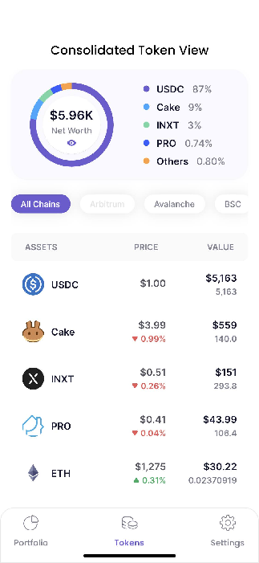

# Reactive Programming in Tokenpad (Part 2)

## Description

In the [last article](../Getting Started with Reactive Programming/README.md), we created the PortfoliosSubscriber class, which implements Tokenpad's Consolidated Tokens view using the Observer Pattern. This approach lets us update the application's data once new events are received. A caveat to this approach is that the code depends on the event's argument and piles inside the *processEvent* block.
In this article, we'll share the approach used in Tokenpad, which​​ uses Reactive Programming to improve the PortfoliosSubscriber class.

## Introduction

Reactive Programming allows us to reuse the required data-transforming logic at different places inside Tokenpad so that the code is not piled inside a single block. This allows us to create our own modified and reusable reactive data sources.

Before sharing the Tokenpad's implementation, it's necessary to understand Reactive Programming operators–the different available types, how they work, and how to combine multiple Stream instances.

## Background: Operators in Reactive Programming

Reactive Programming operators enable the manipulation of the data sequence that flows through a Stream in any way the application needs. Its operators are one of the main benefits of using Reactive Programming. Dart, the programming language used to create Flutter applications, includes multiple Stream operators by default and allows the creation of custom operators.

Like [Dart's Iterable operators](https://dart.dev/codelabs/iterables), such as map or where, help in processing collections, viewing a Stream as an [asynchronous Iterable](https://dart.dev/tutorials/language/streams) can help us understand the Stream's equivalent operators. Following are some examples.

### Map

```
final Stream<int> numbers = Stream.fromIterable([1, 2, 3, 4, 5]);

numbers.map((number) => number * number)
  .listen(
    (int squaredValues) {
      // Here we have access to the squaredValues one at a time:
      // 1, then 4, 9, 16 and finally 25
    },
  );
```

Stream's [map](https://dart.dev/codelabs/iterables#mapping) operator allows us to modify each item received in any way we decide.
It will return the same amount of received items, each one modified by the received operation (squared in the example) while maintaining the original order.

### Where

```
final Stream<int> numbers =
      Stream.fromIterable([1, 2, 3, 4, 5, 6]);

  numbers
      .where((number) => number.isEven)
      .listen(
        (int squaredValues) {
          // Here we have access to the even values
          // 2, then 4 and finally 6
        },
      );
```

Stream's [where](https://dart.dev/codelabs/iterables#example-using-where) operator allows us to filter the received items in any way we decide. It will return the same number of received items or fewer. When evaluating the received predicate, the returned elements are those that return `true`. In this example, the where operator will filter out the odd numbers and keep the even ones.

Stream's [map](https://dart.dev/codelabs/iterables#mapping) and [where](https://dart.dev/codelabs/iterables#example-using-where) operators are the direct equivalent of their Iterable counterparts. The only difference is that Iterable data is fully allocated in memory or is lazily calculated synchronously. Stream data, once again, is asynchronous and thus can be thought of as coming into existence as soon as an event is received carrying the data.

Iterable's map and where operators return a new Iterable instance.

The Stream's equivalents return a new Stream instance as well.

That feature allows Stream operators to be chainable, meaning you can concatenate the result of one operator as the entry for the next operator using a dot notation.

```
final numbers = Stream.fromIterable([1, 2, 3, 4, 5, 6]);

numbers
    .where((number) => number.isEven)
    .map((evenNumber) => evenNumber * evenNumber)
    .listen(
      (int squaredValues) {
        // Here we have access to the squaredValues of only original even numbers
        // 4, 16 and 36
      },
    );
```

In the example, two operators are chained:

- First, odd numbers are filtered from the original Stream, keeping the even ones (where).
- Then, we square the even numbers (map).

The fact that each operator returns a new Stream makes Reactive Programming very powerful. You can split your calculations into different Stream instances with different operators. Then, with each Stream being the source of some data, you can reuse the streams generated from different *upstream* calculations for different *downstream* calculations.

Let me explain what *downstream* and *upstream* in this context means.

If we consider Dart Stream instances as a flow of data (similar to a flowing river), *upstream* is a relative term that means all the operations that happened **before** a specific operator, and *downstream* is another relative term that means all the operations that happen **after** a specific operator.

Before giving you an example, I'll explain the [distinct](https://api.flutter.dev/flutter/dart-async/Stream/distinct.html) Stream operator. Understanding the three operators involved will help explain both concepts, *upstream and downstream*.

### Distinct

```
  final numbers = Stream.fromIterable([1, 1, 1, 2, 3, 4, 4]);

  numbers
      .distinct()
      .listen(
        (int values) {
          // Here we only receive in order: 1, 2, 3 and 4
          // Without successive repeated elements
        },
      );
```

Stream's distinct operator filters out all **successive** elements that are **repeated**. In the example, the distinct operator filters the second and third successive 1 and the second successive 4, allowing only the succession 1, 2, 3, and 4\.

Let's see this example to understand *downstream* and *upstream*:

```
  final numbers = Stream.fromIterable([1, 2, 3, 4, 5, 6, 6, 6]);

  numbers
      .where((number) => number.isEven) // 1: First operation
      .distinct() // 2: Second operation
      .map((evenNumber) => evenNumber * evenNumber) // 3: Third operation
      .listen(
    (int squaredValues) {
      // Here we have access to the squaredValues of
      // only original and non-contiguously repeated even numbers
    },
  );
```

We have four different Stream instances:

- *numbers* Stream (The original data source).
- The Stream created by the where operator when applied to the *numbers* Stream*.*
- The Stream created by the distinct operator when applied to the Stream created by where.
- The Stream created by the map operator when applied to the Stream created by distinct.

Relative to the *numbers* Stream, there are no *upstream* operators. All the operators are applied *downstream*.

There are no *downstream* operators relative to the map, and all the previous Stream instances (created by where and distinct) are considered *upstream*. In summary, *upstream* and *downstream* are always relative in a Stream operator chain.

Keeping this in mind, let's re-implement the Consolidated Tokens screen using Reactive Programming.

```
class PortfoliosRepository {
  String get _currentlyFilteredChain => "Polygon";

  /// Assume that here we receive a List of Portfolio
  /// whenever there's new data
  final Stream<List<Portfolio>> _portfoliosStream =
      Stream<List<Portfolio>>.fromIterable(<List<Portfolio>>[]);

  Stream<List<Portfolio>> get _filteredPortfolios =>
      _portfoliosStream.map((List<Portfolio> portfolios) => portfolios
          .where((element) =>
              element.chain ==
              _currentlyFilteredChain) // 1: Filter Portfolios by selected chain
          .toList());

  Stream<List<Portfolio>> get filteredPortfolios =>
      CombineLatestStream.combine2(
          _portfoliosStream,
          _currentlyFilteredChain,
          (List<Portfolio> portfolios, String currentlyFilteredChain) =>
              portfolios
                  .where((element) =>
                      element.chain ==
                      currentlyFilteredChain) // 1: Filter Portfolios by selected chain
                  .toList());

  Stream<List<Token>> get filteredTokens => filteredPortfolios
      .map((List<Portfolio> portfolios) => portfolios
          .map((Portfolio portfolio) => portfolio.tokens)
          .toList()) // 2: Extract Tokens from Portfolios
      .map(
        (List<List<Token>> tokensMatrix) => tokensMatrix
            .expand((tokens) => tokens)
            .toList(), // 3: Flatten matrix of Token into List of Token
      );

  Stream<Map<String, List<Token>>> get groupedTokensByCode =>
      filteredTokens.map(
        (List<Token> filteredTokens) =>
            groupBy(filteredTokens), // 4: Group all Tokens by Token code field
      );

  Stream<List<Token>> get tokensWithAddedValue => groupedTokensByCode.map(
        (Map<String, List<Token>> tokensByCode) => calcTotalValueByTokenCode(
            tokensByCode
                .values), // 5: Add up all the usdValue of the Tokens for each code
      );

  Stream<List<Token>> get sortedTokensWithAddedValue =>
      tokensWithAddedValue.map(
        (List<Token> tokens) {
          tokens.sort(
            (Token a, Token b) => a.usdValue.compareTo(
                b.usdValue), // 6: Sort the Tokens by its added usdValue
          );

          return tokens;
        },
      );

  Stream<List<TokenAndPercentage>> get top4Tokens =>
      sortedTokensWithAddedValue.map(
        (List<Token> tokens) =>
            calculateTop4Tokens(tokens), // 7: Extract top 4 Token
      );

  // 8: Show the sortedTokensWithAddedValue in the screen
  // 9: Show the top4Tokens in the screen

  List<Token> calcTotalValueByTokenCode(Iterable<List<Token>> values) {
    /// TODO: Add up all tokens values and return a single representative
    /// of the Token with its usdValue field having the calculated addition
  }

  Map<String, List<Token>> groupBy(List<Token> tokens) {
    // TODO: Group all tokens by its code field
  }

  List<TokenAndPercentage> calculateTop4Tokens(
      List<Token> tokensWithAddedValue) {
    /// TODO: Calculate the percentage of each token wrt the total
    /// and return the top4 and "Other"
  }
}
```

Even though the code looks verbose, it creates the same result as the Observer Pattern example with multiple advantages:

- The code is split into different interconnected Stream instances, such as the original source \_portfoliosStream and \_filteredPortfolios.
- Each  Stream can be reused as the source for different calculations, like \_filteredPortfolios being used to create a new Stream (filteredTokens), effectively decoupling the calculations and making them reusable for different purposes.
  - **In the Observer Pattern example**, all the calculations had to be done inside the processEvent method.
  - **In the Reactive Programming alternative**, most Stream instances depend on an *upstream* operation, but every intermediate step can be reused in isolation for new calculations. The data will be kept current as soon as new events arrive with new data from the source (or sources because the Stream instances will potentially depend on *upstream* sources). Now, everything is reduced to create a new Stream that listens (directly or after applying operators) to the original \_portfoliosStream to do the proper calculations.


Since each step is a different code block, the code tends to be more concise and easier to understand, making it easier to maintain.

There's a trick in the previous example: \_currentlyFilteredChain is a static field. Currently, the code will only be filtered by the Polygon chain. It's not fully reactive at the end.

## Combine multiple Streams

To fix the non-reactivity in \_currentlyFilteredChain, we can turn it into a Stream.

Everything can be a Stream.

Imagine that \_currentlyFilteredChain is a Stream\<String\> instead of a hardcoded String.

Assuming that \_currentlyFilteredChain emits a new String whenever the app user changes the current chain filter, we can use both \_currentlyFilteredChain and \_portfoliosStream to filter the latest portfolios according to the currently selected chain.

Using [Marble Diagrams](https://rxmarbles.com/#combineLatest) to explain Reactive Programming operators more visually, let's review how the CombineLatest operator works.


A Marble Diagram visually represents all Stream instances, events, operators, and their results in a single place.

- Each horizontal line represents a Stream. The arrow shows the time flow from past to future.
- Each marble in a Stream represents an event. As the Stream is asynchronous, the marbles located on the left are events emitted **before** the marbles located on the right.
- The content inside each marble represents the event's data.
- The vertical lines at the end of the Stream mark the end of the events for that Stream.
- The elevated rectangle is the used operator:
  - combineLatest is the operator's name in the example.
  - The arguments for the operator are all the Stream instances located above the elevated rectangle.
  - The lambda expression inside combineLatest is the operation to be executed by the operator whenever that operator is invoked. It's optional, depending on the operator. In the picture, combineLatest receives the **latest** emitted event from each Stream as arguments and concatenates the received events' data.
- The Stream below the operator results from running the operator with the received Stream arguments.

Going to [the Rx Marbles website](https://rxmarbles.com) lets you discover and experiment with interactive examples of multiple operators, helping you better grasp the concepts and how each operator works.

The combineLatest operator combines the **latest** event from all the Stream instances used as arguments. The condition for executing the combineLatest's lambda expression is that every Stream argument **must** have emitted a value at **least once**; otherwise, combineLatest will not emit any value in the resulting Stream.

Analyzing the Marble Diagram, we have:

- The topmost Stream emits the value **1** first.
- Given that the second Stream hasn't emitted yet, combineLatest's lambda expression **is not** executed, and the resulting Stream doesn't emit a value (it's empty at that time).
- As soon as the second Stream emits the value, **A**, the combineLatest lambda expression is immediately executed, concatenating both values. The resulting Stream gets its first emission, **1A,** because **1** and **A** are the **latest** emitted values from each original Stream.
- When the topmost Stream emits the value **2,** the combineLatest's lambda expression is executed, with the **latest** emitted values from each Stream, now **2**  and **A**.
- This process of concatenating the latest emitted values from both Stream instances continues until both Streams are completed, signaled by the vertical line at the right end of each Stream.

With combineLatest, we can combine the Stream for the list of Portfolios with the new Stream for the currently selected chain, like this:

```
class PortfoliosRepository {
  /// Assume that here we receive a String whenever there's a new
  /// selected chain to filter the data
  final Stream<String> _currentlyFilteredChain =
      Stream<String>.fromIterable(<String>[]);

  /// Assume that here we receive a List of Portfolio
  /// whenever there's new data
  final Stream<List<Portfolio>> _portfoliosStream =
      Stream<List<Portfolio>>.fromIterable(<List<Portfolio>>[]);

  Stream<List<Portfolio>> get filteredPortfolios =>
      CombineLatestStream.combine2(
          _portfoliosStream,
          _currentlyFilteredChain,
          (List<Portfolio> portfolios, String currentlyFilteredChain) =>
              portfolios
                  .where((element) =>
                      element.chain ==
                      currentlyFilteredChain) // 1: Filter Portfolios by selected chain
                  .toList());

/// The rest of the class remains unmoodified

}
```

Some important points to notice:

- To use combineLatest in Dart, we added [rxdart](https://pub.dev/packages/rxdart) as a dependency.
- We can use combineLatest in multiple ways. In the example, we used the CombineLatest.combine2 static method.
- This example shows one of the advantages of splitting the code into intermediate Stream instances. We only had to modify filteredPortfolios. All the downstream operators kept working as expected **without** any modifications.

We combined both \_portfoliosStream and the modified \_currentlyFilteredChain with combineLatest to have the portfolios filtered by the selected chain reacting to the sources.

## Two Common Issues

Although working with Reactive Programming brings multiple benefits, it is not without issues, especially when you first start using it.

Here, I'll detail two common issues that arise when working with Reactive Programming. I'll explain the reason behind the issues and how to solve them. Hopefully, this will save you some troubleshooting time.

#### Issue 1: Bad State Message

##### Situation

When you try to listen to one Stream multiple times (either directly, by calling listen in the Stream, or indirectly by using the same Stream instance as the source for multiple other Stream instances), you may see an error like this:
Bad state: Stream has already been listened to.

The error is quite explicit, but it's unclear why it happens.

##### The reason behind Bad State:

From [Dart's official documentation](https://dart.dev/tutorials/language/streams), we see that there are two kinds of Streams:

###### *Single Subscription Streams*

Single Subscription Streams emit events that **can not** be received incompletely, or that need to be fully received and correctly sorted to make sense (for example, reading a file or receiving a web request).

Given that restriction, Single Subscription Streams can be listened to **only once;** otherwise, partial and unmeaningful data will be received.

By default, Dart's Streams are Single Subscriptions. That's why it throws the error mentioned above when you try to listen to a Dart Stream multiple times.

###### *Broadcast Streams*

Broadcast Streams send complete data for each event, and there's no dependency between events. Events from such streams can be listened to at any moment because each event is meaningful on its own.

As stated previously, Dart Streams are Single Subscription Streams by default. However, we can convert a Single Subscription Stream into a Broadcast Stream by using the asBroadcastStream() method in the Stream instance.

##### Solution

For our ongoing example, using asBroadcastStream() will suit us very well because our Streams emit meaningful events without dependencies from previous or future events. Given that all our Streams depend on two Streams (\_currentlyFilteredChain and \_portfolioStream), we can transform both to fix the error and listen to the Streams multiple times. This solution is illustrated below.

```
class PortfoliosRepository {
  /// Assume that here we receive a String whenever there's a new
  /// selected chain to filter the data
  final Stream<String> _currentlyFilteredChain =
      Stream<String>.fromIterable(<String>[]).asBroadcastStream();

  /// Assume that here we receive a List of Portfolio
  /// whenever there's new data
  final Stream<List<Portfolio>> _portfoliosStream =
      Stream<List<Portfolio>>.fromIterable(<List<Portfolio>>[]).asBroadcastStream();

/// The rest of the class remains unmoodified

}
```

##### Important Note:

##### Always consider whether your Stream can be converted into a Broadcast Stream. Converting a Stream that emits events dependent on other previously emitted events into a Broadcast Stream will fix the Bad State error. However, you may create other issues in the process. One common issue is getting incomplete data because you started listening to a Stream that has already emitted events.

#### Issue 2: Multiple simultaneous subscriptions to different Streams

##### Situation

As explained previously, Stream operators usually return a *new* Stream after it's applied. The key here is the word *new*. Every time we call map, where, distinct, or any other Stream operator, we get a new Stream. It means that we can create an immense number of Stream instances if we're not careful.

Why is this a problem? Each Stream instance consumes resources (memory, CPU, network, etc.). If we use each Stream operator within the method that outputs a Stream, we'll create the whole Stream operator chain every time we access the getter method.

Let me show you a scenario where this happens:

```
class PortfoliosRepository {
  /// Assume that here we receive a String whenever there's a new
  /// selected chain to filter the data
  final Stream<String> _currentlyFilteredChain =
      Stream<String>.fromIterable(<String>[]).asBroadcastStream();

  /// Assume that here we receive a List of Portfolio
  /// whenever there's new data
  final Stream<List<Portfolio>> _portfoliosStream =
      Stream<List<Portfolio>>.fromIterable(<List<Portfolio>>[]).asBroadcastStream();

  Stream<List<Portfolio>> get filteredPortfolios =>
      CombineLatestStream.combine2(
          _portfoliosStream,
          _currentlyFilteredChain,
          (List<Portfolio> portfolios, String currentlyFilteredChain) =>
              portfolios
                  .where((element) =>
                      element.chain ==
                      currentlyFilteredChain) // 1: Filter Portfolios by selected chain
                  .toList());

  Stream<List<Token>> get filteredTokens => filteredPortfolios
      .map((List<Portfolio> portfolios) => portfolios
          .map((Portfolio portfolio) => portfolio.tokens)
          .toList()) // 2: Extract Tokens from Portfolios
      .map(
        (List<List<Token>> tokensMatrix) => tokensMatrix
            .expand((tokens) => tokens)
            .toList(), // 3: Flatten matrix of Token into List of Token
      );

  Stream<Map<String, List<Token>>> get groupedTokensByCode =>
      filteredTokens.map(
        (List<Token> filteredTokens) =>
            groupBy(filteredTokens), // 4: Group all Tokens by Token code field
      );
}
```

Now imagine that we use the PortfoliosRepository like this:



We call filteredTokens, groupedTokensByCode, and filteredPortfolios. Since they depend on each other, our repository will create the following Stream instances:

- **filteredPortfolios** calls **CombineLatestStream.combine2**
- **filteredTokens** calls **filteredPortfolios** and **applies map twice**
- **groupedTokensByCode** calls **filteredTokens** and **applies map once**

To satisfy the **groupedTokensByCode** alone, our repository internally had to create:

- One CombineLatest instance for filteredPortfolios
- Two Stream instances from the two filteredTokens map operators
- One Stream instance from the groupedTokensByCode map operator

Total: 4 instances for 1 **groupedTokensByCode** call.

To satisfy **filteredTokens**, our repository internally had to create:

- One CombineLatest instance for filteredPortfolios
- Two Stream instances from the two filteredTokens map operators

Total: 3 instances for 1 **filteredTokens** call.

To satisfy **filteredPortfolios**, our repository internally had to create:

- One CombineLatest instance for filteredPortfolios

Total: 1 instance for 1 **filteredPortfolios** call.

**Grand total**: 8 Stream instances were created to get the data from the 3 accessible Stream getter methods.

##### The reason behind Multiple simultaneous subscriptions to different Streams:

The issue is that each time a getter method is accessed, all the underlying Stream instances get created. Even if the getter method is called multiple times, each time we access it, new Stream instances get created. Besides, that means we'll create different subscriptions to \_portfoliosStream and \_currentlyFilteredChain when we access the getter methods, creating the separate data flows.

##### Solution

The solution for this issue is to instantiate the Stream instances at the object creation time and to use a cache mechanism for the intermediate results. We can do this in Dart easily; instead of getters, we'll use fields.

Here's how to solve the second issue:

```
class PortfoliosRepository {
  /// Assume that here we receive a String whenever there's a new
  /// selected chain to filter the data
  final Stream<String> _currentlyFilteredChain =
      Stream<String>.fromIterable(<String>[]).asBroadcastStream();

  /// Assume that here we receive a List of Portfolio
  /// whenever there's new data
  final Stream<List<Portfolio>> _portfoliosStream =
      Stream<List<Portfolio>>.fromIterable(<List<Portfolio>>[]).asBroadcastStream();

  late final Stream<List<Portfolio>> filteredPortfolios =
      CombineLatestStream.combine2(
          _portfoliosStream,
          _currentlyFilteredChain,
          (List<Portfolio> portfolios, String currentlyFilteredChain) =>
              portfolios
                  .where((element) =>
                      element.chain ==
                      currentlyFilteredChain) // 1: Filter Portfolios by selected chain
                  .toList());

  late final Stream<List<Token>> filteredTokens = filteredPortfolios
      .map((List<Portfolio> portfolios) => portfolios
          .map((Portfolio portfolio) => portfolio.tokens)
          .toList()) // 2: Extract Tokens from Portfolios
      .map(
        (List<List<Token>> tokensMatrix) => tokensMatrix
            .expand((tokens) => tokens)
            .toList(), // 3: Flatten matrix of Token into List of Token
      );

  late final Stream<Map<String, List<Token>>> groupedTokensByCode =
      filteredTokens.map(
        (List<Token> filteredTokens) =>
            groupBy(filteredTokens), // 4: Group all Tokens by Token code field
      );

  late final Stream<List<Token>> tokensWithAddedValue = groupedTokensByCode.map(
        (Map<String, List<Token>> tokensByCode) => calcTotalValueByTokenCode(
            tokensByCode
                .values), // 5: Add up all the usdValue of the Tokens for each code
      );

  late final Stream<List<Token>> sortedTokensWithAddedValue =
      tokensWithAddedValue.map(
        (List<Token> tokens) {
          tokens.sort(
            (Token a, Token b) => a.usdValue.compareTo(
                b.usdValue), // 6: Sort the Tokens by its added usdValue
          );

          return tokens;
        },
      );

  late final Stream<List<TokenAndPercentage>> top4Tokens =
      sortedTokensWithAddedValue.map(
        (List<Token> tokens) =>
            calculateTop4Tokens(tokens), // 7: Extract top 4 Token
      );

  // 8: Show the sortedTokensWithAddedValue in the screen
  // 9: Show the top4Tokens in the screen

  List<Token> calcTotalValueByTokenCode(Iterable<List<Token>> values) {
    /// TODO: Add up all tokens values and return a single representative
    /// of the Token with its usdValue field having the calculated addition
  }

  Map<String, List<Token>> groupBy(List<Token> tokens) {
    // TODO: Group all tokens by its code field
  }

  List<TokenAndPercentage> calculateTop4Tokens(
      List<Token> tokensWithAddedValue) {
    /// TODO: Calculate the percentage of each token wrt the total
    /// and return the top4 and "Other"
  }
}
```

With this approach, we're using late final fields instead of getter methods. With late final:

- **late**: Stream instances can reference each other during the object creation time.
- **final**: The Stream instances will not be recreated once the repository instance has been created.

This way, the Stream instances get created only once during the object's creation time and can be reused without having to recreate them.

## Conclusion

Reactive Programming offers powerful benefits for managing real-time data in applications like Tokenpad:

1. **Reusability**: Stream operators allow us to split complex data processing into reusable, composable pieces
2. **Maintainability**: Each transformation step is isolated and easy to understand
3. **Reactivity**: Data automatically flows through the system when source data changes

However, there are important considerations:
- **Stream Types**: Understanding single subscription vs broadcast streams prevents runtime errors
- **Performance**: Using `late final` fields instead of getters prevents unnecessary Stream instance creation
- **Dependencies**: The [rxdart](https://pub.dev/packages/rxdart) package extends Dart's Stream capabilities with operators like `combineLatest`

By applying these concepts, we've transformed a tightly coupled Observer Pattern implementation into a flexible, reactive system that automatically keeps the UI synchronized with changing data sources.

The key takeaway is that Reactive Programming shines when you have complex data transformations that need to respond to multiple changing inputs - exactly the scenario we face in financial applications like Tokenpad where portfolio data, filtering criteria, and display preferences all change independently.