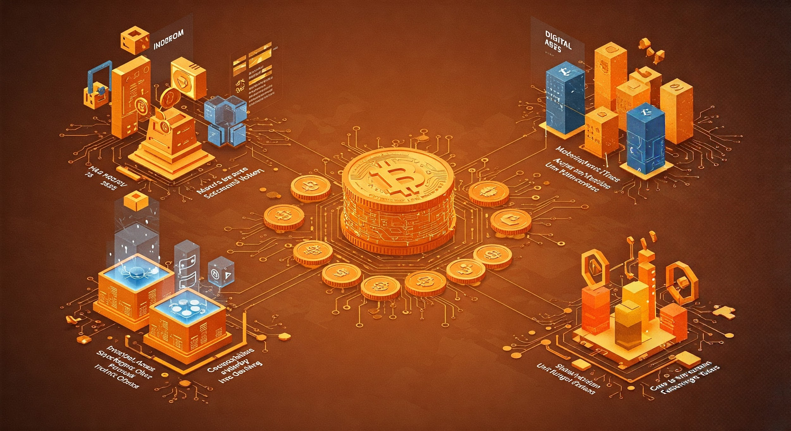
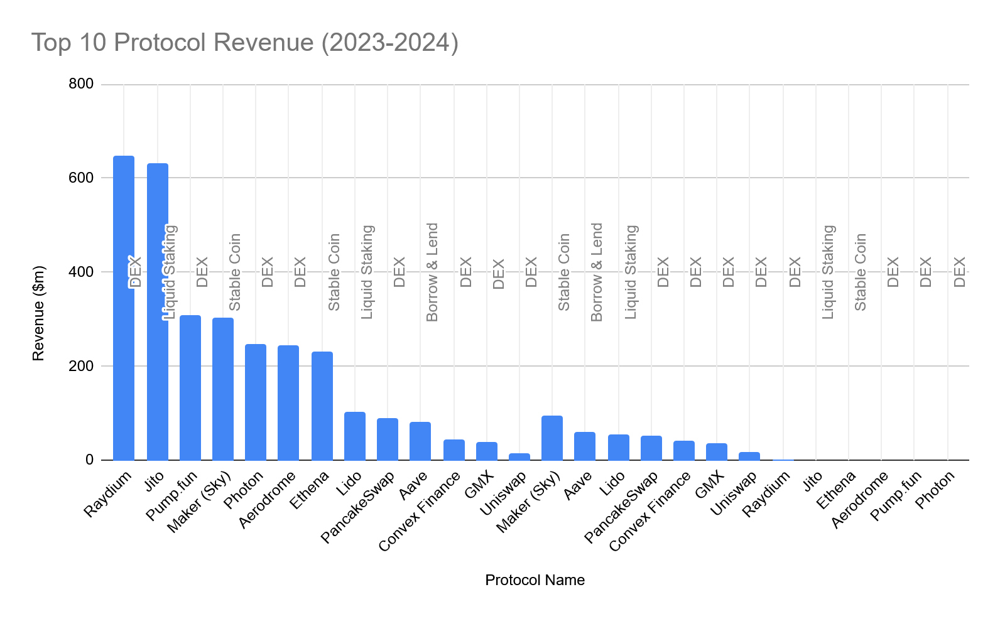
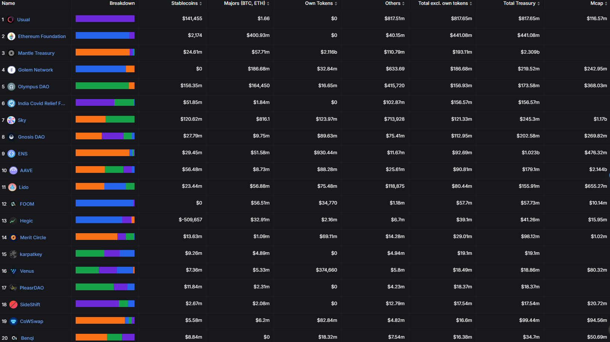

# Decentralized Finance (DeFi) - Part I: Reinvigorating Market Dynamics for a More Liberated Ownership

## Table of Contents
- [Preface](#preface)
- [Overview](#overview)
- [Value Transition: Lending and Borrowing](#value-transition-lending-and-borrowing)
- [Tokenization and Collateral Management](#tokenization-and-collateral-management)
- [Interest Rate Models](#interest-rate-models)
- [Governance](#governance)
- [Oracle](#oracle)
- [Medium of exchange: DEX & AMM](#medium-of-exchange-dex--amm)
- [Uniswap](#uniswap)
- [1inch](#1inch)
- [Hyperliquid](#hyperliquid)
- [Value storage: Stable Coins](#value-storage-stable-coins)
- [Fully Backed Stable Coin](#fully-backed-stable-coin)
- [USDC](#usdc)
- [USDT](#usdt)
- [Algorithmic stable Coin](#algorithmic-stable-coin)
- [Term Structure: Yields & AMM](#term-structure-yields--amm)
- [Pendle](#pendle)
- [Other DeFi Applications](#other-defi-applications)
- [Decentralized Asset Management](#decentralized-asset-management)
- [Prediction Markets](#prediction-markets)
- [Cross-Chain Interoperability & Bridges](#cross-chain-interoperability--bridges)
- [Tokenized Real-World Assets (RWAs) & TradFi](#tokenized-real-world-assets-rwas--tradfi)
- [NFT Finance (NFTfi)](#nft-finance-nftfi)


## Preface
The existing financial system predominantly centers on government-issued currencies and major banking establishments that function as reliable third parties within transactional associations. Fiat money offers stability to the financial markets, and banks enhance productivity by extending credit, taking on counterparty risks, and facilitating payments. Were it not for these two institutions furnishing liquidity and essential business infrastructure, the speed of market transactions and the pace of innovation would be significantly retarded compared to the present levels. Regrettably, the current framework entails specific compromises. The worth and movement of capital are susceptible to centralized authorities and inefficient procedures. This renders the markets liable to censorship, restricts access to capital, and extends the durations of contracts.

Decentralized Finance (DeFi) represents a paradigm shift. It reallocates the ownership of monetary and banking infrastructure, wresting it from the hands of centralized authorities and placing it within a decentralized framework that is collectively owned by market participants.

Rather than relying on authoritative bodies to issue currency and operating financial networks via centralized servers, DeFi allows for money and markets to function autonomously. Users can engage through distributed software protocols, which possess the remarkable ability to consistently achieve reliable consensus regarding the network's state. Prominent examples of such platforms facilitating this self-operation include Ethereum and Solana.

From the perspective of free movement of capitals, DeFi not only relocates trust from fallible human entities to immutable code but also harbors the potential for colossal network effects. Given that DeFi decentralized applications (Dapps) are accessible worldwide for both usage and further development, they introduce novel trust dynamics into financial markets. This unrestricted access and innovative trust model have the propensity to reshape the flow and utilization of capital, challenging traditional economic paradigms and potentially unlocking new avenues for growth and efficiency in line with the principles of free capital movement envisioned in classic economics.


## Overview
In the context of classic economics, money is often defined by its functions. It serves as a medium of exchange, a store of value, and a standard of deferred payment. Within the landscape of cryptocurrency and blockchain technology, digital assets align with money’s classic economic functions, now embedded in core crypto protocols and functions. They act as a medium of exchange via blockchain transaction protocols, enabling peer - to - peer transfers across decentralized networks. Cryptographic hashing and consensus mechanisms within these protocols secure their role as a store of value, protecting against unauthorized alteration and maintaining asset integrity over time. Moreover, smart contract protocols facilitate their function as a standard of deferred payment, automating and enforcing future - oriented payment terms without intermediaries.



Despite the top protocols listed above, there are a number of protocols that have attracted significant TVL during 2023 and 2024, such as . There are numerous other protocols that have amassed substantial TVL.





These protocols have developed innovative features tailored to their specific clientele. To gain a better understanding, we will first examine the common themes among them. Subsequently, we will provide an in - depth look at four crucial building blocks of DeFi, as follows:

- Value Transition: Lending and Borrowing 
- Medium of Exchange: DEX & AMM
- Value storage: Stable Coins
- Term Structure: Yield Enhancer


## Value Transition: Lending and Borrowing 
In the realm of financial systems, borrowing and lending play a pivotal role as they give rise to interest rates that can imply certain economic signals. These interest rates, in turn, can facilitate the functioning of a market that is free to divide the rewards among various opportunity costs.

Contrasting with traditional systems, mainstream cryptocurrencies inherently possess a deflationary tendency, which stems from their vibrant and respected communities. Consider Bitcoin (BTC) and Ethereum (ETH), for example. The cost associated with mining these cryptocurrencies has been steadily increasing over time. In a similar vein, application-based tokens such as Aave and Curve (CRV) pose substantial opportunity costs for users who decide not to engage in their staking rewards programs, especially when considering the potential benefits that could be reaped from participation.

Borrowing and lending established a vital market mechanism that enables a fairer transfer of value for all market participants. In the context of Aave, lenders are able to provide funds at a market-determined interest rate. They do this while still maintaining the flexibility to sell their assets quickly as they are not locked in. Meanwhile, borrowers, who have deliberately opted to borrow the asset, generate rewards in each block. This symbiotic relationship between lenders and borrowers, governed by the interest rates set in the market, allows for the allocation of rewards and the consideration of opportunity costs in a way that supports the fluid operation of the cryptocurrency market.

Aave and Compound stand as twin pillars of the decentralized finance (DeFi) ecosystem, redefining lending and borrowing through smart contract automation, community governance, and innovative capital allocation models. Below is a vivid breakdown of their business logics, highlighting core mechanisms, differentiators, and market impact:

Both protocols eliminate intermediaries, enabling peer-to-peer financial interactions via trustless smart contracts on Ethereum (and later, multi-chain expansions):

- For Lenders: Earn passive yield on idle assets by supplying liquidity to pools (e.g., ETH, USDC, BTC).
- For Borrowers: Access collateralized loans without credit checks, using digital assets as security.


### Tokenization and Collateral Management
Both Aave and Compound utilize tokenization as a fundamental mechanism for representing users' lending and borrowing positions. In Compound, when users supply assets to the protocol, they receive cTokens. These cTokens are ERC - 20 compliant tokens whose value is pegged to the underlying asset and accrues interest over time. The CToken smart contract manages the entire tokenization process, with functions like mint and redeem handling the creation and destruction of cTokens based on users' supply and withdrawal actions.

Aave, on the other hand, employs aTokens to represent users' deposited assets. Aave also offers a segregated collateral pool, which is a significant improvement in risk management. This feature allows for better isolation of different types of collateral, reducing the systemic risk associated with cross - contamination of assets. Additionally, Aave's e - mode (efficient mode) is designed to optimize capital usage for correlated asset pairs. For example, if two assets have a high positive correlation, users can benefit from more favorable lending and borrowing terms when using them in the e - mode.

```solidity
// Simplified example of Compound's CToken mint function
contract CToken {
    function mint(uint256 amount) external {
        // Logic to calculate and mint cTokens based on supply
        require(amount > 0, "Amount must be greater than zero");
        uint256 exchangeRate = getExchangeRate();
        uint256 cTokensToMint = amount / exchangeRate;
        // Mint cTokens to the user's address
        _mint(msg.sender, cTokensToMint);
    }
}
```


### Interest Rate Models
The interest rate models in Aave and Compound are designed to be responsive to the supply and demand dynamics within the lending pools. Compound's interest rate model is algorithmically driven and monitors the asset balances in the pools. It uses an interest rate oracle to fetch external market data, which is then incorporated into the interest rate calculations. However, this oracle - based approach has been a point of vulnerability in the past, as attackers have exploited it to manipulate the reported interest rates.

Aave offers both variable and stable interest rates. The variable interest rate fluctuates with market conditions, responding to changes in supply and demand. In contrast, the stable interest rate remains relatively constant, providing borrowers and lenders with a more predictable financial environment. This dual - rate system caters to different risk appetites and financial strategies.

```python
# Simplified example of a function to calculate interest rate in Compound
def calculate_interest_rate(supply, borrow):
    utilization = borrow / (supply + borrow)
    if utilization < kink:
        rate = base_rate + utilization * slope1
    else:
        rate = base_rate + kink * slope1+(utilization - kink) * slope2
    return rate
```


### Governance
Governance in both Aave and Compound is token - based, allowing token holders to participate in the decision - making process regarding the protocol's development. In Compound, COMP token holders can vote on proposals through dedicated voting contracts. Each COMP token represents a certain amount of voting power, and the voting process is designed to be democratic, ensuring that the community has a say in the protocol's evolution.

Aave's governance is also centered around its native token, AAVE. Token holders can vote on various aspects of the protocol, including the addition of new assets, changes to risk parameters, and updates to the smart contract code. This decentralized governance model promotes transparency and community - driven development.

**Evaluation**

**Pros**
- Liquidity Enhancement: In both protocols, the tokenization of assets (cTokens in Compound and aTokens in Aave) allows users to easily trade their positions, enhancing the overall liquidity of the lending market. For example, users can transfer their cTokens or aTokens on decentralized exchanges, providing them with flexibility in managing their assets.
- Dynamic Market Response: The interest rate models in Aave and Compound are highly responsive to market changes. In the case of high demand for borrowing a particular asset, such as USDC, the borrowing interest rate will increase, which in turn encourages more users to supply the asset, thus balancing the market.
- Community - Driven Development: The governance tokens (COMP and AAVE) give the community a voice in the protocol's development. This leads to more user - friendly and efficient protocol changes, as the decisions are made with the best interests of the users in mind.

**Cons**
- Complexity and Volatility: Tokenization adds a layer of complexity to the lending process. The value of cTokens and aTokens can fluctuate based on the underlying asset's price and the interest rate dynamics. This volatility can make it challenging for users to accurately assess the value of their positions.
- Oracle and Smart Contract Risks: Both protocols rely on oracles for external market data and smart contracts for their core functionality. Any vulnerability in the oracle or smart contract code can be exploited by attackers. For example, in Compound, the interest rate oracle has been targeted in the past, and in Aave, flash loan contracts have been subject to attacks due to coding errors.
- Market - Induced Instability: The volatile nature of the cryptocurrency market can pose significant challenges to these lending protocols. Sudden drops in collateral value can trigger mass liquidations, leading to a downward spiral in asset prices and potentially destabilizing the entire protocol.

In conclusion, Aave and Compound, while having their unique features and differences, are both integral parts of the decentralized lending ecosystem. Their combined functionalities, such as tokenization, interest rate models, and governance mechanisms, contribute to the overall growth and stability of the cryptocurrency lending market. However, they also face common challenges related to security, complexity, and market volatility that need to be continuously addressed for the long - term success of the ecosystem.

MakerDAO: MakerDAO is primarily known for creating and managing the Dai stablecoin. Dai is pegged to the US dollar and designed to maintain a stable value. It achieves this stability through a collateralized debt position (CDP) system.

**Collateralized Debt Position (CDP)**: these are another form of lending and borrowing, where a user deposits collateral (such as cryptocurrency like Ether) into a smart contract. In return, the user is able to borrow a certain amount of another asset (such as DAI) based on the value of the collateral and a pre - determined collateralization ratio.


### Oracle
Oracle is essential for lending and borrowing protocols because it provides accurate and up-to-date external market data such as asset prices. This data is crucial for calculating key metrics like collateral values, loan-to-value (LTV) ratios, and interest rates. Without reliable price feeds, the protocols wouldn’t be able to accurately assess the risk of loans, which could lead to under - collateralized loans, unfair interest rate settings, and potential losses for lenders.

- **Chainlink**:
  - Oracles often have a consensus mechanism to ensure the accuracy of the aggregated data. Some oracles require a certain number of data sources to agree on a price range before it's considered valid. For example, if more than 70% of the data sources report an ETH price within a certain narrow range, that price range is more likely to be considered accurate and used by the lending and borrowing protocol.
- **Pyth Network**:
  - Unlike Chainlink, where users pay gas to “push” the updated price to be on-chain, a set of trusted data publishers are responsible for providing the data for users to pull the data easily.
- **Timeswap's Oracle-Free Lending Approach**:
  - Timeswap has introduced a revolutionary alternative in the lending protocol landscape by eliminating the need for an oracle. Traditional lending models heavily rely on oracles to obtain external price data, which are used to assess collateral values and trigger liquidations. Instead of seizing and selling off collateral when a certain price threshold is breached, Timeswap operates on a swap-based mechanism. Here, the collateral will never be liquidated in the traditional sense. When an agreed target price, which is set by admin at the contract's inception, is reached, a swap of ownership occurs.


## Medium of exchange: DEX & AMM
Decentralized Exchanges (DEXs) are crucial for value transition as they provide an open and permissionless environment. Unlike traditional centralized exchanges (CEXs), DEXs don't require users to go through extensive KYC (Know Your Customer) procedures in many cases. This means that anyone with an internet connection and a digital wallet can access and trade assets. For example, in regions where financial infrastructure is underdeveloped or where individuals have limited access to traditional banking services, DEXs offer an alternative way to engage in financial transactions and transfer value.

In a DEX, trades are executed through smart contracts. These self - executing contracts eliminate the need for a central intermediary to hold users' funds. With CEXs, users have to deposit their assets into the exchange's wallet, which creates a counterparty risk. In the event of a hack, insolvency, or other issues with the exchange, users' funds could be at risk. DEXs, on the other hand, allow users to maintain control of their assets in their own wallets until the moment of the trade. The code of the smart contract ensures that the trade is executed as per the agreed - upon terms, reducing the risk of a third - party misappropriating funds.

**Automated Market Maker (AMM) Model**: Instead of using a traditional order book system, Uniswap uses an AMM model. Liquidity providers (LPs) deposit pairs of tokens into liquidity pools. For example, for the ETH/DAI pool, LPs add both Ether and DAI. The ratio of these tokens in the pool determines the price. When a user wants to trade, the AMM algorithm calculates the price based on the available liquidity and the amount of tokens in the pool. This allows for continuous trading and provides liquidity even for less popular tokens.


### Uniswap
Uniswap is a decentralized exchange (DEX) protocol based on the Ethereum blockchain. It allows users to trade ERC-20 tokens directly from their wallets without the need for a central authority.

- **Liquidity Provision and Rewards**: LPs earn a portion of the trading fees generated by the pool as a reward for providing liquidity. The more liquidity they provide and the more trading activity there is in the pool, the more fees they earn. This incentivizes users to contribute to the liquidity of different token pairs and helps to maintain a healthy trading environment.
- **Permissionless Listing**: Uniswap allows any ERC-20 token to be listed and traded on its platform. This means that new and innovative projects can easily gain access to a trading venue without having to go through a complex and often costly listing process like on traditional exchanges.
- **Bound Curve Feature on Bump.fun**: as the price discovered by AMM is arguably engineered, Bump.fun has taken this ingenuity to the next level by removing the requirement of LP, such as exchange and settlement are unified via on pre-set formulae.


### 1inch
1inch scans multiple DEXs such as Uniswap, SushiSwap, etc., to find the best available price for a given token trade.

- **Aggregation of Liquidity and Rates**: 1inch uses its routing algorithm to split the trade across different DEXs if needed to achieve the optimal price. For example, if a user wants to trade token A for token B, 1inch might find that the best price is obtained by splitting the trade between Uniswap and SushiSwap. 1inch offers limit order functionality, which helps users to minimize their trading costs and get the most out of their trades.
- **Protection Against Slippage**: Slippage can occur when the actual executed price of a trade differs from the expected price due to changes in market conditions or low liquidity. 1inch has mechanisms to protect against slippage. It provides users with an estimate of the slippage before they execute a trade and tries to minimize it by using its advanced routing algorithms and by aggregating liquidity from multiple sources.


### Hyperliquid
**Order Book Architecture and On - Chain Operations**

Hyperliquid deviates from the widely - adopted Automated Market Maker (AMM) model, which relies on pre - determined mathematical formulas to price assets and facilitate trades. Instead, it implements an on - chain order book mechanism. This on - chain order book is a data structure stored on the blockchain that records all buy and sell orders, cancellations, trades, and settlements in a decentralized and immutable manner.

**Semi - Decentralized Nature and Smart Contract - Based Transactions**

Hyperliquid is characterized as a semi - decentralized platform. The core of its transactional processes is built on blockchain smart contracts. These smart contracts are self - executing pieces of code that enforce the rules and conditions of trades without the need for a central authority. When a user initiates a trade, the smart contract validates the transaction based on pre - defined rules, such as collateral requirements for futures trading or available funds for spot trading.

In contrast, major centralized exchanges (CEXs) operate on a centralized model. Users are required to deposit their assets into wallets managed by the exchange. This centralized custody of assets introduces significant trust risks, as users must rely on the exchange's security measures and integrity. For example, if a CEX is hacked or mismanages its funds, users' assets may be at risk. Hyperliquid's semi - decentralized approach mitigates these risks by leveraging the security and immutability of the blockchain.

**In - house Oracle System**

One of the key technical features of Hyperliquid is its in - house oracle system. Traditional blockchain applications often rely on external oracles to fetch real - world data, such as asset prices. However, Hyperliquid has developed its own oracle system operated by blockchain validators. These validators are responsible for collecting and aggregating price data from multiple sources and updating the spot price on the blockchain.

The spot price is updated every 3 seconds, providing a high - frequency and accurate representation of the market value. This frequent update interval enhances the reliability and stability of the price data used for trading. By eliminating the reliance on external oracles, Hyperliquid reduces the risk of price manipulation. External oracles can be vulnerable to attacks, where malicious actors may try to manipulate the reported prices for their own gain. With its in - house oracle system, Hyperliquid has more control over the data source and validation process, ensuring the integrity of the price information.

**HyperBFT Consensus Mechanism and Low Transaction Latency**

Hyperliquid employs the HyperBFT Consensus Mechanism to achieve fast and efficient transaction processing. The Byzantine Fault Tolerance (BFT) class of consensus algorithms is designed to tolerate a certain number of faulty nodes in a distributed network. The HyperBFT mechanism builds on this foundation to optimize for high - throughput and low - latency trading.

The average transaction latency on Hyperliquid is about 0.2 seconds. This low latency is comparable to the trading experience offered by centralized exchanges, which are known for their fast order execution. The HyperBFT Consensus Mechanism achieves this by reducing the time required for nodes to reach a consensus on the validity of transactions. It uses a combination of message passing, voting, and state machine replication techniques to quickly validate and confirm transactions. This low - latency trading environment is essential for high - frequency traders and those who require real - time execution of trades in the volatile cryptocurrency markets.


## Value storage: Stable Coins
Both USDC (USD Coin) and USDT (Tether) are stablecoins, which play significant roles in the decentralized finance (DeFi) ecosystem. Here are the key features in terms of their collateral status and importance in DeFi:


### Fully Backed Stable Coin 
#### USDC
- **Collateral Status**: USDC is a fully collateralized stablecoin. It is backed 1:1 by U.S. dollars held in reserve accounts at regulated financial institutions. These reserves are regularly audited to ensure transparency and maintain the stable value of the coin.
- **Importance in DeFi**:
  - **Stability**: Its stable value makes it a reliable medium of exchange and store of value within the DeFi space. Users can easily move funds between different DeFi protocols without worrying about significant price fluctuations.
  - **Liquidity**: USDC is widely accepted across various DeFi platforms, providing high liquidity. This allows for efficient trading and lending operations, facilitating the growth and functioning of the DeFi ecosystem.
  - **Regulatory Compliance**: The fact that it is backed by real U.S. dollars and subject to certain regulatory requirements gives users a sense of security and confidence in its usage within DeFi applications.

#### USDT
- **Collateral Status**: USDT is also designed to maintain a stable value pegged to the U.S. dollar. However, its collateralization has been a subject of some controversy and scrutiny. Initially, it was claimed to be backed 1:1 by U.S. dollars held in reserve, but there have been questions and concerns about the transparency and adequacy of these reserves.
- **Importance in DeFi**:
  - **Early Adoption and Liquidity**: USDT was one of the first stablecoins and gained significant popularity and liquidity in the cryptocurrency market. Its wide acceptance and availability on many exchanges and DeFi platforms made it a go-to stablecoin for many users, facilitating trading and other financial activities.
  - **Market Access**: For users who may have limited access to traditional banking systems or face restrictions in dealing with fiat currencies, USDT is widely accepted for large CEX such as Binance. USDT is still the most popular stable coin on TRON.


### Algorithmic stable Coin
Algorithmic stablecoins represent a fascinating innovation within the cryptocurrency realm. These digital assets are engineered with a singular goal: to uphold a stable value, frequently by being pegged to a well - known asset, most commonly the United States Dollar (USD).

Unlike traditional stablecoins that rely on physical collateral, such as actual dollars held in reserve, algorithmic stablecoins operate on a different principle. Their value stability is achieved through the implementation of algorithms. These algorithms function as the guardians of the stablecoin's price, constantly monitoring market conditions.

When the market shows an upswing in the demand for the algorithmic stablecoin, causing its price to climb above the pre - set target peg, the algorithm swings into action. It authorizes the creation and issuance of new tokens. This influx of new supply into the market then exerts downward pressure on the price, gradually bringing it back to the desired peg level.

Conversely, if the stablecoin's price dips below the peg due to decreased demand or other market forces, the algorithm initiates a buy - back and burn mechanism. Tokens are purchased from the market and then "burned," which effectively removes them from circulation. This reduction in supply has the effect of increasing the price of the remaining tokens, thus pushing the price back up towards the peg.

The entire process of maintaining this delicate balance is automated and executed through smart contracts. These self - executing contracts are deployed on blockchain platforms, ensuring transparency, immutability, and decentralization in the management of the algorithmic stablecoin's supply and price. This innovative approach has opened up new possibilities in the world of decentralized finance, but also comes with its own set of challenges and considerations, such as the need for flawless algorithm design and market confidence in the system.

- **DAI**: MakerDAO's standout offering is the DAI stablecoin, an algorithmic stable coin. As we've explored, DAI is meticulously crafted to uphold a stable value, functioning as a decentralized stablecoin pegged to the US dollar. This stability is of paramount importance in the volatile realm of decentralized finance (DeFi), where rapid price fluctuations can be the norm.DAI's design incorporates a complex set of mechanisms aimed at keeping its value in check. Traditionally, it relied on over-collateralization with cryptocurrencies. For instance, users would lock up a certain amount of Ethereum, worth more than the value of the DAI they wished to mint, ensuring there was a buffer to absorb potential losses in the collateral's value. However, this approach had its limitations, especially when the cryptocurrency markets themselves were in turmoil.

**RWAs**: It has been astutely leveraging Real-World Assets (RWA) to augment its allure among DeFi users, which would be a better way to maintain the value of DAI than its market stability mechanism. RWAs offer a more diversified and potentially less volatile source of backing. Consider real estate, a prime example of an RWA. Real estate values, while not immune to economic cycles, tend to move at a much slower pace compared to cryptocurrencies. A property's value is often influenced by long-term factors such as population growth, infrastructure development, and local economic trends. When DAI is backed by real estate - backed tokens, for example, it gains an added layer of stability.

Invoices also play a significant role as RWAs. A company with a reliable stream of invoices from its customers can use them to collateralize DAI. This not only provides an alternative to volatile crypto collateral but also brings in a new dimension of real - world economic activity into the DeFi space. The predictability of invoice payments, based on the creditworthiness of the issuing company, can contribute to a more consistent value for DAI.

Furthermore, loans can be tokenized and incorporated as RWAs. Banks or lending institutions can offer up portions of their loan portfolios, which, if of high quality, can act as reliable collateral. This allows DAI to tap into the vast existing lending infrastructure in the traditional economy, again diversifying its collateral base and enhancing stability.

As RWAs are integrated into the DAI ecosystem, a host of opportunities unfold for DeFi users. They can now access a more stable form of stablecoin, which is crucial for activities like lending, borrowing, and trading. For instance, in a lending scenario, borrowers are more likely to seek DAI if they know its value is firmly anchored by a combination of RWAs and crypto collateral. Lenders, too, would be more inclined to provide funds as the risk of sudden devaluation is reduced.

MakerDAO's strategic use of RWAs for DAI represents a significant step forward in the evolution of stablecoins. It not only addresses the inherent volatility issues associated with crypto - only collateral but also opens up new avenues for collaboration between the traditional and decentralized finance worlds, ultimately benefiting DeFi users seeking stability and value in their financial transactions.


## Term Structure: Yields & AMM
**Term Structure Basics**: In classic economics, the term structure refers to the relationship between the interest rates (or yields) and the time to maturity of financial instruments, usually bonds. It is often depicted graphically as a yield curve. The yield curve shows the yields of bonds with different maturities, such as short - term (e.g., 1 - year bonds), medium - term (e.g., 5 - year bonds), and long - term (e.g., 10 - year bonds). 

The concept of term structure trading has been brought to the Defi space to allow a fair split between fixed income investors and airdrops hunters.


### Pendle
Pendle allows users to tokenize and trade the future yield of various underlying assets. Essentially, it takes the yield that would be generated from assets like staked tokens or lending positions and breaks it into separate components that can be bought, sold, or otherwise interacted with on the blockchain.

**Key Mechanics**
1. **Yield/Principal Separation**:
   Every Pendle market splits an income-generating asset into:
   - **Principal Token (PT)**: Tracks the underlying asset’s price (e.g., stETH, aUSDC) without yield.
   - **Yield Token (YT)**: Tracks the future yield stream (e.g., staking rewards, lending interest), priced based on market expectations of yield rates.
2. **Pricing via Discounted Cash Flow**:
   YTs are priced using a discount rate—if the market expects yields to fall, YTs trade at a larger discount to face value (e.g., 1 ETH YT promising 1.23 ETH trades at 0.8x).
3. **Use Cases for Different Users**:
   - **Yield Sellers (Alice/Charlie)**: Monetize future yield for liquidity, hedge against yield drops, or “pre-sell” rewards.
   - **Yield Buyers (Bob/Diane)**: Speculate on rising yields, earn yield at a discount, or create synthetic yield positions.

**Tokenization opportunity costs via YT (Yield Tokens)**  
- **Yield Tokenization Process**: Pendle creates two main types of yield tokens - Principal Tokens (PT) and Yield Tokens (YT). When an asset is deposited into a Pendle pool, its future yield is separated out. The PT represents the principal amount of the underlying asset and can be redeemed for the original asset at maturity. The YT, on the other hand, represents the right to receive the yield generated by that asset over a specific period.
- **Valuation Basis**: The value of YT is directly tied to the expected yield of the underlying asset. For example, if a user stakes a certain amount of a cryptocurrency in a staking pool integrated with Pendle, and based on historical data and current market conditions, that staking is expected to generate an annual yield of 10%. The YT corresponding to that staking position will then be valued based on this projected 10% yield. As the market's perception of the yield changes (due to factors like changes in the underlying asset's price, network upgrades that could affect staking rewards, or shifts in overall market interest rates), the value of the YT will also fluctuate.
- **Trading and Pricing**: YTs are tradeable on Pendle's marketplace. Their prices are determined by supply and demand dynamics within the Pendle ecosystem. If more users expect the yield of a particular asset to increase in the future and want to get exposure to that yield, the demand for the corresponding YT will rise, driving up its price. Conversely, if there are concerns about the underlying asset's performance or changes in the broader DeFi landscape that could impact the yield negatively, the price of the YT may decline. Additionally, users can compare the prices of different YTs representing various assets to assess which ones offer better yield opportunities relative to the risk involved.

In summary, Pendle's use of YT to represent and trade yield provides a novel way for DeFi users to gain exposure to the future earnings of different assets. The value of these YTs is intricately linked to the expected yield of the underlying assets and is further shaped by the market forces of supply and demand within the Pendle platform's trading environment.


## Other DeFi Applications 
Beyond the core categories of lending/borrowing, trading, and stablecoins, Decentralized Finance (DeFi) encompasses a diverse ecosystem of applications that reimagine traditional financial services and create entirely new decentralized primitives. Below is a structured overview of these innovative use cases:


### Decentralized Asset Management
**Purpose**: Automate and democratize investment strategies, the creation of diversified portfolios, and yield optimization without relying on centralized fund managers.

**Key Applications**:
- **Yield Aggregators (e.g., Yearn.finance, Beefy Finance)**:
  - Scour multiple DeFi protocols (Aave, Compound, Curve) to find the highest-yield opportunities for users’ deposits.
  - Example: Yearn’s “Vaults” automatically move funds between lending/borrowing platforms to maximize returns, charging a small management fee.
- **Index Protocols (e.g., Index Coop, Set Protocol)**:
  - Create tokenized baskets of assets (e.g., DeFi Pulse Index, BTC/ETH/USDC bundles) for diversified exposure.
  - Users can buy/sell index tokens (e.g., $DPI for top DeFi tokens) instead of managing individual assets.
- **Options & Derivatives Strategies (e.g., Ribbon Finance, Opyn)**:
  - Offer structured products like covered calls or put spreads for yield enhancement or hedging.
  - Example: Ribbon allows users to earn yield by selling call options on ETH, generating income if ETH’s price stays below a certain threshold.

**Key Features**:
- No Minimum Investment: Open to all users, unlike traditional asset management that requires high minimums.
- Transparency: Strategies are coded into smart contracts, auditable by anyone.


### Prediction Markets
**Purpose**: Enable decentralized forecasting of events (e.g., election outcomes, crypto price movements, sports results) with financial incentives for accurate predictions.

**Key Applications**:
- **Event Prediction Platforms (e.g., Augur, Gnosis, Polymarket)**:
  - Users create markets for events and trade outcome tokens (e.g., “Bullish” or “Bearish” on ETH hitting $5k by 2024).
  - Example: Augur uses a jury system (randomly selected users) to resolve ambiguous events, while Gnosis leverages quadratic voting for efficiency.

**Key Features**:
- Liquidity for Forecasting: Markets remain open until event resolution, allowing traders to exit positions early.
- Decentralized Truth-Telling: Reduces bias by relying on consensus (e.g., oracles for price events, juries for subjective outcomes).


### Cross-Chain Interoperability & Bridges
**Purpose**: Enable seamless asset and data transfer across different blockchains (e.g., Ethereum ↔ Solana ↔ Bitcoin), addressing the fragmentation of DeFi across networks.

**Key Applications**:
- **Cross-Chain Bridges (e.g., Polkadot, Cosmos, Axelar, Synapse)**:
  - Polkadot/Cosmos: Use “relay chains” or “inter-blockchain communication” (IBC) to connect independent blockchains (parachains/zone) for shared security and data transfer.
  - Axelar/Synapse: Provide middleware for cross-chain smart contract calls (e.g., sending ETH from Ethereum to Terra Classic).
- **Multi-Chain Aggregators (e.g., 1inch, Paraswap)**:
  - Aggregate liquidity across chains and DEXs to find the best trading routes, even across different blockchains (e.g., swapping USDC on BSC to ETH on Ethereum).

**Key Features**:
- Unified Liquidity: Allows users to access assets and DeFi services across multiple blockchains from a single interface.
- Risk Challenges: Bridges are frequent attack targets (e.g., $600M Ronin Bridge hack in 2022), driving demand for audited, multi-signature security.


### Tokenized Real-World Assets (RWAs) & TradFi
**Purpose**: Create digital representations of external assets (e.g., stocks, gold, fiat currencies) or abstract financial instruments (e.g., indices, weather derivatives) on the blockchain.

**Key Applications**:
- **Synthetic Asset Protocols**
  - Synthetix: Mints “synths” (e.g., sUSD, sXAU, sSPX) backed by overcollateralized SNX tokens, mirroring real-world asset values via Chainlink oracles.
  - Mirror Protocol: Tokenizes individual stocks (e.g., $AAPL, $GOOGL) as mAssets, allowing DeFi users to track stock prices without traditional brokerage accounts.
- **Real-World Asset Tokenization**
  - Centrifuge: Tokenizes commercial invoices and supply chain assets, connecting businesses with DeFi lenders for invoice financing.
  - Maple Finance: Facilitates institutional lending by matching DeFi liquidity pools (e.g., USDC) with borrowers, structuring loans as on-chain NFTs with automated repayment logic.
- **HUMA (Human Tokenization Protocol)**
  - Focus: Specializes in income-generating TradFi assets (mortgages, consumer loans) via a hybrid architecture:
    - Off-chain data processing (KYC/AML, loan origination) paired with on-chain settlement (ERC-20 tokens like H-Tokens).
    - Smart contracts automate cash flow distribution (e.g., rental income to token holders) and collateral management (150% overcollateralization for mortgages).
  - Innovation: Uses zero-knowledge proofs for regulatory compliance and interoperates with DeFi protocols (e.g., Aave) as collateral, enabling cross-ecosystem liquidity.

**Key Features**
- Liquidity & Fractional Ownership: Illiquid assets (e.g., real estate, loans) become tradeable 24/7 via tokenization (e.g., splitting a $1M property into 10,000 $100 tokens).
- Regulatory Compliance: Integrates KYC/AML modules (e.g., Onfido, Tenderly) to meet global standards, attracting institutional participation.
- Smart Contract Automation: Enforces repayment schedules, interest calculations, and liquidations via code (e.g., HUMA’s RepaymentScheduler for monthly distributions).
- Oracle Dependency: Relies on secure price feeds (Chainlink, Pyth Network) to peg tokens to real-world values, critical for synthetic assets and RWAs.
- Composability: Tokenized assets (e.g., HUMA’s H-Tokens) can be used as collateral in DeFi protocols, creating seamless cross-ecosystem financial workflows.


### NFT Finance (NFTfi)
**Purpose**: Extend DeFi primitives to non-fungible tokens (NFTs), enabling lending, borrowing, and yield generation against digital collectibles (e.g., Bored Apes, CryptoPunks).

**Key Applications**:
- **NFT-Backed Loans (e.g., NFTfi, BendDAO, JPEG’d)**:
  - Users borrow ETH/USDC by collateralizing their NFTs (e.g., a BAYC as collateral for a 50 ETH loan).
  - Example: BendDAO offers mortgages for NFTs, with lenders earning interest on loan principals.
- **NFT Fractionalization (e.g., Rarible, Fractional, Sudoswap)**:
  - Split high-value NFTs into fungible tokens (e.g., 10,000 $APE tokens for a BAYC), allowing partial ownership and trading on DEXs.
- **Yield-Generating NFTs (e.g., Axie Infinity, DeGods)**:
  - NFTs grant access to DeFi protocols (e.g., staking rewards, governance rights) or gaming ecosystems (e.g., earning tokens by playing Axie).

**Key Features**:
- Liquidity for Illiquid Assets: Converts unique NFTs into tradable or borrowable collateral.
- Niche Market: Caters to collectors and speculators, with risks like NFT price volatility and illiquid secondary markets.
- ML in decentralized ecosystems without compromising user autonomy.

These applications share a common goal: decentralization, user empowerment, and elimination of intermediaries. While each category faces unique challenges (e.g., regulatory uncertainty, security risks, or liquidity fragmentation), they collectively demonstrate DeFi’s potential to disrupt and redefine every corner of global finance. As the ecosystem matures, these applications will likely converge with traditional finance (TradFi) and Web3, creating a seamless, borderless financial infrastructure.