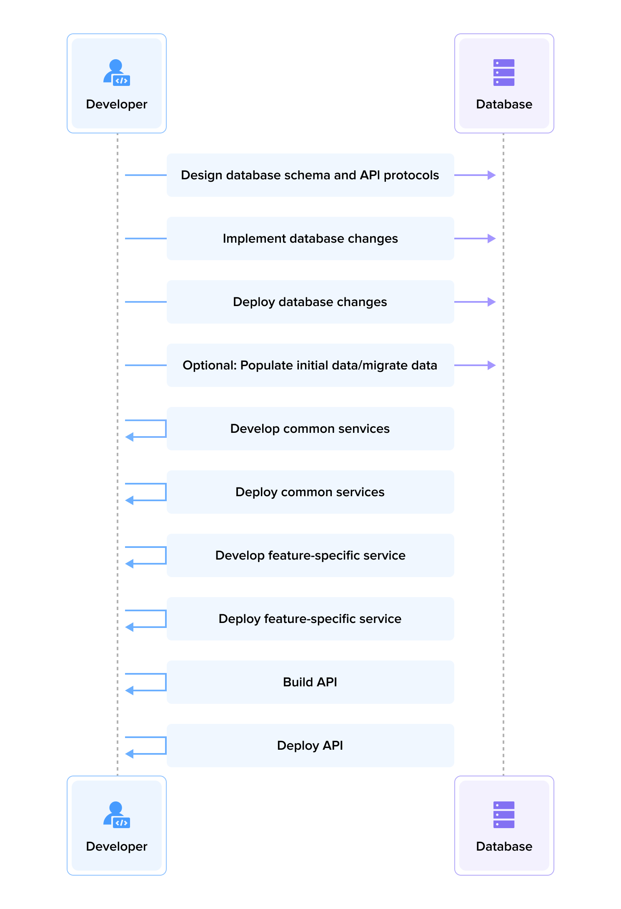
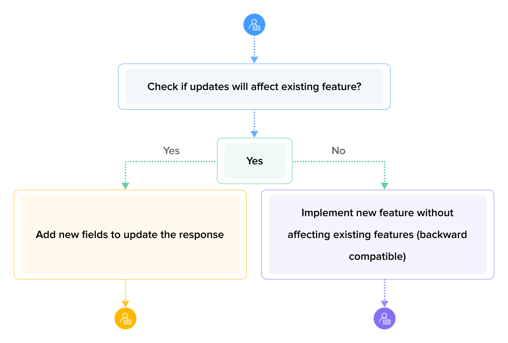

## Abstract

Do you face challenges when deploying large features? Do you find yourself needing to temporarily shut down services to ensure the smooth functioning of an entire feature, such as managing basic data feeding, migrating legacy data, or avoiding disruptions to dependent clients? 

In most cases, these issues can be avoided by adopting the practice of shipping as small as possible, which aligns with the principles of Continuous Integration and Continuous Deployment (CI/CD).

## How To

To achieve the goal of shipping small, solid, and deliverable changes, it is essential to break down features into manageable components. The following principles can guide us in this process.

### New Features

When it comes to new features, it is relatively easy to build them without exposing them to clients or users. However, it is crucial to keep them as small as possible. Here's a recommended approach:

- Create the basic or common changes required as a foundation for upcoming logic or features. This may include database modifications and the development of common services/components.
- Build the feature from the bottom up or in reverse order, starting from the database layer, then moving to the service layer, and finally constructing the protocol/interface layer.
- Construct new exposed UI/APIs.

### Existing Features

Some features build upon existing ones, which means that the new feature rules may not always apply. In such cases, it becomes necessary to consider compatibility for both new and updated features. Here are some approaches. 

1. Do not initialize new changes if dependencies are not ready, such as setting up a new message queue service or SMS service.
2. Add a feature flag that allows the changes to be disabled based on conditions. For example, you may want to hide all change information from users or specific user groups.
3. Instead of updating existing features directly, consider adding new features alongside the old ones. For instance, if you need to modify a field in the response, it is better to mark the old field as deprecated and introduce a new field. This ensures compatibility with different services that rely on the old field.
4. Create a new version of the API when the changes significantly alter the original structure. If the response data structure needs to use a different format, it is advisable to create a new API version for it.

### Moreover

To ensure smooth shipping, additional actions should be taken in other areas:

- Split the feature into deliverable pieces during the technical design phase.
- Use pull requests to facilitate team review and minimize the risk of system disruptions.
- Leverage CI/CD to run tests that cover the core logic.
- Establish a reliable shipment channel to notify the team about changes.
- Enable A/B testing for clients to validate the new feature changes. 

## Pros

Adopting the practice of shipping as small as possible offers several advantages:

- Reasonable splitting of changes.
- Easy review of each change, allowing for the detection of potential issues before deployment.
- Simplification of the branch model.
- Faster delivery of changes.
- Preemptive data feeding and migration of legacy data to new schemas.
- Verification of changes by clients before their release.
- Ability to release new features to clients at any time.

## Cons

There are some considerations and challenges associated with shipping small changes

- The risk of breaking existing features if changes are not compatible with existing clients.
- The need to block public client access to changes during specific stages.
- Setting up feature flags to enable changes when needed and removing them once the new version is stable.

## Examples

### Build New API

For backend services, creating new APIs for new features typically follows this sequence

1. Design the database schema and API protocols.
2. Implement the database changes and deploy them to production without causing disruptions.
3. Optional: Populate initial data for the new data schema if necessary.
4. Develop common services required for upcoming APIs and deploy them.
5. Build the APIs incrementally, shipping them one by one.
6. Ensure careful access control to prevent premature exposure of new APIs.

### Update Existing API

When modifying APIs used by various components, it is crucial to avoid breaking existing systems. Instead, consider the following approaches

- Determine whether changes can be made to the existing API without causing issues.

    - If yes, add new fields to update the response. For example, if the existing API only returns a user's name but requirements dictate displaying the user's information, add an object field to contain all user information.
    - If no, create a new version of the API to replace the existing one.

### Build New UI

When building new user interfaces, the same principles applied to building new APIs can be followed. However, it is important to consider when to expose the UI publicly. Ensure the following:

1. Define who can access the UI and when.
2. Develop the appropriate entry point for users to access the new UI.
3. Determine the process for shipping the new UI once it is completed.

### Update Existing UI

When updating existing user interfaces, it often requires new APIs. In such cases, both versions of the UI can coexist, allowing for a gradual transition. Use a feature flag to determine which version is displayed to each user. Once one version is confirmed to be successful, update the feature flag to make the preferred version available to all users.

## Summary

By adopting the practice of shipping as small as possible, you can expedite the deployment of changes without having to wait for the entire feature to be completed. This approach minimizes the risk of rolling back an entire feature if it doesn't function as expected, as reverting can be done on a smaller scale.

Shipping small changes offers numerous benefits, including reasonable change splitting, ease of review, streamlined branch models, faster delivery, early data feeding, seamless legacy data migration, client verification before release, and the ability to release new features at any time. However, it's essential to consider potential drawbacks such as the risk of breaking existing features, the need to control public client access to changes, and the management of feature flags.

By following the recommended approaches and considering the provided examples, you can navigate the process of shipping small changes effectively, ensuring smoother deployments and minimizing disruptions to your system.
