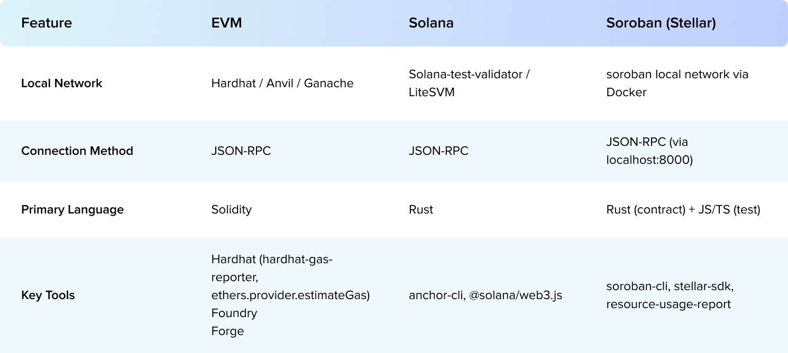

## Introduction

Testing smart contracts isn’t just about checking individual functions. In contract development, especially in Soroban, where contracts interact with users, tokens, and other contracts: integration testing is essential.

Soroban contracts often involve multiple moving parts: token approvals, vault logic, inter-contract calls, and strict resource limits. Unit tests won’t catch everything. Integration tests simulate full workflows and help ensure your contracts actually behave as expected on-chain.

## How Soroban Differs From EVM

If you’re coming from Ethereum or Solana, Soroban may feel both familiar and surprisingly lightweight. Here’s a comparison to illustrate the differences:


Soroban offers a cleaner, Docker-based localnet, built-in support for Rust contracts, and a JavaScript SDK that makes full integration testing possible without heavy setup.

## Five Practices That Matter

Integration testing on Soroban means running your contracts in a setting that closely mimics the real Stellar network. This catches issues unit tests miss (e.g. inter-contract state, resource limits, etc.). Five key practices are essential:

### Use a realistic local network

Mocking contracts or skipping fees might not catch real bugs. Use a localnet instead to test with actual ledger rules, token balances, and transaction limits. Deploy real tokens (like Soroban Token), test full interactions (not mocks), and track resource use (cpu, memory).

While we recommend using official Soroban tools whenever possible, resource usage tracking doesn’t yet have an official solution. For now, we suggest using the open-source @57blocks/stellar-resource-usage tool to inspect CPU and memory usage during testing. We’ll cover how to use it in detail later.

### Cover full end-to-end user flows

Real users don’t just call one function, they go through flows. These flows may touch multiple contracts. Integration tests should cover:

- Mutual contract interaction
- Token approvals across contracts
- Balance updates across steps

We suggest writing tests that simulate a full user journey: from token approval, to deposit, to earning rewards, to withdrawal and claiming. Use actual contract IDs (fetched from testnet or deployed locally). Avoid mocking tokens or external contracts, you want to catch issues in the real dependencies too.

### Control State and Validate Outcomes

Ensure every test starts from a clean, known ledger state. Meanwhile, after each transaction, check that the on-chain state changed as expected.

### Cover Edge Cases and Failure Paths

These are the tests that protect you from real-world exploits.

Don’t only test the “happy path.” Deliberately trigger failure modes to catch bugs or security holes, pass invalid data, exceed resource usage limits, simulate permission errors. Also try invalid dependencies. For example, use an oracle that returns broken data and see how your contract handles it.

### Automate testing with CI

Make integration tests part of your development workflow so they always run on every push or pull request, because a broken integration test can sneak into production if it’s not automated.

Store setup scripts in your repo: account creation, contract deployment, etc And make testing a required step before merging.

## Our Experience: Lessons From a Real Project

We’ve applied these practices in an actual Soroban project. Here’s how we approached testing, tooling, and handled the nuances of resource usage.

### Tooling & Project Structure

Our recommended structure setup looks like this:

```
project/
├── contracts/         # Rust contract source
├── pkg/               # Compiled Wasm
├── scripts/           # Setup/deploy scripts
├── tests/             # JS/TS tests
│   ├── batchLiquidation.test.js
│   └── testUtils.js
├── package.json
└── .github/workflows/ # CI config
```

**Toolset recommendations:** Use the official Soroban tools and SDKs:
**- Soroban CLI:** for network management, snapshots, contract deploy/upgrade.
**- @stellar/soroban-client:** the JavaScript SDK for invoking contracts in tests. It provides SorobanRpc to send transactions.
**- Test framework:** Mocha or Jest with an assertion library (Chai or built-in Jest assertions) works well for async contract calls.
**- Resource profiler:** include @57blocks/stellar-resource-usage if you want resource usage reports.

### Step-by-Step: CLI + JavaScript Integration

Below is a sample integration test scenario for a Soroban batch liquidation contract. It shows key steps in both shell and JavaScript:

1. Start the local network:

```
# Ensure you’ve compiled your contract to Wasm (Rust)
$ stellar contract build
# Start a full Soroban Quickstart localnet via Docker
$ stellar container start local
```

This launches a local network (Core, Horizon, Soroban RPC, faucet) on http://localhost:8000 with a persistent ledger state unless reset. This emulates a live environment for integration testing.

2. Create a Test Account and Deploy Your Contract

```
# Generate a new keypair for testing
$ stellar keys generate --name testpayer --network local
# Deploy your contract Wasm to the localnet
$ stellar contract deploy \
    --wasm target/wasm32-unknown-unknown/release/my_contract.wasm \
    --source testpayer \
    --network local

$ stellar snapshot create --network testnet --address C... --out token_state.json
$ stellar snapshot load --file token_state.json
```

Capture the returned CONTRACT_ID (a string starting with C...). Keep it for later JS use.

3. E2E user flow: Batch Liquidation Contract

```
describe('Batch Liquidation Contract - Basic', () => {
  let liquidator, debtorAccounts, collateralAsset, debtAsset;

  before(async () => {
    // Initialize network and deploy contract
    await initializeTestEnv();
    [liquidator, ...debtorAccounts] = await createTestAccounts(10);
    [collateralAsset, debtAsset] = await createAssets(['COLL', 'DEBT']);

    // Setup undercollateralized positions
    await setupDebtPositions(debtorAccounts, collateralAsset, debtAsset);
  });

  it('should successfully liquidate undercollateralized positions', async () => {
    const liquidateTx = buildBatchLiquidationTx({
      liquidator: liquidator.publicKey,
      debtors: debtorAccounts.map(a => a.publicKey),
      contractId: CONTRACT_ID
    });

    // Submit and validate transaction
    const result = await submitTx(liquidateTx, liquidator);
    expect(result.successful).to.be.true;

    // Verify state changes
    for (const debtor of debtorAccounts) {
      const position = await getPosition(debtor.publicKey);
      expect(position.collateral).to.equal(0);
      expect(position.debt).to.equal(0);
    }

    // Verify liquidator received assets
    const liquidatorBalances = await getBalances(liquidator.publicKey);
    expect(liquidatorBalances[collateralAsset]).to.be.above(0);
  });

  it('should handle partial liquidation when exceeding operation limit', async () => {
    const largeDebtorGroup = await createTestAccounts(150);
    await setupDebtPositions(largeDebtorGroup, collateralAsset, debtAsset);

    const partialTx = buildBatchLiquidationTx({
      liquidator: liquidator.publicKey,
      debtors: largeDebtorGroup.map(a => a.publicKey),
      contractId: CONTRACT_ID,
      maxOperations: 100  // Contract-enforced limit
    });

    const result = await submitTx(partialTx, liquidator);
    expect(result.successful).to.be.true;

    // Verify only 100 positions processed
    const processedEvents = result.events.filter(e => e.type === 'LIQUIDATION_SUCCESS');
    expect(processedEvents.length).to.equal(100);
  });

  it('should fail with insufficient transaction resources', async () => {
    const tx = buildBatchLiquidationTx({
      // Intentionally underfunded
      fee: 100,
      liquidator: liquidator.publicKey,
      debtors: debtorAccounts.map(a => a.publicKey),
      contractId: CONTRACT_ID
    });

    await expect(submitTx(tx, liquidator)).to.eventually.be.rejectedWith('tx_insufficient_fee');
  });
});
```

4. Tear down localnet:

```
# Stop the localnet via Docker
$ stellar container stop local
```

By chaining real transactions, we verified behavior under realistic network conditions, including fee deduction, sequence handling, and inter-contract logic.

5. Automate the scripts with the CI:

```
jobs:
  test:
    steps:
      - uses: actions/checkout@v3
      - run: npm install
      - run: stellar container start local
      - run: npm test
      - run: stellar container stop local
```

Store setup scripts in your repo: account creation, contract deployment, etc And make testing a required step before merging.

### Debugging Resource Usage Issues

One key pain point was hitting resource limits (CPU, memory) unexpectedly. These failures often weren’t obvious until runtime.

To solve this, we:

- Integrated @57blocks/stellar-resource-usage into our test runner
- Captured metrics after each contract invocation
- Used the profiler’s output to set realistic resource budgets and tune contract logic accordingly.

### Conclusion

Solid integration tests give you confidence that Soroban contracts will run correctly once deployed. They cover real flows across contracts, balances, and resource limits—things that unit tests can’t fully check. Running them in CI keeps the project stable as code evolves.

When setting up your own tests, it’s worth also keeping an eye on resource usage. Tools like @57blocks/stellar-resource-usage make it easier to see where CPU and memory get tight, so you can adjust before it becomes a production problem.
