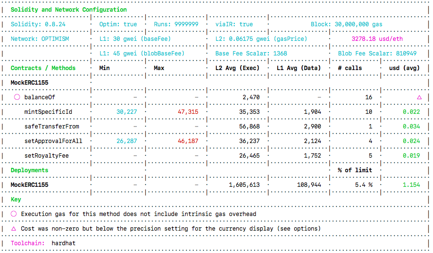

# A Resource Usage Analysis Tool for Stellar — Ship Soroban Smart Contracts with Confidence

## TL;DR — Why We Built This

Soroban is a smart contract platform for the Stellar blockchain, allowing developers to write dApps that run on the Stellar network, much like on Ethereum or Solana. The key difference? Soroban features a meticulously designed, multi-dimensional resource model aimed at predictable, low-cost execution.

Sounds great, right? Well, here’s the catch: writing a smart contract that passes local tests is one thing. Ensuring it won’t fail or become prohibitively expensive at scale is another. Unlike Ethereum's single "gas" figure, Soroban tracks CPU, memory, ledger I/O, and transaction size separately. An optimization that saves CPU might increase write costs. How can you be sure you're making the right trade-off?

Soroban makes Stellar powerful, but it also makes performance prediction harder. If you've developed on other chains, you know the pain: a function that looks fine in local testing can fail in production due to a subtle resource limit.

We built **`@57block/stellar-resource-usage`** to help teams catch these issues early. It's a lightweight tool that integrates into your tests, shows the multi-dimensional resource footprint of your contract calls, and turns complex numbers into clear, actionable insights. Use it to prevent unexpected failures, shorten your iteration cycles, and make trade-off decisions with confidence—not guesswork.

To give you a quick idea of what our tool does, think of it like the Hardhat Gas Reporter. That tool is excellent and powerful (and, in fact, was a major inspiration for our project). Here’s what the Hardhat Gas Reporter looks like in action:


## The Problem (In Plain English)

Soroban doesn't bill you with a single "gas" number. Instead, it has multiple resource dimensions—CPU, memory, ledger I/O, transaction size—and any one of them can cause a transaction to fail or drive up costs.

What this means for teams:

- You can't optimize blindly anymore. A change that saves CPU might increase writes and push you over a limit.
- Debugging performance issues after deployment is slow and expensive.

We wanted a tool that provides a clear view during development, so teams can iterate faster and ship safer.

### How Transaction Fees Work

In simple terms, every Soroban transaction fee can be understood with a basic formula:

**Transaction Fee = Resource Fee + Inclusion Fee**

- **Resource Fee**: Deterministic and tied to the resources your transaction consumes (compute, storage, I/O). It includes a non-refundable work fee and a refundable state rent fee.
- **Inclusion Fee**: The market-driven component—essentially the "bid" you pay to get your transaction into a ledger, dependent on network congestion and transaction complexity.

Keeping these two parts in mind helps make sense of the resource report: our tool focuses on the **Resource Fee** side (the deterministic, debuggable part), while the Inclusion Fee explains why costs can still fluctuate based on network conditions.

## What The Tool Gives You

- **Lightweight Integration**: Just a line or two in your tests, no major refactoring needed.
- **Clear Terminal Reports**: A clean table showing which functions are resource-heavy and why.
- **Multi-Dimensional Metrics**: `cpu_insns`, `mem_bytes`, read/write counts and bytes, transaction size, and more.
- **Developer-First UX**: Human-readable output, minimal noise, and insights you can act on today.

### Quick Install

Choose your package manager:

```shell
npm i @57block/stellar-resource-usage
pnpm add @57block/stellar-resource-usage
bun add @57block/stellar-resource-usage
```

### Spin Up a Local Node for Realistic Testing

If you have Docker installed, this helper command quickly starts a local Soroban node:

```shell
npx dockerDev [--port=your_port]
```

Wait for the node to fully sync before running your tests.

## The Resource Limits That Matter (What to Watch)

These are the real per-transaction limits we look at when diagnosing issues:

| Resource Component    | Per-Transaction Limit | Why It Matters                                                 |
| :-------------------- | :-------------------- | :------------------------------------------------------------- |
| CPU Instructions      | 100 Million           | Complex algorithms can burn through this limit quickly.        |
| Memory Allocation     | 40 MB                 | Large allocations or unbounded buffers will cause failures.    |
| Ledger Reads          | 40 Items              | Many small reads add up; consider indexes or caching.          |
| Ledger Writes         | 25 Items              | Writes are expensive—batch or minimize them whenever possible. |
| Ledger Read Bytes     | 200 KB                | Reading large blobs is costly.                                 |
| Ledger Write Bytes    | 129 KiB               | Large writes drive storage rent and fees.                      |
| Transaction Size      | 129 KiB               | Affects inclusion fees and network costs.                      |
| Events / Return Value | 8 KB                  | Large returns or events add to the transaction size.           |

Source: https://developers.stellar.org/docs/networks/resource-limits-fees#resource-limits

## How to Use It — Three Quick Patterns

### 1) Replace Your RPC Server (Minimal Change)

The old way:

```javascript
import { rpc } from "@stellar/stellar-sdk";

const rpcServer = new rpc.Server("http://localhost:8000/rpc", {
  allowHttp: true,
});
await rpcServer.sendTransaction(assembledTx);
```

The new way:

```javascript
import { StellarRpcServer } from "@57block/stellar-resource-usage";

const rpcServer = new StellarRpcServer("http://localhost:8000/rpc", {
  allowHttp: true,
});
await rpcServer.sendTransaction(assembledTx);
rpcServer.printTable();
```

### 2) Wrap a Generated TypeScript Client

```javascript
import { ResourceUsageClient } from "@57block/stellar-resource-usage";
import { Client } from "yourPath/to/module";

const WrappedClient = await ResourceUsageClient(Client, {
  /* config options */
});
const res = await WrappedClient.run({
  /* ... */
});
await res.signAndSend();
WrappedClient.printTable();
```

### 3) Run Your Tests

```shell
bun run your-script.ts
```

After the test run, the resource usage table will be printed to your console.

## From Numbers to Decisions — Practical Advice

A report is only useful if it leads to clear action. Here are the most common optimization patterns we recommend:

- **High Write Count/Bytes** → Consolidate state into structs, write diffs instead of full blobs, batch writes.
- **High Read Count** → Add indexes, cache frequently read keys, denormalize where appropriate.
- **High CPU Instructions** → Simplify algorithms, avoid nested loops, trade space for time with indexed maps.
- **High Transaction Size** → Trim redundant inputs/outputs, use pagination, move large data off-chain.

### Real-World Example: Optimizing Reward Calculations in a DAO

We had a DAO contract where a `calculate_rewards` function repeatedly failed in tests.

The report snapshot:

| Function          | Resource  | Average    | Max             | Limit       |
| :---------------- | :-------- | :--------- | :-------------- | :---------- |
| calculate_rewards | cpu_insns | 98,540,000 | **115,230,000** | 100,000,000 |

**Diagnosis**: A nested loop was causing O(N×M) CPU growth.

**The Fix**: We changed the data model to maintain an indexed map that accumulated points for each user as contributions came in. The final calculation became a simple, single lookup.

The refactored results:

| Function          | Resource  | Average   | Max       | Limit       |
| :---------------- | :-------- | :-------- | :-------- | :---------- |
| calculate_rewards | cpu_insns | 8,200,000 | 9,150,000 | 100,000,000 |

**The Result**: CPU usage dropped by an order of magnitude, and the tests passed. This is the kind of make-or-break improvement the tool helps you find.

## The Road Ahead — What’s Next

We designed this tool for local development, but we want it to be part of the full workflow:

- Machine-readable output for CI and dashboards.
- Threshold-based alerting (fail a PR when a limit regresses).
- Historical baselines and diffs to catch regressions early.
- Better visualizations for product/ops teams (optional web UI).

If you use it, let us know where it helped—or where it didn't. Real-world feedback drives what we build next.

---

Thanks for reading. We hope this tool shortens your feedback loop
