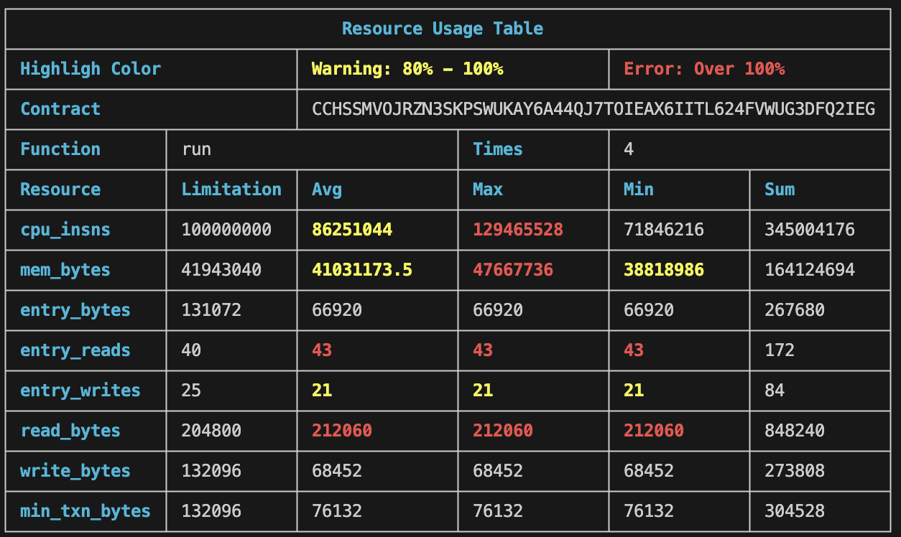

# **Stellar Resource Usage Analyzer: A Optimization Tool for Soroban Developers**

## **Background: New Challenges from Soroban and the Need for Developer Tools**

With the integration of Soroban, the Stellar network has evolved from a payment-focused network into a general-purpose smart contract platform. This significant upgrade opens the door for developers to build complex decentralized applications (dApps), but it also introduces a new challenge: the sophisticated management of a multi-dimensional resource model. This isn't just about transaction costs; it directly impacts the performance, reliability, and ultimately, the user experience of a contract.

To better understand this need, we can draw from the mature experience of the Ethereum (EVM) ecosystem. In Ethereum development, tools like hardhat-gas-reporter are an indispensable part of a professional workflow. After a developer runs a test suite, it automatically generates a clear gas consumption report, allowing them to intuitively see the cost of each function call and optimize accordingly.

Example output from hardhat-gas-reporter:


As shown above, such tools provide detailed metrics on gas usage for contract deployments and method calls, and can even estimate the cost in fiat currency. This immediate feedback is crucial for optimizing gas consumption and preventing transaction failures.

To address the gap in the Stellar ecosystem, **@57block/stellar-resource-usage** was created. It aims to fill this critical tooling void, providing Soroban developers with similar, essential performance insights to help them develop with more confidence and efficiency.

## **Section 1: A Deep Dive into Soroban's Fee and Resource Model**

Before presenting the solution, it's essential to clarify the complexity of the problem it solves. Unlike the relatively singular "Gas" metric in the EVM, Soroban's model is a complex, multi-dimensional system designed for fine-grained control and dynamic pricing. Understanding this model is a prerequisite for writing efficient contracts and key to appreciating the value of the stellar-resource-usage tool.

### **The Two Pillars of Transaction Costs**

Every transaction fee on Soroban is composed of two core parts:

**Transaction Fee \= Resource Fee \+ Inclusion Fee**

- **Resource Fee:** This is the focus of this section. The resource fee is deterministic and directly tied to the computational and storage resources consumed during transaction execution. It consists of a **non-refundable fee** for work already done and a **refundable fee** for state rent. The formula for the total transaction fee is very clear.
- **Inclusion Fee:** This can be understood as the "bid" to get a transaction included in the ledger. It's primarily determined by network congestion and the number of operations in the transaction.

### **Components of Resource Consumption**

Soroban's resource metering is multi-dimensional, covering computation, storage I/O, and network footprint.

- **Computational Resources (Engine):**
  - **CPU Instructions (cpu_insns):** This measures the raw computational work. This metric directly reflects the efficiency of the contract's algorithms.
  - **Memory (mem_bytes):** Refers to the RAM allocated during contract execution. While there's no direct fee, it has a strict limit, and exceeding it will cause the transaction to fail. This highlights the importance of efficient data structure management.
- **Storage I/O (Interacting with the Ledger):**
  - **Ledger Reads (read_entries / read_bytes):** The cost of reading data from the Stellar ledger. This emphasizes the need to optimize state access.
  - **Ledger Writes (write_entries / write_bytes):** The cost of writing data to the ledger, one of the most critical and expensive operations.
- **Data and Network Footprint (Payload):**
  - **Transaction Size (tx_size_bytes):** A cost associated with the raw size of the transaction, representing network bandwidth and historical storage overhead.
  - **Events and Return Values:** The cost of emitting events or returning data from a contract call.

To help developers intuitively understand these constraints, the following table consolidates all key information and serves as an indispensable quick-reference guide.

**Table 1: Soroban Resource Metering and Limits Matrix**

| Resource Component        | Per-Transaction Limit | Developer Takeaways                                                                                |
| :------------------------ | :-------------------- | :------------------------------------------------------------------------------------------------- |
| **CPU Instructions**      | 100 Million           | Measures computational complexity. A high value indicates inefficient algorithms.                  |
| **Memory Allocation**     | 40 MB                 | Crucial for managing complex data structures and preventing transaction failures.                  |
| **Ledger Entry Reads**    | 40 entries            | The cost of accessing state. Can be reduced by optimizing data structures or using off-chain data. |
| **Ledger Entry Writes**   | 25 entries            | One of the most expensive I/O operations and a primary target for optimization.                    |
| **Ledger Read Bytes**     | 200 KB                | Measures the volume of data read. Reading large amounts can be costly.                             |
| **Ledger Write Bytes**    | 129 KiB               | Measures the volume of data written, directly impacting the most expensive fee component.          |
| **Transaction Size**      | 129 KiB               | A cost related to network bandwidth, affecting the inclusion fee calculation.                      |
| **Events / Return Value** | 8 KB                  | The cost of emitting events or returning large data payloads from contract calls.                  |

[Resource Limits](https://developers.stellar.org/docs/networks/resource-limits-fees#resource-limits)

This multi-dimensional resource model means that optimizing a Soroban contract is a multi-variable problem. A developer might reduce cpu_insns by using a lookup table, but this could increase the number of read_entries. Therefore, optimization is no longer a single objective but a trade-off between different resource dimensions. A tool that provides a detailed, itemized resource report is essential for making informed optimization decisions.

Furthermore, given these strict resource limits, discovering that a contract exceeds them after deploying to a testnet or mainnet can be very costly in terms of time and effort. The development feedback loop must be as short as possible. By shifting performance analysis from a post-deployment "audit" phase to the "coding" phase of development, you can significantly improve development efficiency and code quality. @57block/stellar-resource-usage is designed precisely for this purpose.

## **Section 2: Introducing @57block/stellar-resource-usage: Your Soroban Performance Dashboard**

@57block/stellar-resource-usage is an open-source developer tool designed to bring unprecedented clarity and precision to the optimization of Soroban smart contracts.

Its core value proposition can be summarized as: **Providing a precise, actionable, and comprehensive view of a smart contract's resource footprint within a developer's existing testing workflow, in a simple and non-intrusive way.**

### **Core Features at a Glance**

- **Real-time, Granular Monitoring:** The tool doesn't just give a final score. It monitors key resource dimensions during contract execution, including cpu_insns, mem_bytes, ledger I/O, and more.
- **Detailed Terminal Reports:** After a test run, it generates a clean, easy-to-read table directly in the terminal. This provides immediate, actionable feedback.
- **Minimal Code Intrusion:** This is a major selling point. The tool is designed to be a near "plug-and-play" replacement, requiring minimal changes to existing test scripts.
- **Open Source and Community-Driven:** The tool is open-sourced under the MIT license, and community contributions are welcome.

### **Installation and Environment Setup**

This section will guide you through installing the tool and preparing your environment.

#### **2.1. Prerequisite: Local Test Environment**

First, you need a local Soroban network for testing. The tool provides a convenient command to start a local, unrestricted-mode network. This requires Docker Desktop to be pre-installed on your system.

Run the following command in your terminal:

```shell
npx dockerDev [--port=your_port]
```

This command will start a local node using the official stellar/quickstart image, with the default port set to 8000\. Please be patient and wait until you see stellar-core: Synced\! messages continuously in the logs, which indicates the network is ready.

#### **2.2. Installation**

The installation is very simple and requires just one line. Choose one of the following commands based on your project's package manager:

```shell
# Using npm
npm i @57block/stellar-resource-usage
# Using pnpm
pnpm add @57block/stellar-resource-usage
# Using bun
bun add @57block/stellar-resource-usage
```

## **Section 3: Practical Usage Scenarios**

This section is a step-by-step tutorial showing how to integrate the tool into your testing workflow.

### **3.1. Scenario 1: Standard StellarRpcServer Integration**

This is the most common use case for developers writing custom test scripts. The integration is extremely simple. The "before" and "after" code comparison below illustrates this intuitively.

**Before (using the native stellar-sdk):**

```javascript
import {
  Keypair,
  Networks,
  rpc,
  TransactionBuilder,
  Operation,
  Account,
} from "@stellar/stellar-sdk";
const rpcUrl = "http://localhost:8000/rpc";
const rpcServer = new rpc.Server(rpcUrl, { allowHttp: true });
// ... transaction building and signing process ...
await rpcServer.sendTransaction(assembledTx);
```

**After (using @57block/stellar-resource-usage):**

```javascript
import {
  Keypair,
  Networks,
  rpc,
  TransactionBuilder,
  Operation,
  Account,
} from "@stellar/stellar-sdk";
import { StellarRpcServer } from "@57block/stellar-resource-usage"; // 1. Import StellarRpcServer
const rpcUrl = "http://localhost:8000/rpc";
const rpcServer = new StellarRpcServer(rpcUrl, { allowHttp: true }); // 2. Replace rpc.Server
// ... transaction building and signing process ...
await rpcServer.sendTransaction(assembledTx);
rpcServer.printTable(); // 3. Call printTable()
```

As you can see, you only need to modify two lines of code and add one function call to complete the integration.

### **3.2. Scenario 2: Integration with a Generated TypeScript Client**

For projects using Soroban's code generation feature (stellar contract bindings typescript), the tool also provides a seamless integration.

**Before (using the generated client):**

```javascript
import { Client } from "yourPath/to/module";
const _contract = new Client({
  // ... configuration options ...
});
const res = await _contract.run({
  /*...*/
});
await res.signAndSend();
```

**After (using @57block/stellar-resource-usage):**

```javascript
import { ResourceUsageClient } from "@57block/stellar-resource-usage"; // 1. Import ResourceUsageClient
import { Client } from "yourPath/to/module";
const _contract =
  (await ResourceUsageClient) <
  Client >
  (Client,
  {
    // 2. Wrap with ResourceUsageClient
    // ... configuration options ...
  });
const res = await _contract.run({
  /*...*/
});
await res.signAndSend();
_contract.printTable(); // 3. Call printTable()
```

This design reflects a deep understanding of the developer workflow. By providing a simple wrapper (StellarRpcServer) and a higher-order component (ResourceUsageClient), the tool caters to both direct RPC interactions and more abstract, type-safe client patterns. This ergonomic design significantly lowers the barrier to adoption.

**3.3. Running Tests and Viewing the Report**

After writing your test script, execute the file using bun or another TypeScript runtime environment:

```shell
bun run your-script.ts
```

Upon successful execution, the resource usage report will be printed directly in your console.

## **Section 4: Interpreting the Report: Turning Data into Optimization Strategies**

This section will guide you on how to derive insights from the report and translate that data into concrete optimization actions.

### **Report Overview**

Below is a sample report generated by the tool, which will serve as a visual reference for our discussion.



### **Table 2: Stellar Resource Usage Report Breakdown**

The following table explains each column in the report and links it to the resource concepts discussed in Section 1, helping you turn numbers into actionable optimization paths.

| Column Name       | Description                                              | Optimization Focus                                                                                   |
| :---------------- | :------------------------------------------------------- | :--------------------------------------------------------------------------------------------------- |
| **Function**      | The name of the smart contract function that was called. | Identify which functions are resource hogs to guide optimization efforts.                            |
| **cpu_insns**     | The number of CPU instructions consumed.                 | Algorithm efficiency. Check for complex loops or heavy computations.                                 |
| **mem_bytes**     | The number of memory bytes allocated.                    | Data structure efficiency, variable scope. Avoid allocating large objects unnecessarily.             |
| **read_entries**  | The number of ledger entries read from storage.          | State access patterns. Can multiple reads be combined? Can data be cached?                           |
| **write_entries** | The number of ledger entries written to storage.         | State modification patterns. Can writes be batched? Is every write necessary?                        |
| **read_bytes**    | The total bytes read from the ledger.                    | On-chain data volume. Can data be compressed or organized more efficiently?                          |
| **write_bytes**   | The total bytes written to the ledger.                   | On-chain data volume. This is a key driver of storage rent fees.                                     |
| **tx_size_bytes** | The size of the transaction submitted to the network.    | Size of input parameters and contract call structure. Avoid sending unnecessarily large data chunks. |

### **Common Optimization Checklist**

- **High write_entries/write_bytes:** Consolidate data into structs, use differential writes, batch operations.
- **High read_entries:** Introduce read-only caches, optimize key patterns, use lightweight indexes instead of full scans.
- **High cpu_insns:** Rewrite algorithms, avoid nested loops, use map lookups (O(1)) instead of linear searches.
- **High tx_size_bytes:** Trim input/return parameters, use binary compression, implement pagination/cursors.

### **Specific Optimization Scenarios**

#### **Resolving a Computational Bottleneck from High cpu_insns**

While testing a Decentralized Autonomous Organization (DAO) contract, the development team noticed that tests for the calculate_rewards function were repeatedly failing. After running the tests with resource monitoring enabled, @57block/stellar-resource-usage generated the following report (key parts only):

| Function          | Resource  | Avg        | Max             | Limitation  |
| :---------------- | :-------- | :--------- | :-------------- | :---------- |
| calculate_rewards | cpu_insns | 98,540,000 | **115,230,000** | 100,000,000 |

The report clearly shows that the function's average cpu_insns is approaching the limit, and the maximum value (highlighted in red) exceeds Soroban's per-transaction limit of 100 million. This directly explains the transaction failure: the computation was too intensive.

Guided by the report, the developers located the calculate_rewards function. Upon inspection, they found its core logic contained a nested loop: the outer loop iterated through all DAO members, and the inner loop iterated through all of each member's contribution records for the current period to calculate points. The complexity of this algorithm is O(N×M) (where N is the number of members and M is the average number of contribution records), causing CPU consumption to rise sharply as the number of members and contributions grew.

This insight prompted the team to refactor. The core idea of the optimization was to "trade space for time" by using a more optimal data structure to avoid heavy real-time computation.

- **Introduce an Indexed Map:** Instead of using a simple list to store contributions, the team updated the logic to accumulate points into a Map keyed by (user_id, period) each time a user submitted a contribution. This way, each user's total points for a period were recorded and updated in real-time.
- **Simplify Calculation Logic:** The refactored calculate_rewards function no longer needed a nested loop. It could now directly fetch a user's total points with a single map lookup (O(1) complexity) based on the provided user_id and period, and then proceed with the reward calculation.

After implementing the changes, the team ran the tests again. The new resource usage report showed a significant improvement:

| Function          | Resource  | Avg       | Max       | Limitation  |
| :---------------- | :-------- | :-------- | :-------- | :---------- |
| calculate_rewards | cpu_insns | 8,200,000 | 9,150,000 | 100,000,000 |

The cpu_insns consumption dropped by an order of magnitude, falling well below the limit and completely resolving the performance bottleneck. This scenario perfectly demonstrates the tool's value: it transformed a vague "transaction failed" problem into a specific, quantifiable code optimization task caused by exceeding the cpu_insns limit.

## **Section 5: Conclusion**

As builders in the Soroban ecosystem, we want to make @57block/stellar-resource-usage one of the default tools for "writing high-performance contracts." It doesn't just give you a total score; it breaks down each function call into a multi-dimensional profile of "compute-memory-I/O-network," helping you make engineering trade-offs: where to merge writes, where to move logic off-chain, and where to use a more compact data model.

Next, we will continue to improve machine-readable output, threshold-based alerts, historical baseline comparisons, and visualization capabilities to integrate performance optimization into your daily CI/CD pipeline. We also sincerely invite you to contribute via Issues/PRs: share your use cases, propose your thresholds, and challenge our defaults. Let's work together to embed Soroban's "predictable performance" and "cost determinism" into every line of code.
