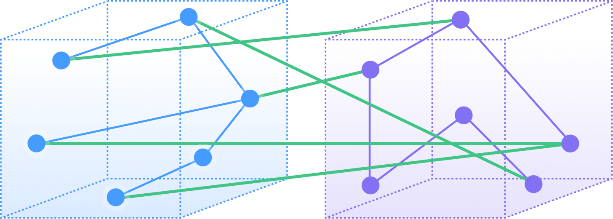
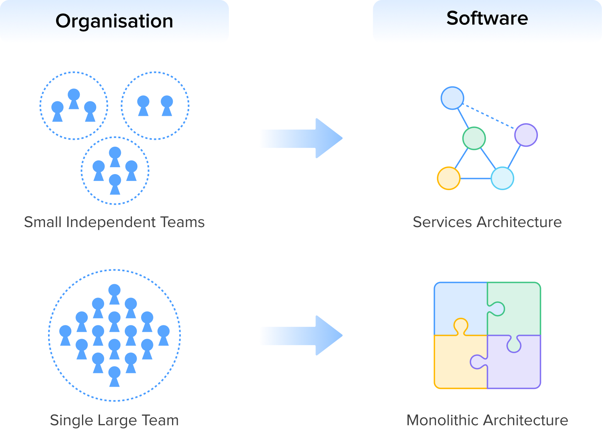
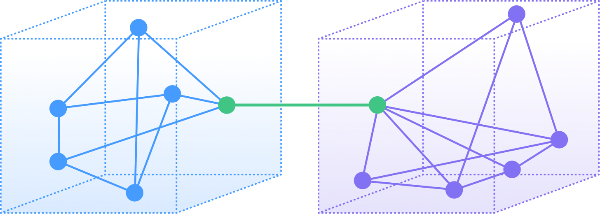

Over the past decade, I’ve overseen the launch of over 120 MVPs. I’ve watched companies evolve from napkin sketches to Series C scale, some as independent startups, others as incubated ventures within mature tech organizations. Combined with my experience running global engineering teams as a VP of Engineering for a public company, this vantage point has taught me a singular truth: distributed work succeeds brilliantly, or it fails in ways that slow companies down for years.

There is a mythology around remote engineering that suggests you can simply "hire the best talent anywhere" and magic will happen. Without deliberate design, this leads to six engineers in six time zones, constantly waiting on one another. Therefore, the future of engineering will be decided by how well teams are designed to learn, adapt, and ship.

## Phase 1: The Pre-PMF Reality and the Embedded Model

Pre-Product Market Fit typically encompasses the Pre-Seed and early Seed stages, with the objective of high velocity of experimentation. A firm needs to run as many experiments as possible to find the signal. In our embedded model, everyone communicates with everyone; it’s a mesh network of "node-to-node" communication across timezones and locations.

{.d-block .mx-auto .my-3 .mw-100}{width=500px}

This works for Pre-PMF startups because the founders are the central routers. They are always on the product, always available, and they drive the communication. They act as the glue that holds disparate nodes together. This approach works because we inject capability by providing niche expertise, and it provides access to velocity by plugging in high-quality engineers to bypass slow local hiring.

The embedded model inevitably fails when the founders move from building to running the company. As the founders get pulled away by investor prep, hiring, and client meetings, the central routing node disappears. This is when node-to-node communication starts to break down. Without a deliberate redesign, the key communication responsibility shifts to other folks in the organization who may lack well-defined roles or the technical context to drive the mesh. Friction increases, and velocity drops.

### The Pivot Point: Conway’s Law

"Organizations which design systems are constrained to produce designs which are copies of the communication structures of these organizations." — Melvin Conway

As a startup moves through the Seed stage, strong PMF signals begin to emerge. This is the danger zone. In the early days, the prior approach worked because the codebase was monolithic and the founder was the arbiter for everything. But as you scale, the founder becomes the bottleneck.

{.d-block .mx-auto .my-3 .mw-100}{width=500px}

## Phase 2: Post-PMF and the Pod Model

Post-PMF does not mean slowing down becomes an option, as a firm still needs speed to drive experimentation at a wider scale. At this phase, though, the firm has a mandate to protect the core of the business. You have users, revenue, and a reputation. You cannot break the main application while testing new features. To solve this, we move from the embedded model to the pod model.

The Pod Model is the organizational equivalent of a microservice. It relies on well-defined boundaries and full ownership. To make a distributed pod function like a reliable microservice, you must design the interface with the same rigor you apply to your codebase.

{.d-block .mx-auto .my-3 .mw-100}{width=500px}

### Best Practices

#### #1: Architect the Org Before the Work

Just as software systems require clear service boundaries, teams need clearly defined ownership boundaries. This starts by identifying modular domains that a distributed team can fully own, such as a mobile application, an internal admin tool, or a specific microservice.

True ownership also requires the right mix of roles. A successful pod is cross-functional, typically including a tech lead, product manager, and QA, so it can ship end-to-end without relying on external teams. Many organizations benefit from a hybrid topology, where some team members remain embedded within core teams to inject critical capabilities, while other groups operate as autonomous pods responsible for distinct feature sets.

#### #2: Redesign Dependency Management

Redesigning the organization also requires a deliberate rethink of dependency management. The primary objective should be to reduce unnecessary communication and coordination overhead between teams. Roadmaps should be decoupled wherever possible so pods can execute independently without constant back-and-forth. When dependencies cannot be eliminated, they should be formalized through clear service level agreements. For example, if a pod requires an API change from a core team, headquarters must commit to a defined turnaround time. This ensures that distributed teams are not blocked simply because the main office is offline or operating on a different schedule.

#### #3: Identify the Internal Champion at HQ

In addition to structural clarity, every pod needs a dedicated internal champion at headquarters. This individual acts as a human “API gateway” between the pod and the rest of the organization. Typically a lead engineer, engineering manager, or product manager, this person is empowered to advocate for the pod’s needs, resolve conflicts, and remove obstacles. By having a trusted bridge in place, founders and senior leaders can stay focused on the broader vision rather than being pulled into day-to-day execution issues.

#### #4: Define and Communicate Success Metrics

Finally, ownership must be paired with clear accountability through well-defined success metrics. Teams need to understand what success looks like, not just how the work should be done. Product outcomes and team performance metrics should be explicitly defined and communicated consistently. When expectations are clear, pods gain real decision-making authority. As long as they meet agreed-upon quality standards and key performance indicators, they are free to determine how best to build and deliver their work.

## Conclusion

The transition from a founder-led, monolithic team to a scalable, distributed organization is one of the most critical evolution in a startup's life. Before a firm achieves product-market fit, it makes sense for them to use the embedded model for speed and capability injection. After they’ve had success, we recommend refactoring into the pod model to use a modular structure to protect the core of the business while enabling parallel experimentation.

Don't let the org chart happen by accident. Design your team structure with the same rigor you apply to your system architecture.
