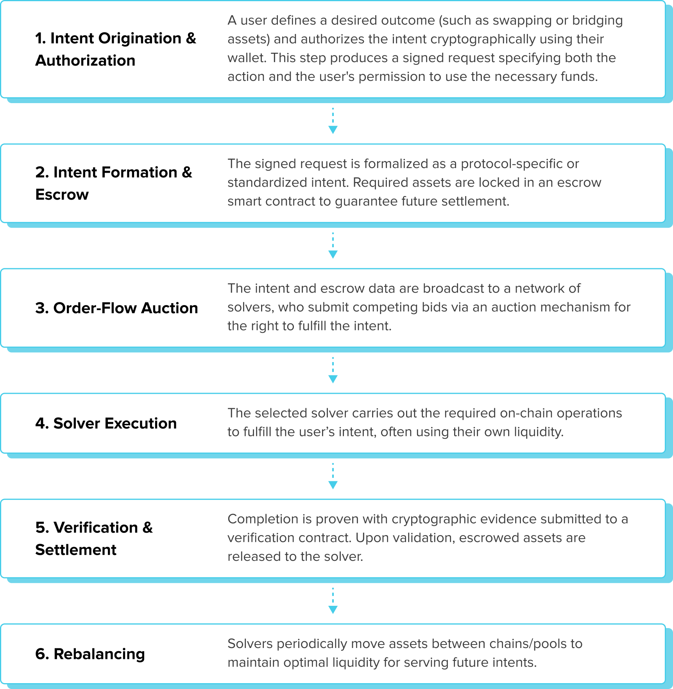
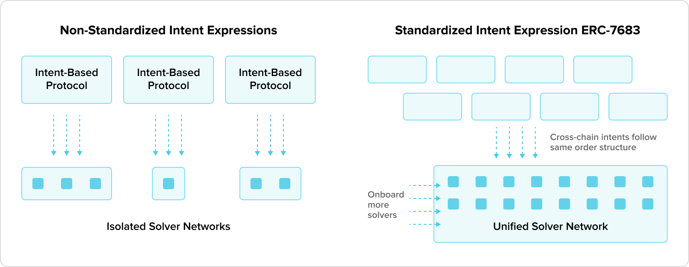
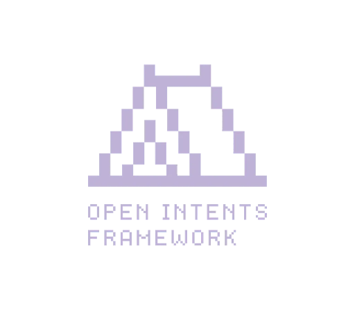
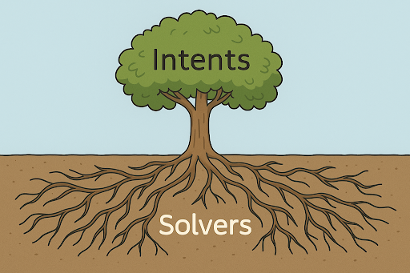

We've been thinking a lot lately about what it really means to build technology that people want to use.

Take crypto today - many users want to chase better yields, buy an NFT on a different chain, or participate in a DAO that doesn’t live where their assets are. These are real motivations that require cross-chain interoperability, but the process still feels unnecessarily complex.

You know that feeling when something should be simple - like transferring money or booking a flight - but the steps are so frustrating you question whether it’s worth it? Cross-chain protocols have matured considerably over the past several years and necessary technical infrastructure exists to seamlessly transfer assets between blockchains. Yet user face friction from confusing steps, fragmented wallets,technical jargon, seed-phrase management, unintuitive interfaces, lack of clear human-centered design which constitute a fundamental barrier to widespread crypto adoption.

Instead of forcing users to figure out how to move their assets including bridges, gas tokens, and token standards, it’s more effective to let them focus on what they want to achieve - not on how to get there.

Seamless, secure cross-chain transactions are achievable today and [LI.FI](https://li.fi/) through their aggregated liquidity across multiple DEXs and blockchains and **Intents-based** solutions is leading the conversation about what's next and pushing the boundaries of what end-users and developers can accomplish in the DeFi space.

## The Challenge: Making Cross-Chain Transactions User-Friendly

Let's start with a reality check. Picture this. You're a user who wants to swap some tokens from one blockchain to another. Sounds simple, right? But here's what you must do to fulfill your cross-chain transactions request:

1. Find a bridge
2. Ensure it supports your asset and destination chain
3. Pay gas fees on the source blockchain
4. Wait for the bridge to complete your transaction to receive assets on destination chain
5. If you don’t have it yet, send yourself relevant assets to pay for the gas on the destination chain (ETH, Sol. APT, BNB or other)
6. Manually swap your bridged assets on a DEX on a destination chain
7. Pay more gas fees for the swap on the destination blockchain
8. Hope you, or your bridge, didn't make a mistake along the way

It's like trying to exchange currency by visiting two different banks, filling out forms at each one, and paying fees every step of the way. This architecture creates multiple failure points, introduces MEV opportunities, and results in poor UX that limits adoption.. Complex processes frustrate users.. but they’re also an opportunity to build something better.

## Secure, User-Centric Web3

](./logo-lifi.png){.d-block .mx-auto .mw-100 .my-3}

[LI.FI](https://li.fi/) is tackling this exact challenge head-on launching intent-based cross-chain swaps, and it's about to change how people think about moving money across different blockchains. Think of it like this. Instead of telling the system how to do something step by step, you just tell it what you want to achieve. It's like calling an Uber instead of planning your own route with multiple bus transfers.

{.d-block .mx-auto .mw-100}

## Revolutionizing Cross-Chain Transactions with LI.FI’s Intents System

[LI.FI](https://li.fi/)'s intents based cross-chain transactions solution works like a marketplace where you express what you want, and specialized service providers (called solvers) compete to give you the best deal.

Here's what that looks like on the user's end:

1. You make a request: "I want to swap 100 USDC on Ethereum for MATIC on Polygon"
2. The intents-based application’s logic finds the best way: Multiple solvers compete to offer you the best rate
3. It happens instantaneously: The winning solver fulfills your request behind the scenes through smart contracts, aggregators, oracles, and protocol infrastructure.
4. You get your tokens: Fast, cheap, and without the headache

EXAMPLE / REFERENCE GRAPH FOR DESIGNERS:

{.d-block .mx-auto .mw-100}

It's like having a personal assistant who knows all the best routes and handles all the paperwork while you focus on what matters to you. This approach transforms cross-chain transactions from a technical nightmare into a seamless experience.

## Real Security, Real Innovation

How do you maintain trust and security when users delegate transaction execution to third-party solvers? Traditional cross-chain transactions, despite their complexity, offer direct control over each step. Intent-based architecture must provide equivalent or superior security guarantees while abstracting away this control.

[LI.FI](https://li.fi/)’s _“Open Intent Framework”_ (ERC‑7683) is designed specifically for secure cross-chain intent fulfillment. It standardizes the way to express cross-chain intents enabling any frontend, wallet, or protocol to describe what a user wants without prescribing how it should be fulfilled. The framework establishes an environment that doesn’t require faith in individual solvers or centralized intermediaries.

The security model relies on four core mechanisms:

- **Escrow protection.** User funds are locked in smart contracts until intent fulfillment is verified
- **Atomic settlement.** Transactions complete fully or revert entirely, eliminating partial failure states.
- **Solver bonding.** Solvers stake collateral to prevent malicious behavior.
- **Validation oracles.** Cross-chain state verification ensures execution matches intent specifications.

This architecture eliminates counterparty risk while enabling competitive execution.

For example, [Resource Locks](https://li.fi/knowledge-hub/li-fi-intents-are-taking-over-resource-locks-make-them-scale/) - used in implementations like [Uniswap's Compact](https://github.com/Uniswap/the-compact) - ensure secure escrow during the transaction. This design prevents users from withdrawing funds prematurely and guarantees that solvers can only settle intents with a matching orderHash proven on the destination chain. Together, these frameworks ensure that funds remain safe and solvers are only compensated after successful fulfillment.

{.d-block .mx-auto .mw-100}

### Cross-Chain from the Start

While many solutions focus on just a few popular blockchains, building for the multi-chain is the future. Including Bitcoin support, which is more complex than filling EVM orders, is surprisingly rare in this space. This forward-thinking approach aligns perfectly with building for tomorrow, not just today, and ensures cross-chain transaction platforms can handle whatever the future brings.

## Unlocking Cross-Chain Liquidity: Why LI.FI’s Evolution Matters

Several major DeFi projects have embraced intent-based systems, each putting their spin on simplifying how users trade or move assets:

  

    

      
      

        <strong>CoW Swap</strong> (abbr. for Coincidence of Wants) launched in <strong>April 2021</strong>, enabling intent-based trading on a single chain via CoW-based atomic swaps that match compatible user orders directly. It uses a Dutch Auction mechanism to incentivize solver competition, reducing MEV risk and allowing for positive slippage. CoW Swap’s design has influenced cross-chain development by showing that a healthy solver marketplace doesn’t require a dominant player.
      

    

  

  

    

      
      

        <strong>Across Protocol</strong> began as a bridge and has been natively intents‑based since its launch in <strong>late 2021</strong>. It retained its own relayer (solver) as the primary fulfiller of orders through much of 2024, even as external solver participation grew. It supports a more diverse solver network today and contributed to the development of standards like ERC‑7683 to enable broader interoperability.
      

    

  

  

    

      
      

        <strong>In 2022, 1inch Fusion</strong> and <strong>Fusion+</strong> enabled gasless swaps on a single blockchain, using professional "solvers" to prevent front-running. In 2024, Fusion+ added cross-chain swaps without external bridges, all powered by a secure Dutch auction system. 1inch's proven technology and large user base helped build trust in intent-based swapping.
      

    

  

  

    

      
      

        <strong>UniswapX</strong> introduced an intent-based system to Uniswap <strong>in 2023</strong>, enabling gas-free swaps filled by off-chain solvers through auctions. The protocol also helped shape the ERC-7683 standard for compatibility among intent-based protocols. Initially, solver participation was restricted, with plans to open it up over time.
        

    

  

[LI.FI](https://li.fi/) distinguishes itself by offering a flexible, modular system that supports many blockchains from the start and features a permissionless solver network. Its secure smart contracts guarantee safe trades. Unlike 1inch and Uniswap, which use intent models within existing platforms and push new standards, LI.FI aims for an adaptable infrastructure that unifies cross-chain trading under one process and standard, making it easy for developers and wallet builders to adopt and support industry-wide interoperability.

[LI.FI](https://li.fi/)’s [Open Intents Framework](https://www.openintents.xyz/), an open open-source framework available to everyone aiming to bring permissionless intents, is supported also by teams from Arbitrum, Optimism, Scroll, Polygon, Gnosis, Gelato, Starknet, zkSync and others

[{.d-block .mx-auto .mw-100}](https://li.fi/knowledge-hub/with-intents-its-solvers-all-the-way-down/)

A common challenge across intent-based protocols is **incentivizing healthy solver competition**. Running a solver and being profitable is hard - it requires capital, infrastructure, and smart routing. But when multiple solvers compete, it leads to better-priced quotes, faster execution, and more reliable fulfillment, since solvers race to win orders by being first in.

{.d-block .mx-auto .mw-100}

Intents systems must still address the complexity of working across diverse blockchain stacks and considerations such as:

- **Solver centralization risk** (mentioned above) - incentives, permissionless participation, lower barriers to entry and transparent competition will help maintain decentralization.
- **Cross-chain state synchronization** - Oracle networks and cryptographic proofs will enable validation without the need to trust other intermediaries.
- **Gas optimization across chains** can be achieved through dynamic routing algorithms that consider gas costs, liquidity depth, and execution speed.
- **MEV protection** is addressed with sealed-bid auctions, intent batching reducing MEV extraction opportunities without compromising on execution efficiency.

## Implementation Impact

### For Users: Effortless Swapping Across Chains

With a vastly expanded network of integrated DEXs and liquidity pools, users can enjoy best-price execution for cross-chain swaps with no hassle and no fragmented interfaces. Swapping assets across different blockchains becomes a smooth, intuitive experience, with more opportunities and less friction.

### For Developers and Projects: Building on a Stronger Foundation

Teams building next-generation DeFi apps benefit from [LI.FI](https://li.fi/)’s robust DEX aggregator and cross-chain infrastructure. Instead of spending resources on piecing together multi-chain connectivity and liquidity themselves, they can focus on innovating their core products while relying on LI.FI’s ever-growing reach and execution capabilities. With intent-based architecture, user acquisition becomes easier - users can onboard by simply signing a transaction that expresses their intent to move assets to a specific chain, app, or protocol. This seamless flow lowers onboarding friction and lets projects lock in capital more efficiently.

### For the Industry: Pushing Multi-Chain Interoperability Forward

Rapidly connecting with new chains and liquidity sources sets benchmarks for interoperability and accessibility. This collaborative and forward-thinking approach, including contributions to standards like ERC-7683, strengthens the entire cross-chain ecosystem and inspires greater industry cohesion.

## Future of Intents

Today, intent-based systems primarily focus on asset swapping and basic cross-chain transfers. However the sole intent concept and architecture might enable more sophisticated financial operations in crypto space. The declarative nature of intent expression, combined with competitive solver networks, might create opportunities for other multi-step DeFi use cases that would be prohibitively difficult for users to execute manually.

We can look at them as a natural next step, extensions of the current architecture, and each introducing new technical challenges around composability, protocol coordination, and optimization at scale.

- Expanding beyond swaps to complex DeFi operations, including **lending**, **staking**, and **yield farming** strategies **executed through single intent expressions**.
- Cross-protocol intent routing enables users to **access liquidity and services across different DeFi protocols** seamlessly.
- **Advanced solver strategies** like machine learning integration for predictive routing, dynamic pricing, and risk management in solver operations.

## Thoughts on Product Development

From my experience most successful products **prioritize outcomes and user experience** over processes, recognizing that users care fundamentally about what they achieve rather than involving them in the behind-the-scenes mechanics of how it happens. This user-centric approach should be paired with building for collaboration, as the best cross-chain transactions solutions work seamlessly with others rather than operating in isolation.

Finally, **security** doesn't have to mean complexity. Large and complex systems might get difficult to manage as they grow, however it’s not a rule. We believe in maintaining simplicity in the user experience (it’s useful to have another new pair of eyes to help you see from the side), while delivering enterprise-grade protection and reliability.

The future of technology isn't just about building more features. It's about making powerful capabilities accessible to everyone. You don't have to choose between innovation and usability. With the right partnership and approach, you can have both.

## Ready to Build Something Amazing Together?

This aligns with how we approach projects at 57Blocks. We prove that technical complexity doesn't have to mean user complexity, especially in the [cross-chain transactions](https://57blocks.com/blockchain) space. Are you working on a project that could benefit from this kind of approach? [We'd love to help](https://57blocks.com/contact-us) turn your vision into reality.
