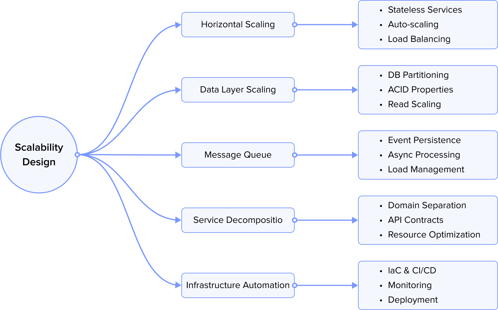

## 1. Overview

In today's digital economy, payment integration represents far more than just a technical implementation—it's a critical business capability that can define the success or failure of modern digital platforms. Whether you're building an e-commerce platform, a subscription service, or a marketplace, the ability to process payments reliably, securely, and efficiently is fundamental to business operations.

Payment integration in 2025 has evolved into a complex ecosystem that combines traditional financial infrastructure with cutting-edge technology. It's no longer sufficient to simply connect to a payment gateway and process transactions. Modern payment systems must navigate a landscape of:

- Multiple payment methods and currencies
- Complex regulatory requirements
- Sophisticated fraud prevention
- High availability and performance demands
- Cross-border commerce requirements
- Real-time processing expectations

This technical guide aims to provide a comprehensive understanding of what it takes to build a robust payment integration in today's digital landscape. We'll explore the critical components, essential considerations, and best practices that form the foundation of successful payment systems.

## 2. Security & Compliance in Modern Payment Systems

Imagine building a house made of glass - it needs to be both beautifully transparent yet impenetrably secure. That's today's payment systems. We're not just checking boxes for security compliance; we're crafting an ecosystem where millions of transactions flow seamlessly while being protected at every step.

### 2.1 The Security Balancing Act

Modern payment security is a delicate dance between iron-clad protection and frictionless user experience. Think of how Apple Pay works - a simple thumb press executes a complex symphony of encryption, authentication, and fraud checks, all in milliseconds. But behind that smooth facade lies multiple layers of sophisticated security measures:

When a customer taps their phone to pay, the system simultaneously:

- Validates their biometric data
- Generates unique transaction tokens
- Checks for suspicious patterns
- Ensures regulatory compliance
- Monitors for potential fraud signals

All this happens faster than you can say "approved."

### 2.2 Beyond Traditional Security

Today's threats aren't just external hackers - they're sophisticated operations using AI, social engineering, and zero-day exploits. That's why modern security extends beyond traditional measures:

For instance, when processing a cross-border transaction, systems need to:

- Analyze behavioral patterns (Is this purchase unusual for the customer?)
- Check geolocation consistency (Does the IP match the card's location?)
- Monitor velocity (Are there multiple transactions in impossible timeframes?)
- Apply machine learning models to spot subtle fraud patterns
- Ensure compliance with multiple regulatory frameworks

This multi-layered approach means even if one security measure fails, others are there to catch potential threats.

### 2.3 The Compliance Landscape

Regulatory compliance isn't just about following rules - it's about adapting to an ever-evolving landscape of requirements. The challenge is maintaining global standards while adhering to local regulations in an increasingly interconnected world.

Consider a seemingly simple scenario: a European customer buying from a US store through a Singapore-based payment processor. This single transaction, crossing multiple jurisdictions, must comply with GDPR for European data protection, PCI DSS for card security, local banking regulations in all three regions, anti-money laundering (AML) requirements, and Know Your Customer (KYC) standards.

This complex web of regulations requires payment systems to be both flexible and robust. They must handle multiple compliance frameworks simultaneously while ensuring smooth transactions for users across different regions, all without compromising on security or user experience.

### 2.4 The Human Element

Despite all our amazing technology, we can't forget that humans are still at the heart of payment security. Think about it - even the most sophisticated security system in the world can be defeated by someone writing their password on a sticky note or clicking a phishing link.

This is why modern payment systems put so much emphasis on the human side of security. Companies invest heavily in regular staff training, making sure everyone knows the security protocols like the back of their hand. They develop crystal-clear procedures for handling security incidents - no confusion allowed when there's a potential breach. Security awareness isn't just a one-time thing either; it's woven into the daily routine through continuous programs and updates.

Regular audits and penetration testing keep everyone on their toes, while strict access control policies ensure that people can only access what they absolutely need. After all, security is a bit like a chain - it's only as strong as its weakest link, and often that link is human.

### 2.5 Looking Forward

The world of payment security never stands still - and that's what makes it so fascinating. Just when we think we've got it figured out, along comes something like quantum computing to shake things up. It's a bit like playing chess against an opponent who keeps learning new moves.

Think about how far we've come: from simple PIN codes to systems that can spot fraud before it happens. But what's really exciting is where we're heading. We're seeing authentication systems that adapt on the fly, like a digital bouncer who gets smarter with every guest. AI is getting better at catching fraudsters, learning from every transaction like a detective who never forgets a face. And blockchain? It's changing the game entirely, making certain types of fraud practically impossible.

The really clever bit is how all this heavy-duty security is becoming invisible to users. Remember when extra security meant extra hassle? Those days are fading fast. Today's systems are like well-trained security guards - vigilant but unobtrusive, keeping you safe without getting in your way.

At the end of the day, it's all about trust. When you tap your phone to pay for coffee, you're not thinking about the complex security dance happening behind the scenes - and that's exactly how it should be. Because in our digital world, trust isn't just nice to have - it's the foundation everything else is built on. And protecting that trust? Well, that's what keeps us security folks up at night, and we wouldn't have it any other way.

## 3. Error Handling & Monitoring

Let's talk about something that keeps payment system engineers awake at night - handling errors and keeping an eye on everything that could go wrong. It's a bit like being a combination of a detective, firefighter, and guardian angel for millions of transactions happening every day.

### 3.1 Error Handling Strategies

Think of error handling like a safety net for a trapeze artist - you hope they won't need it, but it absolutely has to be there and work perfectly. When things go wrong in payment processing (and they will), you need a game plan that's both smart and practical. This means building smart retry logic that knows when to back off, making sure a payment happens exactly once (nobody wants to pay for their coffee twice!), and keeping all the pieces together even when things break.

Most importantly, we need error messages that don't make users want to throw their phone across the room. Good error handling is like a well-trained customer service rep - it not only identifies the problem but also shows users the way forward.

### 3.2 System Monitoring

Modern payment systems need eyes everywhere, like a digital security guard watching countless monitors. We're tracking real-time transactions like air traffic controllers, checking system health, monitoring database performance, and keeping all our digital highways clear.

Key metrics to watch include:

- Transaction flow and performance
- System resource utilization
- Network health across critical paths
- API endpoint availability

### 3.3 Logging & Auditing

Think of logs as our system's diary - they tell us exactly what happened and when. But this isn't just any diary; it's more like a highly organized journal that could stand up in court. We're recording every transaction's life story, detailed error reports (what went wrong, when, and why), and keeping track of who did what and when they did it.

These logs become invaluable when troubleshooting issues or responding to security incidents. They're our digital breadcrumbs, helping us trace back through time to understand exactly what happened.

### 3.4 Alerting Systems

Our digital early warning system needs to be smart about raising the alarm. It's like having a really intelligent smoke detector that knows the difference between burnt toast and a real fire. We can't afford to have our teams chasing false alarms, but we also can't miss the real problems when they emerge.

The key is building alerts that are both sensitive and specific - catching real issues early while filtering out the noise. When something does need attention, we make sure the right people know about it right away.

### 3.5 Recovery Procedures

When things do go sideways (and they will), you need a plan that's clearer than a fire escape route. This means having automatic cleanup crews for data messes, clear procedures for getting systems back on their feet, and regular practice runs for disaster scenarios.

The best recovery procedures are like well-rehearsed emergency protocols - everyone knows their role, and the team can execute smoothly even under pressure. It's not just about having a plan; it's about having a plan you know will work when you need it most.

The key to making all this work isn't just having fancy tools and procedures - it's about having teams who understand them and keep making them better. Because in the world of payments, yesterday's solutions might not cut it for tomorrow's challenges. Staying ahead of the game isn't just smart - it's essential.

Like they say in the scouts: be prepared. In payment processing, that means being ready for anything while making it all look easy to the people using your system. After all, the best error handling is the kind users never notice is happening.

## 4. Integration & Testing

Let's dive into what keeps payment system developers both busy and anxious - making sure everything works together perfectly and catching problems before they reach real users. It's a bit like being both a master chef testing recipes and a quality control expert at NASA - the stakes are high, and there's no room for "almost right."

### 4.1 Integration Architecture

Think of integration architecture as building a really sophisticated Lego set. Each piece needs to fit perfectly with the others, but you also need to be able to swap out pieces without the whole thing falling apart. We build these systems with clear boundaries between components - imagine having really well-designed connectors that click together perfectly every time.

The key is creating interfaces that are both robust and flexible. Like a good handshake, every connection needs to be firm but not rigid. We use circuit breakers to prevent problems from cascading (think of them as digital circuit breakers that stop one problem from taking down the whole system), and we make sure our systems can handle delays and retries gracefully.

### 4.2 Testing Strategy

Testing payment systems is like being a combination of detective, scientist, and fortune teller. We need to verify what works now, understand why it works, and predict what might go wrong in the future. Our testing strategy starts with the basics and builds up to complex scenarios that mirror real-world situations.

We test everything from individual components (unit testing) to how different parts work together (integration testing), and finally, how the whole system performs under real-world conditions. Think of it as testing not just each ingredient, but also how they combine into a recipe, and finally how the dish holds up in a busy restaurant.

### 4.3 Test Environments

You wouldn't test a new rocket engine in your backyard, right? Similarly, we need specialized environments for different types of testing. Each environment is like a specialized laboratory, carefully configured for specific types of tests.

Developers get their own sandbox to play in, while more complex tests happen in environments that more closely mirror the real world. It's like having practice kitchens for trainee chefs, test kitchens for new recipes, and full restaurant simulations for final testing.

### 4.4 Test Data Management

Here's a tricky challenge: how do you thoroughly test a payment system without using real payment data? It's like trying to practice emergency procedures without creating actual emergencies. We've developed sophisticated ways to generate realistic test data that looks and behaves like the real thing, without compromising security or privacy.

We create synthetic transactions that cover every possible scenario we can think of, while keeping sensitive information completely secure. It's a delicate balance between realism and responsibility.

### 4.5 Deployment Testing

The final frontier: making sure new versions of our system can go live without breaking anything. This is where we really earn our keep as engineers. We've developed sophisticated procedures for rolling out updates that are a bit like changing an airplane's engine mid-flight - it needs to happen smoothly, without anyone noticing.

We test our deployment processes religiously, including how to roll back changes if something unexpected happens. It's like having a safety net under your safety net - you hope you'll never need it, but you'll be really glad it's there if you do.

The art of integration and testing in payment systems is about being methodical yet creative, thorough yet efficient. It's about building systems that are both robust and flexible, and testing them in ways that give us confidence without creating false security. After all, in the world of payments, "good enough" isn't good enough - we need to aim for perfect, every time.

Remember: every successful payment transaction you make is the result of countless hours of testing and integration work by teams of developers who lose sleep so you don't have to. And we wouldn't have it any other way.

## 5. Performance Optimization

In today's digital payment landscape, system performance isn't merely a technical metric—it's a critical business differentiator that directly impacts user satisfaction, transaction completion rates, and ultimately, revenue. Every millisecond of latency can affect user confidence, while system efficiency determines both operational costs and scalability potential. This chapter explores comprehensive approaches to optimizing payment system performance while maintaining the delicate balance between speed, reliability, and security.

### 5.1 Database Optimization

At the core of every payment system lies its database infrastructure, serving as both the system of record and a potential performance bottleneck. Modern high-volume payment systems require sophisticated database optimization strategies that go beyond simple indexing and query tuning.

Successful database optimization begins with understanding transaction patterns and data access behaviors. High-traffic payment systems often employ a combination of strategies:

Query optimization remains fundamental, but modern approaches go beyond basic indexing. Advanced techniques include materialized views for complex aggregations, carefully designed partitioning schemes, and sophisticated query plan management. For instance, a payment system might implement different optimization strategies for real-time transaction processing versus historical reporting queries.

Read/write splitting has become increasingly crucial as systems scale. By directing read queries to replicas while maintaining write operations on primary instances, systems can significantly improve throughput. This approach requires careful consideration of replication lag and consistency requirements, particularly in payment contexts where data accuracy is paramount.

The role of database sharding has evolved from a scaling solution to a comprehensive data management strategy. Modern sharding approaches consider not just data volume but also geographical distribution, regulatory requirements, and disaster recovery needs.

### 5.2 Application Performance

Application-level optimization requires a holistic approach that considers both infrastructure efficiency and code-level performance. Modern payment applications must process thousands of transactions per second while maintaining consistent response times and resource utilization.

The journey to optimal application performance often begins with request/response optimization. This includes not just payload size reduction but also intelligent API design that minimizes round trips and maximizes data efficiency. Leading payment systems implement sophisticated serialization strategies that balance processing speed with bandwidth utilization.

Memory management plays a crucial role in sustained performance. Beyond basic garbage collection tuning, advanced systems implement sophisticated object pooling and cache management strategies. These systems carefully monitor memory usage patterns to prevent both leaks and unnecessary object creation.

### 5.3 Caching Architecture

In the realm of payment processing, effective caching strategies can mean the difference between a system that scales gracefully and one that buckles under load. Modern caching architectures implement sophisticated multi-level strategies that go beyond simple key-value storage.

Browser-level caching, while important for user interface components, requires careful consideration in payment contexts where data freshness can be critical. Successful implementations typically cache static assets and public reference data while maintaining strict controls over sensitive information.

Application-level caching has evolved to include predictive elements, where systems analyze usage patterns to optimize cache contents proactively. This approach extends beyond simple time-based invalidation to include sophisticated coherency protocols that maintain data consistency across distributed systems.

### 5.4 Load Balancing

Modern load balancing strategies in payment systems have evolved far beyond simple round-robin distribution. Today's approaches consider multiple factors including server health, geographic location, and real-time performance metrics.

Layer 7 load balancing has become increasingly important as payment systems grow more sophisticated. Content-aware routing allows systems to optimize request distribution based on payload characteristics, user attributes, and current system conditions. Geographic load distribution has become critical for global payment systems, requiring sophisticated routing algorithms that balance proximity with system capacity.

### 5.5 Monitoring & Tuning

Performance optimization in payment systems is an ongoing journey rather than a destination. Successful organizations implement comprehensive monitoring strategies that provide real-time visibility into system behavior while enabling proactive optimization.

Modern monitoring approaches go beyond basic metrics to include sophisticated analysis of transaction patterns, user behavior, and system interactions. Machine learning techniques are increasingly employed to detect anomalies and predict potential performance issues before they impact users.

As payment systems continue to evolve, performance optimization strategies must adapt to meet new challenges. The rise of mobile payments, increasing regulatory requirements, and growing transaction volumes all present unique performance considerations. Successful organizations maintain a balanced approach, continuously refining their optimization strategies while ensuring that performance improvements never come at the expense of security or reliability.

The future of payment system performance optimization lies in intelligent, adaptive systems that can automatically adjust to changing conditions while maintaining strict security and reliability standards. As technology continues to advance, the most successful payment systems will be those that can effectively leverage new tools and techniques while maintaining the fundamental principles of efficient, reliable payment processing.

## 6. Scalability Design

Let's talk about one of the most exciting challenges in payment systems - making them grow gracefully. Imagine building a highway that can magically add lanes whenever traffic gets heavy, or a restaurant that can instantly double its kitchen size during lunch rush. That's what we're trying to achieve with scalable payment systems.

### 6.1 Horizontal Scaling

Think of horizontal scaling like adding more cashiers at a busy store instead of trying to make one cashier work faster. It's about spreading the load across multiple workers rather than creating super-workers. The trick is making sure all these workers can seamlessly handle any customer without needing to share notes constantly.

Modern payment systems achieve this through what we call "stateless design" - imagine each cashier having instant access to all the information they need, without having to remember anything from previous transactions. We use sophisticated tools to:

- Automatically add or remove processing power as needed (like a store manager watching the lines and opening new registers)
- Spread work evenly across all available resources
- Handle transactions from anywhere in the world
- Keep track of where all the processing power is and how to use it best

### 6.2 Data Layer Scaling

Now here's where things get really interesting. Handling data at scale is like trying to organize a library that's constantly getting new books while people are reading the existing ones. We can't just throw more shelves at the problem - we need to be smart about it.

The key strategies here are:

- Splitting data across multiple databases intelligently (like organizing books by genre across different floors)
- Creating multiple copies for faster reading (like having popular books available at multiple branches)
- Managing updates carefully to maintain accuracy (ensuring all copies stay in sync)

The real art is doing all this while ensuring that every transaction remains accurate and consistent - because in payments, "almost right" isn't good enough.

### 6.3 Message Queue Architecture

Message queues are like the world's most efficient postal service for our digital transactions. They ensure that even during the busiest times, no transaction gets lost or processed incorrectly. It's about managing the flow of information smoothly, whether we're handling 10 transactions or 10 million.

We design these systems to be smart about prioritizing and routing messages, much like an air traffic control system guiding planes safely to their destinations. Each message carries crucial transaction information that needs to reach the right destination at the right time, every time.

### 6.4 Service Decomposition

Breaking down a payment system into smaller, manageable pieces is like organizing a large company into specialized departments. Each department (or service) handles its specific tasks independently but works in harmony with others. This approach lets us:

- Scale each component based on its specific needs
- Update services independently without disrupting others
- Maintain clearer boundaries between different system parts
- Optimize resources where they're needed most

### 6.5 Infrastructure Automation

In today's world, trying to manage a scalable payment system manually would be like trying to direct city traffic without traffic lights. Automation isn't just convenient - it's essential. We build systems that can:

- Set themselves up consistently every time (like a self-building Lego set)
- Deploy updates safely and efficiently
- Adjust to changing conditions automatically
- Alert us to potential problems before they become actual problems

The future of payment scaling is heading toward systems that can predict and adapt to changes in demand almost like living organisms. It's not just about handling more transactions - it's about handling them intelligently, efficiently, and reliably.

Remember: building scalable payment systems is a bit like planning for a city's growth. You need to think about not just today's needs, but tomorrow's possibilities. The best systems grow so smoothly that users never notice the complexity behind their simple tap-to-pay experience. And that's exactly how it should be.
