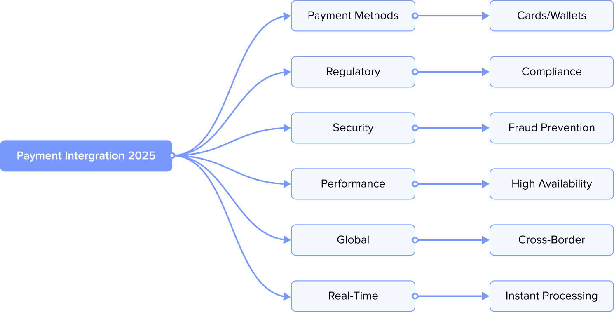
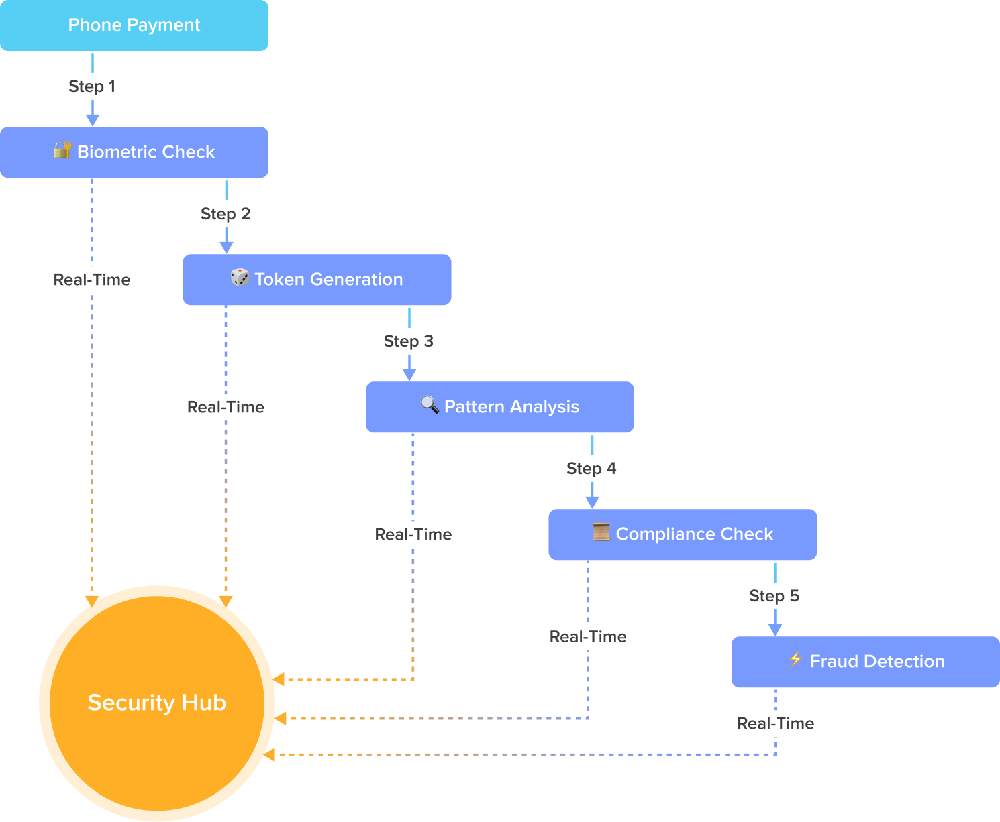
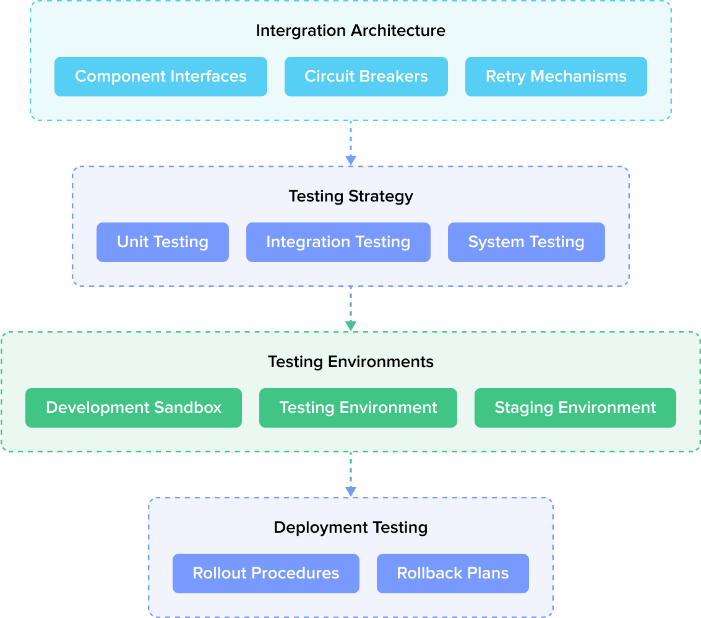
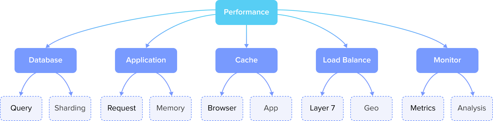

## 1. Overview

Payment integration in 2025 has evolved into a complex ecosystem that combines traditional financial infrastructure with cutting-edge technology. It's no longer sufficient to simply connect to a payment gateway and process transactions. Modern payment systems must navigate a landscape of:

- Multiple payment methods and currencies
- Complex regulatory requirements
- Sophisticated fraud prevention
- High availability and performance demands
- Cross-border commerce requirements
- Real-time processing expectations

This technical guide aims to provide a comprehensive understanding of what it takes to build a robust payment integration in today's digital landscape. We'll explore the critical components, essential considerations, and best practices that form the foundation of successful payment systems.

## 2. Security & Compliance in Modern Payment Systems

Imagine building a house made of glass. It needs to be both beautifully transparent yet impenetrably secure. That's what today's payment systems do. We're not just checking boxes for security compliance; we're crafting an ecosystem where millions of transactions flow seamlessly while the interests of users, businesses, and financial institutions are protected at every step.

### 2.1 Making security a seamless secret to users

# Modern Payment Security: The Invisible Symphony  

Modern payment security is a delicate dance between iron-clad protection and frictionless user experience. Consider how Apple Pay works–a simple thumb press ignites a multi-layered symphony of cryptographic protocols and real-time risk analysis, all interconnected in milliseconds. Behind the scenes, the system:  

1. **Validates your biometric data.** Your thumbprint or face scan is locally authenticated via the device's **Secure Enclave** (a hardware-bound key that never exposes raw biometric data).  

2. **Generates a one-time dynamic cryptogram (unique transaction token) through a Tokenization Engine, replacing your card number.** These tokens expire in nanoseconds to thwart replay attacks.

3. **Completes network vigilance** by cross-referencing the transaction against:  
   - Behavioral baselines (e.g., atypical purchase amount/location)  
   - Device reputation (is this iPhone previously associated with fraud?)  
   - Merchant risk tiers (high-risk categories trigger additional scrutiny)  

4. **Completes regulatory orchestration and auto-adjusts transaction workflow for regional compliance** (e.g., EU's Strong Customer Authentication, global PCI-DSS standards).  

5. **Conduct fraud analysis, synchronizing with** bank fraud systems and network AIs (Visa/Mastercard's neural networks). 

  

**The Result?**  
By the time you hear *"Payment approved,"* your transaction has navigated cryptographic handshakes, passed machine-learning scrutiny, and advanced beyond enforced zero-trust principles—all invisibly.  

### 2.2 Modern security: a backup plan for the backup plan

Today's threats are sophisticated, multi-point operations using AI, social engineering, and zero-day exploits.

For instance, when processing a cross-border transaction, systems need to:

- Analyze behavioral patterns (Is this purchase unusual for the customer?)
- Check geolocation consistency (Does the IP address match the card's location?)
- Monitor velocity (Are multiple transactions occurring in impossible timeframes?)
- Apply machine learning models to spot subtle fraud patterns (What patterns indicate potential fraud?)
- Ensure compliance with multiple regulatory frameworks (Does the transaction adhere to relevant regulations?)

This multi-layered approach acts like a fail-safe net. If behavioral analysis misses an anomaly, geolocation checks catch the mismatch; if velocity monitoring is bypassed, machine learning models flag subtle fraud patterns. Each layer targets different vulnerabilities, forcing attackers to defeat every mechanism simultaneously, which is statistically almost impossible given real-time system adaptation.

### 2.3 Compliance is local and global

The challenge of regulatory compliance today lies in maintaining global standards while adhering to local regulations in an increasingly interconnected world. Companies need to adapt to this ever-evolving landscape of legal requirements.

Consider a seemingly simple scenario: a European customer buying from a US store through a Singapore-based payment processor. This single transaction, crossing multiple jurisdictions, must comply with GDPR for European data protection, PCI DSS for card security, local banking regulations in all three regions, anti-money laundering (AML) requirements, and Know Your Customer (KYC) standards.

This complex web of regulations requires payment systems to be both flexible and robust. They must simultaneously and seamlessly handle multiple compliance frameworks with few to no errors, ensuring smooth transactions for users across different regions without compromising security or user experience.

### 2.4 Removing the human element of a security breach

Despite all our amazing technology, we can't forget that humans are at the heart of payment security. The most sophisticated security system in the world can be breached by someone writing their password on a sticky note that is found by a bad actor or clicking on a phishing link.

This is why modern payment system security approaches need to address technical solutions as well as human blind spots. Many companies invest heavily in regular staff training, making sure everyone knows the organization's security protocols like the back of their hand. They develop crystal-clear procedures for handling security incidents to reduce confusion when there's a potential breach and the team needs to react immediately. Security awareness is woven into daily routines through continuous programs and updates that train employees to build their muscle memory for keeping security top-of-mind, which reduces risks.

Regular audits and penetration testing keep everyone aware and alert regarding irregular behaviors and trends, while strict access control policies ensure that people can only access what they absolutely need. After all, security is a bit like a chain–it's only as strong as its weakest link, and often that link is the person who sits at the desk next to you.

### 2.5 Looking Forward

The world of payment security never stands still, and that's what makes it so fascinating. Just when we think we've got it figured out, a new form of AI-powered fraud comes along to shake things up.

Banking security started with simple PIN codes associated with a plastic card and ATMs and has evolved to systems that can pre-emptively spot fraud. We're now seeing authentication systems combined with AI that can learn from every transaction to improve fraud identification, like a digital bouncer who gets smarter with every guest encounter. Additionally, we're seeing blockchain systems that are now making certain types of fraud practically impossible to do. Take double-spending attacks in cross-border payments: the distributed ledger's immutable record structure instantly detects and prevents any attempt to spend the same digital asset twice.

What's very clever in all this is how all high-tech security is becoming invisible to users. Remember when “better” security meant extra hassles to remember PINs and passwords? Today's systems are designed to detect and respond to threats in real-time while minimizing disruptions to the user experience. For example, modern fraud detection systems in online banking monitor transaction patterns in the background, instantly flagging suspicious activities like an unusual international wire transfer without interrupting the user's normal banking activities.

In the end, trust matters. When you tap your phone to pay for coffee, you're not thinking about the complex security dance happening behind the scenes, and that's exactly how it should be. Because in our digital world, trust isn't just nice to have, it's the foundation upon which everything else is built.

## 3. Error Handling & Monitoring

Error handling and monitoring are critical to ensure the reliability and security of payment systems. Seemingly minor defects in payment systems can disrupt millions of transactions and erode user trust. A robust error handling strategy minimizes downtime, prevents data inconsistencies, and ensures that failures are resolved quickly to maintain a seamless user experience. Monitoring tools play a vital role in detecting anomalies, flagging suspicious activities, and providing real-time insights to prevent potential issues before they escalate.

Modern monitoring approaches go beyond basic metrics to include sophisticated analysis of transaction patterns, user behavior, and system interactions. Machine learning (ML) techniques are increasingly employed to detect anomalies and predict potential performance issues before they impact users. For example, our ML models analyze historical transaction data to establish "normal" patterns, like typical transaction volumes during peak shopping hours or average response times for different payment methods. When the system detects deviations, such as an unusual spike in declined transactions or subtle increases in processing latency, it automatically alerts our teams. Recently, this system helped us identify a degrading database connection three hours before it would have caused customer-facing issues during a Black Friday. This early warning prevented a potential outage that would have resulted in millions of dollars in lost revenue.

### 3.1 Error Handling for Programmers

Error handling is a safety net that you hope no one will need, but is required to work perfectly at three levels:
1. **Prevention**  
   `input validation | idempotent operations | rate limiting`
2. **Containment**  
   `transaction rollbacks | circuit breakers | sandbox`
3. **Communication**  
   `structured error codes | actionable messages | audit trails`

When things go wrong in payment processing (and they will, given the complexity of third-party APIs, network latency, and bank protocols), you need error handling plans that are both smart and practical. Such plans could include smart retry logic that slows the pace of retrying failed transactions to avoid overloading the system and ensure that each payment is processed exactly once (nobody wants to pay for their coffee twice!), or a requirement to design a system that can continue functioning even when individual components fail. When payment systems fail, you need smart error handling approaches like:

- **Smart retries** with exponential backoff  
  *(e.g. wait 1s, then 2s, then 4s before retrying)*

- **Idempotency keys**  
  *(e.g. unique client-generated UUID for each transaction)*

- **Graceful fallbacks**  
  *(e.g. process payments offline when bank APIs fail, then sync later)*

These ensure data consistency while minimizing user impact.

Most importantly, systems need to provide error messages that are clear, actionable, and empathetic, so users feel guided rather than frustrated. For example, instead of a vague message like, "Something went wrong", a better alternative could be something like:

> "**We couldn't process your payment. Please check:**
>
> - **Your card number, expiration date, and CVV code**
> - **Your billing address to be sure that it matches the one on file with your bank**
> - **Your available balance or card limits**
>
> **Alternatively, try another payment method or contact your bank for assistance.**"

Providing additional context or actionable steps can significantly improve the user experience in moments of frustration.

### 3.2 System Monitoring

In addition to making sure all digital payments clear the system, payment systems need a way to check general system health and monitor database performance. This is critical because issues like database slowdowns or system outages can disrupt transaction processing leading to failed payments, duplicate charges, or frustrated users. For example, if a database query takes too long to execute, it could delay payment approvals or even cause timeouts, eroding user trust. Proactive monitoring helps identify bottlenecks and potential failures early, ensuring a seamless and reliable payment experience.

Additionally, payment systems continuously monitor key operational metrics, including:

- Transaction flow and performance
- System resource utilization
- Network health across critical paths
- API endpoint availability

Effective monitoring transforms raw system data into actionable insights. By establishing clear performance baselines and alert thresholds, teams can distinguish between normal fluctuations and genuine threats to payment integrity. This vigilance enables not just problem detection, but predictive intervention, addressing issues before they impact customers. Ultimately, robust monitoring is what allows payment systems to maintain both technical reliability and user confidence at scale.

### 3.3 Logging & Auditing

Payment systems rely on two complementary safeguards: logging captures the technical details of every event, while auditing ensures these records meet security and compliance standards.

Logs serve as the foundational record, documenting precise timestamps, transaction metadata, system errors, and user activity in machine-readable format. These raw data points become truly valuable when subjected to systematic auditing–a process that verifies log integrity, correlates events across distributed systems, enforces retention policies, and generates compliance-ready reports.

Consider a suspected fraudulent transaction. The logs provide the essential "who, what, when" details, while the audit trail answers critical oversight questions. It confirms whether investigators followed proper protocols when accessing records, detects any unauthorized modifications to log data, and ensures all actions align with financial regulations.

This dual-layer approach transforms technical data into accountable business intelligence. Where logging offers visibility, auditing provides validation, and together they satisfy both operational troubleshooting needs and rigorous compliance requirements like PCI DSS.

### 3.4 Alerting Systems

Our digital early warning system detects critical payment issues like fraudulent transaction spikes, API failure cascades, or suspicious login patterns. It acts like an intelligent smoke detector that distinguishes between burnt toast (false positives) and real fires (genuine threats). The system uses machine learning to analyze historical patterns, ensuring alerts focus on:

- Financial risks: Unusual high-value transactions or money movement patterns
- Technical failures: Payment gateway timeouts or database replication lags
- Security events: Brute-force attacks or abnormal admin access attempts
- Compliance triggers: Unusual cross-border activity or data privacy violations

This precision monitoring helps teams focus on what matters while filtering routine system noise.

For example, when a retail customer purchases over $2,000 of electronics from a foreign IP at 3 AM, the system evaluates this action against multiple contextual layers. First, the system may determine that the transaction amount represents a 20x deviation from the customer's normal spending pattern. The system may also determine that the timing of the transaction falls outside the customer's established activity window, and the geolocation mismatch exceeds their usual travel radius. When these risk factors converge (occurring simultaneously in <0.5% of legitimate transactions), the system triggers a high-confidence fraud alert. This nuanced approach prevents false flags during legitimate anomalies like holiday shopping sprees, while reliably intercepting genuine threats that exhibit coordinated red flags.

To ensure alerts reach the right team members, such as engineers or system administrators, the system should incorporate intelligent routing mechanisms, including role-based access control (RBAC) and automated escalation paths. For example, critical system failures might be routed directly to senior engineers, while less urgent issues could be sent to on-call support staff. This ensures that the right individuals with the necessary expertise are notified promptly, minimizing downtime and facilitating faster resolution. A critical security breach might trigger an immediate notification to the incident response team, while less urgent issues could be routed to the relevant department for review. By tailoring alerts to specific roles and contexts, we can minimize confusion and ensure timely action when it matters most.

### 3.5 Recovery Procedures

When systems fail, you need a comprehensive plan with three core components:
1. Automated recovery mechanisms
2. Documented escalation procedures
3. Tested protocols including:
- Quarterly outage simulations
- Post-mortem improvement cycles
- Team training drills

Let's review what each type of plan should include.

#### 3.5.1 Automated Cleanup & Recovery
Payment systems must self-heal from common failures, such as:
- **Database crashes**. To avoid duplicate charges that could happen during this event, we employ automatic transaction reconciliation.
- **Network outages**. After an outage, we ensure that queued transactions process automatically when connectivity resumes.
- **Peak load failures** are addressed via auto-scaling that handles predictable surges like holiday shopping rushes and payday spikes in mobile money markets, as well as unpredictable viral payment trends.

> For example, let's say during Black Friday, a database node fails. The system will need to automatically:
> 1. Shift traffic to healthy nodes while maintaining transaction integrity through consistent hashing.
> 2. Queue pending transactions.
> 3. Alert the on-call team with diagnostic data.

By designing for automated recovery, we reduce manual intervention, minimize revenue loss during outages, and maintain customer trust, even under extreme conditions. This proactive approach distinguishes such a payment system as both resilient and operationally efficient.

#### 3.5.2 Disaster Preparedness: Validating Resilience Through Proactive Testing

Payment systems require proven recovery capabilities–not just theoretical plans. Regular disaster preparedness exercises reduce real incident resolution times by **40-60%**[^1].

Teams validate recovery plans through:

- **Quarterly fire drills** 
  
  - Planned simulated outages with escalating scenarios each quarter (e.g., cloud failures in Q1, combined fraud/outage in Q2)
  - These include strict time-bound recovery targets (<15min for Tier 1 systems)
  
- **Tabletop exercises** 
  
  - Structured walkthroughs of new failure scenarios each session
  - The exercises surface hidden dependencies through cross-team collaboration
  - Update playbooks with proactive mitigations for hypothetical failures ("lessons imagined")
  
- **Red team tests** 
  We conduct controlled attack simulations to proactively strengthen our defenses.
  
  **Methodology**  
  
  - Replicate current threat actor techniques  
  - Target specific system components (APIs, auth systems, etc.)  
  - Validate monitoring and response capabilities  

**Key Benefits:**

- Identify vulnerabilities before attackers do  
- Improve incident response effectiveness  
- Provide measurable security benchmarks  

**Outcome Example:**

When we discovered a two-factor authentication (2FA) bypass in authentication flow, we implemented push notification fallback, reducing risk by 80%.

What is the impact we have observed with our clients? Organizations using this regimen consistently maintained 99.99% payment availability even during peak events, with some reducing incident resolution time by over 50% within the first year.

### 3.5.3 Team Readiness: The Human Factor in System Resilience

Payment systems succeed or fail due to human decisions during critical moments. When databases crash or networks fail, well-prepared teams determine if downtime lasts minutes versus hours. This operational reality demands deliberate readiness practices.

**Role-Specific Playbooks** turn institutional knowledge into muscle memory. Engineers follow annotated recovery scripts with branching decision points (e.g., "If latency >800ms for 3 checks, initiate failover"). Support teams use templated impact statements that auto-populate key metrics, cutting communication delays during crises.

**Cross-Training** breaks down organizational silos by building what we call T-shaped skills within teams. This approach combines specialized expertise with broader system knowledge. Developers participate in quarterly operational exercises where they work with live monitoring systems, while support teams engage in diagnosing simulated system failures. These activities create more well-rounded team members who can better handle complex technical challenges. We've observed this method leads to more effective collaboration during system incidents, as team members develop a shared understanding of how different components interact. For instance, developers who gain operational experience often provide more useful context when troubleshooting issues.

**Post-Mortem Rigor** transforms failures into upgrades. The best teams document blameless analyses within 48 hours, focusing on systemic fixes. After one gateway outage, a focused review yielded 17 concrete improvements–from DNS configurations to circuit breaker thresholds–that prevented recurrence.

These practices form the foundation of what payment professionals call resilience hygiene: the discipline of preparing humans as carefully as systems.

#### 3.5.4 Contingency Planning

Payment systems survive disruptions through deliberate contingency design, not accident. At the core lies a three-tiered safety net that activates automatically when thresholds are breached. Primary payment processors seamlessly fail over to secondary providers when error rates exceed 5% for three consecutive minutes–a protocol refined by observing dozens of real-world processor outages.

The system's ability to degrade gracefully separates temporary glitches from full outages. Non-essential features like loyalty point accrual are automatically suspended before core payment functions are impacted, buying precious minutes for recovery. This triage system extends to communications, where pre-approved, regulator-reviewed messages for two dozen common scenarios stand ready in multiple languages, having been load-tested under peak traffic conditions.

What appears as automatic resilience is actually the result of meticulous planning. One European payment provider's contingency architecture reduced their average outage duration from 47 to 9 minutes–not by preventing failures, but by ensuring each failure mode had a pre-engineered recovery path. Their secret? Treating contingency planning not as documentation, but as executable code.

> "The difference between good and great teams isn't preventing failures—it's recovering so smoothly users never notice." - Payments Industry Principle

Like they say in the scouts: be prepared. In payment processing, that means being ready for anything while making it all look easy to the people using your system. After all, the best error handling is the kind users never notice is happening.

## 4. Integration & Testing

What keeps payment system developers both busy and anxious: ensuring that everything works together perfectly and problems are caught before they reach real users. When we say “everything works together perfectly,” we mean that every component in the system—such as payment gateways, fraud detection algorithms, and bank integrations—must function seamlessly as a unified process.

Even a small issue, like a delay in communicating with the bank or a false fraud alert, can disrupt the entire transaction, potentially leaving it in a "pending" state for hours until manual reconciliation resolves the conflict, or worse, causing duplicate charges when users retry failed payments. In payments, there's no room for "almost right". Every part must work flawlessly to ensure a smooth user experience and maintain trust.

### 4.1 Integration Architecture

Integration architecture is like a sophisticated LEGO set—each piece must fit perfectly with the others, yet remain modular enough to swap out without disrupting the whole system. We achieve this by designing systems with clear boundaries between components and robust, flexible interfaces.

For example, in a payment system, the fraud detection module operates independently from the payment authorization module. If a new fraud detection algorithm needs to be implemented, it can be added without impacting the payment authorization process. Similarly, replacing or upgrading a payment gateway to support a new provider can happen seamlessly without requiring a complete system overhaul. These clear boundaries ensure modularity, maintainability, and scalability.

To further enhance system resilience, we implement strategies like circuit breakers, message queues, and graceful retry mechanisms.

**Circuit breakers** monitor service health and temporarily block requests to a failing service, preventing cascading failures. For instance, if the fraud detection module starts failing, the circuit breaker isolates it, allowing other components like payment authorization or user notifications to continue functioning independently.

**Message queues** decouple services by allowing asynchronous communication. For example, when a user initiates a payment, the payment processing system places the request in a queue instead of directly sending it to the settlement service. If the settlement service is temporarily unavailable, the queue ensures requests are stored and processed once the service recovers. This keeps the LEGO pieces connected but flexible, maintaining overall stability.

**Graceful Retry Mechanisms Techniques** like exponential backoff gradually increase wait times between retries to avoid overwhelming failing services. For instance, if a third-party service is temporarily unavailable, the system retries after 1 second, then 2 seconds, then 4 seconds, and so on, giving the service time to stabilize.

Additionally, idempotency keys ensure that retrying the same request doesn't lead to duplicate actions. For example, if a payment retry occurs due to a timeout, the idempotency key prevents duplicate charges, ensuring a seamless user experience.

By combining these strategies, we build systems that remain resilient, responsive, and user-friendly, even under stress or during outages, ensuring that individual components can fail gracefully without compromising the entire architecture.

### 4.2 Testing Strategy

To test payment systems, we need to verify what works, understand why it works, and predict what might go wrong with the system in the future. Our testing strategy starts with validating basic transaction flows and builds up to complex scenarios that mirror real-world situations. For example, we recently simulated a high-volume Black Friday scenario where thousands of concurrent payments hit our system within minutes. This test revealed a potential bottleneck in our database connections that we fixed before the actual holiday rush.

We test everything from individual components (unit testing) to how different parts work together (integration testing), and finally, how the whole system performs under real-world conditions. Think of it as testing a recipe, where we test not just each ingredient, but the result of the combined ingredients, and then we test how that recipe produces a quality dish every time in a busy restaurant.

### 4.3 Test Environments

You wouldn't test a new rocket engine in your backyard, right? Similarly, we need specialized environments carefully configured for specific types of tests.

Our testing pipeline includes multiple environments, each serving a distinct purpose:

| Environment       | Purpose                                                                 |
|-------------------|-------------------------------------------------------------------------|
| Development (Dev) | Sandbox for developers to experiment with new features and fixes        |
| Integration       | Validation of component interactions and interfaces                     |
| Staging           | Production-like environment for full system testing                     |
| Performance       | Dedicated infrastructure for load testing and optimization              |
| UAT               | Business stakeholders verify feature requirements and usability         |
| Production        | Live environment serving real customer transactions                     |

For example, when implementing a new payment gateway we approach the process by:
- Testing a prototype in Dev
- Verifying API integrations in Integration
- Conducting load tests with simulated traffic in Performance
- Getting stakeholder sign-off in UAT
- Deploying the app or system to Production after thorough validation in Staging

### 4.4 Test Data Management

A tricky challenge we frequently encounter is how to thoroughly test a payment system without using real payment data. We've developed sophisticated ways to generate realistic test data that looks and behaves like the real thing without compromising security or privacy.

We create synthetic transactions that cover every possible scenario we can think of, while keeping sensitive information completely secure. This approach proved invaluable during our recent fraud detection system upgrade. Using synthetic data, our team could freely test extreme scenarios, like a sudden surge of high-value international transactions or unusual spending patterns, without risking real customer data being compromised. When we discovered our system was flagging too many legitimate transactions from overseas travelers, we quickly adjusted the algorithms and validated the update using varied test scenarios. This kind of thorough testing would have been impossible with real transaction data where mistakes could affect actual customers or expose sensitive information.

### 4.5 Deployment Testing

In payment systems, we're not just handling transactions–we're protecting people's financial trust. That's why "good enough" testing isn't good enough. We suggest that you create your test plans based on your users' actual behaviors, not just technical requirements. Map their payment journeys from routine transactions to edge cases and build test strategies around these real-world scenarios. We need to aim for perfect execution every time.

The final frontier: making sure new versions of our system can go live without breaking anything. We've developed sophisticated procedures for rolling out updates that are a bit like changing an airplane's engine mid-flight–they happen smoothly, without anyone noticing. 

One example is our recent payment processor upgrade. We deployed the new version to a small percentage of users while closely monitoring transaction success rates. When detecting a slight increase in timeout errors for a specific bank integration, the system automatically paused the rollout, preventing any customer impact. After adjusting the connection pool settings, we completed the update seamlessly.

We test our deployment processes religiously, including how to roll back changes if something unexpected happens.

The art of integration and testing in payment systems is about being methodical yet creative, thorough yet efficient. During a recent payment gateway migration that would move millions of customers to a new payment platform, we discovered that perfect test coverage isn't just about the number of test cases but about understanding real user behavior. By analyzing transaction patterns, we created test scenarios that mimicked our busiest shopping days, including the complex mix of payment methods, currencies, and retry attempts. This approach caught critical edge cases that traditional test plans might have missed—like how expired cards retried with new payment methods created duplicate authorization holds, or when currency conversion rounding errors during partial refunds caused reconciliation mismatches.

Whether you're a developer, product manager, or business owner, understanding these testing principles helps you make better decisions about payment implementations and provides the right questions to ask when evaluating payment solutions. After all, the goal isn't just to process payments–it's to build trust with every transaction.

## 5. Performance Optimization

System performance is a critical business differentiator that directly impacts user satisfaction, transaction completion rates, and ultimately, revenue. Every millisecond of latency can affect user confidence, while system efficiency determines both operational costs and scalability potential. This section explores key approaches to optimize payment system performance while maintaining the delicate balance between speed, reliability, and security.

### 5.1 Database Optimization

At the core of every payment system lies its database infrastructure, serving as both the system of record and a potential performance bottleneck. Modern high-volume payment systems require sophisticated database optimization strategies that go beyond simple indexing and query tuning.

Successful database optimization begins with understanding transaction patterns and data access behaviors. High-traffic payment systems often employ a combination of strategies.

**Query optimization remains fundamental, but modern approaches and advanced techniques include materialized views for complex aggregations**, carefully designed partitioning schemes, and sophisticated query plan management. For instance, a payment system might implement different optimization strategies for real-time transaction processing versus historical reporting queries.

**Read/write splitting has become increasingly crucial as systems scale.** By directing read queries to replicas while maintaining write operations on primary instances, systems can significantly improve throughput. This approach requires careful consideration of replication lag and consistency requirements, particularly in payment contexts where data accuracy is paramount.

### 5.2 Application Performance

Application-level optimization requires a holistic approach that considers both infrastructure efficiency and code-level performance. Modern payment applications must process thousands of transactions per second while maintaining consistent response times and resource utilization.

The journey to optimal application performance often begins with request/response optimization. This includes not just payload size reduction but also intelligent API design that minimizes round trips and maximizes data efficiency. Leading payment systems implement sophisticated serialization strategies that balance processing speed with bandwidth utilization.

Memory management plays a crucial role in sustained performance. Beyond basic garbage collection tuning, advanced systems implement sophisticated object pooling and cache management strategies. These systems carefully monitor memory usage patterns to prevent both leaks and unnecessary object creation.

### 5.3 Performance Tuning

Payment systems demand continuous performance tuning to maintain optimal throughput as transaction patterns evolve. Our weekly tuning process begins with analyzing latency distributions across payment methods, where we recently discovered cryptocurrency transactions required different connection pooling than credit card processing. Based on these insights, we implement targeted adjustments. In one case, we increased Redis cache TTL for frequent merchant IDs while reducing JDBC connection timeouts during peak hours.

The most valuable tuning comes from observing real-world behavior. For one client, we noticed a 15% latency increase in cross-border transactions. Deeper investigation revealed our currency conversion service needed rebalanced thread pools during European morning hours. After adjusting the executor configurations, we not only resolved the bottleneck but improved throughput 20% during peak periods. This exemplifies why effective tuning relies on production telemetry rather than theoretical benchmarks.

These micro-optimizations compound over time. Through gradual refinements to database indexing strategies, garbage collection parameters, and API rate limiting rules, we've reduced our payment processing latency for our clients by 40% while tripling volume capacity. The key is treating tuning as a rhythm rather than a project. Small, frequent adjustments based on observable system behavior create systems that improve with age rather than degrade.

## Conclusion

As payment systems continue to evolve, performance optimization strategies must adapt to meet new challenges. The rise of mobile payments, increasing regulatory requirements, and growing transaction volumes all present unique performance considerations. Successful organizations maintain a balanced approach regarding payment implementations, continuously refining their optimization strategies while ensuring that performance improvements never come at the expense of security or reliability.

[^1]: **Google SRE research**: [Source: Google Cloud Architecture Center](https://cloud.google.com/architecture/framework/reliability)
