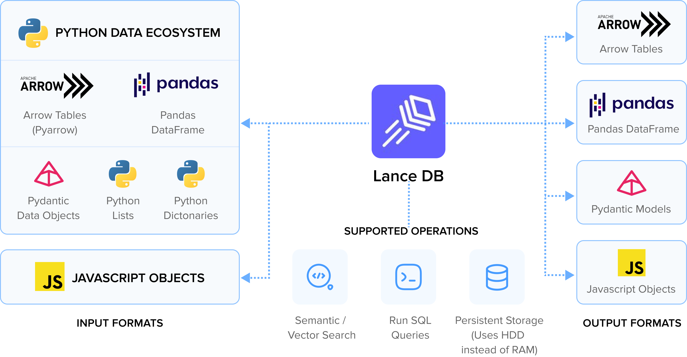
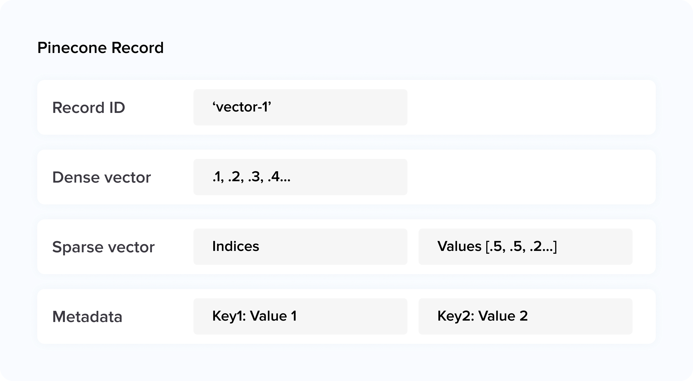

## 1. The Hallmarks of a Superior Vector Database

In the data-driven age where processing high-dimensional vectors
efficiently marks the difference between industry leaders and the competition, the significance of a top-tier vector database cannot be overstated. Such a database must possess a definitive set of characteristics that not only address the immense complexity of big data but also cater to the refined demands of advanced analytics.



At the core, search speed stands as the linchpin of vector database
performance, impacting user experience and real-time decision-making.
Superior vector databases must offer flexibility in utilizing a range of
similarity algorithms, including but not limited to Euclidean distance
and cosine similarity, crucial for conducting Approximate Nearest
Neighbor (ANN) searches with precision across extensive datasets. It's
not solely about rapid execution; it involves consistently delivering
quick and precise vector similarity searches scalable with data growth.

Storage efficiency is equally integral to a database's prowess. Ideal
vector databases minimize the latency between data insertion and query
processing, aiming for millisecond-level turnaround times. This is
realized through advanced encoding and indexing technologies like
inverted indexes, hierarchical clustering, and quantization, all
tailored to conserve storage space without compromising accessibility or
performance.

Data migration capabilities are also vital, facilitating smooth
transitions and scaling by allowing efficient replication of
tables---even those with considerable volumes of data. This ensures that
the database remains adaptable and responsive as organizational needs
evolve, without interrupting existing processes.

Usability and scalability come down to the clarity of APIs and user
interfaces, simplifying integration and deployment for developers.
However, such simplicity must be compounded with robust scalability
options, both horizontally and vertically. A model vector database would
not only adapt performance as datasets expand but also seamlessly
transition between single-node configurations and cluster-based
deployments.

Features that assure data persistence and reliability are indicative of
a vector database's caliber. Leading databases provide secure data
storage with resilience against system failures, maintaining consistent
performance and response times even under high demand---a requirement
for enterprise-grade applications.

In today's diverse technological ecosystem, a vector database's
integration capabilities must be broad. Compatibility becomes
critical---it should align with a variety of data formats and integrate
smoothly with the prevailing data science and machine learning
ecosystems.

Focusing on security, a vector database should encompass features for
encryption, access control, and audit logging. These features are
paramount for safeguarding data integrity and confidentiality,
increasingly important in an era where data privacy concerns are more
pronounced.

Moreover, automation and operational simplicity are crucial for
mitigating cognitive loads on users. Features that allow hands-off
maintenance, backups, recoveries, and optimizations demonstrate a
database solution that values modern operational efficiency.

Cost-effectiveness should not be overlooked when evaluating a vector
database. A transparent and predictable cost structure allows users to
plan their expenses relative to their scale of operations and patterns
of usage.

Lastly, the importance of a supportive community and reliable customer
service is indisputable. For open-source platforms, the community drives
innovation and troubleshooting, while proprietary databases must offer
excellent and dependable support.

To sum it up, a vector database that harmonizes these attributes not
only excels in its field but also emerges as an indispensable ally in
harnessing the full potential of vector data.

## 2. Introduction

### 2.1. What is Pinecone?

Pinecone is a closed source, fully-managed, cloud-native vector database
specifically designed for high-performance Artificial Intelligence (AI)
applications. Its main features include offering a simple API that
allows users to effortlessly provide a long-term memory function for AI
applications without the need to manage the underlying infrastructure.
It allows you to search and retrieve the most similar items in a
high-dimensional vector space efficiently. Pinecone is particularly
useful for applications such as recommendation systems, image search,
and natural language processing tasks, where similarity search plays a
vital role.

### 2.1. What is LanceDB？

LanceDB is an open-source vector database that excels in handling
multimodal data including text, images, and video. It employs a
serverless architecture with hard disk drives (HDD) for persistent
storage. Additionally, at its data storage layer, LanceDB utilizes
Lance, a novel and faster columnar format than parquet, specifically
designed for highly efficient lookups.

LanceDB is available in two flavors: OSS and Cloud.

LanceDB Cloud is a SaaS (software-as-a-service) solution that runs
serverless in the cloud, making the storage clearly separated from
compute. Currently in private beta with general availability coming
soon.

## 3. Key Differences Between Lancedb and Pinecone

### 3.1. LanceDB vs Pinecone - Workflow

The workflow in Pinecone starts with creating an index. This index must
be established prior to uploading any vector data into the system, which
thereafter becomes searchable. The index is the primary organizational
structure within Pinecone for storing vectors, running queries, and
executing other vector data-related tasks. Each Pinecone index is
operated on at least one "pod", serving as its fundamental operational
unit.

In contrast, LanceDB follows a traditional database workflow where the
initial step involves defining a data table's schema (structure). Once
the schema has been set, data can be added, and search operations can
commence.

### 3.2. LanceDB vs Pinecone - Data Type

Pinecone focuses on array vector types used in high-dimensional vector
space, essential for applications involving similarity search and
machine learning tasks.

LanceDB handles a wide array of data structures, including dict, lists
of dicts, pd.DataFrame, pa.Table, iterable record batches, Pydantic
models, and JavaScript objects. This adaptability makes it suitable for
various structured and semi-structured data dealings.


Pydantic integration with LanceDB enables the use of advanced features
such as nested schemas and validators for building complex, valid table
schemas, boosting data integrity and functionality. We can utilize the
embedding function to annotate our model with the VectorField method,
which instructs LanceDB to use a generic embedding technique to create
embeddings for matching queries. Simultaneously, the SourceField ensures
that when data is ingested, LanceDB automatically employs an appropriate
embedding technique to encode the input images. This collaboration
significantly streamlines the data handling process by enriching the
vector column through the embedding function, and simplifies the data
input and encoding process via the SourceField, without specifying any
particular embedding model.

**Example**

The following example defines a Pydantic model named Pets for use with
LanceDB, which includes a vector column for image embeddings that are
generated using the specified embedding function from the clip module.
This Pets model allows querying by leveraging both text and images, as
demonstrated by its ability to search through the database using a text
query as well as an image input for the search.
```python
from PIL import Image
from lancedb.pydantic import LanceModel, Vector
from pathlib import Path


class Pets(LanceModel):
    vector: Vector(clip.ndims) = clip.VectorField()
    image_uri: str = clip.SourceField()

    @property
    def image(self):
        return Image.open(self.image_uri)

table = db.create_table("pets", schema=Pets)
result = table.search("dog")
p = Path("path/to/images/samoyed_100.jpg")
query_image = Image.open(p)
table.search(query_image)
```

### 3.3. LanceDB vs Pinecone - Search

Pinecone Database it empowers users to perform scalable Approximate
Nearest Neighbor (ANN) searches quickly and accurately, excels with both
sparse and dense vector support, allowing for mixed searches in a
singular index. This hybrid approach combines semantic depth with
keyword precision for improved relevance and accuracy in results.
Additionally, Pinecone enables the attachment of metadata key-value
pairs to indexed vectors, coupled with detailed filter expressions
during queries, enabling tailored searches based on specific criteria.
With support for up to 40 kb of metadata per vector, [[selective
metadata
indexing]{.underline}](https://docs.pinecone.io/docs/manage-indexes/#selective-metadata-indexing)
is advised to prevent unnecessary high-cardinality metadata from being
indexed when not required for filtering. This adaptability allows users
to create diverse search experiences, from simple text searches to
complex queries.

Pinecone sparse-dense vectors have the following limitations:
- Pinecone supports sparse vector values of sizes up to 1000 non-zero
 values.
- Pinecone only supports upserting sparse-dense vectors to p1 and s1 indexes.
- In order to query an index using sparse values, the index must use the [[dot product> metric]{.underline}](https://docs.pinecone.io/docs/indexes#distance-metrics). Attempting to query any other index with sparse values returns an error.
- Indexes created before February 22, 2023 do not support sparse values.



LanceDB supports both vector search and full-text search(currently
python only). When using the search method, if the query_type is set to
'auto', the system will automatically infer the type of query to
perform. This means that if the query is a list or a NumPy array, it
will be treated as a vector search. If the query is an image, the system
may either perform a vector search or return an error if there is no
corresponding embedding function available. If the query is a string,
the query type can be either 'vector' or 'fts' (full-text search),
depending on whether the table possesses an embedding function or not.
In the absence of an index, LanceDB would need to exhaustively scan the
entire vector column (via Flat Search) and compute the distance for
every vector in order to identify the closest matches, which effectively
constitutes a KNN (k-nearest neighbors) search. By constructing a vector
index, LanceDB utilizes Approximate Nearest Neighbor (ANN) Search with a
Vector Index for enhanced efficiency during query processing.

### 3.4. LanceDB vs Pinecone - Index

Pinecone's index is a customized, optimized structure made for
efficient vector similarity searches, known for bolstering the
performance of Approximate Nearest Neighbor (ANN) searches. Users can
increase the number of replicas to enhance index availability and
throughput, along with configuring the behavior of Pinecone's internal
metadata index.

Pinecone supports partitioning records into namespaces within an index,
allowing operations and queries to be restricted to specific, isolated
segments. This facilitates differentiated search experiences tailored to
particular subsets of data.

Indexes can be scaled horizontally---by adding pods, which suspends
upserts temporarily and increases general capacity, or by adding
replicas, which boosts throughput without disrupting upserts---and
vertically for accommodating different load requirements.

It's important to be aware that the GCP starter environment doesn't
support the advanced features mentioned here, such as pods, replicas,
and collections. These options are reserved for more advanced Pinecone
environments that allow such scalability and partitioning capabilities.

**Example**

The following example creates a vector index named "example-index"
with a 1024-dimensional vector space, a copy, and the specified metadata
configuration.
```python
metadata_config = {
    'indexed': ['color']
}

pinecone.create_index('example-index', dimension=1024, replicas=1, metadata_config=metadata_config)
```

LanceDB supports various index types, among which IVF_PQ (Inverted File
Index combined with Product Quantization) is the most commonly used. The
dataset is partitioned into 'N' sections using IVF, and then each
partition's vectors are compressed through Product Quantization (PQ).
The parameters for IVF_PQ include 'num_partitions' (default: 256),
determining the number of sections, and 'num_sub_vectors' (default:
96), which defines the count of sub-vectors 'M' for a 'D'
dimensional vector, split into 'M' of 'D/M' sub-vectors, each
represented by a single PQ code.

DISKANN(the DiskANN algorithm, presented at NeurIPS 2019, demonstrates
the potential to be the fastest for disk-based searches across
billion-scale datasets.) is an experimental index that structures the
vector data on-disk as a graph with vertices representing vector
neighbors.

Lance's Python SDK offers experimental GPU support for creating the IVF
index which can significantly speed up the process. This feature
requires PyTorch version above 2.0. Users can enable GPU acceleration by
setting 'accelerator' to 'cuda' or 'mps' (for Apple Silicon
devices) to facilitate GPU training.

Search refinement can be fine-tuned using two parameters:
'[[nprobes]{.underline}](https://lancedb.github.io/lancedb/ann_indexes/#querying-an-ann-index)',
which adjusts the number of partitions to search in, and
'refine_factor', influencing the refinement passes. These tools help
in fine-tuning the search for a balance between speed and accuracy.

```python
import lance

dataset = lance.dataset("/tmp/sift.lance")
dataset.create_index(
    "vector",
    "IVF_PQ",
    num_partitions=256,
    num_sub_vectors=16,
    accelerator="cuda"
)

tbl.search(np.random.random((1536))) 
    .limit(2) 
    .nprobes(20) 
    .refine_factor(10) 
    .to_pandas()
```

### 3.5. LanceDB vs Pinecone - Versioning

In Pinecone, a collection captures a static snapshot of an index at a
specific moment, preserving the complete set of vectors and metadata in
a non-queryable form. It can serve as version control for data, enabling
comparisons and historical rollbacks. Collections allow for the creation
of new indices, providing the option to modify parameters such as pod
count, pod type, or similarity metric relative to the original index.

Indexes in the gcp-starter environment do not support collections.

**Example**

The following example creates a collection named example-collection from
an index named example-index. and create an index named example-test
from the collection named example-collection

```python
pinecone.create_collection("example-collection", "example-index")
pinecone.create_index('example-test', dimension=1024, replicas=1, source_collection="example-collection")
```

LanceDB eliminates the need for explicit version control management and
the creation of costly and time-consuming snapshots. It automatically
tracks the complete history of operations and supports quick rollbacks.
In production, this capability is crucial for debugging issues and
minimizing downtime by rapidly reverting to a previously successful
state within seconds.

**Example**

The following example shows the current version and goes back to version 1

```python
table.list_versions()
```
```python
[{'version': 1,
  'timestamp': datetime.datetime(2023, 10, 20, 14, 33, 39, 40549),
  'metadata': {}},
 {'version': 2,
  'timestamp': datetime.datetime(2023, 10, 20, 14, 33, 39, 63675),
  'metadata': {}}
]
```

```python
table.restore(1)
table.list_versions()
```
```python
[{'version': 1,
  'timestamp': datetime.datetime(2023, 10, 20, 14, 33, 39, 40549),
  'metadata': {}},
 {'version': 2,
  'timestamp': datetime.datetime(2023, 10, 20, 14, 33, 39, 63675),
  'metadata': {}},
 {'version': 3,
  'timestamp': datetime.datetime(2023, 10, 20, 14, 33, 53, 979216),
  'metadata': {}}
]
```

When we restore an old version, we're not deleting the version history,
we're just creating a new version where the schema and data is
equivalent to the restored old version. In this way, we can keep track
of all of the changes and always rollback to a previous state.

## 4. Conclusion

Selecting the ideal vector database hinges on the stark realization that
there is no one-size-fits-all solution; the decision is intrinsically
tied to how well the database aligns with the distinctive needs and
specific use cases of a given project.

Here are some potential application scenarios for LanceDB and Pinecone:


| Application Scenarios | LanceDB | Pinecone |
| :----------- | :----------- | :----------- |
| Multimodal Data Analysis         | Ideal for projects that integrate and analyze diverse data (like images, text, audio), suitable for multimedia search engines, cross-modal retrieval, or smart recommendation systems.        |         |
| Customizable Search and Analysis | Ideal for projects needing deep customization of search algorithms and processing workflows, useful in research institutions or corporate R&D departments where researchers may need special preprocessing, indexing, or querying of vector data. | |
| Hybrid or Private Cloud Deployment | Supports flexible storage with MinIO and S3 integration, ideal for secure, compliant data handling in hybrid/private clouds. | |
| Real-Time Recommendation Systems | | Optimized for high-speed, real-time data handling, ideal for recommendation engines needing immediate, accurate similarity matches. |
| High-Precision Similarity Search | | Optimal for precision-focused, high-dimensional vector search projects with efficient scaling and resource management to maximize accuracy and limit false positives. |
| Low Latency, High Throughput Situations | | Ideal for low-latency, high-throughput use cases like financial risk, cybersecurity, smart homes, and security, where Pinecone offers quick setup for high-performance vector search. |


LanceDB's extensive feature set is designed to manage a plethora of
data types and complex queries adeptly. Nevertheless, in scenarios where
pin-point accuracy in high-dimensional similarity searches is essential,
LanceDB's approximate nearest neighbor search algorithms might
necessitate improvements.

Both LanceDB and Pinecone showcase unique methodologies in scalability.
LanceDB augments its data handling capabilities by integrating with
external storage systems like MinIO and S3, whereas Pinecone advances
with a seamless, resource-efficient scaling framework, empowered by its
in-built resource and Pod management system.

Pinecone has earned preferences for its rapid query responses and its
ability to process substantial volumes of real-time data within a
user-friendly "plug-and-play" model. Conversely, LanceDB is
particularly strong in handling multimodal data vectors and offers a
more customized search experience. Despite its current data migration
utilities having room for further development, it still presents
valuable features that can be essential for certain applications.

Ultimately, the choice between Pinecone's operational simplicity and
reliable performance and LanceDB's vast potential for customization
through its open-source nature is a nuanced one. While both platforms
facilitate machine learning integrations and LanceDB supports a wider
variety of data types, the decision-making process should include
consideration of LanceDB's advancement in data migration alongside
other criteria.

Therefore, the best-suited vector database emerges not from a fixed
archetype but from a process of discerning adaptation to your project's
specificities and aspirations. Rigorous assessment of your project's
requirements will decipher whether LanceDB's adaptability or
Pinecone's streamlined efficiency and scalability will better serve
your pursuit. As LanceDB and Pinecone evolve in the vector database
sphere, they will continue to deepen their specialized capabilities to
address a broad spectrum of user needs, collectively propelling forward
the standards of excellence for vector database solutions.
